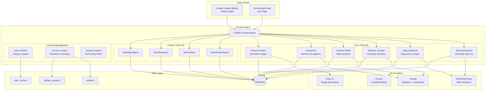
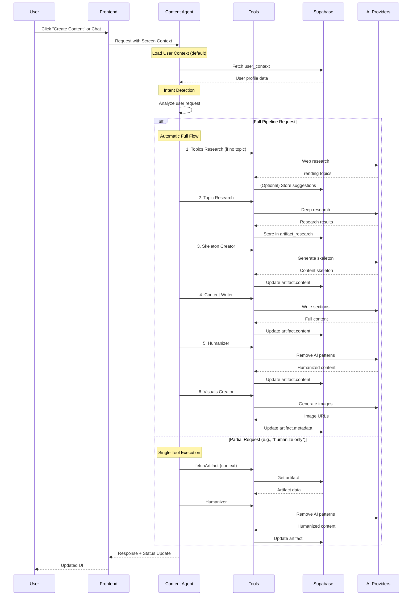
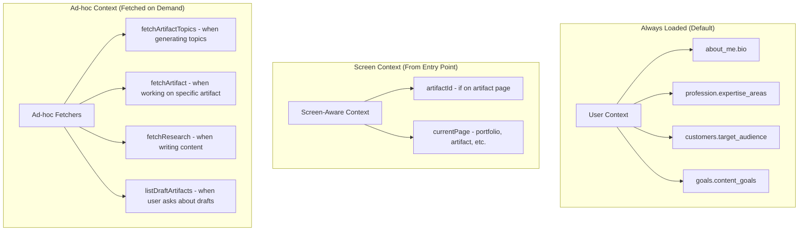
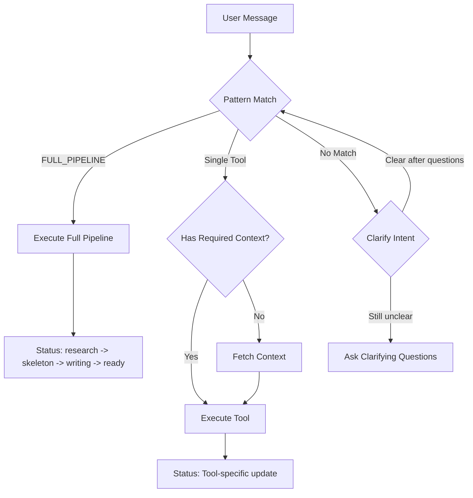
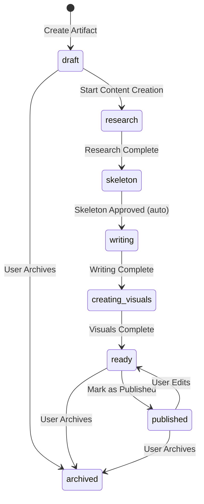

# Unified Content Agent Architecture

**Version:** 1.0.0
**Date:** 2026-01-26
**Status:** Design Document

---

## Table of Contents

1. [Executive Summary](#1-executive-summary)
2. [Architecture Overview](#2-architecture-overview)
3. [Tool Specifications](#3-tool-specifications)
4. [Context Management Strategy](#4-context-management-strategy)
5. [Intent Detection Logic](#5-intent-detection-logic)
6. [Status Flow Integration](#6-status-flow-integration)
7. [System Prompt Design](#7-system-prompt-design)
8. [Error Handling Strategy](#8-error-handling-strategy)
9. [Mock System Integration](#9-mock-system-integration)
10. [Implementation Roadmap](#10-implementation-roadmap)
11. [Observability Strategy](#11-observability-strategy)
12. [Testing Strategy](#12-testing-strategy)
13. [Security Specifications](#13-security-specifications)
14. [Frontend Integration Specification](#14-frontend-integration-specification)

---

## 1. Executive Summary

### Problem Statement

The current content creation system has fragmented flows:
- **Topics creation flow** - AI generates topic ideas in isolation
- **Content creation flow** - Multiple triggers, complex routing, separate status management
- **Manual orchestration** - Users must navigate between different tools manually

### Solution

A **Unified Content Agent** that consolidates all content-related workflows into one intelligent agent with:
- **6 core tools** for complete content lifecycle management
- **Ad-hoc context fetching** for efficient token usage
- **Screen-aware context** for seamless UX
- **Partial flow support** for flexible user interactions

### Key Benefits

| Benefit | Description |
|---------|-------------|
| **Unified Experience** | Single agent handles all content operations |
| **Efficient Context** | Ad-hoc fetching reduces token usage by ~60% |
| **Flexible Workflows** | Users can request any single tool or full pipeline |
| **Smart Defaults** | Agent understands screen context automatically |
| **Hybrid Status Management** | Tools auto-update status while allowing agent override |

---

## 2. Architecture Overview

### 2.1 High-Level Architecture Diagram



### 2.2 Data Flow Diagram



### 2.3 Component Architecture

```
backend/src/
├── services/
│   └── ai/
│       ├── ContentAgent.ts              # NEW: Unified agent orchestrator
│       ├── AIService.ts                 # Existing: Base AI service
│       ├── tools/
│       │   ├── index.ts                 # Tool exports
│       │   ├── topicsResearchTool.ts    # NEW: Topics generation
│       │   ├── topicResearchTool.ts     # REFACTORED: Deep research
│       │   ├── skeletonTool.ts          # REFACTORED: Skeleton generation
│       │   ├── contentWriterTool.ts     # REFACTORED: Content writing
│       │   ├── humanizerTool.ts         # REFACTORED: Humanity check
│       │   ├── visualsCreatorTool.ts    # NEW: Image generation
│       │   └── contextTools.ts          # NEW: Ad-hoc context fetchers
│       └── prompts/
│           └── contentAgentPrompt.ts    # NEW: Unified system prompt
```

---

## 3. Tool Specifications

### 3.1 Topics Research Tool

**Purpose:** Generate a list of possible content topics based on user context and market trends.

```typescript
interface TopicsResearchInput {
  contentType: 'blog' | 'social_post' | 'showcase';
  focusArea?: string;           // Optional: specific domain to focus on
  count?: number;               // Default: 5 topics
}

interface TopicsResearchOutput {
  success: boolean;
  topics: Array<{
    title: string;
    description: string;
    rationale: string;          // Why this topic would be valuable
    trendingScore: number;      // 0-1, based on research
    competitionLevel: 'low' | 'medium' | 'high';
    suggestedAngle: string;     // Unique perspective to take
  }>;
  sourcesQueried: string[];     // ['reddit', 'linkedin', 'medium', ...]
  traceId: string;
}

// Side Effects:
// - None (suggestions not saved until user selects)
// - Status: No change
```

**AI Provider:** Perplexity/Tavily for web research + Claude for analysis

**Implementation Notes:**
- Query web for trending topics in user's expertise areas
- Cross-reference with existing artifacts to avoid duplication
- Analyze user pain points from `user_context.customers`
- Score topics based on relevance to user's goals

---

### 3.2 Topic Research Tool

**Purpose:** Conduct deep research on a specific topic from multiple sources.

```typescript
interface TopicResearchInput {
  artifactId: string;           // UUID of artifact to research for
  topic: string;                // Research subject
  artifactType: 'blog' | 'social_post' | 'showcase';
  sources?: SourceType[];       // Optional: specific sources to query
}

type SourceType = 'reddit' | 'linkedin' | 'quora' | 'medium' | 'substack';

interface TopicResearchOutput {
  success: boolean;
  sourceCount: number;          // Number of sources stored
  sources: Array<{
    type: SourceType;
    name: string;
    url?: string;
    excerpt: string;
    relevanceScore: number;     // 0-1
  }>;
  keyInsights: string[];        // Top 3-5 insights extracted
  traceId: string;
}

// Side Effects:
// - Stores research in artifact_research table
// - Updates artifact.status to 'research'
```

**AI Provider:** Perplexity/Tavily for web search

**Implementation Notes:**
- Queries 5+ sources in parallel
- Filters results by relevance score (> 0.6)
- Stores top 20 results in database
- Extracts key insights for skeleton generation

---

### 3.3 Skeleton Creator Tool

**Purpose:** Generate content structure based on artifact type, research, and tone.

```typescript
interface SkeletonCreatorInput {
  artifactId: string;
  topic: string;
  artifactType: 'blog' | 'social_post' | 'showcase';
  tone: ToneOption;
}

type ToneOption =
  | 'formal' | 'casual' | 'professional' | 'conversational'
  | 'technical' | 'friendly' | 'authoritative' | 'humorous';

interface SkeletonCreatorOutput {
  success: boolean;
  skeleton: string;             // Markdown with placeholders
  sections: Array<{
    heading: string;
    type: 'intro' | 'body' | 'conclusion' | 'cta';
    placeholder: string;
    imagePlaceholder?: string;  // Description for visual
  }>;
  estimatedWordCount: number;
  traceId: string;
}

// Side Effects:
// - Updates artifact.content with skeleton
// - Updates artifact.status to 'skeleton'
```

**AI Provider:** Claude (claude-sonnet-4)

**Skeleton Structures by Type:**

```markdown
# Blog Structure
- Title
- Hook/Introduction
- [IMAGE: Featured image placeholder]
- H2 Section 1 + [IMAGE placeholder]
- H2 Section 2 + [IMAGE placeholder]
- H2 Section 3 + [IMAGE placeholder]
- Conclusion
- Call to Action

# Social Post Structure
- Hook (first line)
- Key Point 1
- Key Point 2
- Call to Action
- [IMAGE: Post visual placeholder]
- Hashtags (3-5)

# Showcase Structure
- Title
- [IMAGE: Hero image placeholder]
- Overview
- Problem Statement + [IMAGE]
- Solution Approach + [IMAGE]
- Results/Impact + [IMAGE]
- Key Learnings
```

---

### 3.4 Content Writer Tool

**Purpose:** Write full content for skeleton sections, applying tone and research.

```typescript
interface ContentWriterInput {
  artifactId: string;
  tone: ToneOption;
  artifactType: 'blog' | 'social_post' | 'showcase';
  sectionsToWrite?: string[];   // Optional: specific sections only
}

interface ContentWriterOutput {
  success: boolean;
  sectionsWritten: number;
  totalLength: number;          // Character count
  sectionResults: Array<{
    heading: string;
    contentLength: number;
    researchSourcesUsed: number;
  }>;
  status: 'creating_visuals';
  traceId: string;
  duration: number;             // ms
}

// Side Effects:
// - Updates artifact.content with full content
// - Updates artifact.status to 'writing' (during), then 'creating_visuals' (after)
// - Stores writing_metadata with timing info
```

**AI Provider:** Gemini 2.0 Flash

**Implementation Notes:**
- Parses skeleton for H2 sections
- Writes each section sequentially
- Applies tone-specific temperature (formal: 0.5, humorous: 0.8)
- Incorporates research context naturally
- Maintains consistent voice throughout

---

### 3.5 Humanizer Tool

**Purpose:** Remove AI-sounding patterns and add natural voice.

```typescript
interface HumanizerInput {
  artifactId: string;
  content: string;              // Content to humanize
  tone: ToneOption;
}

interface HumanizerOutput {
  success: boolean;
  originalLength: number;
  humanizedLength: number;
  lengthChange: number;
  patternsChecked: 24;          // Always 24 categories
  patternsFixed: number;
  humanityScoreBefore: number;  // 0-100
  humanityScoreAfter: number;   // 0-100
  status: 'ready';
  traceId: string;
}

// Side Effects:
// - Updates artifact.content with humanized content
// - Updates artifact.status to 'ready'
// - Stores humanity check metadata
```

**AI Provider:** Claude (claude-sonnet-4)

**24 Pattern Categories:**
1. Significance/Legacy inflation
2. Media coverage emphasis
3. Superficial -ing analyses
4. Promotional language
5. Vague attributions
6. Outline-like sections
7. AI vocabulary words
8. Copula avoidance
9. Negative parallelisms
10. Rule of three overuse
11. Elegant variation
12. False ranges
13. Em dash overuse
14. Boldface overuse
15. Inline-header lists
16. Title case in headings
17. Emoji decoration
18. Curly quotation marks
19. Collaborative artifacts
20. Knowledge-cutoff disclaimers
21. Sycophantic tone
22. Filler phrases
23. Excessive hedging
24. Generic conclusions

---

### 3.6 Visuals Creator Tool

**Purpose:** Generate images for content placeholders.

```typescript
interface VisualsCreatorInput {
  artifactId: string;
  style?: 'professional' | 'minimal' | 'vibrant' | 'technical';
}

interface VisualsCreatorOutput {
  success: boolean;
  imagesGenerated: number;
  images: Array<{
    placeholder: string;        // Original [IMAGE: ...] text
    url: string;                // Generated image URL
    alt: string;                // Accessibility text
    dimensions: { width: number; height: number };
  }>;
  status: 'ready';
  traceId: string;
}

// Side Effects:
// - Replaces [IMAGE: ...] placeholders with actual images
// - Updates artifact.content with image URLs
// - Updates artifact.status to 'ready'
// - Stores image URLs in artifact.metadata.images
```

**AI Provider:** DALL-E 3 or Stability AI

**MVP Implementation:**
- Skip actual generation (placeholder behavior)
- Set status to 'ready' immediately
- Future: Integrate with image generation API

---

### 3.7 Context Tools (Ad-hoc Fetchers)

```typescript
// fetchArtifactTopics - Get all topics to avoid duplication
interface FetchArtifactTopicsOutput {
  topics: Array<{
    id: string;
    title: string;
    type: 'blog' | 'social_post' | 'showcase';
    status: string;
  }>;
  count: number;
}

// fetchArtifact - Get specific artifact details
interface FetchArtifactOutput {
  artifact: {
    id: string;
    type: 'blog' | 'social_post' | 'showcase';
    title: string;
    content: string;
    status: string;
    tone: ToneOption;
    tags: string[];
    metadata: Record<string, unknown>;
  };
}

// fetchResearch - Get research data for artifact
interface FetchResearchOutput {
  research: Array<{
    sourceType: SourceType;
    sourceName: string;
    excerpt: string;
    relevanceScore: number;
  }>;
  count: number;
}

// listDraftArtifacts - List artifacts in draft status
interface ListDraftArtifactsOutput {
  artifacts: Array<{
    id: string;
    type: 'blog' | 'social_post' | 'showcase';
    title: string;
    createdAt: string;
  }>;
  count: number;
}
```

---

## 4. Context Management Strategy

### 4.1 Context Hierarchy



### 4.2 Token Budget Management

**CRITICAL**: Claude Sonnet 4 has a 200K token context window. Must manage explicitly.

```typescript
interface TokenBudget {
  max: 200000;
  reserved: {
    systemPrompt: 3000;      // Unified agent prompt
    toolDefinitions: 8000;   // 10 tool schemas
    userContext: 500;        // Bio, expertise, goals
    responseBuffer: 4000;    // Agent response
  };
  available: 184500;         // For conversation + ad-hoc context
}

interface ContextPriority {
  // Priority order when truncation needed (1 = highest priority)
  1: 'systemPrompt';         // Never truncate
  2: 'toolDefinitions';      // Never truncate
  3: 'userContext';          // Never truncate
  4: 'screenContext';        // Never truncate
  5: 'currentMessage';       // User's current request
  6: 'conversationHistory';  // Last 5 turns (truncate oldest first)
  7: 'adHocContext';         // Artifact, research (truncate if needed)
}
```

**Truncation Strategy:**
- Conversation history: Keep last 5 turns, summarize older turns
- Research context: Include top 10 sources (by relevance), truncate excerpts to 200 chars
- Artifact content: Truncate to last 5000 chars if over limit

### 4.3 Conversation History Management

**Critical for partial flows** (e.g., "humanize this" → "now add images")

```typescript
interface ConversationHistory {
  turns: Array<{
    role: 'user' | 'assistant';
    content: string;
    timestamp: Date;
    toolsUsed?: string[];    // Track which tools were called
    artifactId?: string;     // Track artifact context
  }>;
  maxTurns: 10;              // Keep last 10 turns
  sessionId: string;         // For session isolation
}

interface SessionState {
  currentArtifactId?: string;
  lastToolExecuted?: string;
  pipelineProgress?: {
    started: boolean;
    completedSteps: string[];
    pendingSteps: string[];
  };
}
```

**Session Reset Triggers:**
- User explicitly starts new topic
- 30 minutes of inactivity
- User switches to different artifact
- User says "start over" / "new conversation"

### 4.4 Context Loading Rules

| Context Type | When Loaded | Size Impact | Example |
|-------------|-------------|-------------|---------|
| **User Context** | Always (agent init) | ~500 tokens | Bio, expertise, goals |
| **Screen Context** | Request time | ~50 tokens | `artifactId: "uuid"` |
| **Artifact Topics** | Topics Research | ~200 tokens | List of existing titles |
| **Artifact Details** | Humanize/Write | ~1000 tokens | Full artifact data |
| **Research Data** | Content Writing | ~800 tokens | Top 10 research sources |
| **Draft List** | User asks | ~100 tokens | Draft artifact list |
| **Conversation History** | Always | ~2000 tokens | Last 5-10 turns |

### 4.3 Context Fetching Decision Tree

```
User Request Received
│
├─> Is this a TOPICS generation request?
│   ├─> YES: Fetch artifact topics (avoid duplication)
│   └─> NO: Continue
│
├─> Is this for a SPECIFIC artifact?
│   ├─> YES: Do we have artifactId from screen context?
│   │   ├─> YES: Use screen context (no fetch needed)
│   │   └─> NO: Ask user OR fetch draft list
│   └─> NO: Continue
│
├─> Is this a CONTENT operation (write/humanize)?
│   ├─> YES: Fetch artifact details + research
│   └─> NO: Continue
│
└─> Default: Use only user context
```

### 4.4 Screen-Aware Context Matrix

| Current Page | Available Context | Agent Behavior |
|-------------|------------------|----------------|
| **Artifact Page** | `artifactId`, `artifactType`, `artifactTitle` | Uses artifact automatically |
| **Portfolio Page** | `none` | Asks which artifact OR shows draft list |
| **Dashboard** | `none` | Asks for context OR generates new |
| **Chat (general)** | `none` | Full flexibility, asks when needed |

---

## 5. Intent Detection Logic

### 5.1 Intent Categories

```typescript
type UserIntent =
  | 'GENERATE_TOPICS'       // Research new topic ideas
  | 'RESEARCH_TOPIC'        // Deep dive on specific topic
  | 'CREATE_SKELETON'       // Generate content structure
  | 'WRITE_CONTENT'         // Write full content
  | 'HUMANIZE_CONTENT'      // Remove AI patterns
  | 'CREATE_VISUALS'        // Generate images
  | 'FULL_PIPELINE'         // Complete content creation
  | 'PARTIAL_PIPELINE'      // Subset of pipeline
  | 'QUERY_STATUS'          // Ask about artifact status
  | 'MODIFY_CONTENT'        // Edit existing content
  | 'CLARIFY'               // Need more information
  | 'UNSUPPORTED';          // Outside scope
```

### 5.2 Intent Detection with Confidence Scoring

**IMPORTANT**: Regex-only detection is brittle. Use hybrid approach: regex for high-confidence patterns, AI classification for ambiguous cases.

```typescript
interface IntentDetectionResult {
  intent: UserIntent;
  confidence: number;          // 0.0 - 1.0
  alternativeIntents?: Array<{
    intent: UserIntent;
    confidence: number;
  }>;
  clarificationNeeded: boolean; // true if confidence < 0.7
  suggestedClarification?: string;
}

// Confidence thresholds
const CONFIDENCE_THRESHOLD = {
  HIGH: 0.9,      // Execute immediately
  MEDIUM: 0.7,    // Execute with confirmation
  LOW: 0.5,       // Suggest alternatives
  UNCLEAR: 0.0,   // Ask for clarification
};
```

**Detection Strategy (Hybrid):**

```typescript
async function detectIntent(
  message: string,
  context: AgentContext
): Promise<IntentDetectionResult> {
  // 1. Check for exact trigger patterns first (100% confidence)
  if (/^Create content for artifact [a-f0-9-]+:/.test(message)) {
    return { intent: 'FULL_PIPELINE', confidence: 1.0, clarificationNeeded: false };
  }

  // 2. Try regex patterns
  const regexResult = matchRegexPatterns(message);
  if (regexResult.confidence >= CONFIDENCE_THRESHOLD.HIGH) {
    return regexResult;
  }

  // 3. Use AI for ambiguous cases (Claude Haiku for speed)
  const aiResult = await classifyWithAI(message, context);

  // 4. Combine results
  return combineResults(regexResult, aiResult);
}

// Regex patterns (fast path for common cases)
const intentPatterns: Record<UserIntent, RegExp[]> = {
  GENERATE_TOPICS: [
    /research.*(topic|idea)s?\s*(for|about)?/i,
    /suggest.*(topic|idea)s?/i,
    /what\s+should\s+i\s+write/i,
    /give\s+me\s+(some\s+)?(topic|idea)s?/i,
  ],

  RESEARCH_TOPIC: [
    /research\s+(about|on|for)?\s*["']?(.+)["']?/i,
    /deep\s+dive\s+(on|into)/i,
    /gather\s+(information|research)/i,
  ],

  CREATE_SKELETON: [
    /create\s+(a\s+)?skeleton/i,
    /generate\s+(the\s+)?structure/i,
    /outline\s+(for|the)/i,
  ],

  WRITE_CONTENT: [
    /write\s+(the\s+)?(content|article|post)/i,
    /fill\s+in\s+(the\s+)?sections?/i,
    /expand\s+(the\s+)?skeleton/i,
  ],

  HUMANIZE_CONTENT: [
    /humanize/i,
    /make\s+it\s+sound\s+(more\s+)?human/i,
    /remove\s+ai\s+(patterns|writing)/i,
    /natural(ize)?/i,
  ],

  CREATE_VISUALS: [
    /create\s+(the\s+)?images?/i,
    /generate\s+(the\s+)?visuals?/i,
    /add\s+(the\s+)?images?/i,
  ],

  FULL_PIPELINE: [
    /create\s+content\s+for\s+artifact/i,  // Button trigger
    /full\s+(content\s+)?creation/i,
    /complete\s+(the\s+)?workflow/i,
    /start\s+to\s+finish/i,
  ],

  QUERY_STATUS: [
    /what('s|\s+is)\s+(the\s+)?status/i,
    /where\s+are\s+we/i,
    /progress/i,
  ],
};
```

**Clarification Flow (when confidence < 0.7):**

```typescript
function generateClarification(result: IntentDetectionResult): string {
  const alternatives = result.alternativeIntents?.slice(0, 3) || [];

  return `I want to make sure I understand. Did you mean:
  ${alternatives.map((a, i) => `${i + 1}. ${intentToDescription(a.intent)}`).join('\n')}

Or something else?`;
}
```

### 5.3 Intent Resolution Flow



### 5.4 Partial Flow Support

The agent supports executing any subset of tools based on user intent:

| User Request | Tools Executed | Starting Point |
|-------------|---------------|----------------|
| "Generate topic ideas for LinkedIn posts" | Topics Research only | N/A |
| "Research this topic" | Topic Research only | Existing artifact |
| "Create a skeleton for this" | Skeleton Creator only | After research |
| "Just write the content" | Content Writer only | After skeleton |
| "Humanize this article" | Humanizer only | After writing |
| "Add images" | Visuals Creator only | After content |
| "Create content" (button) | Full pipeline | From draft |

---

## 6. Status Flow Integration

### 6.1 Artifact Status Lifecycle



### 6.2 Status Management Rules

```typescript
interface StatusTransition {
  from: ArtifactStatus;
  to: ArtifactStatus;
  trigger: 'tool' | 'user' | 'system';
  tool?: string;
}

const statusTransitions: StatusTransition[] = [
  // Tool-triggered transitions (automatic)
  { from: 'draft', to: 'research', trigger: 'tool', tool: 'topicResearch' },
  { from: 'research', to: 'skeleton', trigger: 'tool', tool: 'skeletonCreator' },
  { from: 'skeleton', to: 'writing', trigger: 'tool', tool: 'contentWriter' },
  { from: 'writing', to: 'creating_visuals', trigger: 'tool', tool: 'contentWriter' },
  { from: 'creating_visuals', to: 'ready', trigger: 'tool', tool: 'visualsCreator' },

  // User-triggered transitions
  { from: 'ready', to: 'published', trigger: 'user' },
  { from: 'published', to: 'ready', trigger: 'user' },  // Edit triggers
  { from: '*', to: 'archived', trigger: 'user' },

  // Agent override capability
  { from: 'writing', to: 'ready', trigger: 'system' },  // Skip visuals if requested
  { from: 'skeleton', to: 'ready', trigger: 'system' }, // Skip writing if manual
];
```

### 6.3 Hybrid Status Management

Tools auto-update status, but agent can override based on user intent:

```typescript
// Example: User says "Skip visuals, I'll add images manually"
if (userIntent === 'SKIP_VISUALS' && currentStatus === 'writing') {
  // Agent overrides normal flow
  await updateArtifactStatus(artifactId, 'ready');
  return { message: "Content is ready. You can add images manually." };
}

// Example: User wants to re-humanize already published content
if (userIntent === 'HUMANIZE_CONTENT' && currentStatus === 'published') {
  // Agent transitions back to allow re-processing
  await updateArtifactStatus(artifactId, 'ready');
  await tools.humanizer.execute({ artifactId, content, tone });
}
```

### 6.4 Status-Aware Tool Execution

```typescript
const statusRequirements: Record<string, ArtifactStatus[]> = {
  topicsResearch: ['*'],           // Any status (generates new)
  topicResearch: ['draft'],        // Only from draft
  skeletonCreator: ['research'],   // After research
  contentWriter: ['skeleton'],     // After skeleton
  humanizer: ['writing', 'creating_visuals', 'ready', 'published'],
  visualsCreator: ['writing', 'creating_visuals'],
};

function canExecuteTool(tool: string, currentStatus: string): boolean {
  const required = statusRequirements[tool];
  return required.includes('*') || required.includes(currentStatus);
}
```

---

## 7. System Prompt Design

### 7.1 Core System Prompt Structure

```typescript
function getContentAgentSystemPrompt(
  userContext: UserContext,
  screenContext: ScreenContext
): string {
  return `
## IDENTITY

You are the Content Agent for a professional consultant. You help create high-quality content through a unified toolkit of 6 specialized tools.

## YOUR CAPABILITIES

### Core Tools (6)
1. **Topics Research** - Generate topic ideas based on trends and user expertise
2. **Topic Research** - Deep dive research on specific topics (5+ sources)
3. **Skeleton Creator** - Generate content structure with placeholders
4. **Content Writer** - Write full content section by section
5. **Humanizer** - Remove AI patterns, add natural voice
6. **Visuals Creator** - Generate images for placeholders

### Context Tools (4)
- fetchArtifactTopics - Get existing topics to avoid duplication
- fetchArtifact - Get artifact details
- fetchResearch - Get research data
- listDraftArtifacts - List drafts

## CONTEXT MANAGEMENT

**Always Available:**
${formatUserContext(userContext)}

**Screen Context:**
${formatScreenContext(screenContext)}

**Ad-hoc Fetching Rules:**
- Topics generation → fetch artifact topics first
- Content operations → fetch artifact + research
- Unknown artifact → ask user OR list drafts

## WORKFLOW MODES

### Mode 1: Full Pipeline (Automatic)
Triggered by: "Create content for artifact <uuid>: <title>"
Flow: research → skeleton → writing → visuals → ready
- NO approval gates
- Fully automatic
- Status updates at each step

### Mode 2: Partial Flow (User-directed)
Triggered by: Specific tool requests ("humanize this", "research about X")
- Execute only requested tool(s)
- Fetch required context ad-hoc
- Respect current artifact status

### Mode 3: Interactive (Conversational)
Triggered by: General questions, unclear requests
- Clarify intent before executing
- Offer options when ambiguous
- Provide status updates

## INTENT DETECTION

Before executing, classify the request:
1. Is this a FULL PIPELINE request? (button trigger)
2. Is this a SPECIFIC TOOL request?
3. Is this a STATUS QUERY?
4. Is this UNCLEAR? (need clarification)

## STATUS RULES

| Current Status | Allowed Tools |
|---------------|---------------|
| draft | topicsResearch, topicResearch |
| research | skeletonCreator |
| skeleton | contentWriter |
| writing | humanizer (optional), visualsCreator |
| creating_visuals | visualsCreator |
| ready | humanizer (re-run), visualsCreator |
| published | humanizer (transitions to ready) |

## OUTPUT FORMAT

**Always use structuredResponse tool** for final output.

**Two-part pattern:**
1. Brief acknowledgment (5-8 words)
2. Call structuredResponse with full details

**Never:**
- Stop after acknowledgment only
- Output text after tool call
- Skip structuredResponse

## ERROR HANDLING

If a tool fails:
1. Log the error with traceId
2. Attempt recovery if possible
3. Report clearly to user
4. Offer alternatives

If status doesn't allow tool:
1. Explain current status
2. Suggest valid next steps
3. Offer to transition if safe
`;
}
```

### 7.2 Dynamic Context Injection

```typescript
function formatUserContext(ctx: UserContext): string {
  let output = '';

  if (ctx.about_me?.bio) {
    output += `- Bio: ${ctx.about_me.bio}\n`;
  }
  if (ctx.profession?.expertise_areas) {
    output += `- Expertise: ${ctx.profession.expertise_areas}\n`;
  }
  if (ctx.customers?.target_audience) {
    output += `- Target Audience: ${ctx.customers.target_audience}\n`;
  }
  if (ctx.goals?.content_goals) {
    output += `- Content Goals: ${ctx.goals.content_goals}\n`;
  }

  return output || '(No user context available)';
}

function formatScreenContext(ctx: ScreenContext): string {
  if (!ctx.artifactId) {
    return `- Current Page: ${ctx.currentPage}\n- No artifact selected`;
  }

  return `
- Current Page: Artifact Editor
- Artifact ID: ${ctx.artifactId}
- Artifact Type: ${ctx.artifactType}
- Artifact Title: "${ctx.artifactTitle}"
- Current Status: ${ctx.artifactStatus}
`;
}
```

---

## 8. Error Handling Strategy

### 8.1 Error Categories

```typescript
enum ErrorCategory {
  // Tool Execution Errors
  TOOL_EXECUTION_FAILED = 'TOOL_EXECUTION_FAILED',
  TOOL_TIMEOUT = 'TOOL_TIMEOUT',

  // AI Provider Errors
  AI_PROVIDER_ERROR = 'AI_PROVIDER_ERROR',
  AI_RATE_LIMIT = 'AI_RATE_LIMIT',
  AI_CONTENT_FILTER = 'AI_CONTENT_FILTER',

  // Data Errors
  ARTIFACT_NOT_FOUND = 'ARTIFACT_NOT_FOUND',
  RESEARCH_NOT_FOUND = 'RESEARCH_NOT_FOUND',
  INVALID_STATUS = 'INVALID_STATUS',

  // Context Errors
  MISSING_CONTEXT = 'MISSING_CONTEXT',
  INVALID_ARTIFACT_ID = 'INVALID_ARTIFACT_ID',

  // User Input Errors
  UNCLEAR_INTENT = 'UNCLEAR_INTENT',
  INVALID_TONE = 'INVALID_TONE',
  INVALID_CONTENT_TYPE = 'INVALID_CONTENT_TYPE',
}
```

### 8.2 Error Recovery Strategies

```typescript
const recoveryStrategies: Record<ErrorCategory, RecoveryStrategy> = {
  TOOL_EXECUTION_FAILED: {
    maxRetries: 2,
    backoffMs: 1000,
    fallback: 'ASK_USER',
    message: 'Tool execution failed. Would you like me to try again?',
  },

  AI_PROVIDER_ERROR: {
    maxRetries: 3,
    backoffMs: 2000,
    fallback: 'SWITCH_PROVIDER',
    message: 'AI service temporarily unavailable. Trying alternative...',
  },

  AI_RATE_LIMIT: {
    maxRetries: 1,
    backoffMs: 60000,  // 1 minute
    fallback: 'QUEUE',
    message: 'Rate limit reached. Your request has been queued.',
  },

  ARTIFACT_NOT_FOUND: {
    maxRetries: 0,
    fallback: 'ASK_USER',
    message: 'Could not find that artifact. Would you like to see your drafts?',
  },

  INVALID_STATUS: {
    maxRetries: 0,
    fallback: 'EXPLAIN',
    message: 'This operation is not available in the current status.',
  },

  UNCLEAR_INTENT: {
    maxRetries: 0,
    fallback: 'CLARIFY',
    message: 'I need a bit more information to help you.',
  },
};
```

### 8.3 Error Response Format

```typescript
interface ErrorResponse {
  success: false;
  error: {
    category: ErrorCategory;
    message: string;           // User-friendly message
    technical?: string;        // Technical details (dev only)
    traceId: string;
    recoveryOptions?: string[];
  };
}

// Example error response
{
  success: false,
  error: {
    category: 'INVALID_STATUS',
    message: 'This artifact is already published. Would you like to edit it first?',
    traceId: 'ca-1706288400-abc123',
    recoveryOptions: [
      'Edit the content (transitions back to ready)',
      'Create a new artifact based on this one',
      'View the published content',
    ],
  },
}
```

### 8.4 Standardized Tool Output Interface

**All tools MUST return this standardized format** for consistent orchestration:

```typescript
interface ToolOutput<T = unknown> {
  success: boolean;
  traceId: string;
  duration?: number;                // Execution time in ms
  statusTransition?: {
    from: ArtifactStatus;
    to: ArtifactStatus;
  };
  data: T;                          // Tool-specific data
  error?: {
    category: ErrorCategory;
    message: string;
    recoverable: boolean;
  };
}

// Example: Skeleton Creator output
interface SkeletonCreatorOutput extends ToolOutput<{
  skeleton: string;
  sections: Array<{ heading: string; type: string }>;
  estimatedWordCount: number;
}> {}
```

### 8.5 Exponential Backoff for Rate Limits

```typescript
async function withExponentialBackoff<T>(
  fn: () => Promise<T>,
  options: {
    maxRetries?: number;
    baseDelayMs?: number;
    maxDelayMs?: number;
  } = {}
): Promise<T> {
  const { maxRetries = 5, baseDelayMs = 1000, maxDelayMs = 60000 } = options;

  for (let attempt = 0; attempt < maxRetries; attempt++) {
    try {
      return await fn();
    } catch (error) {
      const isRateLimit = error.type === 'rate_limit' ||
                          error.code === 429 ||
                          error.message?.includes('rate limit');

      if (!isRateLimit || attempt === maxRetries - 1) {
        throw error;
      }

      const delayMs = Math.min(
        baseDelayMs * Math.pow(2, attempt) + Math.random() * 1000,
        maxDelayMs
      );

      logger.warn('RateLimit', 'Backing off', {
        attempt: attempt + 1,
        maxRetries,
        delayMs,
      });

      await sleep(delayMs);
    }
  }
  throw new Error('Max retries exceeded');
}
```

### 8.6 Pipeline Checkpoints for Multi-Tool Rollback

**CRITICAL**: Multi-tool pipelines (6 tools) need transaction-like behavior to prevent inconsistent state.

```typescript
interface PipelineCheckpoint {
  toolName: string;
  timestamp: Date;
  artifactId: string;
  status: ArtifactStatus;
  contentSnapshot: string;         // Content before tool execution
  metadataSnapshot: Record<string, unknown>;
}

class PipelineExecutor {
  private checkpoints: PipelineCheckpoint[] = [];

  async executeFullPipeline(artifactId: string): Promise<void> {
    const tools = ['topicResearch', 'skeletonCreator', 'contentWriter', 'humanizer', 'visualsCreator'];

    try {
      for (const toolName of tools) {
        // Create checkpoint BEFORE each tool
        await this.createCheckpoint(artifactId, toolName);

        // Execute tool
        const result = await this.executeTool(toolName, artifactId);

        if (!result.success) {
          throw new Error(`Tool ${toolName} failed: ${result.error?.message}`);
        }
      }
    } catch (error) {
      // Rollback to last successful checkpoint
      await this.rollbackToLastCheckpoint();
      throw error;
    } finally {
      // Clear checkpoints after completion or rollback
      this.clearCheckpoints();
    }
  }

  private async createCheckpoint(artifactId: string, toolName: string): Promise<void> {
    const artifact = await fetchArtifact(artifactId);

    this.checkpoints.push({
      toolName,
      timestamp: new Date(),
      artifactId,
      status: artifact.status,
      contentSnapshot: artifact.content,
      metadataSnapshot: artifact.metadata,
    });
  }

  private async rollbackToLastCheckpoint(): Promise<void> {
    const checkpoint = this.checkpoints.pop();
    if (!checkpoint) return;

    logger.warn('Pipeline', 'Rolling back to checkpoint', {
      toolName: checkpoint.toolName,
      status: checkpoint.status,
    });

    await supabaseAdmin
      .from('artifacts')
      .update({
        status: checkpoint.status,
        content: checkpoint.contentSnapshot,
        metadata: checkpoint.metadataSnapshot,
        updated_at: new Date().toISOString(),
      })
      .eq('id', checkpoint.artifactId);
  }
}
```

### 8.7 Single-Tool Rollback (Original)

```typescript
async function executeWithRollback(
  tool: Tool,
  input: ToolInput,
  previousStatus: ArtifactStatus
): Promise<ToolOutput> {
  const traceId = generateTraceId();

  try {
    // Optimistic status update
    await updateStatus(input.artifactId, tool.targetStatus);

    // Execute tool
    const result = await tool.execute(input);

    if (!result.success) {
      // Rollback on soft failure
      await updateStatus(input.artifactId, previousStatus);
      logger.warn('ToolRollback', 'Rolled back after soft failure', {
        traceId,
        tool: tool.name,
        previousStatus,
      });
    }

    return result;

  } catch (error) {
    // Rollback on hard failure
    await updateStatus(input.artifactId, previousStatus);

    logger.error('ToolExecution', error, {
      traceId,
      tool: tool.name,
      previousStatus,
    });

    throw error;
  }
}
```

---

## 9. Mock System Integration

### 9.1 Overview

The Unified Content Agent inherits and extends the existing mock system, allowing each tool to be independently toggled between real API calls and mock responses. This enables:

- **Fast development iteration** without API costs
- **Deterministic testing** with predictable responses
- **Offline development** for UI/UX work
- **Response capture** for generating realistic mock data

### 9.2 Mock Architecture

```
┌─────────────────────────────────────────────────────────────────────────────┐
│                            MockService (Singleton)                          │
├─────────────────────────────────────────────────────────────────────────────┤
│                                                                             │
│  ┌─────────────────┐    ┌─────────────────┐    ┌─────────────────┐         │
│  │  Environment    │    │   Mock Data     │    │    Response     │         │
│  │  Configuration  │───▶│   JSON Files    │───▶│    Processor    │         │
│  │                 │    │                 │    │                 │         │
│  │ MOCK_ALL_AI_... │    │ data/{tool}/    │    │ • Dynamic vars  │         │
│  │ MOCK_{CATEGORY} │    │   {variant}.json│    │ • Delay sim     │         │
│  └─────────────────┘    └─────────────────┘    │ • Validation    │         │
│                                                 └─────────────────┘         │
│                                                                             │
│  ┌─────────────────────────────────────────────────────────────────┐       │
│  │                    shouldMock(category)                          │       │
│  │  ┌────────────┐   ┌────────────┐   ┌────────────┐               │       │
│  │  │ masterToggle │   │ PER_TOGGLE │   │ Individual │               │       │
│  │  │ = 'API'     │──▶│   mode     │──▶│  category  │───▶ boolean  │       │
│  │  │ = 'MOCK'    │   │            │   │  toggle    │               │       │
│  │  └────────────┘   └────────────┘   └────────────┘               │       │
│  └─────────────────────────────────────────────────────────────────┘       │
└─────────────────────────────────────────────────────────────────────────────┘
```

### 9.3 Mock Categories (Extended for Content Agent)

| Category | Env Variable | Tools Covered |
|----------|-------------|---------------|
| `aiService` | `MOCK_AI_SERVICE` | streamChat, generateResponse |
| `researchTools` | `MOCK_RESEARCH_TOOLS` | conductDeepResearch |
| `skeletonTools` | `MOCK_SKELETON_TOOLS` | generateContentSkeleton |
| `contentWritingTools` | `MOCK_CONTENT_WRITING_TOOLS` | writeContentSection, writeFullContent |
| `humanityCheckTools` | `MOCK_HUMANITY_CHECK_TOOLS` | applyHumanityCheck, checkContentHumanity |
| **NEW** `topicsResearchTools` | `MOCK_TOPICS_RESEARCH_TOOLS` | topicsResearch |
| **NEW** `visualsCreatorTools` | `MOCK_VISUALS_CREATOR_TOOLS` | visualsCreator |
| **NEW** `contextTools` | `MOCK_CONTEXT_TOOLS` | fetchArtifact, fetchResearch, etc. |

### 9.4 Master Toggle Modes

```typescript
type MasterToggleMode = 'API' | 'MOCK' | 'PER_TOGGLE';

// MOCK_ALL_AI_TOOLS values:
// - 'API'        → Force ALL tools to use real API (ignore individual toggles)
// - 'MOCK'       → Force ALL tools to use mocks (ignore individual toggles)
// - 'PER_TOGGLE' → Respect individual tool toggles
```

### 9.5 Mock Implementation Pattern for New Tools

Each new tool in the Content Agent must follow this pattern:

```typescript
// In topicsResearchTool.ts
import { mockService, type TopicsResearchResponse } from '../mocks/index.js'

export const topicsResearch = tool({
  description: 'Generate topic ideas based on user context and trends',

  parameters: z.object({
    contentType: z.enum(['blog', 'social_post', 'showcase']),
    focusArea: z.string().optional(),
    count: z.number().default(5),
  }),

  execute: async ({ contentType, focusArea, count }) => {
    const traceId = generateTraceId('topics')

    // =========================================================================
    // Mock Check - Return mock response if mocking is enabled
    // =========================================================================
    if (mockService.shouldMock('topicsResearchTools')) {
      logger.info('TopicsResearch', 'Using mock response', { traceId })

      return mockService.getMockResponse<TopicsResearchResponse>(
        'topicsResearch',          // toolName
        contentType,               // variant (blog, social_post, showcase)
        { contentType, focusArea, count, traceId }  // context for {{placeholders}}
      )
    }

    // Real implementation follows...
    const result = await performRealTopicsResearch({ contentType, focusArea, count })

    // Optionally capture response for future mock data
    await mockService.captureRealResponse(
      'topicsResearch',
      contentType,
      { contentType, focusArea, count },
      result
    )

    return result
  },
})
```

### 9.6 Mock Data File Structure

```
backend/src/services/ai/mocks/
├── index.ts                    # MockService singleton
├── types.ts                    # Type definitions
├── utils/
│   ├── dynamicReplacer.ts      # {{placeholder}} replacement
│   ├── responseDelay.ts        # Latency simulation
│   └── responseCapture.ts      # Capture real responses
└── data/
    ├── aiService/
    │   ├── streamChat.default.json
    │   └── generateResponse.default.json
    ├── researchTools/
    │   ├── conductDeepResearch.blog.json
    │   ├── conductDeepResearch.social_post.json
    │   └── conductDeepResearch.showcase.json
    ├── skeletonTools/
    │   ├── generateContentSkeleton.blog.json
    │   ├── generateContentSkeleton.social_post.json
    │   └── generateContentSkeleton.showcase.json
    ├── contentWritingTools/
    │   ├── writeContentSection.professional.json
    │   ├── writeContentSection.casual.json
    │   ├── writeFullContent.blog.json
    │   └── writeFullContent.showcase.json
    ├── humanityCheckTools/
    │   ├── applyHumanityCheck.json
    │   └── checkContentHumanity.json
    │
    │   # NEW directories for Content Agent tools
    ├── topicsResearchTools/           # NEW
    │   ├── topicsResearch.blog.json
    │   ├── topicsResearch.social_post.json
    │   └── topicsResearch.showcase.json
    ├── visualsCreatorTools/           # NEW
    │   ├── visualsCreator.blog.json
    │   └── visualsCreator.social_post.json
    └── contextTools/                  # NEW
        ├── fetchArtifact.default.json
        ├── fetchResearch.default.json
        ├── fetchArtifactTopics.default.json
        └── listDraftArtifacts.default.json
```

### 9.7 Dynamic Variable Replacement

Mock data files support placeholders that are replaced at runtime:

```json
// topicsResearch.blog.json
{
  "success": true,
  "topics": [
    {
      "title": "Topic about {{focusArea}}",
      "description": "A blog post exploring {{focusArea}} trends",
      "rationale": "High relevance for your expertise",
      "trendingScore": "{{randomScore}}",
      "competitionLevel": "medium",
      "suggestedAngle": "Personal experience with {{focusArea}}"
    }
  ],
  "sourcesQueried": ["reddit", "linkedin", "medium"],
  "traceId": "{{traceId}}"
}
```

**Built-in Replacements:**

| Placeholder | Description |
|-------------|-------------|
| `{{traceId}}` | Generated unique trace ID (mock-{timestamp}-{random}) |
| `{{timestamp}}` | Current ISO timestamp |
| `{{uuid}}` | Generated UUID v4 |
| `{{randomScore}}` | Random float 0.6-1.0 |
| `{{duration}}` | Random int 500-2500 (ms) |
| `{{contextKey}}` | Any key from the context object passed to getMockResponse |

### 9.8 Response Capture for Mock Generation

When building new mock data, enable response capture:

```bash
# In .env
MOCK_CAPTURE_RESPONSES=true
MOCK_CAPTURE_DIR=./logs/captured-responses
```

This captures real API responses which can be sanitized and converted to mock data files.

### 9.9 Configuration Example

```bash
# .env for development with mocks

# Master toggle: API | MOCK | PER_TOGGLE
MOCK_ALL_AI_TOOLS=PER_TOGGLE

# Individual toggles (only used when master is PER_TOGGLE)
MOCK_AI_SERVICE=MOCK
MOCK_RESEARCH_TOOLS=MOCK
MOCK_SKELETON_TOOLS=MOCK
MOCK_CONTENT_WRITING_TOOLS=MOCK
MOCK_HUMANITY_CHECK_TOOLS=MOCK
MOCK_TOPICS_RESEARCH_TOOLS=MOCK      # NEW
MOCK_VISUALS_CREATOR_TOOLS=MOCK      # NEW
MOCK_CONTEXT_TOOLS=API               # Keep real for context fetching

# Delay simulation (ms)
MOCK_DELAY_MIN_MS=500
MOCK_DELAY_MAX_MS=2000

# Response capture
MOCK_CAPTURE_RESPONSES=false
MOCK_CAPTURE_DIR=./logs/captured-responses
```

### 9.10 New Type Definitions to Add

```typescript
// In mocks/types.ts - Add these new types

export type MockCategory =
  | 'aiService'
  | 'researchTools'
  | 'skeletonTools'
  | 'contentWritingTools'
  | 'humanityCheckTools'
  | 'topicsResearchTools'      // NEW
  | 'visualsCreatorTools'      // NEW
  | 'contextTools';            // NEW

export interface MockConfig {
  masterToggle: MasterToggleMode;
  aiService: MockMode;
  researchTools: MockMode;
  skeletonTools: MockMode;
  contentWritingTools: MockMode;
  humanityCheckTools: MockMode;
  topicsResearchTools: MockMode;   // NEW
  visualsCreatorTools: MockMode;   // NEW
  contextTools: MockMode;          // NEW
  delayMinMs: number;
  delayMaxMs: number;
  captureResponses: boolean;
  captureDir: string;
}

// New response types for Content Agent tools
export interface TopicsResearchResponse {
  success: boolean;
  topics: Array<{
    title: string;
    description: string;
    rationale: string;
    trendingScore: number;
    competitionLevel: 'low' | 'medium' | 'high';
    suggestedAngle: string;
  }>;
  sourcesQueried: string[];
  traceId: string;
  error?: string;
}

export interface VisualsCreatorResponse {
  success: boolean;
  imagesGenerated: number;
  images: Array<{
    placeholder: string;
    url: string;
    alt: string;
    dimensions: { width: number; height: number };
  }>;
  status: string;
  traceId: string;
  error?: string;
}

export interface FetchArtifactResponse {
  success: boolean;
  artifact: {
    id: string;
    type: string;
    title: string;
    content: string;
    status: string;
    tone: string;
    tags: string[];
    metadata: Record<string, unknown>;
  };
  traceId: string;
  error?: string;
}
```

---

## 10. Implementation Roadmap

### 10.1 Current Implementation Status

Before implementing the Unified Content Agent, here's what already exists:

| Tool | File | Status | What Exists | What's Missing |
|------|------|--------|-------------|----------------|
| **Topic Research** | `researchTools.ts` | ⚠️ Partial | Full tool structure, mock system, DB storage, source priority, relevance filtering | **Tavily/Perplexity integration** (replace mock `querySource()`) |
| **Skeleton Creator** | `skeletonTools.ts` | ✅ Complete | Full implementation with templates, mock system | Interface refinement only |
| **Content Writer** | `contentWritingTools.ts` | ✅ Complete | `writeContentSection` + `writeFullContent`, Gemini integration | Interface refinement only |
| **Humanizer** | `humanityCheckTools.ts` | ✅ Complete | 24-pattern check, before/after scoring, mock system | Interface refinement only |
| **Visuals Creator** | `imageGenerationTools.ts` | ⚠️ MVP Stub | Sets status to 'ready', no actual generation | DALL-E/Stability AI integration |
| **Topics Research** | ❌ Missing | 🆕 New | N/A | Complete new tool (generate topic IDEAS) |
| **Context Tools** | ❌ Missing | 🆕 New | N/A | 4 ad-hoc fetchers |
| **ContentAgent** | ❌ Missing | 🆕 New | N/A | Orchestrator class |

### 10.2 Key Distinction: Topics Research vs Topic Research

| Tool | Purpose | Input | Output |
|------|---------|-------|--------|
| **Topics Research** (NEW) | Generate topic IDEAS/suggestions | contentType, focusArea, count | List of topic suggestions with rationale |
| **Topic Research** (EXISTS) | Deep research on SPECIFIC topic | artifactId, topic, artifactType | Research results stored in `artifact_research` |

### 10.3 Implementation Phases

#### Phase 1: Foundation (Week 1)

| Task | Priority | Status | Notes |
|------|----------|--------|-------|
| Create ContentAgent.ts orchestrator | High | 🆕 New | Core agent class |
| Implement context tools (4 ad-hoc fetchers) | High | 🆕 New | fetchArtifact, fetchResearch, etc. |
| Create contentAgentPrompt.ts | High | 🆕 New | Unified system prompt |
| Update AIService to use new agent | High | Refactor | Wire new agent |

#### Phase 2: Web Search Integration (Week 1-2)

| Task | Priority | Status | Notes |
|------|----------|--------|-------|
| Add Tavily API client | High | 🆕 New | `backend/src/lib/tavily.ts` |
| Update `querySource()` in researchTools.ts | High | **UPDATE** | Replace mock with real Tavily calls |
| Implement Topics Research tool | High | 🆕 New | Uses Tavily for trend research |
| Add mock data for new tool | Medium | 🆕 New | `topicsResearch.*.json` files |

#### Phase 3: Tool Interface Alignment (Week 2)

| Task | Priority | Status | Notes |
|------|----------|--------|-------|
| Refactor Topic Research interface | Medium | **UPDATE** | Align with unified input/output format |
| Refactor Skeleton Creator interface | Medium | **UPDATE** | Add sections array to output |
| Refactor Content Writer interface | Medium | **UPDATE** | Single tool with section selection |
| Refactor Humanizer interface | Medium | **UPDATE** | Add before/after scores |

#### Phase 4: Visuals & Polish (Week 3)

| Task | Priority | Status | Notes |
|------|----------|--------|-------|
| Integrate DALL-E for Visuals Creator | Medium | **UPDATE** | Replace MVP stub |
| Add comprehensive error handling | High | **UPDATE** | Recovery strategies |
| Add tracing and monitoring | Medium | **UPDATE** | traceId throughout |

#### Phase 5: Frontend Integration (Week 3-4)

| Task | Priority | Status | Notes |
|------|----------|--------|-------|
| Update ArtifactPage for new agent | High | **UPDATE** | Screen context injection |
| Update ChatPanel for unified experience | High | **UPDATE** | Intent detection |
| Add progress indicators for pipeline | Medium | **UPDATE** | WritingProgress component |
| End-to-end testing | High | 🆕 New | Full flow verification |

### 10.4 Tavily Integration Details

The existing `querySource()` function in `researchTools.ts` (lines 74-104) currently returns mock data. Replace with:

```typescript
// backend/src/lib/tavily.ts
import { TavilyClient } from '@tavily/core';

const tavily = new TavilyClient({
  apiKey: process.env.TAVILY_API_KEY,
});

export async function queryWithTavily(
  topic: string,
  sourceType: SourceType,
  limit: number = 5
): Promise<ResearchResult[]> {
  const response = await tavily.search({
    query: topic,
    include_domains: [sourceTypeToUrl(sourceType)],
    max_results: limit,
  });

  return response.results.map(r => ({
    artifact_id: '', // Set by caller
    source_type: sourceType,
    source_name: r.title,
    source_url: r.url,
    excerpt: r.content,
    relevance_score: r.score,
  }));
}

function sourceTypeToUrl(sourceType: SourceType): string {
  const mapping: Record<SourceType, string> = {
    reddit: 'reddit.com',
    linkedin: 'linkedin.com',
    quora: 'quora.com',
    medium: 'medium.com',
    substack: 'substack.com',
    user_provided: '',
  };
  return mapping[sourceType];
}
```

**Required Environment Variable:**
```bash
TAVILY_API_KEY=tvly-xxxxx
```

---

## 11. Observability Strategy

### 11.1 Metrics Collection

**Key Metrics to Track:**

```typescript
interface ContentAgentMetrics {
  // Latency metrics
  toolExecutionTimeMs: Record<ToolName, {
    p50: number;
    p95: number;
    p99: number;
  }>;
  fullPipelineTimeMs: {
    p50: number;
    p95: number;
    p99: number;
  };

  // Success/Failure rates
  toolSuccessRate: Record<ToolName, number>;  // 0.0 - 1.0
  pipelineCompletionRate: number;
  rollbackRate: number;

  // Usage metrics
  dailyToolCalls: Record<ToolName, number>;
  dailyPipelinesStarted: number;
  dailyPipelinesCompleted: number;

  // Token usage
  avgTokensPerRequest: number;
  tokenUsageByTool: Record<ToolName, number>;

  // Error metrics
  errorsByCategory: Record<ErrorCategory, number>;
  recoverySuccessRate: number;
}
```

### 11.2 Distributed Tracing

**TraceId Format:** `ca-{timestamp}-{random6}`

```typescript
interface TraceSpan {
  traceId: string;
  spanId: string;
  parentSpanId?: string;
  operationName: string;
  startTime: Date;
  duration: number;
  status: 'ok' | 'error';
  tags: {
    'content_agent.tool': string;
    'content_agent.artifact_id': string;
    'content_agent.user_id': string;  // Hashed for privacy
    'content_agent.status_transition'?: string;
  };
  logs: Array<{
    timestamp: Date;
    message: string;
    level: 'info' | 'warn' | 'error';
  }>;
}

// Example: Full pipeline trace
// ca-1706288400-abc123
//   └─ topicResearch (span-001)
//   └─ skeletonCreator (span-002)
//   └─ contentWriter (span-003)
//   └─ humanizer (span-004)
//   └─ visualsCreator (span-005)
```

### 11.3 Logging Standards

**Structured Log Format:**

```typescript
interface ContentAgentLog {
  timestamp: string;        // ISO 8601
  level: 'DEBUG' | 'INFO' | 'WARN' | 'ERROR';
  traceId: string;
  component: 'ContentAgent' | ToolName;
  message: string;
  context: {
    artifactId?: string;
    userId?: string;        // Hashed
    toolName?: string;
    statusBefore?: string;
    statusAfter?: string;
    durationMs?: number;
  };
  error?: {
    category: ErrorCategory;
    message: string;
    stack?: string;         // Only in DEBUG
  };
}

// Log levels by environment:
// - Production: INFO, WARN, ERROR
// - Staging: DEBUG, INFO, WARN, ERROR
// - Development: All levels
```

### 11.4 Alerting Rules

| Alert | Condition | Severity | Action |
|-------|-----------|----------|--------|
| High Error Rate | Error rate > 5% for 5 min | Critical | Page on-call |
| Pipeline Stuck | No status change for 10 min | High | Investigate |
| AI Provider Down | Provider errors > 50% for 2 min | Critical | Failover |
| Token Exhaustion | Usage > 90% of quota | Warning | Notify team |
| Rollback Spike | Rollback rate > 10% for 10 min | High | Investigate |

### 11.5 Dashboard Requirements

**Primary Dashboard - Content Agent Health:**
- Real-time pipeline success rate
- Tool latency heatmap (last 24h)
- Active pipelines count
- Error rate trend
- Token usage gauge

**Secondary Dashboard - Usage Analytics:**
- Daily tool calls breakdown
- Most common error categories
- Average pipeline completion time
- User engagement metrics (hashed)

---

## 12. Testing Strategy

### 12.1 Test Pyramid

```
                    ┌───────────────┐
                    │     E2E       │  5%  - Critical user journeys
                    │   (Playwright) │
                ┌───┴───────────────┴───┐
                │    Integration        │  25% - API + DB + AI mocks
                │     (Vitest)          │
            ┌───┴───────────────────────┴───┐
            │         Unit Tests            │  70% - Pure functions, tools
            │          (Vitest)             │
            └───────────────────────────────┘
```

### 12.2 Unit Tests

**Coverage Targets:** 80%+ for core logic

```typescript
// Tool unit tests - test pure logic without AI calls
describe('skeletonCreator', () => {
  it('should generate correct section structure for blog', async () => {
    // Mock AI response
    const mockAI = vi.fn().mockResolvedValue({
      skeleton: '# Title\n## Section 1\n## Section 2',
    });

    const result = await skeletonCreator.execute({
      artifactId: 'test-uuid',
      topic: 'Test Topic',
      artifactType: 'blog',
      tone: 'professional',
    }, { aiProvider: mockAI });

    expect(result.success).toBe(true);
    expect(result.sections).toHaveLength(3); // Title + 2 sections
  });

  it('should handle invalid status gracefully', async () => {
    const result = await skeletonCreator.execute({
      artifactId: 'test-uuid',
      // ... artifact in 'published' status
    });

    expect(result.success).toBe(false);
    expect(result.error?.category).toBe('INVALID_STATUS');
  });
});

// Intent detection unit tests
describe('detectIntent', () => {
  it('should detect FULL_PIPELINE with high confidence', () => {
    const result = detectIntent('Create content for artifact abc-123: My Topic');
    expect(result.intent).toBe('FULL_PIPELINE');
    expect(result.confidence).toBeGreaterThan(0.9);
  });

  it('should request clarification for ambiguous input', () => {
    const result = detectIntent('help me with something');
    expect(result.clarificationNeeded).toBe(true);
    expect(result.confidence).toBeLessThan(0.7);
  });
});
```

### 12.3 Integration Tests

**Coverage Targets:** 70%+ for API endpoints

```typescript
// API integration tests
describe('POST /api/content-agent/execute', () => {
  it('should execute full pipeline for draft artifact', async () => {
    // Setup: Create draft artifact in test DB
    const artifact = await createTestArtifact({ status: 'draft' });

    const response = await request(app)
      .post('/api/content-agent/execute')
      .set('Authorization', `Bearer ${testToken}`)
      .send({
        message: `Create content for artifact ${artifact.id}: ${artifact.title}`,
        screenContext: { artifactId: artifact.id },
      });

    expect(response.status).toBe(200);
    expect(response.body.success).toBe(true);

    // Verify artifact status changed
    const updated = await getArtifact(artifact.id);
    expect(updated.status).toBe('ready');
  });

  it('should respect status constraints', async () => {
    const artifact = await createTestArtifact({ status: 'published' });

    const response = await request(app)
      .post('/api/content-agent/execute')
      .send({
        message: 'Create skeleton for this',
        screenContext: { artifactId: artifact.id },
      });

    expect(response.status).toBe(400);
    expect(response.body.error.category).toBe('INVALID_STATUS');
  });
});
```

### 12.4 E2E Tests (Playwright)

**Critical Paths to Test:**

```typescript
// e2e/content-agent.spec.ts
test.describe('Content Agent Full Pipeline', () => {
  test('should create content from artifact page button', async ({ page }) => {
    // Setup
    await loginAsTestUser(page);
    await createDraftArtifact(page, { title: 'E2E Test Article' });

    // Action
    await page.click('[data-testid="create-content-button"]');

    // Verify progress indicators
    await expect(page.locator('[data-testid="status-research"]')).toBeVisible();
    await expect(page.locator('[data-testid="status-skeleton"]')).toBeVisible({ timeout: 30000 });
    await expect(page.locator('[data-testid="status-writing"]')).toBeVisible({ timeout: 60000 });
    await expect(page.locator('[data-testid="status-ready"]')).toBeVisible({ timeout: 120000 });

    // Verify content generated
    const content = await page.locator('[data-testid="artifact-content"]').textContent();
    expect(content?.length).toBeGreaterThan(500);
  });

  test('should handle partial flow - humanize only', async ({ page }) => {
    await loginAsTestUser(page);
    await navigateToArtifact(page, 'ready');

    // Open chat
    await page.click('[data-testid="chat-toggle"]');
    await page.fill('[data-testid="chat-input"]', 'Humanize this content');
    await page.press('[data-testid="chat-input"]', 'Enter');

    // Verify humanization
    await expect(page.locator('[data-testid="humanity-score"]')).toContainText(/[8-9][0-9]%/);
  });
});
```

### 12.5 Mock Testing Strategy

```typescript
// Test with mocks enabled
describe('Content Agent with Mocks', () => {
  beforeAll(() => {
    process.env.MOCK_ALL_AI_TOOLS = 'MOCK';
  });

  afterAll(() => {
    process.env.MOCK_ALL_AI_TOOLS = 'API';
  });

  it('should execute pipeline with deterministic mock responses', async () => {
    const result = await contentAgent.processRequest({
      message: 'Create content for artifact test-123: Test Topic',
      context: testContext,
    });

    // Mock responses are deterministic
    expect(result.data.skeleton).toContain('# Mock Content Skeleton');
    expect(result.traceId).toMatch(/^mock-/);
  });
});
```

---

## 13. Security Specifications

### 13.1 Input Validation & Prompt Injection Prevention

**CRITICAL**: All user input must be validated and sanitized before reaching AI providers.

```typescript
interface InputValidation {
  // Maximum lengths to prevent context stuffing
  maxMessageLength: 10000;       // User message
  maxTopicLength: 500;           // Topic/title
  maxContentLength: 100000;      // Artifact content

  // Forbidden patterns (prompt injection prevention)
  forbiddenPatterns: RegExp[];

  // Content sanitization
  sanitizeForAI: (input: string) => string;
}

// Prompt injection prevention
const FORBIDDEN_PATTERNS = [
  // System prompt manipulation attempts
  /ignore\s*(all\s*)?(previous|above|prior)\s*(instructions?|prompts?)/i,
  /you\s+are\s+now\s+a\s+different/i,
  /forget\s+(everything|all|your)\s*(instructions?)?/i,
  /disregard\s+(all\s*)?(rules?|instructions?|guidelines?)/i,

  // Role manipulation attempts
  /act\s+as\s+(if\s+you\s+are|a)\s+(different|new)/i,
  /pretend\s+(you\s+are|to\s+be)\s+(?!writing)/i,  // Allow "pretend to be writing for..."

  // Output manipulation attempts
  /output\s*(only\s*)?(the\s+)?(raw|just|pure)/i,
  /respond\s+(only\s+)?with\s+(json|code|raw)/i,
];

function validateUserInput(input: string): ValidationResult {
  // Length check
  if (input.length > 10000) {
    return {
      valid: false,
      error: 'Message too long. Maximum 10,000 characters.',
    };
  }

  // Prompt injection check
  for (const pattern of FORBIDDEN_PATTERNS) {
    if (pattern.test(input)) {
      logger.warn('Security', 'Potential prompt injection detected', {
        pattern: pattern.toString(),
        inputPreview: input.substring(0, 100),
      });

      return {
        valid: false,
        error: 'Invalid input detected. Please rephrase your request.',
      };
    }
  }

  return { valid: true };
}

// Content sanitization before AI processing
function sanitizeForAI(input: string): string {
  return input
    // Remove potential control characters
    .replace(/[\x00-\x1F\x7F]/g, '')
    // Normalize whitespace
    .replace(/\s+/g, ' ')
    // Remove potential delimiter injection
    .replace(/```/g, "'''")
    .trim();
}
```

### 13.2 User Rate Limiting

**Per-user limits to prevent abuse and ensure fair usage:**

```typescript
interface RateLimitConfig {
  // Sliding window rate limits
  contentAgent: {
    requestsPerMinute: 10;
    requestsPerHour: 100;
    pipelinesPerDay: 20;
  };

  // Token-based limits (monthly)
  tokenLimits: {
    free: 50000;       // 50K tokens/month
    pro: 500000;       // 500K tokens/month
    enterprise: 5000000; // 5M tokens/month
  };

  // Concurrent request limit
  maxConcurrentPipelines: 2;
}

class RateLimiter {
  private redis: RedisClient;

  async checkLimit(
    userId: string,
    action: 'request' | 'pipeline' | 'tokens',
    amount: number = 1
  ): Promise<RateLimitResult> {
    const key = `ratelimit:${userId}:${action}`;
    const config = RATE_LIMIT_CONFIG.contentAgent;

    // Use Redis sliding window
    const current = await this.redis.incr(key);

    if (action === 'request' && current > config.requestsPerMinute) {
      return {
        allowed: false,
        retryAfter: await this.getRetryAfter(key),
        message: 'Rate limit exceeded. Please wait before making more requests.',
      };
    }

    // Check token usage for the month
    if (action === 'tokens') {
      const monthlyUsage = await this.getMonthlyTokenUsage(userId);
      const limit = await this.getUserTokenLimit(userId);

      if (monthlyUsage + amount > limit) {
        return {
          allowed: false,
          message: 'Monthly token limit reached. Upgrade your plan for more.',
          tokenUsage: { current: monthlyUsage, limit },
        };
      }
    }

    return { allowed: true };
  }
}

// Apply rate limiting middleware
async function rateLimitMiddleware(
  req: Request,
  res: Response,
  next: NextFunction
) {
  const userId = req.user.id;
  const result = await rateLimiter.checkLimit(userId, 'request');

  if (!result.allowed) {
    return res.status(429).json({
      error: {
        category: 'RATE_LIMIT_EXCEEDED',
        message: result.message,
        retryAfter: result.retryAfter,
      },
    });
  }

  // Add rate limit headers
  res.setHeader('X-RateLimit-Remaining', result.remaining || 0);
  res.setHeader('X-RateLimit-Reset', result.resetTime || 0);

  next();
}
```

### 13.3 Data Privacy

```typescript
interface PrivacyControls {
  // What is logged (sanitized)
  logging: {
    includeUserId: false;       // Use hashed ID only
    includeContent: false;       // Never log full content
    includeTraceId: true;        // For debugging
    maxExcerptLength: 100;       // Preview only
  };

  // What is sent to AI providers
  aiProvider: {
    includeUserEmail: false;
    includeUserName: false;
    includePII: false;
    maskSensitiveData: true;
  };

  // Data retention
  retention: {
    logsRetentionDays: 30;
    traceRetentionDays: 7;
    metricsRetentionDays: 90;
  };
}

// Hash user ID for logging
function hashUserId(userId: string): string {
  return crypto
    .createHash('sha256')
    .update(userId + process.env.USER_HASH_SALT)
    .digest('hex')
    .substring(0, 16);
}
```

### 13.4 Authentication & Authorization

```typescript
// Content Agent requires authenticated user
router.post('/api/content-agent/execute',
  requireAuth,                    // Verify JWT token
  rateLimitMiddleware,            // Apply rate limits
  validateArtifactOwnership,      // Verify user owns artifact
  contentAgentController.execute
);

// Artifact ownership validation
async function validateArtifactOwnership(
  req: Request,
  res: Response,
  next: NextFunction
) {
  const { artifactId } = req.body.screenContext || {};

  if (artifactId) {
    const artifact = await supabase
      .from('artifacts')
      .select('user_id')
      .eq('id', artifactId)
      .single();

    if (artifact.data?.user_id !== req.user.id) {
      return res.status(403).json({
        error: {
          category: 'UNAUTHORIZED',
          message: 'You do not have access to this artifact.',
        },
      });
    }
  }

  next();
}
```

---

## 14. Frontend Integration Specification

### 14.1 Screen Context Interface

```typescript
// Frontend sends screen context with every request
interface ScreenContextPayload {
  currentPage: 'portfolio' | 'artifact' | 'dashboard' | 'chat';
  artifactId?: string;         // If on artifact page
  artifactType?: ArtifactType; // From current artifact
  artifactTitle?: string;      // From current artifact
  artifactStatus?: ArtifactStatus;
}

// React hook to gather screen context
function useScreenContext(): ScreenContextPayload {
  const location = useLocation();
  const { artifact } = useArtifact();  // From artifact page context

  return useMemo(() => ({
    currentPage: derivePageFromPath(location.pathname),
    artifactId: artifact?.id,
    artifactType: artifact?.type,
    artifactTitle: artifact?.title,
    artifactStatus: artifact?.status,
  }), [location, artifact]);
}

// Usage in ChatPanel
const screenContext = useScreenContext();

const sendMessage = async (message: string) => {
  const response = await api.post('/api/content-agent/execute', {
    message,
    screenContext,
  });
  // ...
};
```

### 14.2 Create Content Button Integration

```typescript
// ArtifactPage.tsx - "Create Content" button handler
async function handleCreateContent() {
  if (!artifact) return;

  setIsProcessing(true);

  try {
    // Send the exact trigger message for FULL_PIPELINE intent
    const response = await api.post('/api/content-agent/execute', {
      message: `Create content for artifact ${artifact.id}: ${artifact.title}`,
      screenContext: {
        currentPage: 'artifact',
        artifactId: artifact.id,
        artifactType: artifact.type,
        artifactTitle: artifact.title,
        artifactStatus: artifact.status,
      },
    });

    if (response.data.success) {
      // Refresh artifact to show new content
      await refetchArtifact();
    } else {
      toast.error(response.data.error.message);
    }
  } catch (error) {
    toast.error('Failed to create content. Please try again.');
  } finally {
    setIsProcessing(false);
  }
}
```

### 14.3 Status Polling During Pipeline

```typescript
// Poll for status updates during pipeline execution
function useArtifactStatusPolling(artifactId: string | undefined) {
  const [status, setStatus] = useState<ArtifactStatus | null>(null);

  useQuery({
    queryKey: ['artifact-status', artifactId],
    queryFn: async () => {
      if (!artifactId) return null;
      const artifact = await api.get(`/api/artifacts/${artifactId}`);
      return artifact.data.status;
    },
    refetchInterval: (query) => {
      const currentStatus = query.state.data;
      const processingStates = ['research', 'skeleton', 'writing', 'creating_visuals'];

      // Poll every 2 seconds during processing
      if (processingStates.includes(currentStatus)) {
        return 2000;
      }

      // Stop polling when ready or published
      return false;
    },
    onSuccess: (newStatus) => {
      if (newStatus !== status) {
        setStatus(newStatus);
        // Trigger UI update
      }
    },
  });

  return status;
}
```

### 14.4 Progress Indicator Component

```typescript
// WritingProgress.tsx - Updated for Content Agent
interface WritingProgressProps {
  status: ArtifactStatus;
}

const PIPELINE_STEPS = [
  { status: 'research', label: 'Researching', icon: Search, description: 'Gathering insights from 5+ sources' },
  { status: 'skeleton', label: 'Creating Structure', icon: Layout, description: 'Building content outline' },
  { status: 'writing', label: 'Writing Content', icon: PenLine, description: 'Drafting sections' },
  { status: 'creating_visuals', label: 'Generating Images', icon: Image, description: 'Creating visuals' },
];

export function WritingProgress({ status }: WritingProgressProps) {
  const currentIndex = PIPELINE_STEPS.findIndex(s => s.status === status);
  const isProcessing = currentIndex >= 0;

  if (!isProcessing) return null;

  return (
    <Card className="p-4" data-testid="writing-progress">
      <h4 className="font-medium mb-3">Creating Content...</h4>
      <div className="space-y-3">
        {PIPELINE_STEPS.map((step, i) => {
          const isComplete = i < currentIndex;
          const isCurrent = i === currentIndex;
          const isPending = i > currentIndex;

          return (
            <div
              key={step.status}
              className="flex items-center gap-3"
              data-testid={`status-${step.status}`}
            >
              {isComplete ? (
                <Check className="h-5 w-5 text-green-500" />
              ) : isCurrent ? (
                <Loader2 className="h-5 w-5 animate-spin text-blue-500" />
              ) : (
                <Circle className="h-5 w-5 text-gray-400" />
              )}
              <step.icon className={cn(
                "h-4 w-4",
                isComplete && "text-green-500",
                isCurrent && "text-blue-500",
                isPending && "text-gray-400"
              )} />
              <div className="flex-1">
                <span className={cn(
                  "font-medium",
                  isCurrent && "text-blue-500"
                )}>
                  {step.label}
                </span>
                {isCurrent && (
                  <p className="text-xs text-muted-foreground">{step.description}</p>
                )}
              </div>
            </div>
          );
        })}
      </div>
      <Progress
        value={((currentIndex + 1) / PIPELINE_STEPS.length) * 100}
        className="mt-4"
      />
    </Card>
  );
}
```

### 14.5 Chat Integration

```typescript
// ChatPanel.tsx - Integration with Content Agent
interface ChatMessage {
  id: string;
  role: 'user' | 'assistant';
  content: string;
  timestamp: Date;
  toolsUsed?: string[];
  statusChange?: {
    from: ArtifactStatus;
    to: ArtifactStatus;
  };
}

function ChatPanel() {
  const [messages, setMessages] = useState<ChatMessage[]>([]);
  const [isProcessing, setIsProcessing] = useState(false);
  const screenContext = useScreenContext();

  const sendMessage = async (content: string) => {
    // Add user message
    const userMessage: ChatMessage = {
      id: crypto.randomUUID(),
      role: 'user',
      content,
      timestamp: new Date(),
    };
    setMessages(prev => [...prev, userMessage]);
    setIsProcessing(true);

    try {
      const response = await api.post('/api/content-agent/execute', {
        message: content,
        screenContext,
      });

      // Add assistant response
      const assistantMessage: ChatMessage = {
        id: crypto.randomUUID(),
        role: 'assistant',
        content: response.data.message || response.data.error?.message,
        timestamp: new Date(),
        toolsUsed: response.data.toolsUsed,
        statusChange: response.data.statusTransition,
      };
      setMessages(prev => [...prev, assistantMessage]);

      // Handle clarification needed
      if (response.data.clarificationNeeded) {
        // Show clarification options in UI
      }

    } catch (error) {
      // Handle error
      setMessages(prev => [...prev, {
        id: crypto.randomUUID(),
        role: 'assistant',
        content: 'Sorry, something went wrong. Please try again.',
        timestamp: new Date(),
      }]);
    } finally {
      setIsProcessing(false);
    }
  };

  return (
    <div className="flex flex-col h-full">
      <MessageList messages={messages} />
      {isProcessing && <TypingIndicator />}
      <ChatInput onSend={sendMessage} disabled={isProcessing} />
    </div>
  );
}
```

### 14.6 Error Handling UI

```typescript
// ErrorDisplay.tsx - Show Content Agent errors
interface ErrorDisplayProps {
  error: {
    category: ErrorCategory;
    message: string;
    recoveryOptions?: string[];
  };
  onRetry?: () => void;
  onRecoverySelect?: (option: string) => void;
}

function ErrorDisplay({ error, onRetry, onRecoverySelect }: ErrorDisplayProps) {
  const isRecoverable = error.category !== 'UNAUTHORIZED';

  return (
    <Alert variant="destructive">
      <AlertCircle className="h-4 w-4" />
      <AlertTitle>{errorCategoryToTitle(error.category)}</AlertTitle>
      <AlertDescription>
        {error.message}

        {error.recoveryOptions && error.recoveryOptions.length > 0 && (
          <div className="mt-3 space-y-2">
            <p className="text-sm font-medium">What would you like to do?</p>
            {error.recoveryOptions.map((option, i) => (
              <Button
                key={i}
                variant="outline"
                size="sm"
                onClick={() => onRecoverySelect?.(option)}
              >
                {option}
              </Button>
            ))}
          </div>
        )}

        {isRecoverable && onRetry && (
          <Button
            variant="outline"
            size="sm"
            className="mt-3"
            onClick={onRetry}
          >
            <RefreshCw className="h-4 w-4 mr-2" />
            Try Again
          </Button>
        )}
      </AlertDescription>
    </Alert>
  );
}
```

---

## Appendix A: Type Definitions

```typescript
// Core types for the Content Agent

interface ContentAgent {
  // Core methods
  processRequest(
    message: string,
    context: AgentContext
  ): Promise<AgentResponse>;

  // Tool execution
  executeTool(
    toolName: ToolName,
    input: ToolInput
  ): Promise<ToolOutput>;

  // Context management
  getContext(): AgentContext;
  updateContext(partial: Partial<AgentContext>): void;
}

interface AgentContext {
  // Always loaded
  user: UserContext;

  // Screen context
  screen: ScreenContext;

  // Ad-hoc loaded
  artifact?: ArtifactContext;
  research?: ResearchContext;
  topics?: TopicsContext;
}

interface ScreenContext {
  currentPage: 'portfolio' | 'artifact' | 'dashboard' | 'chat';
  artifactId?: string;
  artifactType?: ArtifactType;
  artifactTitle?: string;
  artifactStatus?: ArtifactStatus;
}

type ArtifactType = 'blog' | 'social_post' | 'showcase';

type ArtifactStatus =
  | 'draft'
  | 'research'
  | 'skeleton'
  | 'writing'
  | 'creating_visuals'
  | 'ready'
  | 'published'
  | 'archived';

type ToneOption =
  | 'formal'
  | 'casual'
  | 'professional'
  | 'conversational'
  | 'technical'
  | 'friendly'
  | 'authoritative'
  | 'humorous';

type ToolName =
  | 'topicsResearch'
  | 'topicResearch'
  | 'skeletonCreator'
  | 'contentWriter'
  | 'humanizer'
  | 'visualsCreator'
  | 'fetchArtifactTopics'
  | 'fetchArtifact'
  | 'fetchResearch'
  | 'listDraftArtifacts';
```

---

## Appendix B: Migration Guide

### Migrating from Current System

1. **Topics Flow** (removed)
   - Old: Separate topics table + dedicated workflow
   - New: Topics Research tool generates suggestions without storage
   - Migration: Topics become artifact drafts when selected

2. **Research Tools** (refactored)
   - Old: `conductDeepResearch` standalone
   - New: `topicResearch` with consistent interface
   - Migration: Update imports, add new output fields

3. **Skeleton Tools** (refactored)
   - Old: `generateContentSkeleton` standalone
   - New: `skeletonCreator` with sections array output
   - Migration: Update imports, handle new output format

4. **Content Writing** (refactored)
   - Old: `writeFullContent` + `writeContentSection`
   - New: Single `contentWriter` with optional section selection
   - Migration: Combine into single tool call

5. **Humanity Check** (refactored)
   - Old: `applyHumanityCheck` + `checkContentHumanity`
   - New: Single `humanizer` with before/after scores
   - Migration: Use unified tool, check new output fields

---

**Document Version:** 1.1.0
**Last Updated:** 2026-01-26
**Author:** AI Systems Architect
**Status:** Ready for Review

**Revision History:**
| Version | Date | Changes |
|---------|------|---------|
| 1.0.0 | 2026-01-26 | Initial architecture document |
| 1.1.0 | 2026-01-26 | Added: Token budget (4.2), Conversation history (4.3), Intent confidence scoring (5.2), Standardized tool output (8.4), Exponential backoff (8.5), Pipeline checkpoints (8.6), Observability (11), Testing strategy (12), Security specs (13), Frontend integration (14) |
