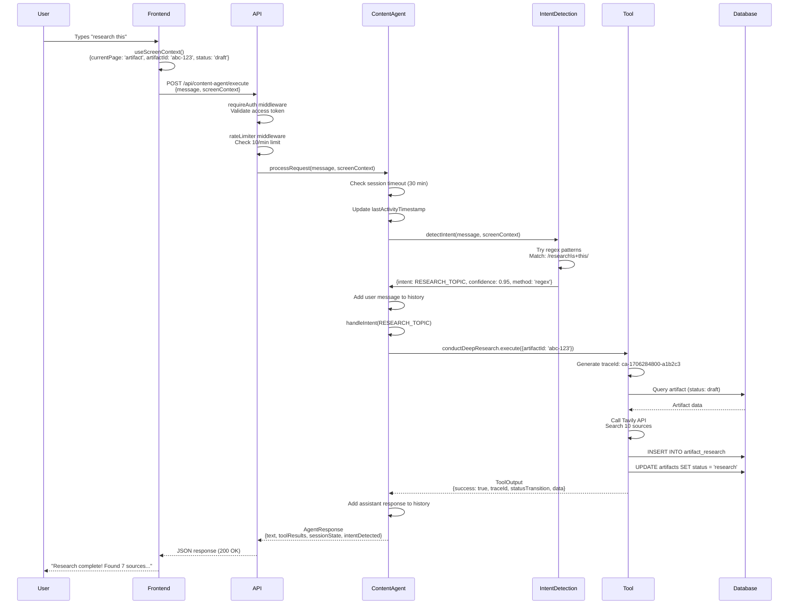

# Content Agent Architecture

**Version:** 2.0.0
**Last Updated:** 2026-01-28
**Status:** Complete (Phase 3 Image Generation)

## Overview

The Content Agent is a unified orchestrator that manages the entire content creation pipeline, from research through writing to visual generation. Built as a conversational AI system, it combines intent detection, tool orchestration, session management, and token budget optimization to provide a seamless user experience.

This architecture leverages Claude Sonnet 4's 200K context window, integrates with multiple AI providers (Anthropic, Google, Tavily), and implements production-grade error handling, observability, and security patterns.

## System Architecture

```mermaid
graph TB
    subgraph "Frontend Layer"
        UI[ArtifactPage Component]
        Hook[useScreenContext Hook]
    end

    subgraph "API Layer"
        Controller[ContentAgentController]
        Middleware[Security Middleware<br/>auth, rate limit, validation]
    end

    subgraph "Content Agent Orchestrator"
        CA[ContentAgent Class]
        Intent[Intent Detection<br/>Hybrid: Regex + Haiku]
        Token[Token Budget Manager<br/>200K context]
        Session[Session State Manager<br/>30min timeout]
    end

    subgraph "Tool Execution Layer"
        T1[conductDeepResearch]
        T2[generateContentSkeleton]
        T3[writeFullContent]
        T4[identifyImageNeeds<br/>DALL-E 3 / Gemini Imagen 4]
        T5[applyHumanityCheck]
        T6[checkContentHumanity]
    end

    subgraph "Context Layer"
        C1[fetchArtifact]
        C2[fetchResearch]
        C3[fetchArtifactTopics]
        C4[listDraftArtifacts]
    end

    subgraph "Security Layer"
        S1[Input Validation<br/>15+ injection patterns]
        S2[Privacy Controls<br/>PII detection]
        S3[Ownership Validation<br/>Multi-tenant security]
        S4[Rate Limiter<br/>10/min, 100/hr]
    end

    subgraph "Observability Layer"
        O1[Distributed Tracing<br/>TraceID correlation]
        O2[Metrics Collection<br/>p50, p95, p99]
        O3[Circuit Breaker<br/>5 failures → open]
    end

    subgraph "External Services"
        DB[(Supabase PostgreSQL<br/>Artifacts, Research)]
        Storage[(Supabase Storage<br/>Generated Images)]
        Tavily[Tavily API<br/>Web Research]
        Anthropic[Claude Sonnet 4<br/>Skeleton, Humanity]
        Google[Gemini 2.0 Flash<br/>Writing]
        DALL_E[DALL-E 3 / Gemini Imagen 4<br/>Image Generation]
    end

    UI --> Hook
    Hook --> Controller
    Controller --> Middleware
    Middleware --> CA
    CA --> Intent
    CA --> Token
    CA --> Session
    CA --> T1 & T2 & T3 & T4 & T5 & T6
    CA --> C1 & C2 & C3 & C4
    T1 & T2 & T3 & T4 & T5 & T6 --> S1 & S2 & S3 & S4
    T1 & T2 & T3 & T4 & T5 & T6 --> O1 & O2 & O3
    T1 --> Tavily
    T2 --> Anthropic
    T3 --> Google
    T4 --> Google
    T5 --> Anthropic
    T6 --> Anthropic
    C1 & C2 & C3 & C4 --> DB
```



## Core Components

### ContentAgent Orchestrator

The central orchestrator that manages conversations, coordinates tools, and maintains session state.

**Responsibilities:**
- Process user requests with natural language understanding
- Detect user intent from conversational messages
- Manage session state and conversation history
- Coordinate tool execution based on detected intent
- Handle token budget to stay within 200K context limit
- Track session timeout (30 minutes of inactivity)

**Implementation:**
```typescript
class ContentAgent {
  private sessionState: SessionState
  private conversationHistory: ConversationTurn[] = []
  private tokenBudget: TokenBudgetManager
  private maxConversationTurns: number = 10

  constructor(sessionId?: string) {
    this.sessionState = {
      sessionId: sessionId || this.generateSessionId(),
      lastActivityTimestamp: Date.now()
    }
    this.tokenBudget = tokenBudgetManager
  }

  async processRequest(
    message: string,
    screenContext: ScreenContext = {}
  ): Promise<AgentResponse>
}
```

**Key Features:**
- **Stateful Sessions**: Each user maintains a persistent session across requests
- **Conversation Memory**: Remembers last 10 turns for context continuity
- **Automatic Cleanup**: Sessions timeout after 30 minutes, state resets
- **Token Awareness**: Continuously monitors and manages token usage

### Session State Management

Tracks user session and activity for maintaining conversation context.

**Session State Interface:**
```typescript
interface SessionState {
  sessionId: string              // Format: session-{timestamp}-{random7}
  lastActivityTimestamp: number  // Unix timestamp in milliseconds
}
```

**Session Lifecycle:**

1. **Creation**: New session generated on first request or after timeout
   ```typescript
   sessionId: `session-${Date.now()}-${Math.random().toString(36).substring(2, 9)}`
   // Example: session-1706284800000-a1b2c3d
   ```

2. **Activity Tracking**: Timestamp updated on every request
   ```typescript
   sessionState.lastActivityTimestamp = Date.now()
   ```

3. **Timeout Detection**: Checked before processing each request
   ```typescript
   const elapsed = Date.now() - sessionState.lastActivityTimestamp
   const hasTimedOut = elapsed > 30 * 60 * 1000  // 30 minutes
   ```

4. **Reset**: Conversation history cleared, new session ID generated
   ```typescript
   resetSession() {
     this.sessionState = {
       sessionId: this.generateSessionId(),
       lastActivityTimestamp: Date.now()
     }
     this.conversationHistory = []
   }
   ```

**Conversation History:**
```typescript
interface ConversationTurn {
  role: 'user' | 'assistant'
  content: string
  timestamp: number
  toolCalls?: string[]  // Serialized tool call details
}
```

- Maximum 10 turns stored
- Oldest turns removed when limit exceeded
- Used for context in future requests
- Contributes to token budget calculations

### Token Budget Manager

Manages Claude Sonnet 4's 200K context window with intelligent truncation and priority-based allocation.

**Token Budget Allocation:**
```typescript
const TOKEN_BUDGET = {
  max: 200000,  // Claude Sonnet 4 total capacity

  reserved: {
    systemPrompt: 3000,      // Agent behavior instructions
    toolDefinitions: 8000,   // 10 tool schemas (6 core + 4 context)
    userContext: 500,        // Current screen context
    responseBuffer: 4000,    // Space for AI response
    total: 15500
  },

  available: 184500  // For conversation, research, dynamic content
}
```

**Context Priority System:**

Determines truncation order when context exceeds budget:

```typescript
enum ContextPriority {
  CRITICAL = 1,           // Never truncate (system prompt, tools)
  REQUIRED = 2,           // Never truncate (current user message)
  SCREEN_CONTEXT = 3,     // Truncate last (current page/artifact)
  CONVERSATION_HISTORY = 4, // Summarize if needed
  RESEARCH_DATA = 5       // Truncate first
}
```

**Truncation Strategy:**

When total context exceeds 200K tokens:

1. **Research Data** (Priority 5): Truncate first
   - Keep most recent/relevant sources
   - Remove older excerpts
   - Maintain key insights

2. **Conversation History** (Priority 4): Summarize older messages
   - Keep most recent 5-7 turns
   - Summarize older context: "[Earlier 3 messages truncated]"
   - Preserve critical information

3. **Screen Context** (Priority 3): Truncate only if absolutely necessary
   - Keep essential fields (artifactId, status)
   - Remove optional metadata

4. **Critical Content** (Priority 1-2): Never truncate
   - System prompt always included
   - Tool definitions always included
   - Current user message always included

**Example Truncation:**
```
Initial Context:
- System Prompt: 3,000 tokens
- Tools: 8,000 tokens
- User Message: 500 tokens
- Screen Context: 300 tokens
- Conversation History: 8,000 tokens (10 turns)
- Research Data: 185,000 tokens (50 sources)
Total: 204,800 tokens (exceeds 200K by 4,800)

After Truncation:
- System Prompt: 3,000 tokens (unchanged)
- Tools: 8,000 tokens (unchanged)
- User Message: 500 tokens (unchanged)
- Screen Context: 300 tokens (unchanged)
- Conversation History: 6,000 tokens (7 recent turns, 3 summarized)
- Research Data: 182,000 tokens (40 most relevant sources)
Total: 199,800 tokens (fits within 200K)
```

**Token Calculation:**
```typescript
calculateUsage(text: string): number {
  // Rough approximation: 1 token ≈ 4 characters
  return Math.ceil(text.length / 4)
}
```

### Intent Detection System

Hybrid approach combining regex pattern matching with AI classification for accurate, fast intent recognition.

**Detection Flow:**
```
User Message → Regex Patterns (confidence 0.95) → Match?
                ↓ No
         → Haiku Classification (temperature 0.1) → Confidence?
                ↓ < 0.7
         → Clarification Request → User provides more info
```

**9 Intent Categories:**
1. `GENERATE_TOPICS` - User wants topic ideas
2. `RESEARCH_TOPIC` - User wants research on a topic
3. `CREATE_SKELETON` - User wants content outline
4. `WRITE_CONTENT` - User wants full content written
5. `HUMANIZE_CONTENT` - User wants AI patterns removed
6. `CREATE_VISUALS` - User wants images generated
7. `FULL_PIPELINE` - User wants complete workflow
8. `STATUS_CHECK` - User wants progress update
9. `UNCLEAR` - Intent cannot be determined

**Regex Pattern Matching** (High Confidence):
```typescript
const INTENT_PATTERNS = [
  {
    intent: UserIntent.RESEARCH_TOPIC,
    patterns: [
      /\bresearch\s+(this\s+)?topic\b/i,
      /\bfind\s+(information|sources)\b/i,
      /\bgather\s+research\b/i
    ]
  },
  {
    intent: UserIntent.WRITE_CONTENT,
    patterns: [
      /\bwrite\s+(it|this|content)\b/i,
      /\bcreate\s+content\b/i,
      /\bgenerate\s+text\b/i
    ]
  }
]

// Returns confidence 0.95 for regex matches
```

**AI Classification** (Medium Confidence):
```typescript
// Uses Claude 3.5 Haiku for speed and accuracy
const { text } = await generateText({
  model: anthropic('claude-3-5-haiku-20241022'),
  prompt: classificationPrompt,
  maxTokens: 50,
  temperature: 0.1  // Low temperature for consistency
})

// Response format: "WRITE_CONTENT|0.8"
// Parsed to: { intent: 'WRITE_CONTENT', confidence: 0.8 }
```

**Screen Context Integration:**

Screen context dramatically improves intent detection:

```typescript
// Without context:
detectIntent("research this")
→ UNCLEAR (what is "this"?)

// With context:
detectIntent("research this", {
  currentPage: 'artifact',
  artifactId: 'abc-123',
  artifactTitle: 'Product Management Best Practices',
  artifactStatus: 'draft'
})
→ RESEARCH_TOPIC (confidence 0.95, "this" = current artifact)
```

## Tool Execution Layer

### Core Tools (6 total)

Tools that modify artifact state and execute the content creation pipeline.

#### 1. conductDeepResearch

**Purpose**: Research topic from multiple web sources using Tavily API

**Status Transition**: `draft` → `research`

**Duration**: ~30-60 seconds

**Implementation**:
```typescript
const conductDeepResearch = tool({
  name: 'conductDeepResearch',
  description: 'Research content topic from multiple sources',
  inputSchema: z.object({
    artifactId: z.string().uuid(),
    minRequired: z.number().min(1).max(20).optional()
  }),
  execute: async ({ artifactId, minRequired = 5 }) => {
    const traceId = generateTraceId()
    const startTime = Date.now()

    // Query Tavily API for web research
    const results = await tavilyClient.search({
      query: topic,
      searchDepth: 'advanced',
      maxResults: 10,
      includeDomains: ['reddit.com', 'linkedin.com', 'quora.com', 'medium.com']
    })

    // Store in database
    await supabase.from('artifact_research').insert(results)

    // Update artifact status
    await supabase
      .from('artifacts')
      .update({ status: 'research' })
      .eq('id', artifactId)

    return {
      success: true,
      traceId,
      duration: Date.now() - startTime,
      statusTransition: { from: 'draft', to: 'research' },
      data: {
        sourceCount: results.length,
        keyInsights: extractInsights(results)
      }
    }
  }
})
```

#### 2. generateContentSkeleton

**Purpose**: Create H1 title + H2 section headings based on research

**Status Transition**: `research` → `skeleton`

**Duration**: ~20-40 seconds

**AI Provider**: Claude Sonnet 4 (Anthropic)

#### 3. writeFullContent

**Purpose**: Write complete content filling in all sections

**Status Transition**: `skeleton` → `creating_visuals`

**Duration**: ~60-120 seconds

**AI Provider**: Gemini 2.0 Flash (Google)

**Tone Mapping**: Temperature varies by selected tone (0.5-0.9)

#### 4. identifyImageNeeds (Phase 3)

**Purpose**: Extract image placeholders, generate high-quality images with DALL-E 3 (primary) or Gemini Imagen 4 (fallback), upload to Supabase storage, and embed images in content

**Status Transition**: `creating_visuals` → `ready`

**Duration**: ~60-180 seconds (varies by image count)

**AI Providers**: DALL-E 3 (primary), Gemini Imagen 4 (fallback)

**Implementation Flow**:
```typescript
const identifyImageNeeds = tool({
  name: 'identifyImageNeeds',
  description: 'Generate images from [IMAGE: description] placeholders',
  inputSchema: z.object({
    artifactId: z.string().uuid()
  }),
  execute: async ({ artifactId }) => {
    // 1. Extract [IMAGE: description] placeholders via regex
    const placeholders = extractImagePlaceholders(artifact.content)

    // 2. For each placeholder:
    for (const placeholder of placeholders) {
      // - Infer purpose (hero, illustration, diagram, photo)
      const purpose = inferPurpose(placeholder.description)

      // - Select resolution based on type and purpose
      const resolution = getResolutionForType(artifact.type, purpose)

      // - Generate image with DALL-E 3, fallback to Gemini Imagen 4
      const buffer = await generateWithRetry({
        prompt: placeholder.description,
        purpose,
        resolution,
        quality: 'hd'
      })

      // - Upload to Supabase storage
      const url = await uploadFinalImage(artifactId, imageId, buffer)

      // - Track result
      finals.push({ id: imageId, url, ... })
    }

    // 3. Replace placeholders with markdown images
    const contentWithImages = insertImagesIntoContent(content, needs, finals)

    // 4. Update artifact with embedded images and visuals_metadata
    await updateArtifact({
      content: contentWithImages,
      visuals_metadata: { phase: { phase: 'complete' }, needs, finals, ... },
      status: 'ready'
    })

    return { success: true, needs, finals, contentWithImages }
  }
})
```

**Resolution by Purpose**:
| Purpose | Resolution | Typical Artifact Types |
|---------|------------|------------------------|
| hero | 1792x1024 | Blog, Showcase |
| illustration | 1024x1024 | Blog sections |
| social | 1024x1024 | Social posts |
| diagram | 1792x1024 | Technical content |
| photo | 1024x1024 | General |

**Storage Location**: `artifacts/{artifactId}/images/final/{imageId}.png`

#### 5. applyHumanityCheck

**Purpose**: Remove AI patterns and make content sound more human

**Status Transition**: `creating_visuals` → `ready`

**Duration**: ~30-45 seconds

**AI Provider**: Claude Sonnet 4 (Anthropic)

**Optional**: User can skip this step

#### 6. checkContentHumanity

**Purpose**: Validate content for AI patterns (read-only)

**Status Transition**: None (validation only)

**Duration**: ~10-15 seconds

**AI Provider**: Claude Sonnet 4 (Anthropic)

### Context Tools (4 total)

Read-only tools that fetch contextual information without modifying state.

#### 1. fetchArtifactTopics

**Purpose**: Check existing artifact titles to avoid duplication

**Limits**: Default 20, max 50

**Query**: `SELECT title FROM artifacts WHERE user_id = ?`

#### 2. fetchArtifact

**Purpose**: Get complete artifact details (title, content, status, metadata)

**Query**: `SELECT * FROM artifacts WHERE id = ? AND user_id = ?`

#### 3. fetchResearch

**Purpose**: Retrieve research data for an artifact

**Limits**: Default 20, max 100

**Query**: `SELECT * FROM artifact_research WHERE artifact_id = ?`

#### 4. listDraftArtifacts

**Purpose**: List all draft/in-progress artifacts for user

**Limits**: Default 10, max 50

**Query**: `SELECT * FROM artifacts WHERE user_id = ? AND status IN ('draft', 'research', 'skeleton')`

### Tool Output Interface

All tools return standardized `ToolOutput<T>` for consistency:

```typescript
interface ToolOutput<T> {
  success: boolean                    // Whether tool executed successfully
  traceId: string                     // Distributed trace ID (ca-{timestamp}-{random6})
  duration?: number                   // Execution time in milliseconds
  statusTransition?: {                // If status changed
    from: ArtifactStatus
    to: ArtifactStatus
  }
  data: T                             // Tool-specific result data
  error?: {                           // If success = false
    category: ErrorCategory           // One of 13 categories
    message: string                   // Technical error message
    recoverable: boolean              // Can operation be retried?
  }
}
```

**Example Success Response:**
```json
{
  "success": true,
  "traceId": "ca-1706284800000-a1b2c3",
  "duration": 45230,
  "statusTransition": {
    "from": "draft",
    "to": "research"
  },
  "data": {
    "sourceCount": 7,
    "keyInsights": ["...", "...", "..."],
    "sourcesBreakdown": {
      "reddit": 3,
      "linkedin": 2,
      "medium": 2
    }
  }
}
```

**Example Error Response:**
```json
{
  "success": false,
  "traceId": "ca-1706284800000-x9y8z7",
  "error": {
    "category": "TOOL_TIMEOUT",
    "message": "Research operation exceeded 60 second timeout",
    "recoverable": true
  },
  "data": null
}
```

## Data Flow

Complete request-response flow from user input to UI update:



**Key Steps:**

1. **User Input**: Natural language message entered
2. **Context Gathering**: useScreenContext() provides page/artifact state
3. **Authentication**: Token validated via requireAuth middleware
4. **Rate Limiting**: 10 requests/minute checked
5. **Session Check**: 30-minute timeout verification
6. **Intent Detection**: Regex or AI classification
7. **Tool Execution**: Appropriate tool called based on intent
8. **Database Operations**: Research stored, status updated
9. **Response**: ToolOutput returned through layers
10. **UI Update**: Frontend displays result to user

## Error Handling

### Error Categories

13 standardized error categories for consistent handling:

```typescript
enum ErrorCategory {
  // Tool Errors
  TOOL_EXECUTION_FAILED,  // → 500 Internal Server Error
  TOOL_TIMEOUT,           // → 504 Gateway Timeout

  // AI Provider Errors
  AI_PROVIDER_ERROR,      // → 502 Bad Gateway
  AI_RATE_LIMIT,          // → 429 Too Many Requests
  AI_CONTENT_FILTER,      // → 400 Bad Request

  // Artifact Errors
  ARTIFACT_NOT_FOUND,     // → 404 Not Found
  INVALID_ARTIFACT_ID,    // → 400 Bad Request
  INVALID_STATUS,         // → 400 Bad Request

  // Intent Errors
  UNCLEAR_INTENT,         // → 400 Bad Request
  MISSING_CONTEXT,        // → 400 Bad Request

  // Research Errors
  RESEARCH_NOT_FOUND,     // → 404 Not Found

  // Validation Errors
  INVALID_TONE,           // → 400 Bad Request
  INVALID_CONTENT_TYPE    // → 400 Bad Request
}
```

### Retry Strategy

Exponential backoff with jitter for recoverable errors:

```typescript
const RETRY_POLICY = {
  maxRetries: 3,
  baseDelayMs: 1000,
  maxDelayMs: 10000,
  retryableCategories: [
    ErrorCategory.TOOL_EXECUTION_FAILED,
    ErrorCategory.TOOL_TIMEOUT,
    ErrorCategory.AI_PROVIDER_ERROR
  ]
}

// Backoff formula
delay = min(baseDelay * 2^attempt + random(0, baseDelay), maxDelay)

// Example delays:
// Attempt 1: 1000-2000ms
// Attempt 2: 2000-4000ms
// Attempt 3: 4000-8000ms
```

### Circuit Breaker

Prevents cascading failures by failing fast when errors exceed threshold:

```typescript
const CIRCUIT_BREAKER = {
  failureThreshold: 5,      // Open after 5 consecutive failures
  recoveryTimeMs: 60000,    // Half-open after 60 seconds
  successThreshold: 1       // Close after 1 successful request
}

// States:
// - CLOSED: Normal operation, all requests allowed
// - OPEN: Fail fast, no requests allowed (60s)
// - HALF_OPEN: Test with 1 request, then decide
```

## Code Examples

### Creating and Using ContentAgent

```typescript
import { createContentAgent } from './services/ai/ContentAgent.js'
import type { ScreenContext } from './services/ai/types/contentAgent.js'

// Create new agent instance
const contentAgent = createContentAgent()

// Process user request with screen context
const screenContext: ScreenContext = {
  currentPage: 'artifact',
  artifactId: 'abc-123',
  artifactType: 'blog',
  artifactTitle: 'Product Management Best Practices',
  artifactStatus: 'draft'
}

const response = await contentAgent.processRequest(
  "research this topic",
  screenContext
)

console.log(response)
// {
//   text: "I'll research Product Management Best Practices...",
//   intentDetected: 'RESEARCH_TOPIC',
//   toolResults: [{ toolCallId: '...', result: {...} }],
//   sessionState: { sessionId: 'session-...', lastActivityTimestamp: ... }
// }
```

### Managing Token Budget

```typescript
import { tokenBudgetManager, ContextPriority } from './services/ai/utils/tokenBudget.js'

// Calculate total token usage
const usage = tokenBudgetManager.calculateTotalUsage({
  systemPrompt: systemPromptText,
  toolDefinitions: toolSchemas,
  userMessage: userInput,
  screenContext: JSON.stringify(context),
  conversationHistory: history,
  researchData: researchText
})

console.log(usage)
// {
//   total: 204800,
//   breakdown: { systemPrompt: 3000, tools: 8000, ... },
//   remaining: -4800,
//   needsTruncation: true
// }

// Truncate if needed
if (usage.needsTruncation) {
  // Truncate research data first (lowest priority)
  const truncatedResearch = tokenBudgetManager.truncateIfNeeded(
    researchData,
    ContextPriority.RESEARCH_DATA,
    180000  // Max 180K tokens for research
  )

  // Optimize conversation history
  const optimizedHistory = tokenBudgetManager.optimizeConversationHistory(
    conversationHistory,
    6000  // Max 6K tokens for history
  )
}
```

### Handling Errors with Retry

```typescript
import { withExponentialBackoff } from './services/ai/utils/backoff.js'
import { ErrorCategory } from './services/ai/types/errors.js'

try {
  // Execute tool with automatic retry
  const result = await withExponentialBackoff(
    async () => {
      return await conductDeepResearch.execute({ artifactId: 'abc-123' })
    },
    {
      maxRetries: 3,
      baseDelayMs: 1000,
      maxDelayMs: 10000
    }
  )

  console.log('Research completed:', result.data)
} catch (error) {
  if (error.category === ErrorCategory.TOOL_EXECUTION_FAILED) {
    // Non-recoverable after retries
    console.error('Research failed permanently:', error.message)
  } else if (error.category === ErrorCategory.ARTIFACT_NOT_FOUND) {
    // Non-retryable error
    console.error('Artifact does not exist:', error.message)
  }
}
```

### Session Management

```typescript
// Get conversation history
const history = contentAgent.getConversationHistory()
console.log(`Conversation has ${history.length} turns`)

// Clear session (reset state)
contentAgent.clearSession()
console.log('Session cleared, new session ID generated')

// Check if session is still active
const SESSION_TIMEOUT_MS = 30 * 60 * 1000  // 30 minutes
const elapsed = Date.now() - contentAgent.sessionState.lastActivityTimestamp
const isActive = elapsed < SESSION_TIMEOUT_MS
```

## Performance Considerations

### Typical Response Times

| Operation | Duration | Bottleneck |
|-----------|----------|------------|
| Intent Detection (Regex) | <50ms | Pattern matching |
| Intent Detection (Haiku) | 200-500ms | AI inference |
| Research (Tavily) | 30-60s | External API + database writes |
| Skeleton Generation | 20-40s | Claude Sonnet 4 generation |
| Content Writing | 60-120s | Gemini 2.0 Flash long-form |
| Image Generation (Phase 3) | 60-180s | DALL-E 3 / Gemini Imagen 4 + Supabase upload |
| Humanity Check | 30-45s | Claude Sonnet 4 refinement |

### Optimization Strategies

1. **Token Budget Optimization**
   - Truncate research data aggressively (lowest priority)
   - Summarize conversation history after 10 turns
   - Use 1 token ≈ 4 characters heuristic

2. **Caching**
   - Cache tool definitions (8K tokens, never changes)
   - Cache system prompt (3K tokens, rarely changes)
   - Cache regex patterns in-memory

3. **Parallel Execution**
   - Fetch artifact and research data in parallel (context tools)
   - Execute independent operations concurrently

4. **Database Optimization**
   - Index artifact_id, user_id, status columns
   - Use connection pooling (Supabase handles this)
   - Batch insert research results

## Related Documentation

- [../../ai-agents-and-prompts/intent-detection-guide.md](../../ai-agents-and-prompts/intent-detection-guide.md) - Complete intent detection system
- [../../ai-agents-and-prompts/pipeline-execution-flow.md](../../ai-agents-and-prompts/pipeline-execution-flow.md) - 4-step pipeline with checkpoints
- [../../ai-agents-and-prompts/core-tools-reference.md](../../ai-agents-and-prompts/core-tools-reference.md) - All 6 core tools documented
- [../../ai-agents-and-prompts/context-tools-reference.md](../../ai-agents-and-prompts/context-tools-reference.md) - All 4 context tools documented
- [../../api/error-handling-reference.md](../../api/error-handling-reference.md) - 13 error categories and retry policies
- [../../api/screen-context-specification.md](../../api/screen-context-specification.md) - Screen context payload specification

---

**Version History:**
- **2.0.0** (2026-01-28) - Phase 3 image generation: Updated identifyImageNeeds tool with DALL-E 3 / Gemini Imagen implementation, added Supabase Storage to external services, revised timing estimates
- **1.0.0** (2026-01-26) - Initial Content Agent architecture documentation
