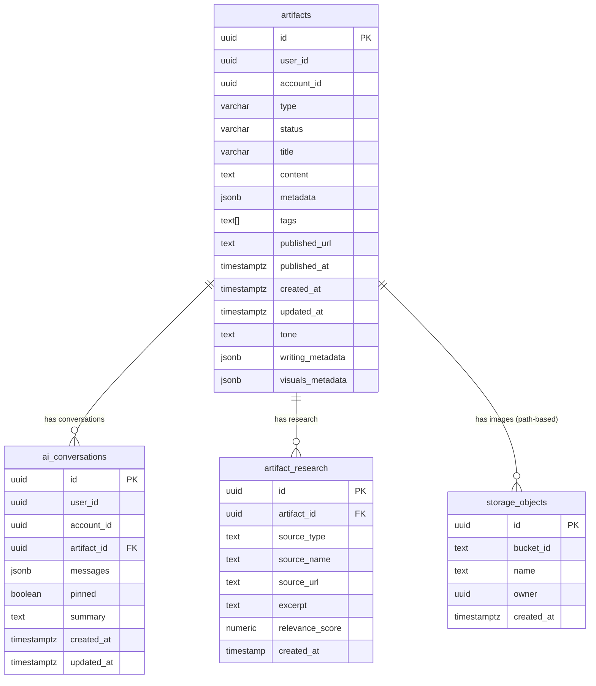
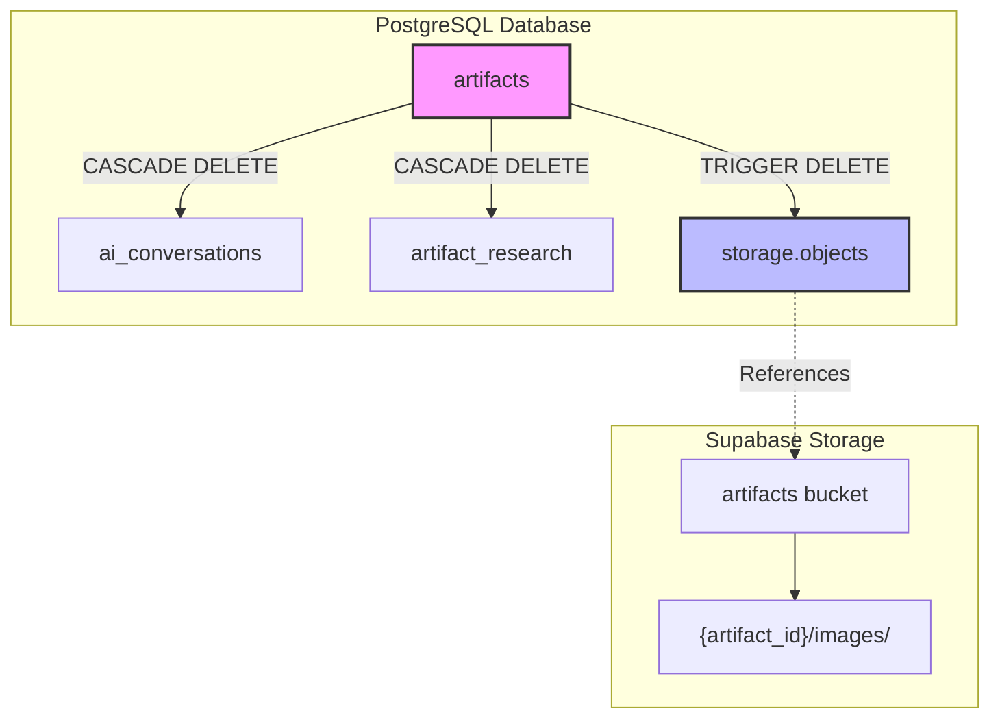
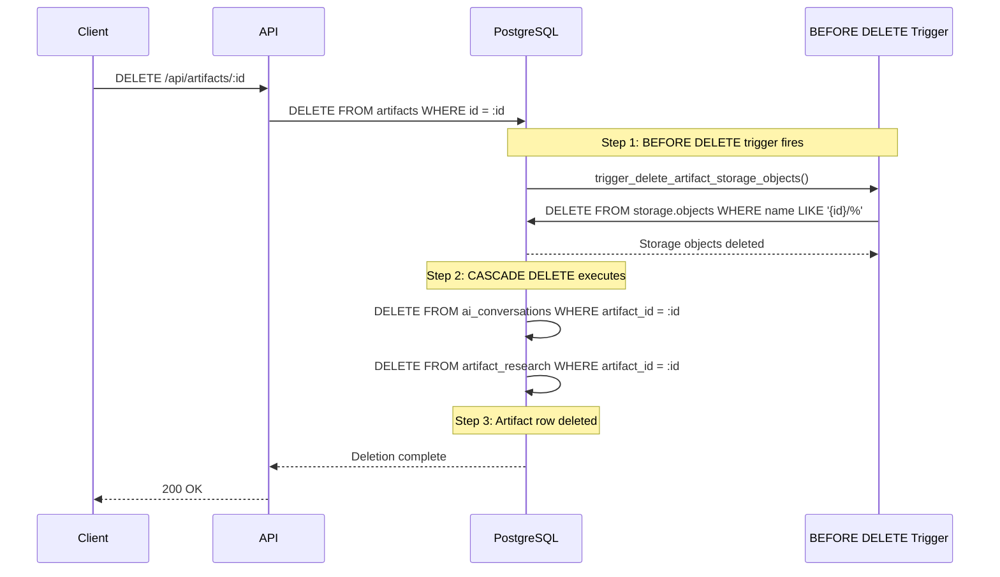

# Artifact Data Relationships

This document describes all data relationships connected to the `artifacts` table, including database tables with foreign key constraints and storage objects with path-based relationships.

## Entity Relationship Diagram



## Cascade Delete Relationships

### Current State (All Implemented ✅)

| Source Table | Source Column | Target Table | Target Column | Delete Rule |
|--------------|---------------|--------------|---------------|-------------|
| `ai_conversations` | `artifact_id` | `artifacts` | `id` | **CASCADE** ✅ |
| `artifact_research` | `artifact_id` | `artifacts` | `id` | **CASCADE** ✅ |
| `storage.objects` | `name` (path) | `artifacts` | `id` | **TRIGGER** ✅ |

### Storage Objects Path Pattern

Storage files are organized by artifact ID:
```
{artifact_id}/images/final/{image_uuid}.png
```

Example:
```
791ad84a-096b-4846-afbd-a7a42cb09d9a/images/final/187ecfb3-1bca-4148-8505-6b212efdf441.png
```

## Data Flow Diagram



## Delete Cascade Flow

When an artifact is deleted, the following happens automatically:



## Tables Summary

### Tables with Foreign Key to artifacts

| Table | Relationship | Cascade Delete | Records |
|-------|--------------|----------------|---------|
| `ai_conversations` | Many-to-One | ✅ FK CASCADE | 0 |
| `artifact_research` | Many-to-One | ✅ FK CASCADE | 490 |

### Storage Objects (Trigger-Based)

| Bucket | Path Pattern | Cascade Delete | Objects |
|--------|--------------|----------------|---------|
| `artifacts` | `{artifact_id}/images/final/*.png` | ✅ TRIGGER | 11 |

## Implementation Details

### Trigger Function: `delete_artifact_storage_objects()`

```sql
CREATE OR REPLACE FUNCTION delete_artifact_storage_objects()
RETURNS TRIGGER
LANGUAGE plpgsql
SECURITY DEFINER
SET search_path = public, storage
AS $$
DECLARE
  deleted_count INTEGER;
BEGIN
  -- Delete all storage objects for this artifact
  DELETE FROM storage.objects
  WHERE bucket_id = 'artifacts'
    AND name LIKE OLD.id::text || '/%';

  GET DIAGNOSTICS deleted_count = ROW_COUNT;

  IF deleted_count > 0 THEN
    RAISE NOTICE 'Deleted % storage objects for artifact %', deleted_count, OLD.id;
  END IF;

  RETURN OLD;
END;
$$;
```

### Trigger Definition

```sql
CREATE TRIGGER trigger_delete_artifact_storage_objects
  BEFORE DELETE ON artifacts
  FOR EACH ROW
  EXECUTE FUNCTION delete_artifact_storage_objects();
```

### Why Direct Table Deletion?

The trigger deletes directly from `storage.objects` table rather than calling the Storage API because:

1. **Reliability**: Direct SQL is more reliable than HTTP calls within transactions
2. **Atomicity**: Deletion happens within the same transaction as artifact deletion
3. **Security**: Uses `SECURITY DEFINER` with explicit `search_path` to prevent injection
4. **Performance**: No network overhead from HTTP calls

### Security Considerations

- Function uses `SECURITY DEFINER` to execute with owner privileges
- `SET search_path = public, storage` prevents search path injection attacks
- Trigger fires `BEFORE DELETE` to ensure storage cleanup before FK cascades

## Migration Reference

- **Migration**: `005_cascade_delete_storage_objects`
- **Date**: 2026-01-28
- **Extension**: `pg_net` enabled (available for future use)
