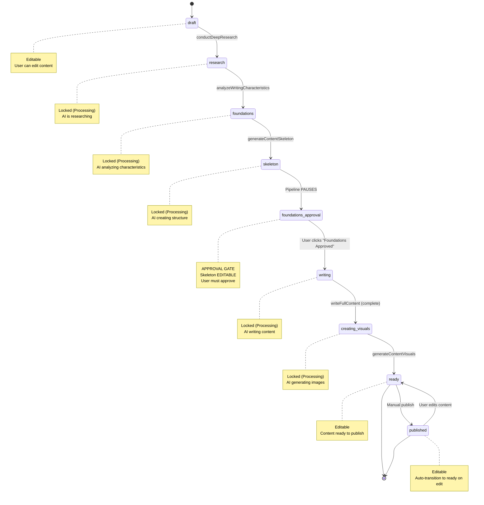

# Database Artifact Schema and Workflow

**Version:** 2.0.0
**Last Updated:** 2026-01-29
**Status:** Complete (Phase 4 Writing Quality Enhancement)

> **⚠️ IMPORTANT UPDATE**: This document has been updated from 7-status to 9-status workflow as of Phase 4. The new workflow introduces `foundations` and `foundations_approval` statuses with a user approval gate for writing quality enhancement.

## Overview

The artifacts table stores all user-generated content (social posts, blogs, showcases) with a **9-status linear workflow**. The schema supports AI-driven content creation with research storage, **writing characteristics analysis**, tone customization, and type-specific metadata in JSONB fields.

**Key Features:**
- **9-Status Linear Workflow (Phase 4)** - draft → research → foundations → skeleton → foundations_approval → writing → creating_visuals → ready → published
- **Writing Quality Enhancement** - User approval gate with editable skeleton before content writing
- **Writing Characteristics** - 20+ characteristics analyzed from user's writing examples
- **Type System** - social_post, blog, showcase with extensible metadata
- **Research Storage** - Separate artifact_research table for multi-source research
- **Tone Customization** - 8 tone options for content generation
- **Indexes** - Optimized for common query patterns

---

## Artifacts Table Schema

### Core Fields

```sql
CREATE TABLE IF NOT EXISTS artifacts (
  -- Primary Key
  id UUID PRIMARY KEY DEFAULT gen_random_uuid(),

  -- Multi-Tenancy (MVP: Default values, Future: Actual user IDs)
  user_id UUID NOT NULL DEFAULT '00000000-0000-0000-0000-000000000001',
  account_id UUID NOT NULL DEFAULT '00000000-0000-0000-0000-000000000001',

  -- Content Type (3 types)
  type VARCHAR(50) NOT NULL CHECK (type IN ('social_post', 'blog', 'showcase')),

  -- Workflow Status (9 statuses - Phase 4)
  status VARCHAR(50) NOT NULL DEFAULT 'draft' CHECK (status IN (
    'draft',
    'research',
    'foundations',           -- Phase 4: AI analyzing writing characteristics
    'skeleton',
    'foundations_approval',  -- Phase 4: User approval gate
    'writing',
    'creating_visuals',
    'ready',
    'published'
  )),

  -- Skeleton Content (Phase 4: Stored separately for editing during approval)
  skeleton_content TEXT,

  -- Content Fields
  title VARCHAR(500),                 -- Artifact title (required)
  content TEXT,                       -- Markdown or HTML content
  metadata JSONB DEFAULT '{}',        -- Type-specific fields (platform, hashtags, etc.)
  tags TEXT[] DEFAULT '{}',           -- User-defined tags
  tone TEXT CHECK (tone IN (
    'formal',
    'casual',
    'professional',
    'conversational',
    'technical',
    'friendly',
    'authoritative',
    'humorous'
  )) DEFAULT 'professional',          -- Tone for AI content generation

  -- Publishing
  published_url TEXT,                 -- URL where content was published
  published_at TIMESTAMPTZ,           -- Timestamp of publishing

  -- Timestamps
  created_at TIMESTAMPTZ DEFAULT NOW(),
  updated_at TIMESTAMPTZ DEFAULT NOW()
);
```

### Indexes

```sql
-- Optimize common query patterns
CREATE INDEX IF NOT EXISTS idx_artifacts_user_id ON artifacts(user_id);
CREATE INDEX IF NOT EXISTS idx_artifacts_type ON artifacts(type);
CREATE INDEX IF NOT EXISTS idx_artifacts_status ON artifacts(status);
CREATE INDEX IF NOT EXISTS idx_artifacts_updated_at ON artifacts(updated_at DESC);
```

**Query Patterns Optimized:**
- Fetch all artifacts for a user: `WHERE user_id = ?`
- Filter by type: `WHERE type = ?`
- Filter by status: `WHERE status = ?`
- Sort by recency: `ORDER BY updated_at DESC`

---

## 9-Status Linear Workflow (Phase 4)

### Status Definitions



| Status | Description | Editor State | Progress | User Actions | AI Operations |
|--------|-------------|--------------|----------|--------------|---------------|
| **draft** | Initial state after creation | Editable | 0% | Edit content, Create Content | conductDeepResearch |
| **research** | AI researching topic from multiple sources | Locked | 15% | Wait | Tavily API queries |
| **foundations** | AI analyzing writing style (Phase 4) | Locked | 30% | Wait | analyzeWritingCharacteristics |
| **skeleton** | AI creating H1 title + H2 section headings | Locked | 45% | Wait | generateContentSkeleton |
| **foundations_approval** | User reviews and approves (Phase 4) | Skeleton Editable | 50% | Edit skeleton, Approve | None (waiting) |
| **writing** | AI writing full content for each section | Locked | 70% | Wait | writeFullContent |
| **creating_visuals** | AI generating cover image/visuals | Locked | 90% | Wait, Humanize | identifyImageNeeds |
| **ready** | Content ready to publish | Editable | 100% | Edit, Humanize, Publish | applyHumanityCheck (optional) |
| **published** | Content published to platform | Editable | 100% | Edit (→ ready) | None |

### Processing States (4 states)

States where editor is locked and polling is active:

```typescript
const PROCESSING_STATES: ArtifactStatus[] = [
  'research',        // AI researching topic
  'foundations',     // AI analyzing writing characteristics (Phase 4)
  'writing',         // AI writing full content
  'creating_visuals' // AI generating images
]

function isProcessingState(status: ArtifactStatus): boolean {
  return PROCESSING_STATES.includes(status)
}
```

### Approval States (Phase 4)

States where pipeline is paused waiting for user action:

```typescript
const APPROVAL_STATES: ArtifactStatus[] = [
  'foundations_approval' // User must click "Foundations Approved" button
]

function isApprovalState(status: ArtifactStatus): boolean {
  return APPROVAL_STATES.includes(status)
}
```

**Key Characteristics of `foundations_approval`:**
- Main editor is LOCKED
- Skeleton is EDITABLE in FoundationsSection
- WritingCharacteristicsDisplay shows style profile
- "Foundations Approved" button is enabled
- No polling (pipeline paused)

### Editable States (3 states)

States where editor is unlocked:

```typescript
const EDITABLE_STATES: ArtifactStatus[] = [
  'draft',
  'ready',
  'published'
]

function isEditableState(status: ArtifactStatus): boolean {
  return EDITABLE_STATES.includes(status)
}
```

---

## Status Transitions (Phase 4 - 9 statuses)

### Valid Transitions Matrix

| From Status | To Status | Trigger | Auto/Manual | Tool/Service |
|------------|-----------|---------|-------------|--------------|
| `draft` | `research` | User clicks "Create Content" | Manual | conductDeepResearch |
| `research` | `foundations` | Research completes | Auto | analyzeWritingCharacteristics |
| `foundations` | `skeleton` | Characteristics analysis completes | Auto | generateContentSkeleton |
| `skeleton` | `foundations_approval` | Skeleton generation completes | Auto | (pipeline pauses) |
| `foundations_approval` | `writing` | User clicks "Foundations Approved" | **Manual (UI)** | writeFullContent |
| `writing` | `creating_visuals` | Content writing completes | Auto | identifyImageNeeds |
| `creating_visuals` | `ready` | Visuals generated | Auto | (automatic) |
| `ready` | `published` | User clicks "Mark as Published" | Manual | (manual action) |
| `published` | `ready` | User edits content | Auto | (auto-transition) |

### Phase 4 Key Changes

1. **New `foundations` status**: AI analyzes writing characteristics from user's examples
2. **New `foundations_approval` status**: Pipeline PAUSES for user review
3. **Editable skeleton**: User can edit skeleton in FoundationsSection during `foundations_approval`
4. **UI button approval**: User clicks "Foundations Approved" to continue (not chat-based)

### Invalid Transitions

```typescript
// Examples of invalid transitions (enforced by backend):

// Cannot skip research step
draft → foundations  ❌ Must research first
draft → skeleton    ❌ Must research first

// Cannot skip foundations (Phase 4)
research → skeleton  ❌ Must analyze characteristics first
research → writing   ❌ Must analyze characteristics first

// Cannot skip skeleton
foundations → writing  ❌ Must create skeleton first
foundations → foundations_approval  ❌ Must create skeleton first

// Cannot skip approval gate (Phase 4)
skeleton → writing  ❌ Must wait for user approval

// Cannot skip writing
foundations_approval → creating_visuals  ❌ Must write content first

// Cannot skip visuals
writing → ready  ❌ Must complete visuals first

// Cannot go backwards (except published → ready)
ready → writing  ❌ One-way flow
foundations_approval → skeleton  ❌ One-way flow
```

### Auto-Transition: Published → Ready

```typescript
// Backend: When user edits published content
if (artifact.status === 'published' && userEditedContent) {
  await updateArtifact({
    id: artifact.id,
    status: 'ready'  // Auto-transition
  })
}
```

**Why?**
- Editing published content makes it "unpublished" (needs re-publishing)
- User can make multiple edits before republishing
- Clear distinction between "published" (final) and "ready" (editable)

---

## Artifact Types

### Type Enum

```typescript
type ArtifactType = 'social_post' | 'blog' | 'showcase'
```

### Type-Specific Metadata (JSONB)

Each artifact type stores additional fields in the `metadata` JSONB column:

#### social_post

```json
{
  "platform": "linkedin" | "twitter" | "facebook" | "instagram",
  "hashtags": ["#productmanagement", "#leadership"],
  "character_count": 1500,
  "engagement_metrics": {
    "likes": 42,
    "comments": 8,
    "shares": 12
  }
}
```

#### blog

```json
{
  "platform": "medium" | "substack" | "custom",
  "seo_title": "SEO-optimized title",
  "seo_description": "Meta description for SEO",
  "featured_image_url": "https://...",
  "reading_time_minutes": 8,
  "canonical_url": "https://..."
}
```

#### showcase

```json
{
  "project_type": "mobile_app" | "web_app" | "product_launch" | "case_study",
  "client": "Company Name",
  "industry": "SaaS",
  "outcomes": {
    "metric_1": "40% increase in user engagement",
    "metric_2": "2x faster onboarding"
  },
  "tech_stack": ["React", "Node.js", "PostgreSQL"]
}
```

### Querying Type-Specific Fields

```sql
-- Get all LinkedIn posts
SELECT * FROM artifacts
WHERE type = 'social_post'
  AND metadata->>'platform' = 'linkedin';

-- Get showcases for specific industry
SELECT * FROM artifacts
WHERE type = 'showcase'
  AND metadata->>'industry' = 'SaaS';

-- Get blogs with high reading time
SELECT * FROM artifacts
WHERE type = 'blog'
  AND (metadata->>'reading_time_minutes')::INTEGER > 10;
```

---

## Artifact Research Table

### Schema

```sql
CREATE TABLE IF NOT EXISTS artifact_research (
  id UUID PRIMARY KEY DEFAULT gen_random_uuid(),
  artifact_id UUID NOT NULL REFERENCES artifacts(id) ON DELETE CASCADE,
  source_type TEXT NOT NULL CHECK (source_type IN (
    'reddit',
    'linkedin',
    'quora',
    'medium',
    'substack',
    'user_provided'
  )),
  source_name TEXT NOT NULL,
  source_url TEXT,
  excerpt TEXT NOT NULL,
  relevance_score DECIMAL(3,2) CHECK (relevance_score >= 0 AND relevance_score <= 1),
  created_at TIMESTAMP DEFAULT NOW()
);

-- Indexes for performance
CREATE INDEX idx_artifact_research_artifact_id ON artifact_research(artifact_id);
CREATE INDEX idx_artifact_research_source_type ON artifact_research(source_type);
CREATE INDEX idx_artifact_research_relevance_score ON artifact_research(relevance_score DESC);
```

### Research Sources

| Source Type | Description | API |
|------------|-------------|-----|
| `reddit` | Reddit posts/comments | Tavily API |
| `linkedin` | LinkedIn articles/posts | Tavily API |
| `quora` | Quora questions/answers | Tavily API |
| `medium` | Medium articles | Tavily API |
| `substack` | Substack newsletters | Tavily API |
| `user_provided` | Manual research entry | User input |

### Example Research Entry

```sql
INSERT INTO artifact_research (artifact_id, source_type, source_name, source_url, excerpt, relevance_score)
VALUES (
  'abc-123',
  'reddit',
  'r/ProductManagement',
  'https://reddit.com/r/ProductManagement/comments/xyz',
  'Product managers should focus on outcome metrics, not output...',
  0.92
);
```

### Fetching Research for Artifact

```sql
-- Get all research for artifact, sorted by relevance
SELECT * FROM artifact_research
WHERE artifact_id = 'abc-123'
ORDER BY relevance_score DESC;

-- Get research grouped by source type
SELECT source_type, COUNT(*) as count
FROM artifact_research
WHERE artifact_id = 'abc-123'
GROUP BY source_type;
```

---

## Phase 4: Writing Characteristics Tables

### artifact_writing_characteristics Table

Stores AI-analyzed writing characteristics for each artifact:

```sql
-- Migration: 008_artifact_writing_characteristics.sql
CREATE TABLE artifact_writing_characteristics (
  id UUID PRIMARY KEY DEFAULT gen_random_uuid(),
  artifact_id UUID NOT NULL REFERENCES artifacts(id) ON DELETE CASCADE,
  characteristics JSONB NOT NULL DEFAULT '{}',
  summary TEXT,
  recommendations TEXT,
  created_at TIMESTAMPTZ NOT NULL DEFAULT NOW(),
  updated_at TIMESTAMPTZ NOT NULL DEFAULT NOW(),
  CONSTRAINT artifact_writing_characteristics_artifact_id_key UNIQUE (artifact_id)
);

CREATE INDEX idx_artifact_writing_characteristics_artifact_id
  ON artifact_writing_characteristics(artifact_id);
```

### characteristics JSONB Structure

```typescript
interface WritingCharacteristics {
  tone?: WritingCharacteristicValue;
  voice?: WritingCharacteristicValue;
  sentence_structure?: WritingCharacteristicValue;
  vocabulary_complexity?: WritingCharacteristicValue;
  pacing?: WritingCharacteristicValue;
  use_of_evidence?: WritingCharacteristicValue;
  use_of_examples?: WritingCharacteristicValue;
  cta_style?: WritingCharacteristicValue;
  formatting_preferences?: WritingCharacteristicValue;
  emotional_appeal?: WritingCharacteristicValue;
  audience_assumption?: WritingCharacteristicValue;
  structure_preference?: WritingCharacteristicValue;
  depth?: WritingCharacteristicValue;
  length_preference?: WritingCharacteristicValue;
  use_of_visuals?: WritingCharacteristicValue;
  // Additional characteristics can be added dynamically
}

interface WritingCharacteristicValue {
  value: string | number | boolean | string[];
  confidence: number;  // 0.0 to 1.0
  source: 'artifact' | 'examples' | 'mix' | 'default';
  reasoning?: string;
}
```

### user_writing_examples Table

Stores user's writing examples for style analysis:

```sql
-- Migration: 009_user_writing_examples.sql
CREATE TABLE user_writing_examples (
  id UUID PRIMARY KEY DEFAULT gen_random_uuid(),
  user_id UUID NOT NULL REFERENCES auth.users(id) ON DELETE CASCADE,
  name VARCHAR(255) NOT NULL,
  content TEXT NOT NULL,
  word_count INTEGER NOT NULL CHECK (word_count >= 500),
  source_type VARCHAR(50) DEFAULT 'manual' CHECK (source_type IN (
    'manual',      -- User pasted text
    'file',        -- User uploaded file
    'artifact'     -- Imported from existing artifact
  )),
  analyzed_characteristics JSONB,
  is_active BOOLEAN DEFAULT TRUE,
  created_at TIMESTAMPTZ NOT NULL DEFAULT NOW(),
  updated_at TIMESTAMPTZ NOT NULL DEFAULT NOW()
);

CREATE INDEX idx_user_writing_examples_user_id ON user_writing_examples(user_id);
CREATE INDEX idx_user_writing_examples_active ON user_writing_examples(user_id, is_active);
```

### Query Examples

```sql
-- Get writing characteristics for artifact
SELECT * FROM artifact_writing_characteristics
WHERE artifact_id = 'abc-123';

-- Get active writing examples for user
SELECT * FROM user_writing_examples
WHERE user_id = '00000000-0000-0000-0000-000000000001'
  AND is_active = TRUE
ORDER BY created_at DESC;

-- Get artifacts with writing characteristics
SELECT
  a.*,
  wc.summary as writing_summary,
  wc.characteristics->>'tone' as tone_analysis
FROM artifacts a
LEFT JOIN artifact_writing_characteristics wc ON wc.artifact_id = a.id
WHERE a.status IN ('foundations_approval', 'writing', 'ready', 'published');
```

---

## Tone Options

### Available Tones

```typescript
type ToneOption =
  | 'formal'          // Formal business tone
  | 'casual'          // Relaxed, everyday language
  | 'professional'    // Balanced professional tone (default)
  | 'conversational'  // Natural, dialogue-style
  | 'technical'       // Technical jargon, precise
  | 'friendly'        // Warm, approachable
  | 'authoritative'   // Expert, confident
  | 'humorous'        // Witty, playful
```

### Tone Usage

```typescript
// Backend: Content Agent uses tone in AI prompts
const prompt = `
Write a ${artifact.tone} blog post about "${artifact.title}".

Tone Guidelines:
- ${getToneGuidelines(artifact.tone)}

Content:
${content}
`

function getToneGuidelines(tone: ToneOption): string {
  const guidelines = {
    formal: 'Use formal language, avoid contractions, maintain professional distance',
    casual: 'Use relaxed language, contractions allowed, friendly and approachable',
    professional: 'Balanced professional tone, clear and concise',
    conversational: 'Natural dialogue style, as if speaking to a colleague',
    technical: 'Precise terminology, technical accuracy, detailed explanations',
    friendly: 'Warm and inviting, use "you" pronouns, build rapport',
    authoritative: 'Confident expert voice, cite sources, demonstrate expertise',
    humorous: 'Witty and playful, appropriate humor, engaging'
  }
  return guidelines[tone]
}
```

### Querying by Tone

```sql
-- Get all artifacts with technical tone
SELECT * FROM artifacts WHERE tone = 'technical';

-- Distribution of tones
SELECT tone, COUNT(*) as count
FROM artifacts
GROUP BY tone
ORDER BY count DESC;
```

---

## Database Triggers

### Updated_at Trigger

```sql
-- Function to update updated_at timestamp
CREATE OR REPLACE FUNCTION update_updated_at_column()
RETURNS TRIGGER AS $$
BEGIN
  NEW.updated_at = NOW();
  RETURN NEW;
END;
$$ LANGUAGE plpgsql;

-- Trigger on artifacts table
CREATE TRIGGER update_artifacts_updated_at
  BEFORE UPDATE ON artifacts
  FOR EACH ROW
  EXECUTE FUNCTION update_updated_at_column();
```

**Purpose:**
- Automatically updates `updated_at` timestamp on every UPDATE
- No manual timestamp management needed
- Accurate audit trail

---

## Row Level Security (RLS)

### RLS Policies (Future Implementation)

```sql
-- Enable RLS on artifacts table
ALTER TABLE artifacts ENABLE ROW LEVEL SECURITY;

-- Policy: Users can only see their own artifacts
CREATE POLICY artifacts_user_isolation ON artifacts
  FOR SELECT
  USING (auth.uid() = user_id);

-- Policy: Users can only insert their own artifacts
CREATE POLICY artifacts_user_insert ON artifacts
  FOR INSERT
  WITH CHECK (auth.uid() = user_id);

-- Policy: Users can only update their own artifacts
CREATE POLICY artifacts_user_update ON artifacts
  FOR UPDATE
  USING (auth.uid() = user_id);

-- Policy: Users can only delete their own artifacts
CREATE POLICY artifacts_user_delete ON artifacts
  FOR DELETE
  USING (auth.uid() = user_id);
```

**Current State (MVP):**
- RLS not yet enabled
- All artifacts use default `user_id = '00000000-0000-0000-0000-000000000001'`
- Backend enforces ownership validation via middleware

**Future State:**
- RLS enabled for multi-tenant security
- Database-level isolation between users
- Automatic user_id injection via Supabase auth

---

## Query Examples

### Common Queries

**Fetch all artifacts for user:**
```sql
SELECT * FROM artifacts
WHERE user_id = '00000000-0000-0000-0000-000000000001'
ORDER BY updated_at DESC;
```

**Fetch draft artifacts:**
```sql
SELECT * FROM artifacts
WHERE status = 'draft'
  AND user_id = '00000000-0000-0000-0000-000000000001'
ORDER BY created_at DESC;
```

**Fetch published blogs:**
```sql
SELECT * FROM artifacts
WHERE type = 'blog'
  AND status = 'published'
ORDER BY published_at DESC NULLS LAST;
```

**Fetch artifacts with research:**
```sql
SELECT
  a.*,
  COUNT(r.id) as research_count
FROM artifacts a
LEFT JOIN artifact_research r ON r.artifact_id = a.id
WHERE a.user_id = '00000000-0000-0000-0000-000000000001'
GROUP BY a.id
HAVING COUNT(r.id) > 0
ORDER BY a.updated_at DESC;
```

**Full-text search:**
```sql
SELECT * FROM artifacts
WHERE (
  title ILIKE '%product management%'
  OR content ILIKE '%product management%'
)
ORDER BY updated_at DESC;
```

---

## Performance Optimization

### Index Usage

```sql
-- Explain query plan to verify index usage
EXPLAIN ANALYZE
SELECT * FROM artifacts
WHERE user_id = '00000000-0000-0000-0000-000000000001'
  AND status = 'draft'
ORDER BY updated_at DESC;

-- Expected: Index Scan using idx_artifacts_user_id
```

### JSONB Indexes

For frequent metadata queries, add GIN indexes:

```sql
-- Index metadata for faster JSONB queries
CREATE INDEX idx_artifacts_metadata ON artifacts USING GIN (metadata);

-- Query using GIN index
SELECT * FROM artifacts
WHERE metadata @> '{"platform": "linkedin"}';
```

### Query Statistics

```sql
-- Table statistics
SELECT
  schemaname,
  tablename,
  n_tup_ins as inserts,
  n_tup_upd as updates,
  n_tup_del as deletes,
  n_live_tup as live_rows
FROM pg_stat_user_tables
WHERE tablename = 'artifacts';

-- Index usage statistics
SELECT
  schemaname,
  tablename,
  indexname,
  idx_scan as index_scans,
  idx_tup_read as tuples_read,
  idx_tup_fetch as tuples_fetched
FROM pg_stat_user_indexes
WHERE tablename = 'artifacts';
```

---

## Migration History

### 001_portfolio_schema.sql

Created initial artifacts table with 5 statuses:
- `draft`, `in_progress`, `ready`, `published`, `archived`

### 002_add_research_and_statuses.sql

**Added:**
- `artifact_research` table for multi-source research
- New statuses: `researching`, `skeleton_ready`, `skeleton_approved`
- `tone` field (8 tone options)

### 002_remove_topics.sql (Cleanup)

**Removed:**
- Old topic-based workflow tables

### 003_add_visuals_metadata.sql

**Added:**
- Visuals metadata fields for DALL-E 3 integration

### 007_phase4_new_statuses.sql (Phase 4)

**Added:**
- `foundations` status for writing characteristics analysis
- `foundations_approval` status for user approval gate
- Updated status constraint to 9 statuses

### 008_artifact_writing_characteristics.sql (Phase 4)

**Added:**
- `artifact_writing_characteristics` table for style analysis
- JSONB `characteristics` field for 20+ writing traits
- Summary and recommendations text fields

### 009_user_writing_examples.sql (Phase 4)

**Added:**
- `user_writing_examples` table for user's writing samples
- Word count constraint (minimum 500 words)
- Source type tracking (manual, file, artifact)

---

## Database Constraints

### Check Constraints

```sql
-- Type constraint (3 valid types)
CHECK (type IN ('social_post', 'blog', 'showcase'))

-- Status constraint (9 valid statuses - Phase 4)
CHECK (status IN (
  'draft',
  'research',
  'foundations',           -- Phase 4 NEW
  'skeleton',
  'foundations_approval',  -- Phase 4 NEW
  'writing',
  'creating_visuals',
  'ready',
  'published'
))

-- Tone constraint (8 valid tones)
CHECK (tone IN (
  'formal',
  'casual',
  'professional',
  'conversational',
  'technical',
  'friendly',
  'authoritative',
  'humorous'
))

-- Relevance score constraint (0.0 to 1.0)
CHECK (relevance_score >= 0 AND relevance_score <= 1)

-- Word count constraint for writing examples (Phase 4)
CHECK (word_count >= 500)
```

### Foreign Key Constraints

```sql
-- Research references artifact (cascade on delete)
artifact_research.artifact_id REFERENCES artifacts(id) ON DELETE CASCADE
```

**Cascade Behavior:**
- When artifact is deleted, all related research entries are automatically deleted
- Maintains referential integrity

---

## Backup and Recovery

### Manual Backup

```bash
# Backup artifacts table to SQL file
pg_dump -h localhost -U postgres -d consultant_helper -t artifacts > artifacts_backup.sql

# Backup entire database
pg_dump -h localhost -U postgres -d consultant_helper > full_backup.sql
```

### Restore from Backup

```bash
# Restore artifacts table
psql -h localhost -U postgres -d consultant_helper < artifacts_backup.sql

# Restore entire database
psql -h localhost -U postgres -d consultant_helper < full_backup.sql
```

### Supabase Backups

Supabase provides automatic daily backups:
- Point-in-time recovery (PITR)
- 7-day retention (Free Plan)
- 30-day retention (Pro Plan)

---

## Related Documentation

- [7-status-workflow-specification.md](../../artifact-statuses/7-status-workflow-specification.md) - Complete 9-status workflow specification (v3.0.0)
- [STATUS_VALUES_REFERENCE.md](../../artifact-statuses/STATUS_VALUES_REFERENCE.md) - Quick status values reference
- [content-agent-architecture.md](../backend/content-agent-architecture.md) - How Content Agent interacts with database
- [screen-context-specification.md](../../api/screen-context-specification.md) - How frontend sends artifact metadata
- [core-tools-reference.md](../../ai-agents-and-prompts/core-tools-reference.md) - Tool documentation (v2.0.0)

---

**Version History:**
- **2.0.0** (2026-01-29) - **Phase 4 Writing Quality Enhancement**:
  - Updated from 7-status to 9-status workflow
  - Added `foundations` and `foundations_approval` statuses
  - Added `skeleton_content` field to artifacts table
  - Added `artifact_writing_characteristics` table documentation
  - Added `user_writing_examples` table documentation
  - Updated status transitions for 9-status flow
  - Added Phase 4 migration history
- **1.0.0** (2026-01-26) - Initial database schema and workflow documentation
