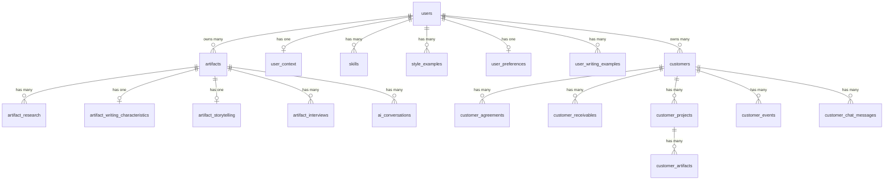

# Database Schema Reference

**Created:** 2026-02-19
**Last Updated:** 2026-02-25
**Version:** 4.0.0
**Status:** Complete

## Overview

Product Consultant Helper uses Supabase (PostgreSQL) with 18 tables in the `public` schema, 5 database functions, 1 generated column (TSVECTOR), and 2 additional GIN indexes (Phase 5). All tables have Row Level Security (RLS) enabled with user-isolation policies. The database supports multi-tenancy via `user_id` (Supabase Auth) with a placeholder user (`00000000-...0001`) for MVP development.

**Supabase Project ID:** `ohwubfmipnpguunryopl`

---

## Table Summary

| # | Table | Purpose | Rows Relation | RLS |
|---|-------|---------|---------------|-----|
| 1 | `artifacts` | Core content (blogs, showcases, social posts) | Root table | Yes |
| 2 | `artifact_research` | Multi-source research per artifact | Many-to-one → artifacts | Yes |
| 3 | `artifact_writing_characteristics` | AI-analyzed writing style per artifact | One-to-one → artifacts | Yes |
| 4 | `artifact_interviews` | Showcase interview Q&A pairs | Many-to-one → artifacts | Yes |
| 5 | `ai_conversations` | Chat message history per artifact | Many-to-one → artifacts | Yes |
| 6 | `user_context` | User profile (about, profession, goals) | One-to-one per user | Yes |
| 7 | `skills` | User skills matrix | Many-to-one per user | Yes |
| 8 | `style_examples` | Legacy writing style examples | Many-to-one per user | Yes |
| 9 | `user_preferences` | Theme and interaction mode | One-to-one per user | Yes |
| 10 | `user_writing_examples` | Writing examples for style analysis | Many-to-one per user | Yes |
| 11 | `artifact_storytelling` | Storytelling guidance per artifact | One-to-one → artifacts | Yes |
| 12 | `customers` | Customer records with lifecycle status | Root table (CRM) | Yes |
| 13 | `customer_agreements` | Service agreements per customer | Many-to-one → customers | Yes |
| 14 | `customer_receivables` | Invoices and payments per customer | Many-to-one → customers | Yes |
| 15 | `customer_projects` | Projects per customer/agreement | Many-to-one → customers | Yes |
| 16 | `customer_artifacts` | Deliverables per project | Many-to-one → customer_projects | Yes |
| 17 | `customer_events` | Timeline events per customer | Many-to-one → customers | Yes |
| 18 | `customer_chat_messages` | AI chat messages per customer | Many-to-one → customers | Yes |

---

## Entity Relationship Diagram



---

## 1. artifacts

Core content table storing blogs, case studies, and social posts with an 11-status workflow.

### Schema

| Column | Type | Nullable | Default | Description |
|--------|------|----------|---------|-------------|
| `id` | UUID | NO | `gen_random_uuid()` | Primary key |
| `user_id` | UUID | NO | `auth.uid()` | Owner (Supabase Auth) |
| `account_id` | UUID | NO | `'00000000-...-000001'` | Multi-tenancy (MVP: placeholder) |
| `type` | VARCHAR(50) | NO | - | Content type |
| `status` | VARCHAR(50) | NO | `'draft'` | Workflow status (12 values in DB) |
| `title` | VARCHAR(500) | YES | - | Artifact title |
| `content` | TEXT | YES | - | HTML/Markdown content body |
| `metadata` | JSONB | YES | `'{}'` | Type-specific fields |
| `tags` | TEXT[] | YES | `'{}'` | User-defined tags |
| `tone` | TEXT | YES | `'professional'` | AI content tone |
| `writing_metadata` | JSONB | YES | `'{}'` | Writing pipeline metadata |
| `visuals_metadata` | JSONB | YES | `'{}'` | Image generation tracking |
| `published_url` | TEXT | YES | - | External publish URL |
| `published_at` | TIMESTAMPTZ | YES | - | Publish timestamp |
| `created_at` | TIMESTAMPTZ | YES | `now()` | Creation timestamp |
| `updated_at` | TIMESTAMPTZ | YES | `now()` | Last update (auto-trigger) |

### CHECK Constraints

```sql
-- Type: 3 valid values
CHECK (type IN ('social_post', 'blog', 'showcase'))

-- Status: 12 valid values (11 active + archived)
CHECK (status IN (
  'draft', 'interviewing', 'research', 'foundations', 'skeleton',
  'foundations_approval', 'writing', 'humanity_checking',
  'creating_visuals', 'ready', 'published', 'archived'
))

-- Tone: 8 valid values
CHECK (tone IN (
  'formal', 'casual', 'professional', 'conversational',
  'technical', 'friendly', 'authoritative', 'humorous'
))
```

### Indexes

| Index | Type | Column(s) | Purpose |
|-------|------|-----------|---------|
| `artifacts_pkey` | UNIQUE btree | `id` | Primary key |
| `idx_artifacts_user_id` | btree | `user_id` | Filter by owner |
| `idx_artifacts_type` | btree | `type` | Filter by content type |
| `idx_artifacts_status` | btree | `status` | Filter by status |
| `idx_artifacts_updated_at` | btree | `updated_at DESC` | Sort by recency |
| `idx_artifacts_visuals_metadata` | GIN | `visuals_metadata` | JSONB queries |
| `idx_artifacts_writing_metadata` | GIN | `writing_metadata` | JSONB queries |

### JSONB: metadata

Shape depends on `type`:

**social_post:**
```json
{ "platform": "linkedin|twitter|other", "hashtags": [...], "character_count": 1500 }
```

**blog:**
```json
{ "platform": "medium|substack|custom", "seo_title": "...", "reading_time_minutes": 8 }
```

**showcase:**
```json
{ "company": "...", "role": "...", "timeframe": "...", "metrics": [...] }
```

### JSONB: visuals_metadata

```json
{
  "phase": { "phase": "complete", "finals": [...] },
  "needs": [{ "id": "...", "description": "...", "purpose": "illustration", "approved": true }],
  "finals": [{ "id": "...", "url": "...", "storage_path": "...", "resolution": {...} }],
  "generation_stats": { "total_needed": 3, "finals_generated": 3, "failures": 0 }
}
```

### RLS Policies

| Policy | Command | Condition |
|--------|---------|-----------|
| Allow placeholder user access | ALL | `user_id = '00000000-...-000001'` |
| Users can view own artifacts | SELECT | `auth.uid() = user_id` |
| Users can insert own artifacts | INSERT | `auth.uid() = user_id` |
| Users can update own artifacts | UPDATE | `auth.uid() = user_id` |
| Users can delete own artifacts | DELETE | `auth.uid() = user_id` |

---

## 2. artifact_research

Multi-source research results collected by the AI research pipeline (Tavily API).

### Schema

| Column | Type | Nullable | Default | Description |
|--------|------|----------|---------|-------------|
| `id` | UUID | NO | `gen_random_uuid()` | Primary key |
| `artifact_id` | UUID | NO | - | FK → artifacts(id) CASCADE |
| `source_type` | TEXT | NO | - | Research source platform |
| `source_name` | TEXT | NO | - | Source display name |
| `source_url` | TEXT | YES | - | URL of source |
| `excerpt` | TEXT | NO | - | Relevant excerpt text |
| `relevance_score` | NUMERIC(3,2) | YES | - | AI-scored relevance (0.0-1.0) |
| `created_at` | TIMESTAMP | YES | `now()` | Creation timestamp |

### CHECK Constraints

```sql
CHECK (source_type IN ('reddit', 'linkedin', 'quora', 'medium', 'substack', 'user_provided'))
CHECK (relevance_score >= 0 AND relevance_score <= 1)
```

### Indexes

| Index | Column(s) | Purpose |
|-------|-----------|---------|
| `artifact_research_pkey` | `id` | Primary key |
| `idx_artifact_research_artifact_id` | `artifact_id` | Lookup by artifact |
| `idx_artifact_research_source_type` | `source_type` | Filter by source |
| `idx_artifact_research_relevance_score` | `relevance_score DESC` | Sort by relevance |

### RLS Policies

| Policy | Command | Condition |
|--------|---------|-----------|
| Allow placeholder user research access | ALL | artifact owned by placeholder user |
| Users can view/insert/update/delete | CRUD | artifact owned by `auth.uid()` |

---

## 3. artifact_writing_characteristics

AI-analyzed writing style characteristics per artifact. One-to-one relationship with artifacts.

### Schema

| Column | Type | Nullable | Default | Description |
|--------|------|----------|---------|-------------|
| `id` | UUID | NO | `gen_random_uuid()` | Primary key |
| `artifact_id` | UUID | NO | - | FK → artifacts(id) UNIQUE |
| `characteristics` | JSONB | NO | `'{}'` | 20+ writing traits |
| `summary` | TEXT | YES | - | Human-readable summary |
| `recommendations` | TEXT | YES | - | Writing recommendations |
| `created_at` | TIMESTAMP | YES | `now()` | Creation timestamp |
| `updated_at` | TIMESTAMP | YES | `now()` | Last update |

### JSONB: characteristics

Each key is a writing trait with a structured value:

```json
{
  "tone": {
    "value": "conversational",
    "confidence": 0.85,
    "source": "examples",
    "reasoning": "User's examples consistently use informal phrasing"
  },
  "sentence_structure": {
    "value": "varied with short emphasis sentences",
    "confidence": 0.78,
    "source": "mix"
  },
  "vocabulary_complexity": { "value": "accessible", "confidence": 0.9, "source": "examples" }
}
```

### Indexes

| Index | Column(s) | Purpose |
|-------|-----------|---------|
| `artifact_writing_characteristics_pkey` | `id` | Primary key |
| `idx_artifact_writing_characteristics_artifact_id` | `artifact_id` | Lookup |
| `unique_artifact_characteristics` | `artifact_id` UNIQUE | One-to-one |

### RLS Policies

| Policy | Command | Condition |
|--------|---------|-----------|
| Users can access their own | ALL | artifact owned by `auth.uid()` |

---

## 4. artifact_interviews

Interview Q&A pairs for showcase (case study) artifacts. 5 dimensions, up to 6 questions.

### Schema

| Column | Type | Nullable | Default | Description |
|--------|------|----------|---------|-------------|
| `id` | UUID | NO | `gen_random_uuid()` | Primary key |
| `artifact_id` | UUID | NO | - | FK → artifacts(id) |
| `question_number` | INTEGER | NO | - | Sequential question number |
| `dimension` | TEXT | NO | - | Interview dimension |
| `question` | TEXT | NO | - | AI-generated question |
| `answer` | TEXT | NO | - | User's answer |
| `coverage_scores` | JSONB | NO | `'{}'` | Dimension coverage after this answer |
| `created_at` | TIMESTAMPTZ | NO | `now()` | Creation timestamp |

### CHECK Constraints

```sql
CHECK (dimension IN (
  'case_context', 'problem_challenge', 'approach_methodology',
  'results_outcomes', 'lessons_insights'
))
```

### Indexes

| Index | Column(s) | Purpose |
|-------|-----------|---------|
| `artifact_interviews_pkey` | `id` | Primary key |
| `idx_artifact_interviews_artifact_id` | `artifact_id` | Lookup by artifact |
| `idx_artifact_interviews_unique_question` | `(artifact_id, question_number)` UNIQUE | Prevent duplicate questions |

### RLS Policies

| Policy | Command | Condition |
|--------|---------|-----------|
| Service role full access | ALL | `auth.role() = 'service_role'` |
| Users can view/insert/update/delete | CRUD | artifact owned by `auth.uid()` |

---

## 5. ai_conversations

Chat message history between user and AI assistant, linked to artifacts.

### Schema

| Column | Type | Nullable | Default | Description |
|--------|------|----------|---------|-------------|
| `id` | UUID | NO | `gen_random_uuid()` | Primary key |
| `user_id` | UUID | NO | `auth.uid()` | Owner |
| `account_id` | UUID | NO | `'00000000-...-000001'` | Multi-tenancy |
| `artifact_id` | UUID | YES | - | FK → artifacts(id), nullable |
| `messages` | JSONB | NO | `'[]'` | Array of chat messages |
| `pinned` | BOOLEAN | YES | `false` | Pinned conversation flag |
| `summary` | TEXT | YES | - | Conversation summary |
| `created_at` | TIMESTAMPTZ | YES | `now()` | Creation timestamp |
| `updated_at` | TIMESTAMPTZ | YES | `now()` | Last update |

### JSONB: messages

Array of message objects:

```json
[
  { "id": "msg-1", "role": "user", "content": "Create a blog post about...", "created_at": "..." },
  { "id": "msg-2", "role": "assistant", "content": "I'll research...", "tool_calls": [...] }
]
```

### Indexes

| Index | Column(s) | Purpose |
|-------|-----------|---------|
| `ai_conversations_pkey` | `id` | Primary key |
| `idx_ai_conversations_user_id` | `user_id` | Filter by user |
| `idx_ai_conversations_artifact_id` | `artifact_id` | Filter by artifact |

### RLS Policies

| Policy | Command | Condition |
|--------|---------|-----------|
| Allow placeholder user access | ALL | `user_id = '00000000-...-000001'` |
| Users can view/insert/update/delete | CRUD | `auth.uid() = user_id` |

---

## 6. user_context

User professional profile with 4 JSONB sections. One row per user.

### Schema

| Column | Type | Nullable | Default | Description |
|--------|------|----------|---------|-------------|
| `id` | UUID | NO | `gen_random_uuid()` | Primary key |
| `user_id` | UUID | NO | `auth.uid()` | Owner (UNIQUE) |
| `account_id` | UUID | NO | `'00000000-...-000001'` | Multi-tenancy |
| `about_me` | JSONB | YES | `'{}'` | Bio, background, years, value prop |
| `profession` | JSONB | YES | `'{}'` | Expertise, industries, methods, certs |
| `customers` | JSONB | YES | `'{}'` | Target audience, ideal client |
| `goals` | JSONB | YES | `'{}'` | Content goals, business goals |
| `created_at` | TIMESTAMPTZ | YES | `now()` | Creation timestamp |
| `updated_at` | TIMESTAMPTZ | YES | `now()` | Last update |

### JSONB Structures

**about_me:**
```json
{ "bio": "...", "background": "...", "years_experience": 10, "value_proposition": "..." }
```

**profession:**
```json
{ "expertise_areas": "...", "industries": "...", "methodologies": "...", "certifications": "..." }
```

**customers:**
```json
{ "target_audience": "...", "ideal_client": "...", "industries_served": ["SaaS", "FinTech"] }
```

**goals:**
```json
{ "content_goals": "...", "business_goals": "...", "priorities": ["thought leadership"] }
```

### Indexes

| Index | Column(s) | Purpose |
|-------|-----------|---------|
| `user_context_pkey` | `id` | Primary key |
| `user_context_user_id_key` | `user_id` UNIQUE | One per user |

### RLS Policies

| Policy | Command | Condition |
|--------|---------|-----------|
| Allow placeholder user access | ALL | `user_id = '00000000-...-000001'` |
| Users can view/insert/update/delete | CRUD | `auth.uid() = user_id` |

---

## 7. skills

User professional skills matrix with category and proficiency.

### Schema

| Column | Type | Nullable | Default | Description |
|--------|------|----------|---------|-------------|
| `id` | UUID | NO | `gen_random_uuid()` | Primary key |
| `user_id` | UUID | NO | `auth.uid()` | Owner |
| `account_id` | UUID | NO | `'00000000-...-000001'` | Multi-tenancy |
| `name` | VARCHAR(200) | NO | - | Skill name |
| `category` | VARCHAR(100) | NO | - | product/technical/leadership/industry |
| `proficiency` | INTEGER | YES | - | 1-5 scale |
| `years_experience` | INTEGER | YES | - | Years of experience |
| `created_at` | TIMESTAMPTZ | YES | `now()` | Creation timestamp |
| `updated_at` | TIMESTAMPTZ | YES | `now()` | Last update |

### CHECK Constraints

```sql
CHECK (proficiency >= 1 AND proficiency <= 5)
```

### Indexes

| Index | Column(s) | Purpose |
|-------|-----------|---------|
| `skills_pkey` | `id` | Primary key |
| `idx_skills_user_id` | `user_id` | Filter by user |
| `idx_skills_category` | `category` | Filter by category |

### RLS Policies

| Policy | Command | Condition |
|--------|---------|-----------|
| Allow placeholder user access | ALL | `user_id = '00000000-...-000001'` |
| Users can view/insert/update/delete | CRUD | `auth.uid() = user_id` |

---

## 8. style_examples

Legacy writing style examples (original Phase 1 table, predates `user_writing_examples`).

### Schema

| Column | Type | Nullable | Default | Description |
|--------|------|----------|---------|-------------|
| `id` | UUID | NO | `gen_random_uuid()` | Primary key |
| `user_id` | UUID | NO | `auth.uid()` | Owner |
| `account_id` | UUID | NO | `'00000000-...-000001'` | Multi-tenancy |
| `label` | VARCHAR(200) | NO | - | Example display name |
| `content` | TEXT | NO | - | Full text of writing sample |
| `analysis` | JSONB | YES | - | AI-generated style analysis |
| `created_at` | TIMESTAMPTZ | YES | `now()` | Creation timestamp |
| `updated_at` | TIMESTAMPTZ | YES | `now()` | Last update |

### JSONB: analysis

```json
{ "tone": "conversational", "structure": "narrative", "vocabulary": "accessible", "length": "medium" }
```

### Indexes

| Index | Column(s) | Purpose |
|-------|-----------|---------|
| `style_examples_pkey` | `id` | Primary key |
| `idx_style_examples_user_id` | `user_id` | Filter by user |

### RLS Policies

| Policy | Command | Condition |
|--------|---------|-----------|
| Allow placeholder user access | ALL | `user_id = '00000000-...-000001'` |
| Users can view/insert/update/delete | CRUD | `auth.uid() = user_id` |

---

## 9. user_preferences

User application preferences (theme, interaction mode). One row per user.

### Schema

| Column | Type | Nullable | Default | Description |
|--------|------|----------|---------|-------------|
| `id` | UUID | NO | `gen_random_uuid()` | Primary key |
| `user_id` | UUID | NO | `auth.uid()` | Owner (UNIQUE) |
| `account_id` | UUID | NO | `'00000000-...-000001'` | Multi-tenancy |
| `theme` | VARCHAR(20) | YES | `'system'` | light/dark/system |
| `preferred_interaction_mode` | VARCHAR(50) | YES | `'chat'` | chat/inline/direct |
| `created_at` | TIMESTAMPTZ | YES | `now()` | Creation timestamp |
| `updated_at` | TIMESTAMPTZ | YES | `now()` | Last update |

### CHECK Constraints

```sql
CHECK (theme IN ('light', 'dark', 'system'))
CHECK (preferred_interaction_mode IN ('chat', 'inline', 'direct'))
```

### Indexes

| Index | Column(s) | Purpose |
|-------|-----------|---------|
| `user_preferences_pkey` | `id` | Primary key |
| `user_preferences_user_id_key` | `user_id` UNIQUE | One per user |

### RLS Policies

| Policy | Command | Condition |
|--------|---------|-----------|
| Allow placeholder user access | ALL | `user_id = '00000000-...-000001'` |
| Users can view/insert/update/delete | CRUD | `auth.uid() = user_id` |

---

## 10. user_writing_examples

Writing references uploaded by users for per-artifact-type style analysis. Supports 4 upload methods: paste text, file upload (DOCX/PDF/MD/TXT), file URL extraction, and publication URL scraping.

### Schema

| Column | Type | Nullable | Default | Description |
|--------|------|----------|---------|-------------|
| `id` | UUID | NO | `gen_random_uuid()` | Primary key |
| `user_id` | UUID | NO | - | FK to auth.users(id) |
| `name` | TEXT | NO | - | Example display name |
| `source_type` | TEXT | NO | `'pasted'` | `pasted` / `file_upload` / `artifact` / `url` |
| `source_url` | TEXT | YES | - | Source URL (for url-based refs) |
| `source_reference` | TEXT | YES | - | Legacy source reference |
| `content` | TEXT | NO | - | Full extracted text content |
| `word_count` | INTEGER | NO | - | Word count |
| `artifact_type` | TEXT | YES | - | `blog` / `social_post` / `showcase` |
| `extraction_status` | TEXT | YES | `'success'` | `success` / `extracting` / `failed` / `pending` |
| `analyzed_characteristics` | JSONB | YES | `'{}'` | AI-analyzed writing traits |
| `is_active` | BOOLEAN | YES | `true` | Active/inactive flag |
| `created_at` | TIMESTAMP | YES | `now()` | Creation timestamp |
| `updated_at` | TIMESTAMP | YES | `now()` | Last update |

### New Columns (Writing References Redesign)

| Column | Added In | Purpose |
|--------|----------|---------|
| `artifact_type` | Phase 1 | Categorize references per content type for filtered analysis |
| `extraction_status` | Phase 2 | Track async extraction progress for URL-based uploads |
| `source_url` | Phase 2 | Store the original URL for URL-based references (used by retry) |

### Indexes

| Index | Column(s) | Purpose |
|-------|-----------|---------|
| `user_writing_examples_pkey` | `id` | Primary key |
| `idx_user_writing_examples_user_id` | `user_id` | Filter by user |
| `idx_user_writing_examples_active` | `(user_id, is_active)` WHERE `is_active = true` | Active examples (partial index) |

### RLS Policies

| Policy | Command | Condition |
|--------|---------|-----------|
| Users can access their own | ALL | `user_id = auth.uid()` |

---

## 11. artifact_storytelling

AI-generated storytelling guidance per artifact. One-to-one relationship with artifacts. Stores narrative framework, story arc, emotional journey, and other storytelling directives consumed by skeleton and content writing tools.

### Schema

| Column | Type | Nullable | Default | Description |
|--------|------|----------|---------|-------------|
| `id` | UUID | NO | `gen_random_uuid()` | Primary key |
| `artifact_id` | UUID | NO | - | FK → artifacts(id) CASCADE, UNIQUE |
| `storytelling_guidance` | JSONB | NO | `'{}'` | Full storytelling guidance structure |
| `narrative_framework` | TEXT | YES | - | Selected framework name (e.g., bab, star, heros_journey) |
| `summary` | TEXT | YES | - | Human-readable storytelling summary |
| `recommendations` | TEXT | YES | - | Storytelling recommendations |
| `created_at` | TIMESTAMPTZ | NO | `now()` | Creation timestamp |
| `updated_at` | TIMESTAMPTZ | NO | `now()` | Last update |

### JSONB: storytelling_guidance

```json
{
  "narrative_framework": {
    "name": "bab",
    "description": "Before-After-Bridge: Show the problem, paint the solution, bridge the gap",
    "confidence": 0.85
  },
  "story_arc": {
    "beginning": "Hook with relatable problem scenario",
    "middle": "Explore tension, present methodology, build toward insight",
    "end": "Deliver transformation moment, actionable framework",
    "section_mapping": [
      {
        "section_role": "hook",
        "guidance": "Open with a specific, relatable scenario",
        "emotional_target": "recognition"
      }
    ]
  },
  "emotional_journey": [
    {
      "stage": "opening",
      "emotion": "curiosity",
      "intensity": 0.7,
      "technique": "provocative question"
    }
  ],
  "hook_strategy": {
    "type": "contrarian_insight",
    "guidance": "Challenge a common assumption to create tension"
  },
  "protagonist": {
    "type": "reader_as_hero",
    "guidance": "Position the reader as someone who can master this"
  },
  "tension_points": [
    {
      "location": "section_2",
      "type": "knowledge_gap",
      "description": "Reveal what most people get wrong"
    }
  ],
  "resolution_strategy": {
    "type": "framework_reveal",
    "guidance": "Deliver a named, memorable framework they can apply immediately"
  }
}
```

### Indexes

| Index | Column(s) | Purpose |
|-------|-----------|---------|
| `artifact_storytelling_pkey` | `id` UNIQUE | Primary key |
| `artifact_storytelling_artifact_id_key` | `artifact_id` UNIQUE | One-to-one constraint |
| `idx_artifact_storytelling_artifact_id` | `artifact_id` | Lookup by artifact |

### RLS Policies

| Policy | Command | Condition |
|--------|---------|-----------|
| Service role can manage storytelling | ALL | `auth.role() = 'service_role'` |
| Users can read own artifact storytelling | SELECT | artifact owned by `auth.uid()` |

---

## Database Functions

### `get_receivables_summary(cid UUID)`

**Purpose:** Compute the financial summary for a customer — total invoiced, total paid, and outstanding balance — entirely in PostgreSQL using NUMERIC arithmetic to avoid JavaScript floating-point rounding errors.

**Location:** `backend/src/db/migrations/` (customer schema migration)

**Used by:** `ReceivableService.getSummary(customerId)` via `supabase.rpc('get_receivables_summary', { cid: customerId })`

**Signature:**
```sql
CREATE OR REPLACE FUNCTION get_receivables_summary(cid UUID)
RETURNS TABLE(
  total_invoiced TEXT,
  total_paid     TEXT,
  balance        TEXT
)
LANGUAGE SQL
SECURITY DEFINER
STABLE
```

**Return type:** `TABLE(total_invoiced TEXT, total_paid TEXT, balance TEXT)`

All monetary values are cast to `TEXT` before returning. This preserves NUMERIC precision across the API boundary — JavaScript `number` cannot represent all PostgreSQL NUMERIC values without loss, so amounts travel as strings end-to-end.

**Calculation logic:**
- `total_invoiced`: SUM of `amount` for all `customer_receivables` rows where `type = 'invoice'` and `customer_id = cid`
- `total_paid`: SUM of `amount` for all `customer_receivables` rows where `type = 'payment'` and `customer_id = cid`
- `balance`: `total_invoiced - total_paid` (positive = customer owes money, negative = credit held, zero = fully settled)

**Security:** `SECURITY DEFINER` — the function executes with the privileges of the function owner, not the calling user. RLS on `customer_receivables` is bypassed inside the function body. The caller's identity (authenticated user) is validated by the backend `requireAuth` middleware before the RPC is invoked.

**Stability:** `STABLE` — no side effects, safe for query optimizer caching within a single transaction.

**Example response (via `ReceivableService.getSummary`):**
```typescript
{
  total_invoiced: "15000.00",
  total_paid: "10000.00",
  balance: "5000.00"
}
```

### `merge_customer_info(cid UUID, new_info JSONB)`

**Purpose:** Atomic JSONB merge into a customer's `info` column without read-modify-write race conditions. Used by the Customer Management AI Agent's `updateCustomerInfo` tool.

**Location:** `backend/src/db/migrations/011_merge_customer_info_function.sql`

**Used by:** `customerMgmtTools.updateCustomerInfo` via `supabase.rpc('merge_customer_info', { cid, new_info })`

**Signature:**
```sql
CREATE OR REPLACE FUNCTION merge_customer_info(cid UUID, new_info JSONB)
RETURNS INT
LANGUAGE plpgsql
SECURITY DEFINER
SET search_path = ''
```

**Return type:** `INT` — number of rows affected (0 if customer not found or not owned by caller)

**Merge logic:**
```sql
UPDATE public.customers
SET info = COALESCE(info, '{}'::jsonb) || new_info,
    updated_at = NOW()
WHERE id = cid
  AND user_id = auth.uid();
```

- `COALESCE(info, '{}'::jsonb)` handles NULL `info` columns
- `|| new_info` performs shallow JSONB merge (new keys added, existing keys overwritten)
- `user_id = auth.uid()` enforces ownership (the authenticated user must own the customer)

**Security:**
- `SECURITY DEFINER` — executes with function owner privileges
- `SET search_path = ''` — prevents search path injection
- `auth.uid()` check ensures user owns the customer record

**Example:**
```typescript
// Merge new info fields into customer
const { data } = await supabase.rpc('merge_customer_info', {
  cid: '550e8400-e29b-41d4-a716-446655440000',
  new_info: { industry: 'SaaS', company_size: '50-200' }
})
// data = 1 (one row updated)
```

### `get_customer_list_summary(p_status TEXT, p_search TEXT, p_sort TEXT)`

**Purpose:** Returns all customer columns plus aggregated summary data (active agreements count, outstanding balance, active projects count, last activity) in a single query with full-text search and dynamic sort.

**Location:** `backend/src/db/migrations/012_customer_search_and_summary.sql`

**Used by:** `useCustomers()` hook via `supabase.rpc('get_customer_list_summary', { p_status, p_search, p_sort })`

**Signature:**
```sql
CREATE OR REPLACE FUNCTION get_customer_list_summary(
  p_status TEXT DEFAULT NULL,
  p_search TEXT DEFAULT NULL,
  p_sort TEXT DEFAULT 'updated_at'
)
RETURNS TABLE (
  id UUID, user_id UUID, name TEXT, status TEXT, info JSONB,
  deleted_at TIMESTAMPTZ, created_at TIMESTAMPTZ, updated_at TIMESTAMPTZ,
  active_agreements_count BIGINT, outstanding_balance NUMERIC(12,2),
  active_projects_count BIGINT, last_activity TIMESTAMPTZ
)
LANGUAGE plpgsql SECURITY DEFINER STABLE SET search_path = public
```

**Summary columns:**
- `active_agreements_count`: COUNT of agreements where `override_status IS NULL` and `end_date >= today OR end_date IS NULL`
- `outstanding_balance`: SUM(invoices where status != 'cancelled') - SUM(payments). Note: paid invoices remain in the sum to avoid double-counting when payments are recorded separately
- `active_projects_count`: COUNT of projects where `status IN ('planning', 'active')`
- `last_activity`: MAX(event_date) from `customer_events`

**Search:** `search_vector @@ websearch_to_tsquery('english', p_search)` — TSVECTOR generated column indexes `name`, `vertical`, `about`, `persona`

**Sort options:** `name`, `status`, `created_at`, `updated_at` (default), `last_activity`, `outstanding_balance`. Sort parameter is validated against allowlist to prevent injection.

**Security:** Uses `auth.uid()` for user isolation. Dynamic SQL via `EXECUTE format()` with `USING` parameters for safe value binding.

---

### `get_customer_dashboard_stats()`

**Purpose:** Returns aggregate counters for the customer dashboard.

**Location:** `backend/src/db/migrations/012_customer_search_and_summary.sql`

**Used by:** `useDashboardStats()` hook via `supabase.rpc('get_customer_dashboard_stats')`

**Signature:**
```sql
CREATE OR REPLACE FUNCTION get_customer_dashboard_stats()
RETURNS TABLE (
  total_customers BIGINT, active_customers BIGINT,
  total_outstanding NUMERIC(12,2), expiring_agreements BIGINT
)
LANGUAGE plpgsql SECURITY DEFINER STABLE SET search_path = public
```

**Return columns:**
- `total_customers`: All non-deleted customers
- `active_customers`: Customers with `status = 'live'`
- `total_outstanding`: Sum of outstanding balances across all customers
- `expiring_agreements`: Agreements expiring within 30 days (no override_status)

---

### Generated Columns

**`customers.search_vector`** (TSVECTOR, GENERATED ALWAYS STORED):
```sql
to_tsvector('english',
  coalesce(name, '') || ' ' ||
  coalesce(info->>'vertical', '') || ' ' ||
  coalesce(info->>'about', '') || ' ' ||
  coalesce(info->>'persona', ''))
```

Indexed with GIN: `idx_customers_search ON customers USING GIN (search_vector)`

### Additional Indexes (Phase 5)

- `idx_customers_search` — GIN index on `customers.search_vector` for full-text search
- `idx_artifacts_linked_customer_artifacts` — GIN index on `artifacts.metadata->'linkedCustomerArtifacts'` with `jsonb_path_ops` for cross-module reverse lookup (portfolio artifacts linking to customer artifacts)

---

## RLS Policy Patterns

All tables use consistent RLS patterns:

### Pattern 1: Direct user_id (user-owned tables)
Tables: `artifacts`, `ai_conversations`, `skills`, `style_examples`, `user_context`, `user_preferences`

```sql
-- Standard CRUD policies
Users can view own X:   SELECT WHERE auth.uid() = user_id
Users can insert own X: INSERT WITH CHECK auth.uid() = user_id
Users can update own X: UPDATE WHERE auth.uid() = user_id WITH CHECK auth.uid() = user_id
Users can delete own X: DELETE WHERE auth.uid() = user_id

-- MVP placeholder access
Allow placeholder user: ALL WHERE user_id = '00000000-0000-0000-0000-000000000001'
```

### Pattern 2: Indirect via artifact (artifact-child tables)
Tables: `artifact_research`, `artifact_writing_characteristics`, `artifact_storytelling`, `artifact_interviews`

```sql
-- Access through artifact ownership
Users can view own:   SELECT WHERE artifact_id IN (SELECT id FROM artifacts WHERE user_id = auth.uid())
Users can insert own: INSERT WITH CHECK artifact_id IN (SELECT ...)
```

### Pattern 3: Service role (backend-only operations)
Tables: `artifact_interviews`, `artifact_storytelling`

```sql
-- Service role bypass for backend AI operations
Service role full access: ALL WHERE auth.role() = 'service_role'
```

---

## Database Triggers

### updated_at Auto-Update

```sql
CREATE OR REPLACE FUNCTION update_updated_at_column()
RETURNS TRIGGER AS $$
BEGIN
  NEW.updated_at = NOW();
  RETURN NEW;
END;
$$ LANGUAGE plpgsql;

-- Applied to: artifacts (confirmed)
CREATE TRIGGER update_artifacts_updated_at
  BEFORE UPDATE ON artifacts
  FOR EACH ROW
  EXECUTE FUNCTION update_updated_at_column();
```

---

## Related Documentation

- [artifact-schema-and-workflow.md](./artifact-schema-and-workflow.md) - Detailed artifacts table with workflow
- [STATUS_VALUES_REFERENCE.md](../../artifact-statuses/STATUS_VALUES_REFERENCE.md) - Status reference
- [authentication-and-security.md](../../api/authentication-and-security.md) - Auth architecture

---

**Version History:**
- **3.2.0** (2026-02-25) - Added `merge_customer_info(cid, new_info)` function for Customer AI Agent atomic JSONB merge
- **3.1.0** (2026-02-25) - Added Database Functions section documenting `get_receivables_summary(cid UUID)`
- **3.0.0** (2026-02-25) - Full schema reference for all 18 tables (11 content + 7 customer)
- **2.0.0** (2026-02-20) - Added `artifact_storytelling` table (#11), updated table count, ER diagram, RLS patterns
- **1.0.0** (2026-02-19) - Initial comprehensive schema reference covering all 10 tables
