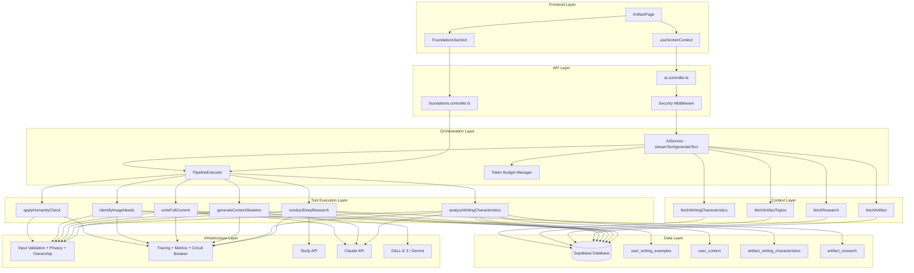
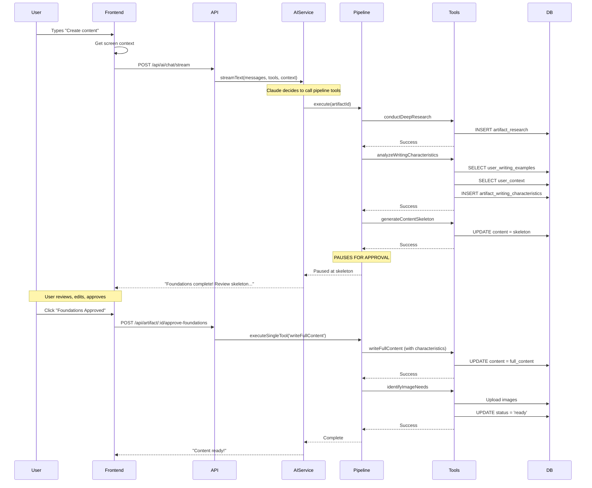

# Content Agent Overview

**Version:** 3.0.0
**Last Updated:** 2026-02-25
**Status:** Production Ready (Vercel AI SDK v6 Refactor)

## Table of Contents

- [Introduction](#introduction)
- [Architecture](#architecture)
- [Core Components](#core-components)
  - [AIService (Orchestrator)](#aiservice-orchestrator)
  - [PipelineExecutor](#pipelineexecutor)
  - [Token Budget Management](#token-budget-management)
- [Workflow Modes](#workflow-modes)
- [Foundations Approval Workflow](#foundations-approval-workflow)
- [Data Flow](#data-flow)
- [Usage Examples](#usage-examples)
- [Configuration](#configuration)
- [Related Documentation](#related-documentation)

---

## Introduction

The **Content Agent** is the AI-powered content creation system in the NextUp platform. It uses **Vercel AI SDK v6** with `streamText`/`generateText` for multi-provider support (Anthropic Claude, OpenAI). The LLM autonomously decides which tools to invoke based on user messages and screen context — there is no explicit intent detection code.

> **v3.0.0 Migration Note**: `ContentAgent.ts` was deleted and replaced by `AIService.ts`. `intentDetection.ts` was deleted — intent detection is now handled implicitly by the LLM via tool-calling. Server-side session state was removed — the frontend manages conversation via message arrays.

Key capabilities:

- **Streaming Chat** - Real-time streaming responses via Vercel AI SDK v6 `streamText`
- **LLM Tool-Calling** - Claude autonomously decides which of 35+ tools to invoke
- **Token Budget Control** - Manages Claude's 200K context window efficiently
- **Pipeline Execution** - PipelineExecutor handles multi-step content creation workflows
- **Error Recovery** - Implements checkpoint/rollback for pipeline atomicity
- **Foundations Approval** - User approval gate for writing characteristics and skeleton review

### Key Capabilities

- **Full Pipeline Execution** - draft → research → foundations → skeleton → [APPROVAL] → writing → creating_visuals → ready
- **Writing Characteristics Analysis** - AI analyzes user's writing style to guide content generation
- **User Approval Gate** - Pipeline pauses for user to review skeleton before content writing
- **Partial Flow Support** - Execute individual steps (e.g., "humanize only")
- **Conversational Interface** - Natural language interaction with context awareness
- **Production-Grade Security** - Rate limiting, ownership validation, prompt injection protection

---

## Architecture

The Content Agent follows a layered architecture with clear separation of concerns:



### Architecture Layers

| Layer | Purpose | Key Components |
|-------|---------|----------------|
| **Frontend** | User interface for artifact editing | ArtifactPage, FoundationsSection, useScreenContext |
| **API** | REST endpoints with security | ai.controller.ts, foundations.controller.ts |
| **Orchestration** | Streaming chat and tool execution | AIService (Vercel AI SDK v6), PipelineExecutor |
| **Tool Execution** | Content creation operations | 35+ tools across 19 tool files |
| **Data** | Writing references and characteristics | user_writing_examples, user_context, artifact_writing_characteristics |
| **Infrastructure** | Security, observability, external APIs | Validation, tracing, Tavily, Claude, DALL-E |

---

## Core Components

### AIService (Orchestrator)

The `AIService` module is the central orchestrator that handles all AI chat interactions using Vercel AI SDK v6.

**Location:** `/backend/src/services/ai/AIService.ts`

**Key Responsibilities:**

- Process streaming chat via `streamText` with multi-turn tool execution
- Process non-streaming chat via `generateText`
- Register all 35+ tools for LLM tool-calling
- Build context-aware system prompts (screen context, selection context, interview context)
- Coordinate with PipelineExecutor for multi-step pipeline execution
- Support multiple AI providers (Anthropic Claude, OpenAI GPT-4o)

**Key Functions:**

```typescript
// Streaming chat with tools (primary endpoint)
export function streamChat(
  messages: ChatMessage[],
  options: StreamChatOptions
): ReadableStream

// Non-streaming chat
export async function chat(
  messages: ChatMessage[],
  options: ChatOptions
): Promise<{ text: string; toolCalls?: any[]; toolResults?: any[] }>

// Content generation
export async function generateContent(
  prompt: string,
  options: GenerateOptions
): Promise<string>
```

**Tool Registration:**

AIService imports and registers tools from all 19 tool files:
- contentTools, profileTools, responseTools, researchTools
- skeletonTools, contentWritingTools, humanityCheckTools
- visualsCreatorTool, imageNeedsTools, contentImprovementTools
- socialPostTools, interviewTools, storytellingTools
- trendingTopicsTools, followUpTopicsTools

> **Note**: There is no explicit intent detection. The LLM (Claude) autonomously decides which tools to call based on the user's message, screen context, and conversation history.

---

### PipelineExecutor

The `PipelineExecutor` manages the sequential execution of pipeline steps with checkpoint/rollback support.

**Location:** `/backend/src/services/ai/PipelineExecutor.ts`

**Key Responsibilities:**

- Execute pipeline steps in correct order
- Create checkpoints before each step
- Rollback to checkpoint on failure
- **Pause pipeline after skeleton generation** (Phase 4)
- Resume pipeline from approval endpoint

**Pipeline Steps (Phase 4):**

```typescript
const PIPELINE_STEPS: PipelineStep[] = [
  { toolName: 'conductDeepResearch', expectedStatusBefore: 'draft', expectedStatusAfter: 'research' },
  { toolName: 'analyzeWritingCharacteristics', expectedStatusBefore: 'research', expectedStatusAfter: 'foundations' },
  { toolName: 'generateContentSkeleton', expectedStatusBefore: 'foundations', expectedStatusAfter: 'skeleton' },
  // PIPELINE PAUSES HERE - status is 'skeleton', waiting for user approval
  { toolName: 'writeFullContent', expectedStatusBefore: 'foundations_approval', expectedStatusAfter: 'writing' },
  { toolName: 'identifyImageNeeds', expectedStatusBefore: 'writing', expectedStatusAfter: 'ready' },
]
```

**Pause/Resume Mechanism:**

```typescript
// Pipeline execution stops after skeleton step
// Agent notifies user via ChatPanel

// User clicks "Foundations Approved" button
// Frontend calls: POST /api/artifact/:id/approve-foundations

// Backend resumes pipeline:
await pipelineExecutor.executeSingleTool('writeFullContent', artifactId);
```

---

### Token Budget Management

The Token Budget Manager ensures efficient use of Claude Sonnet 4's 200K context window.

**Total Context Window:** 200,000 tokens

**Reserved Allocations:**

| Category | Tokens | Priority |
|----------|--------|----------|
| System Prompt | 3,000 | CRITICAL |
| Tool Definitions | 8,000 | CRITICAL |
| Writing Characteristics | 2,000 | HIGH |
| Current User Message | 500 | REQUIRED |
| Response Buffer | 4,000 | CRITICAL |
| **Available for Dynamic Content** | **182,500** | - |

---

---

## Workflow Modes

The Content Agent supports three workflow modes depending on user intent and context.

### 1. Full Pipeline Mode

Executes the complete **6-step** content creation pipeline with approval gate.

**Steps:**

1. **Research** (draft → research) - Query 5+ sources via Tavily API
2. **Foundations** (research → foundations) - Analyze writing characteristics [NEW]
3. **Skeleton** (foundations → skeleton) - Generate H1 title + H2 section headings
4. **[APPROVAL GATE]** - Pipeline pauses, user reviews skeleton
5. **Writing** (foundations_approval → writing) - Write full content using characteristics
6. **Visuals** (writing → ready) - Generate images with DALL-E 3

**Triggers:**

- User says: "Create content", "Generate everything", "Run full pipeline"
- Intent detected: `UserIntent.FULL_PIPELINE`
- Artifact status: `draft`

**Duration:** ~3-5 minutes for blog post (~2000 words) + user approval time

---

### 2. Partial Flow Mode

Executes a single tool or subset of the pipeline based on current artifact status.

**Use Cases:**

- **Humanize Only:** "Make the content sound more human" → `applyHumanityCheck`
- **Regenerate Skeleton:** "Create a new outline" (status: foundations) → `generateContentSkeleton`
- **Resume from Approval:** User clicks "Foundations Approved" → `writeFullContent`

---

### 3. Interactive Mode

User provides guidance at each step with conversational feedback.

**Current Status:** Phase 4 (approval gate implemented)

---

## Phase 4: Foundations Approval Workflow

Phase 4 introduces a **user approval gate** between skeleton generation and content writing.

### Why Approval Gate?

- **Writing Quality**: User reviews AI-analyzed writing characteristics before content generation
- **Skeleton Review**: User can edit the content structure before full writing begins
- **Transparency**: User understands how their content will be written

### Flow Diagram


### Writing References System

The `analyzeWritingCharacteristics` tool pulls from multiple data sources:

**Reference Sources:**

| Source | Table | Data |
|--------|-------|------|
| Writing Examples | `user_writing_examples` | 500+ word samples from user |
| User Context | `user_context` | Profession, goals, target audience |
| Artifact Research | `artifact_research` | Topic-specific research context |

**Characteristics Output:**

```typescript
interface WritingCharacteristics {
  tone: { value: 'professional', confidence: 0.85, source: 'examples' };
  voice: { value: 'first-person', confidence: 0.7, source: 'mix' };
  sentence_structure: { value: 'varied', confidence: 0.8, source: 'examples' };
  vocabulary_complexity: { value: 'intermediate', confidence: 0.75, source: 'context' };
  pacing: { value: 'measured', confidence: 0.6, source: 'default' };
  use_of_evidence: { value: 'moderate', confidence: 0.7, source: 'examples' };
  // ... additional characteristics
}
```

### UI Components

**FoundationsSection** - Contains:
- WritingCharacteristicsDisplay (grouped by source)
- **Editable** skeleton in TipTap editor
- "Foundations Approved" button

**Key Behaviors:**
- Auto-expands when status reaches `skeleton`
- Skeleton is editable (user can modify structure)
- Main ArtifactEditor is **hidden** until writing completes

---

## Data Flow

### Request Processing Flow (Phase 4)



---

## Usage Examples

### Example 1: Streaming Chat with Tool Execution

```typescript
// Frontend sends chat message via Vercel AI SDK useChat hook
// POST /api/ai/chat/stream
const response = await fetch('/api/ai/chat/stream', {
  method: 'POST',
  headers: { 'Authorization': `Bearer ${token}`, 'Content-Type': 'application/json' },
  body: JSON.stringify({
    messages: [{ role: 'user', content: 'Create content for my blog post about AI in product management' }],
    screenContext: { currentPage: 'artifact', artifactId: 'blog-001', artifactType: 'blog', artifactStatus: 'draft' }
  })
});

// Claude autonomously decides to call pipeline tools:
// conductDeepResearch → analyzeWritingCharacteristics → generateContentSkeleton
// Pipeline PAUSES at skeleton — stream response: "Foundations complete!"

// Step 2: User reviews skeleton, clicks "Foundations Approved"
await fetch('/api/artifacts/blog-001/approve-foundations', { method: 'POST' });

// Pipeline resumes: writeFullContent → identifyImageNeeds → ready
```

### Example 2: In-Editor Content Improvement

```typescript
// User selects text in editor and asks for improvement
const response = await fetch('/api/ai/chat/stream', {
  method: 'POST',
  headers: { 'Authorization': `Bearer ${token}`, 'Content-Type': 'application/json' },
  body: JSON.stringify({
    messages: [{ role: 'user', content: 'Make this paragraph more concise' }],
    selectionContext: {
      type: 'text',
      selectedText: 'The selected paragraph text...',
      surroundingContext: { before: '...', after: '...', sectionHeading: 'Introduction' }
    }
  })
});
// Claude calls improveTextContent tool, returns replacement text
```

---

## Configuration

### Environment Variables

**Required:**
- `ANTHROPIC_API_KEY` - For Claude API (characteristics analysis, skeleton, writing)
- `OPENAI_API_KEY` - For DALL-E 3 image generation
- `TAVILY_API_KEY` - For deep research

### Constants

```typescript
// Session timeout (30 minutes)
const SESSION_TIMEOUT_MS = 30 * 60 * 1000;

// Max conversation turns to keep in history
const MAX_CONVERSATION_TURNS = 10;

// Processing states (for polling)
const PROCESSING_STATES = ['research', 'foundations', 'writing', 'creating_visuals'];

// NON-processing states (no polling)
const NON_PROCESSING_STATES = ['draft', 'skeleton', 'foundations_approval', 'ready', 'published'];
```

---

## Related Documentation

### Core Documentation

- **[Pipeline Execution Flow](./pipeline-execution-flow.md)** - Complete pipeline with approval gate
- **[Core Tools Reference](./core-tools-reference.md)** - All tools with schemas
- **[System Prompt Specification](./system-prompt-specification.md)** - System prompt and behavior

### Status Reference

- **[STATUS_VALUES_REFERENCE.md](../artifact-statuses/STATUS_VALUES_REFERENCE.md)** - Complete 11-status definitions
- **[Status Flow Reference](../artifact-statuses/status-flow-reference.md)** - Status transitions and UI

### API Documentation

- **[API Endpoints](../api/content-agent-endpoints.md)** - REST API (`/api/ai/*` routes)
- **[Screen Context Specification](../api/screen-context-specification.md)** - Frontend context integration

### Architecture Documentation

- **[UNIFIED_CONTENT_AGENT_ARCHITECTURE.md](./UNIFIED_CONTENT_AGENT_ARCHITECTURE.md)** - Full system architecture

### Implementation Files

- **AIService:** `/backend/src/services/ai/AIService.ts`
- **PipelineExecutor:** `/backend/src/services/ai/PipelineExecutor.ts`
- **AI Controller:** `/backend/src/controllers/ai.controller.ts`
- **AI Routes:** `/backend/src/routes/ai.ts`
- **System Prompts:** `/backend/src/services/ai/prompts/systemPrompts.ts`
- **Tools Directory:** `/backend/src/services/ai/tools/` (19 tool files)
- **Types:** `/backend/src/services/ai/types/contentAgent.ts`

---

**Version History:**

- **v3.0.0** (2026-02-25) - Vercel AI SDK v6 Refactor
  - `ContentAgent.ts` deleted, replaced by `AIService.ts`
  - `intentDetection.ts` deleted — LLM handles intent via tool-calling
  - Server-side session state removed
  - Routes changed from `/api/content-agent/*` to `/api/ai/*`
  - Updated architecture diagram and all file references
- **v2.0.0** (2026-01-29) - Phase 4: Foundations approval workflow
- **v1.0.0** (2026-01-26) - Initial release with Phase 1 MVP
