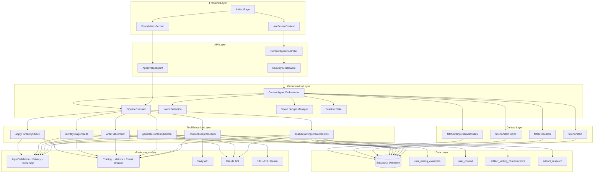
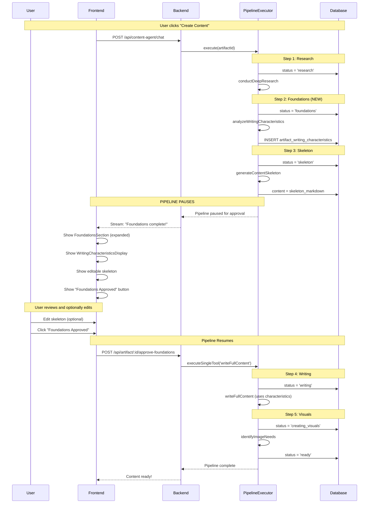
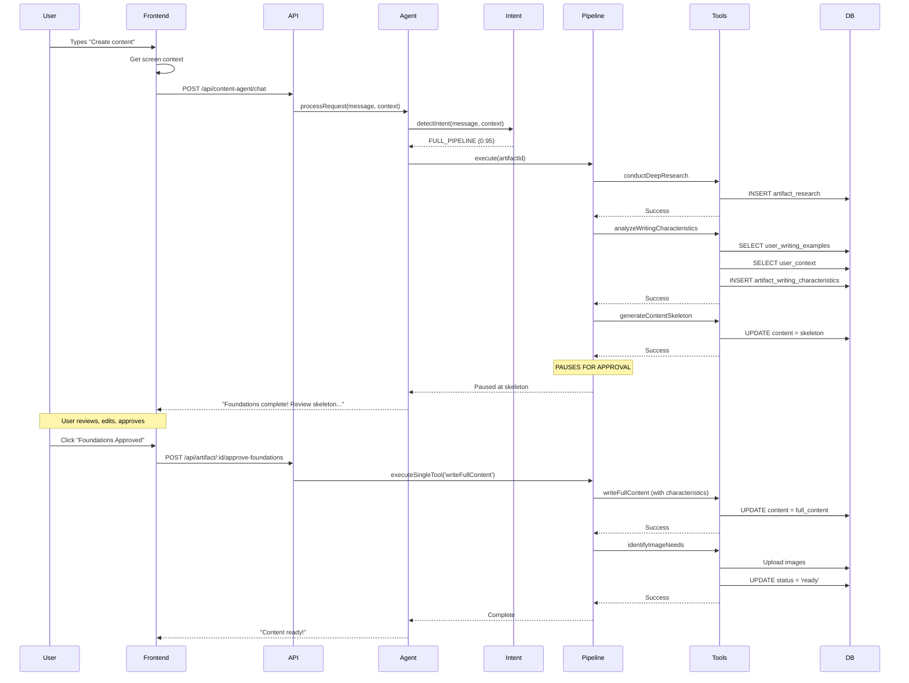

# Content Agent Overview

**Version:** 2.0.0
**Last Updated:** 2026-01-29
**Status:** Production Ready (Phase 4 Foundations Approval)

## Table of Contents

- [Introduction](#introduction)
- [Architecture](#architecture)
- [Core Components](#core-components)
  - [ContentAgent Orchestrator](#contentagent-orchestrator)
  - [PipelineExecutor](#pipelineexecutor)
  - [Session State Management](#session-state-management)
  - [Token Budget Management](#token-budget-management)
  - [Intent Detection](#intent-detection)
- [Workflow Modes](#workflow-modes)
- [Phase 4: Foundations Approval Workflow](#phase-4-foundations-approval-workflow)
- [Data Flow](#data-flow)
- [Usage Examples](#usage-examples)
- [Configuration](#configuration)
- [Related Documentation](#related-documentation)

---

## Introduction

The **Content Agent** is the unified orchestrator for the content creation pipeline in the Product Consultant Helper platform. It manages the end-to-end workflow from initial research through to ready-to-publish content, handling:

- **Intelligent Intent Detection** - Understands user requests using a hybrid regex + AI approach
- **Session Management** - Maintains conversation state with automatic timeout handling
- **Token Budget Control** - Manages Claude Sonnet 4's 200K context window efficiently
- **Tool Orchestration** - Coordinates 7 core tools + 4 context tools for content creation
- **Error Recovery** - Implements checkpoint/rollback for pipeline atomicity
- **Foundations Approval** - Phase 4 user approval gate for writing characteristics and skeleton review

### Key Capabilities

- **Full Pipeline Execution** - draft → research → foundations → skeleton → [APPROVAL] → writing → creating_visuals → ready
- **Writing Characteristics Analysis** - AI analyzes user's writing style to guide content generation
- **User Approval Gate** - Pipeline pauses for user to review skeleton before content writing
- **Partial Flow Support** - Execute individual steps (e.g., "humanize only")
- **Conversational Interface** - Natural language interaction with context awareness
- **Production-Grade Security** - Rate limiting, ownership validation, prompt injection protection

---

## Architecture

The Content Agent follows a layered architecture with clear separation of concerns:



### Architecture Layers

| Layer | Purpose | Key Components |
|-------|---------|----------------|
| **Frontend** | User interface for artifact editing | ArtifactPage, FoundationsSection, useScreenContext |
| **API** | REST endpoints with security | ContentAgentController, approval endpoint |
| **Orchestration** | Request routing and state management | ContentAgent, PipelineExecutor, Intent Detection |
| **Tool Execution** | Content creation operations | 7 core tools + 4 context tools |
| **Data** | Writing references and characteristics | user_writing_examples, user_context, artifact_writing_characteristics |
| **Infrastructure** | Security, observability, external APIs | Validation, tracing, Tavily, Claude, DALL-E |

---

## Core Components

### ContentAgent Orchestrator

The `ContentAgent` class is the central orchestrator that coordinates all content creation operations.

**Location:** `/backend/src/services/ai/ContentAgent.ts`

**Key Responsibilities:**

- Process user requests with intent detection
- Manage session state and conversation history
- Orchestrate tool execution (full pipeline or individual tools)
- Handle errors with automatic recovery
- Enforce token budget constraints
- Coordinate with PipelineExecutor for pipeline execution

**Public API:**

```typescript
class ContentAgent {
  // Main entry point for user requests
  async processRequest(message: string, screenContext: ScreenContext): Promise<AgentResponse>

  // Execute complete content creation pipeline
  async executeFullPipeline(request: PipelineExecutionRequest): Promise<PipelineResult>

  // Execute individual tool
  async executeSingleTool(toolName: ToolName, params: unknown): Promise<ToolOutput>

  // Access conversation history
  getConversationHistory(): ConversationTurn[]

  // Reset session and clear state
  clearSession(): void
}
```

---

### PipelineExecutor

The `PipelineExecutor` manages the sequential execution of pipeline steps with checkpoint/rollback support.

**Location:** `/backend/src/services/ai/PipelineExecutor.ts`

**Key Responsibilities:**

- Execute pipeline steps in correct order
- Create checkpoints before each step
- Rollback to checkpoint on failure
- **Pause pipeline after skeleton generation** (Phase 4)
- Resume pipeline from approval endpoint

**Pipeline Steps (Phase 4):**

```typescript
const PIPELINE_STEPS: PipelineStep[] = [
  { toolName: 'conductDeepResearch', expectedStatusBefore: 'draft', expectedStatusAfter: 'research' },
  { toolName: 'analyzeWritingCharacteristics', expectedStatusBefore: 'research', expectedStatusAfter: 'foundations' },
  { toolName: 'generateContentSkeleton', expectedStatusBefore: 'foundations', expectedStatusAfter: 'skeleton' },
  // PIPELINE PAUSES HERE - status is 'skeleton', waiting for user approval
  { toolName: 'writeFullContent', expectedStatusBefore: 'foundations_approval', expectedStatusAfter: 'writing' },
  { toolName: 'identifyImageNeeds', expectedStatusBefore: 'writing', expectedStatusAfter: 'ready' },
]
```

**Pause/Resume Mechanism:**

```typescript
// Pipeline execution stops after skeleton step
// Agent notifies user via ChatPanel

// User clicks "Foundations Approved" button
// Frontend calls: POST /api/artifact/:id/approve-foundations

// Backend resumes pipeline:
await pipelineExecutor.executeSingleTool('writeFullContent', artifactId);
```

---

### Session State Management

Session state tracks the agent's current context across multiple interactions with 30-minute automatic timeout.

**State Structure:**

```typescript
interface SessionState {
  sessionId: string;
  currentArtifactId?: string;
  lastToolExecuted?: string;
  pipelineProgress?: {
    currentStep: number;
    totalSteps: number;
    completedTools: string[];
    pausedForApproval: boolean;  // NEW: Phase 4
  };
  lastActivityTimestamp: number;
}
```

---

### Token Budget Management

The Token Budget Manager ensures efficient use of Claude Sonnet 4's 200K context window.

**Total Context Window:** 200,000 tokens

**Reserved Allocations:**

| Category | Tokens | Priority |
|----------|--------|----------|
| System Prompt | 3,000 | CRITICAL |
| Tool Definitions | 8,000 | CRITICAL |
| Writing Characteristics | 2,000 | HIGH |
| Current User Message | 500 | REQUIRED |
| Response Buffer | 4,000 | CRITICAL |
| **Available for Dynamic Content** | **182,500** | - |

---

### Intent Detection

Intent detection uses a **hybrid approach** combining regex patterns (fast, high-confidence) with Claude Haiku (AI-powered, handles ambiguity).

**Available Intents:**

```typescript
enum UserIntent {
  GENERATE_TOPICS,      // "suggest topic ideas"
  RESEARCH_TOPIC,       // "research this topic"
  CREATE_SKELETON,      // "create outline"
  WRITE_CONTENT,        // "write the content"
  HUMANIZE_CONTENT,     // "make it sound more human"
  CREATE_VISUALS,       // "generate images"
  FULL_PIPELINE,        // "create content" (end-to-end)
  APPROVE_FOUNDATIONS,  // "approve the skeleton" [NEW]
  STATUS_CHECK,         // "what's the status?"
  UNCLEAR               // Conversational or ambiguous
}
```

---

## Workflow Modes

The Content Agent supports three workflow modes depending on user intent and context.

### 1. Full Pipeline Mode

Executes the complete **6-step** content creation pipeline with approval gate.

**Steps:**

1. **Research** (draft → research) - Query 5+ sources via Tavily API
2. **Foundations** (research → foundations) - Analyze writing characteristics [NEW]
3. **Skeleton** (foundations → skeleton) - Generate H1 title + H2 section headings
4. **[APPROVAL GATE]** - Pipeline pauses, user reviews skeleton
5. **Writing** (foundations_approval → writing) - Write full content using characteristics
6. **Visuals** (writing → ready) - Generate images with DALL-E 3

**Triggers:**

- User says: "Create content", "Generate everything", "Run full pipeline"
- Intent detected: `UserIntent.FULL_PIPELINE`
- Artifact status: `draft`

**Duration:** ~3-5 minutes for blog post (~2000 words) + user approval time

---

### 2. Partial Flow Mode

Executes a single tool or subset of the pipeline based on current artifact status.

**Use Cases:**

- **Humanize Only:** "Make the content sound more human" → `applyHumanityCheck`
- **Regenerate Skeleton:** "Create a new outline" (status: foundations) → `generateContentSkeleton`
- **Resume from Approval:** User clicks "Foundations Approved" → `writeFullContent`

---

### 3. Interactive Mode

User provides guidance at each step with conversational feedback.

**Current Status:** Phase 4 (approval gate implemented)

---

## Phase 4: Foundations Approval Workflow

Phase 4 introduces a **user approval gate** between skeleton generation and content writing.

### Why Approval Gate?

- **Writing Quality**: User reviews AI-analyzed writing characteristics before content generation
- **Skeleton Review**: User can edit the content structure before full writing begins
- **Transparency**: User understands how their content will be written

### Flow Diagram



### Writing References System

The `analyzeWritingCharacteristics` tool pulls from multiple data sources:

**Reference Sources:**

| Source | Table | Data |
|--------|-------|------|
| Writing Examples | `user_writing_examples` | 500+ word samples from user |
| User Context | `user_context` | Profession, goals, target audience |
| Artifact Research | `artifact_research` | Topic-specific research context |

**Characteristics Output:**

```typescript
interface WritingCharacteristics {
  tone: { value: 'professional', confidence: 0.85, source: 'examples' };
  voice: { value: 'first-person', confidence: 0.7, source: 'mix' };
  sentence_structure: { value: 'varied', confidence: 0.8, source: 'examples' };
  vocabulary_complexity: { value: 'intermediate', confidence: 0.75, source: 'context' };
  pacing: { value: 'measured', confidence: 0.6, source: 'default' };
  use_of_evidence: { value: 'moderate', confidence: 0.7, source: 'examples' };
  // ... additional characteristics
}
```

### UI Components

**FoundationsSection** - Contains:
- WritingCharacteristicsDisplay (grouped by source)
- **Editable** skeleton in TipTap editor
- "Foundations Approved" button

**Key Behaviors:**
- Auto-expands when status reaches `skeleton`
- Skeleton is editable (user can modify structure)
- Main ArtifactEditor is **hidden** until writing completes

---

## Data Flow

### Request Processing Flow (Phase 4)



---

## Usage Examples

### Example 1: Full Pipeline with Approval Gate

```typescript
import { createContentAgent } from '@/services/ai/ContentAgent';

const agent = createContentAgent();

// Step 1: User requests content creation
const response = await agent.processRequest(
  "Create content for my blog post about AI in product management",
  {
    currentPage: 'artifact',
    artifactId: 'blog-001',
    artifactType: 'blog',
    artifactStatus: 'draft'
  }
);

// Pipeline executes: research → foundations → skeleton
// Pipeline PAUSES at skeleton status
// Response: "Foundations complete! Review the skeleton and click 'Foundations Approved'..."

// Step 2: User reviews skeleton in FoundationsSection
// User optionally edits the skeleton
// User clicks "Foundations Approved" button

// Step 3: Frontend calls approval endpoint
await fetch('/api/artifact/blog-001/approve-foundations', { method: 'POST' });

// Pipeline resumes: writing → creating_visuals → ready
// Final content with images is generated
```

### Example 2: Resume from Approval

```typescript
// User has artifact in 'skeleton' status
// FoundationsSection shows skeleton and approval button

// Frontend detects status and shows approval UI
if (artifact.status === 'skeleton' || artifact.status === 'foundations_approval') {
  // Show FoundationsSection with approval button
}

// User clicks approval
const approveFoundations = async () => {
  await api.post(`/api/artifact/${artifactId}/approve-foundations`);
  // Pipeline continues automatically
};
```

---

## Configuration

### Environment Variables

**Required:**
- `ANTHROPIC_API_KEY` - For Claude API (characteristics analysis, skeleton, writing)
- `OPENAI_API_KEY` - For DALL-E 3 image generation
- `TAVILY_API_KEY` - For deep research

### Constants

```typescript
// Session timeout (30 minutes)
const SESSION_TIMEOUT_MS = 30 * 60 * 1000;

// Max conversation turns to keep in history
const MAX_CONVERSATION_TURNS = 10;

// Processing states (for polling)
const PROCESSING_STATES = ['research', 'foundations', 'writing', 'creating_visuals'];

// NON-processing states (no polling)
const NON_PROCESSING_STATES = ['draft', 'skeleton', 'foundations_approval', 'ready', 'published'];
```

---

## Related Documentation

### Core Documentation

- **[Pipeline Execution Flow](./pipeline-execution-flow.md)** - Complete 6-step pipeline with approval gate
- **[Core Tools Reference](./core-tools-reference.md)** - All 7 core tools with schemas
- **[Intent Detection Guide](./intent-detection-guide.md)** - Hybrid intent detection
- **[System Prompt Specification](./system-prompt-specification.md)** - System prompt and behavior

### Status Reference

- **[STATUS_VALUES_REFERENCE.md](../artifact-statuses/STATUS_VALUES_REFERENCE.md)** - Complete 9-status definitions
- **[Status Flow Reference](../artifact-statuses/status-flow-reference.md)** - Status transitions and UI

### API Documentation

- **[Content Agent Endpoints](../api/content-agent-endpoints.md)** - REST API including approval endpoint
- **[Screen Context Specification](../api/screen-context-specification.md)** - Frontend context integration

### Architecture Documentation

- **[UNIFIED_CONTENT_AGENT_ARCHITECTURE.md](./UNIFIED_CONTENT_AGENT_ARCHITECTURE.md)** - Full system architecture

### Implementation Files

- **ContentAgent:** `/backend/src/services/ai/ContentAgent.ts`
- **PipelineExecutor:** `/backend/src/services/ai/PipelineExecutor.ts`
- **Writing Characteristics Tool:** `/backend/src/services/ai/tools/writingCharacteristicsTools.ts`
- **FoundationsSection:** `/frontend/src/features/portfolio/components/artifact/FoundationsSection.tsx`
- **Types:** `/backend/src/services/ai/types/contentAgent.ts`

---

**Version History:**

- **v2.0.0** (2026-01-29) - Phase 4: Foundations approval workflow
  - Added `analyzeWritingCharacteristics` tool
  - Added 6-step pipeline with approval gate
  - Added writing references system
  - Updated architecture diagram
  - Added FoundationsSection documentation
- **v1.0.0** (2026-01-26) - Initial release with Phase 1 MVP
