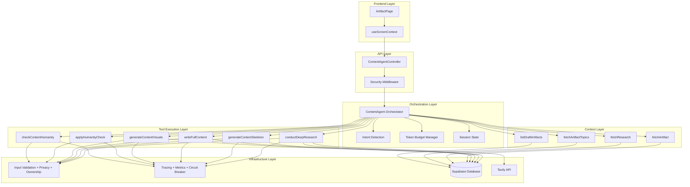
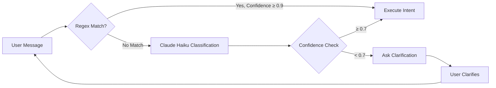
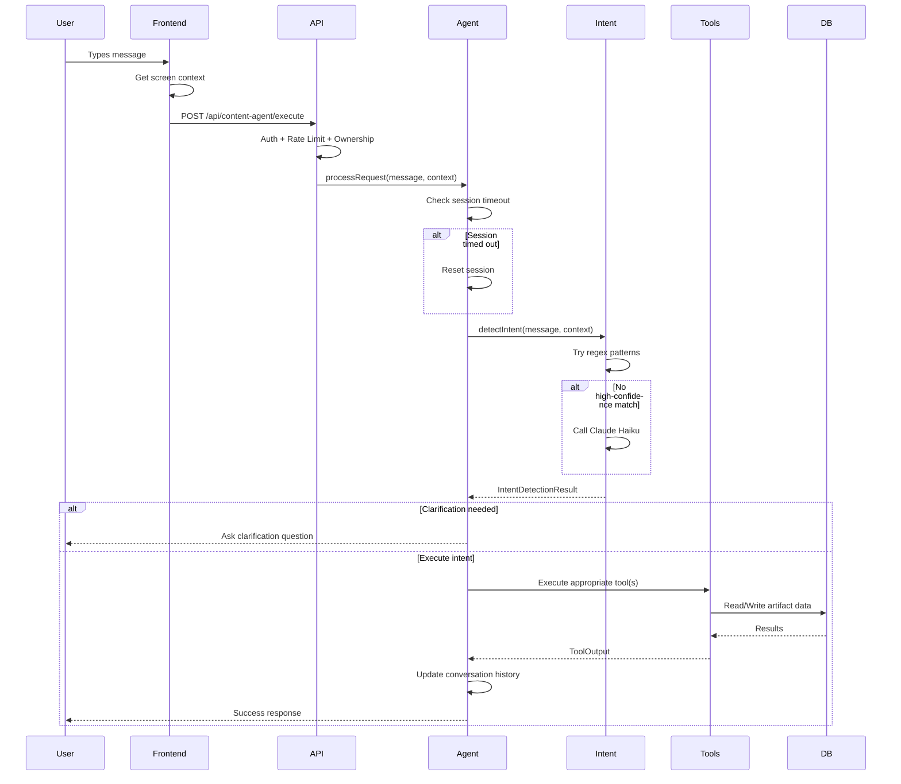
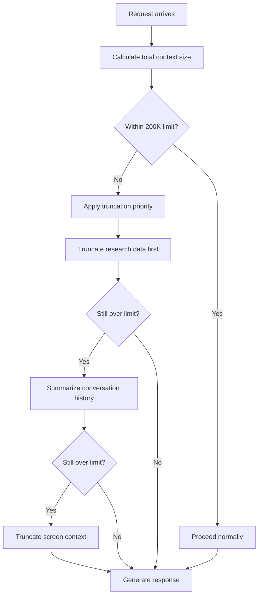

# Content Agent Overview

**Version:** 1.0.0
**Last Updated:** 2026-01-26
**Status:** Production Ready

## Table of Contents

- [Introduction](#introduction)
- [Architecture](#architecture)
- [Core Components](#core-components)
  - [ContentAgent Orchestrator](#contentagent-orchestrator)
  - [Session State Management](#session-state-management)
  - [Token Budget Management](#token-budget-management)
  - [Intent Detection](#intent-detection)
- [Workflow Modes](#workflow-modes)
- [Data Flow](#data-flow)
- [Usage Examples](#usage-examples)
- [Configuration](#configuration)
- [Related Documentation](#related-documentation)

---

## Introduction

The **Content Agent** is the unified orchestrator for the content creation pipeline in the Product Consultant Helper platform. It manages the end-to-end workflow from initial research through to ready-to-publish content, handling:

- **Intelligent Intent Detection** - Understands user requests using a hybrid regex + AI approach
- **Session Management** - Maintains conversation state with automatic timeout handling
- **Token Budget Control** - Manages Claude Sonnet 4's 200K context window efficiently
- **Tool Orchestration** - Coordinates 6 core tools + 4 context tools for content creation
- **Error Recovery** - Implements checkpoint/rollback for pipeline atomicity

### Key Capabilities

- ✅ **Full Pipeline Execution** - draft → research → skeleton → writing → creating_visuals → ready
- ✅ **Partial Flow Support** - Execute individual steps (e.g., "humanize only")
- ✅ **Conversational Interface** - Natural language interaction with context awareness
- ✅ **Production-Grade Security** - Rate limiting, ownership validation, prompt injection protection

---

## Architecture

The Content Agent follows a layered architecture with clear separation of concerns:



### Architecture Layers

| Layer | Purpose | Key Components |
|-------|---------|----------------|
| **Frontend** | User interface for artifact editing | ArtifactPage, useScreenContext hook |
| **API** | REST endpoints with security | ContentAgentController, auth middleware |
| **Orchestration** | Request routing and state management | ContentAgent, Intent Detection, Token Budget |
| **Tool Execution** | Content creation operations | 6 core tools + 4 context tools |
| **Infrastructure** | Security, observability, data | Validation, tracing, metrics, database |

---

## Core Components

### ContentAgent Orchestrator

The `ContentAgent` class is the central orchestrator that coordinates all content creation operations.

**Location:** `/backend/src/services/ai/ContentAgent.ts`

**Key Responsibilities:**

- Process user requests with intent detection
- Manage session state and conversation history
- Orchestrate tool execution (full pipeline or individual tools)
- Handle errors with automatic recovery
- Enforce token budget constraints

**Public API:**

```typescript
class ContentAgent {
  // Main entry point for user requests
  async processRequest(message: string, screenContext: ScreenContext): Promise<AgentResponse>

  // Execute complete content creation pipeline
  async executeFullPipeline(request: PipelineExecutionRequest): Promise<PipelineResult>

  // Execute individual tool
  async executeSingleTool(toolName: ToolName, params: unknown): Promise<ToolOutput>

  // Access conversation history
  getConversationHistory(): ConversationTurn[]

  // Reset session and clear state
  clearSession(): void
}
```

**Example Usage:**

```typescript
import { createContentAgent } from './ContentAgent';

const agent = createContentAgent();

const response = await agent.processRequest(
  "Create content for my blog post about AI in product management",
  {
    currentPage: 'artifact',
    artifactId: 'abc-123',
    artifactType: 'blog',
    artifactStatus: 'draft'
  }
);

console.log(response.text); // "I'll run the full content creation pipeline..."
console.log(response.intentDetected); // UserIntent.FULL_PIPELINE
```

---

### Session State Management

Session state tracks the agent's current context across multiple interactions with 30-minute automatic timeout.

**State Structure:**

```typescript
interface SessionState {
  /** Unique session identifier */
  sessionId: string;

  /** Currently active artifact (if any) */
  currentArtifactId?: string;

  /** Last tool executed in session */
  lastToolExecuted?: string;

  /** Pipeline progress tracking */
  pipelineProgress?: {
    currentStep: number;
    totalSteps: number;
    completedTools: string[];
  };

  /** Timestamp of last activity (for timeout detection) */
  lastActivityTimestamp: number;
}
```

**Session Timeout Behavior:**

- **Timeout Duration:** 30 minutes (1,800,000 ms)
- **Trigger:** Checked on every `processRequest()` call
- **Action:** Automatic session reset with new session ID
- **Logging:** Session timeout events logged for monitoring

**Implementation:**

```typescript
// Session timeout constant
const SESSION_TIMEOUT_MS = 30 * 60 * 1000; // 30 minutes

// Check on every request
private checkSessionTimeout(): boolean {
  const elapsed = Date.now() - this.sessionState.lastActivityTimestamp;
  return elapsed > SESSION_TIMEOUT_MS;
}

// Automatic reset when timeout detected
if (this.checkSessionTimeout()) {
  this.resetSession();
  logger.info('ContentAgent', 'Session reset due to timeout', {
    sessionId: this.sessionState.sessionId
  });
}
```

**Session ID Format:** `session-{timestamp}-{random7}`

**Example:** `session-1706284800000-a7b3c4d`

---

### Token Budget Management

The Token Budget Manager ensures efficient use of Claude Sonnet 4's 200K context window by prioritizing critical content and truncating lower-priority data.

**Total Context Window:** 200,000 tokens

**Reserved Allocations:**

| Category | Tokens | Priority | Truncation Policy |
|----------|--------|----------|-------------------|
| System Prompt | 3,000 | CRITICAL | Never truncate |
| Tool Definitions | 8,000 | CRITICAL | Never truncate |
| Current User Message | 500 | REQUIRED | Never truncate |
| Response Buffer | 4,000 | CRITICAL | Never truncate |
| **Available for Dynamic Content** | **184,500** | - | - |

**Dynamic Content Priority Order (for truncation):**

1. **Screen Context** - Truncate last (lowest priority for truncation)
2. **Conversation History** - Summarize if needed
3. **Research Data** - Truncate first (highest priority for truncation)

**Token Estimation:**

```typescript
// Rough approximation: 1 token ≈ 4 characters
calculateUsage(text: string): number {
  return Math.ceil(text.length / 4);
}
```

**Truncation Strategy:**

```typescript
// Example: Truncate research data if needed
const research = tokenBudgetManager.truncateIfNeeded(
  researchData,
  ContextPriority.RESEARCH_DATA,
  50000 // Max 50K tokens for research
);
```

**Conversation History Optimization:**

```typescript
// Keep most recent messages, drop oldest to fit budget
const optimized = tokenBudgetManager.optimizeConversationHistory(
  conversationMessages,
  20000 // Max 20K tokens for history
);

// Adds summary marker for dropped messages:
// "[Earlier 5 messages truncated to fit token budget]"
```

**Why This Matters:**

- ⚠️ **Without budget management:** Context window overflow → silent truncation by API
- ✅ **With budget management:** Controlled truncation with priority → predictable behavior

---

### Intent Detection

Intent detection uses a **hybrid approach** combining regex patterns (fast, high-confidence) with Claude Haiku (AI-powered, handles ambiguity).

**Detection Flow:**



**Confidence Thresholds:**

| Threshold | Confidence | Action |
|-----------|------------|--------|
| **HIGH** | ≥ 0.9 | Execute immediately (regex matches) |
| **MEDIUM** | ≥ 0.7 | Proceed with caution (strong AI signal) |
| **LOW** | ≥ 0.5 | Ask for clarification (weak signal) |
| **UNCLEAR** | < 0.5 | Must clarify before proceeding |

**Available Intents:**

```typescript
enum UserIntent {
  GENERATE_TOPICS,      // "suggest topic ideas"
  RESEARCH_TOPIC,       // "research this topic"
  CREATE_SKELETON,      // "create outline"
  WRITE_CONTENT,        // "write the content"
  HUMANIZE_CONTENT,     // "make it sound more human"
  CREATE_VISUALS,       // "generate images"
  FULL_PIPELINE,        // "create content" (end-to-end)
  STATUS_CHECK,         // "what's the status?"
  UNCLEAR               // Conversational or ambiguous
}
```

**Regex Patterns (High Confidence ≥ 0.9):**

```typescript
// Example: FULL_PIPELINE intent
patterns: [
  /\bcreate\s+content\b/i,
  /\bgenerate\s+(everything|complete\s+content)\b/i,
  /\brun\s+(the\s+)?(full\s+)?pipeline\b/i,
  /\bstart\s+from\s+scratch\b/i
]

// Match: "Create content for my blog"
// Confidence: 0.95 (regex match)
```

**Claude Haiku Classification (For Ambiguous Cases):**

```typescript
// Low temperature (0.1) for consistent classification
const { text } = await generateText({
  model: anthropic('claude-3-5-haiku-20241022'),
  prompt: `Classify intent from message: "${message}"

  Available intents: GENERATE_TOPICS | RESEARCH_TOPIC | ...

  Respond ONLY with: INTENT|0.8`,
  maxTokens: 50,
  temperature: 0.1
});

// Example response: "WRITE_CONTENT|0.75"
// Parsed → intent: WRITE_CONTENT, confidence: 0.75
```

**Screen Context Integration:**

Intent detection uses screen context to improve accuracy:

```typescript
interface ScreenContext {
  currentPage?: 'portfolio' | 'artifact' | 'dashboard';
  artifactId?: string;
  artifactType?: 'blog' | 'social_post' | 'showcase';
  artifactStatus?: 'draft' | 'research' | 'skeleton' | 'ready';
  artifactTitle?: string;
}

// Example: User says "write it"
// Without context: UNCLEAR (confidence 0.3)
// With context (artifactStatus: 'skeleton'): WRITE_CONTENT (confidence 0.9)
```

**Clarification Flow:**

When confidence < 0.7, the agent generates a clarification question:

```typescript
// User: "make it better"
// Intent: HUMANIZE_CONTENT (confidence 0.6)
// Clarification: "Would you like me to humanize the content (remove AI patterns)?"
```

---

## Workflow Modes

The Content Agent supports three workflow modes depending on user intent and context.

### 1. Full Pipeline Mode

Executes the complete 4-step content creation pipeline automatically.

**Steps:**

1. **Research** (draft → research) - Query 5+ sources via Tavily API
2. **Skeleton** (research → skeleton) - Generate H1 title + H2 section headings
3. **Writing** (skeleton → creating_visuals) - Write full content for all sections
4. **Visuals** (creating_visuals → ready) - Generate images + apply humanization

**Triggers:**

- User says: "Create content", "Generate everything", "Run full pipeline"
- Intent detected: `UserIntent.FULL_PIPELINE`
- Artifact status: `draft`

**Duration:** ~3-5 minutes for blog post (~2000 words)

**Example:**

```typescript
const response = await agent.processRequest(
  "Create content for artifact abc-123",
  { artifactId: 'abc-123', artifactStatus: 'draft' }
);

// Agent executes:
// 1. conductDeepResearch({ artifactId: 'abc-123' })
// 2. generateContentSkeleton({ artifactId: 'abc-123' })
// 3. writeFullContent({ artifactId: 'abc-123' })
// 4. generateContentVisuals({ artifactId: 'abc-123' })
```

**Checkpoint/Rollback:**

- Checkpoint created before each tool execution
- If any tool fails → rollback to previous checkpoint
- Ensures atomicity: either complete pipeline succeeds or nothing changes

---

### 2. Partial Flow Mode

Executes a single tool or subset of the pipeline based on current artifact status.

**Use Cases:**

- **Humanize Only:** "Make the content sound more human" → `applyHumanityCheck`
- **Regenerate Skeleton:** "Create a new outline" (status: research) → `generateContentSkeleton`
- **Add Visuals:** "Generate images" (status: creating_visuals) → `generateContentVisuals`

**Status Constraint Validation:**

The agent validates that the artifact is in the correct status before executing:

```typescript
// User: "Write the content"
// Artifact status: draft (not skeleton)
// Response: "I can help you write content. Do you have an outline ready?"

// User: "Write the content"
// Artifact status: skeleton
// Response: "I'll write the content based on your skeleton."
// Executes: writeFullContent()
```

**Example:**

```typescript
const response = await agent.processRequest(
  "Humanize the content for artifact xyz-789",
  {
    artifactId: 'xyz-789',
    artifactStatus: 'creating_visuals' // Valid status for humanization
  }
);

// Agent executes ONLY applyHumanityCheck tool
// Skips research, skeleton, writing steps
```

---

### 3. Interactive Mode

User provides guidance at each step with conversational feedback.

**Current Status:** Phase 1 MVP (basic conversational responses)

**Future Enhancement:** Manual approval gates between steps

**Flow:**

```
User: "Help me create a blog post about AI in product management"
Agent: "I'll help you create content. Let's start with research. What specific aspects would you like to focus on?"

User: "Focus on AI-driven roadmapping and feature prioritization"
Agent: "Great! I'll research those topics. Should I also include AI for user feedback analysis?"

User: "Yes, that too"
Agent: "Perfect. I'll research all three areas and create an outline."
```

**Implementation (MVP):**

```typescript
// Phase 1: Basic intent handling with text responses
private async handleIntent(intent: UserIntent, message: string, context: ScreenContext) {
  switch (intent) {
    case UserIntent.RESEARCH_TOPIC:
      return {
        text: context.artifactTitle
          ? `I'll research "${context.artifactTitle}" for you.`
          : "What topic would you like me to research?"
      };
    // ... other intents
  }
}
```

**Future (Phase 2+):**

- Step-by-step execution with user confirmation
- Review and edit at each pipeline stage
- Alternative content suggestions with A/B variants

---

## Data Flow

### Request Processing Flow



### Token Budget Allocation Flow



---

## Usage Examples

### Example 1: Full Pipeline Execution

```typescript
import { createContentAgent } from '@/services/ai/ContentAgent';

const agent = createContentAgent();

// User creates a new artifact and requests content generation
const response = await agent.processRequest(
  "Create content for my blog post about prompt engineering best practices",
  {
    currentPage: 'artifact',
    artifactId: 'blog-001',
    artifactType: 'blog',
    artifactTitle: 'Prompt Engineering Best Practices for Product Teams',
    artifactStatus: 'draft'
  }
);

console.log(response);
// {
//   text: "I'll run the full content creation pipeline: research → skeleton → write → humanize → visuals. This may take a few minutes.",
//   sessionState: { sessionId: 'session-1706284800000-a7b3c4d', ... },
//   intentDetected: 'FULL_PIPELINE',
//   clarificationNeeded: false
// }
```

### Example 2: Humanize Existing Content

```typescript
// User has content in creating_visuals status and wants humanization
const response = await agent.processRequest(
  "Make the content sound more natural and less AI-generated",
  {
    currentPage: 'artifact',
    artifactId: 'blog-002',
    artifactType: 'blog',
    artifactStatus: 'creating_visuals'
  }
);

console.log(response);
// {
//   text: "I'll humanize your content to remove AI patterns and make it sound more natural.",
//   intentDetected: 'HUMANIZE_CONTENT',
//   clarificationNeeded: false
// }

// Agent executes ONLY applyHumanityCheck tool
// Status transition: creating_visuals → ready
```

### Example 3: Clarification Flow

```typescript
// Ambiguous user message
const response = await agent.processRequest(
  "fix it",
  {
    currentPage: 'artifact',
    artifactId: 'blog-003',
    artifactStatus: 'ready'
  }
);

console.log(response);
// {
//   text: "I'm not sure what you'd like me to fix. Could you clarify your request?",
//   intentDetected: 'UNCLEAR',
//   clarificationNeeded: true,
//   suggestedClarification: "I'm not sure what you'd like me to fix. Could you clarify your request?"
// }
```

### Example 4: Status Check

```typescript
const response = await agent.processRequest(
  "What's the status of my content?",
  {
    currentPage: 'artifact',
    artifactId: 'blog-004',
    artifactTitle: 'My Blog Post',
    artifactStatus: 'skeleton'
  }
);

console.log(response);
// {
//   text: "Your content \"My Blog Post\" is currently in status: skeleton",
//   intentDetected: 'STATUS_CHECK',
//   clarificationNeeded: false
// }
```

### Example 5: Session Management

```typescript
const agent = createContentAgent();

// First request
await agent.processRequest("Create content", { artifactId: 'abc' });

// ... 31 minutes later ...

// Next request triggers automatic session reset
await agent.processRequest("What's the status?", { artifactId: 'abc' });

// Check conversation history (will be empty after reset)
const history = agent.getConversationHistory();
console.log(history.length); // 1 (only latest message)

// Manual session clear
agent.clearSession();
```

---

## Configuration

### Environment Variables

No environment variables specific to ContentAgent. Configuration is hardcoded for MVP.

**Dependencies:**

- `ANTHROPIC_API_KEY` - For Claude Haiku intent classification (inherited from AI SDK)

### Constants

```typescript
// Session timeout (30 minutes)
const SESSION_TIMEOUT_MS = 30 * 60 * 1000;

// Max conversation turns to keep in history
const MAX_CONVERSATION_TURNS = 10;

// Token budget allocation (see Token Budget Management section)
const TOKEN_BUDGET = {
  max: 200000,
  reserved: { systemPrompt: 3000, toolDefinitions: 8000, ... }
};

// Confidence thresholds for intent detection
const CONFIDENCE_THRESHOLD = {
  HIGH: 0.9,    // Execute immediately
  MEDIUM: 0.7,  // Proceed with caution
  LOW: 0.5,     // Ask for clarification
  UNCLEAR: 0.0  // Must clarify
};
```

### Logging

All operations logged via centralized logger:

```typescript
import { logger } from '@/lib/logger';

logger.info('ContentAgent', 'Initialized', { sessionId });
logger.debug('ContentAgent', 'Intent detected', { intent, confidence });
logger.error('ContentAgent', error, { message });
```

**Log Levels:**

- **INFO:** Session lifecycle, intent detection results
- **DEBUG:** Regex matches, token budget calculations
- **WARN:** Token budget overages, session timeouts
- **ERROR:** Tool execution failures, API errors

---

## Related Documentation

### Core Documentation

- **[System Prompt Specification](./system-prompt-specification.md)** - Complete system prompt and behavior rules
- **[Core Tools Reference](./core-tools-reference.md)** - All 6 core tools with schemas and examples
- **[Context Tools Reference](./context-tools-reference.md)** - Ad-hoc context fetchers
- **[Intent Detection Guide](./intent-detection-guide.md)** - Deep dive into hybrid intent detection
- **[Pipeline Execution Flow](./pipeline-execution-flow.md)** - Complete 4-step pipeline with checkpoints

### API Documentation

- **[Content Agent Endpoints](../api/content-agent-endpoints.md)** - REST API reference
- **[Authentication & Security](../api/authentication-and-security.md)** - Security layers and validation
- **[Error Handling Reference](../api/error-handling-reference.md)** - All 13 error categories
- **[Screen Context Specification](../api/screen-context-specification.md)** - Frontend context integration

### Architecture Documentation

- **[Backend Architecture](../Architecture/backend/content-agent-architecture.md)** - Complete backend system design
- **[Security Architecture](../Architecture/backend/security-architecture.md)** - Multi-layered security approach
- **[Observability Architecture](../Architecture/backend/observability-architecture.md)** - Tracing, metrics, circuit breaker
- **[Frontend Integration](../Architecture/frontend/screen-context-integration.md)** - useScreenContext hook

### Implementation Files

- **Source Code:** `/backend/src/services/ai/ContentAgent.ts`
- **Intent Detection:** `/backend/src/services/ai/utils/intentDetection.ts`
- **Token Budget:** `/backend/src/services/ai/utils/tokenBudget.ts`
- **Types:** `/backend/src/services/ai/types/contentAgent.ts`

---

**Version History:**

- **v1.0.0** (2026-01-26) - Initial release with Phase 1 MVP
  - Intent detection (hybrid regex + Haiku)
  - Session management with 30-minute timeout
  - Token budget management for 200K context
  - Basic conversational interface
  - Placeholder pipeline execution (full implementation in Phase 2)
