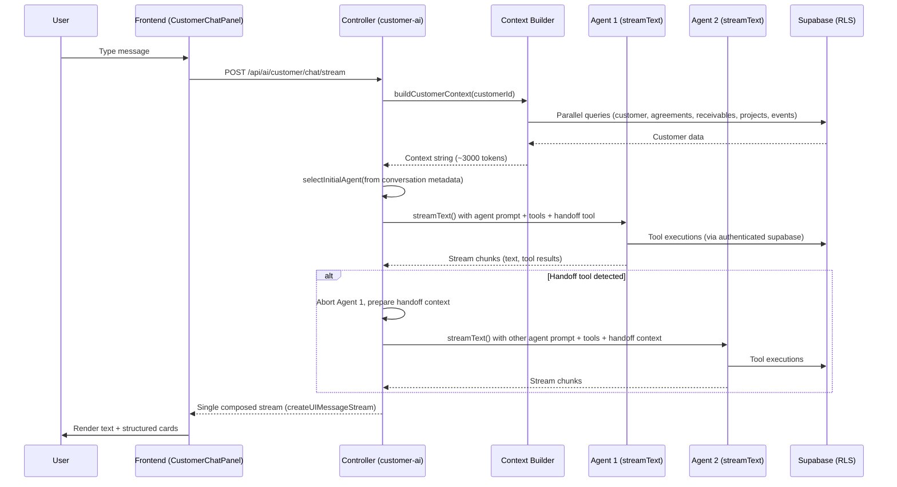

# Customer AI Agents Reference

**Created:** 2026-02-25
**Last Updated:** 2026-02-28
**Version:** 4.0.0
**Status:** Complete (Agent Folder Reorganization + 16 Capability Tools)

---

## Table of Contents

1. [Overview](#overview)
2. [File Organization](#file-organization)
3. [Architecture](#architecture)
4. [Agent 1: Customer Management Agent](#agent-1-customer-management-agent)
5. [Agent 2: Product Management Agent](#agent-2-product-management-agent)
6. [Agent Routing (Handoff-Based)](#agent-routing-handoff-based)
7. [Customer Context Builder](#customer-context-builder)
8. [Related Documentation](#related-documentation)

---

## Overview

The Customer AI system provides two specialized agents for customer management. Agents use **LLM-driven tool-based handoff** — each agent has a `handoff` tool that lets it transfer the conversation to the other agent when the user's request is outside its domain. The controller composes both agents into a single seamless HTTP response stream using Vercel AI SDK v6's `createUIMessageStream`. Both agents receive full customer context (profile, agreements, receivables, projects, recent events, health signals, deliverables) in their system prompt.

The Product Management Agent includes 21 tools total: 5 CRUD tools for project and artifact management, and 16 capability tools that encode complete PM framework methodologies and create artifacts directly in `customer_artifacts`.

---

## File Organization

All AI agent files are organized into agent-specific folders under `backend/src/services/ai/agents/`:

```
backend/src/services/ai/agents/
├── customer-mgmt/
│   ├── prompt/
│   │   └── customerAgentPrompts.ts
│   └── tools/
│       ├── customerMgmtTools.ts     (4 tools)
│       └── actionItemTools.ts       (3 tools)
├── product-mgmt/
│   ├── prompt/
│   │   └── productAgentPrompts.ts
│   └── tools/
│       ├── productMgmtTools.ts      (5 CRUD tools)
│       ├── artifactHelpers.ts       (shared createArtifactWithEvent helper)
│       ├── createProductStrategyTool.ts
│       ├── evaluateBuildStrategyTool.ts
│       ├── applyDecisionFrameworkTool.ts
│       ├── assessShipReadinessTool.ts
│       ├── analyzeCompetitionTool.ts
│       ├── scopeMvpTool.ts
│       ├── buildPersonaIcpTool.ts
│       ├── planUserResearchTool.ts
│       ├── analyzeProductDataTool.ts
│       ├── designUserFlowTool.ts
│       ├── designUxUiTool.ts
│       ├── designAiFeatureTool.ts
│       ├── createGrowthStrategyTool.ts
│       ├── createLaunchPlanTool.ts
│       ├── createNarrativeTool.ts
│       └── prioritizeItemsTool.ts
└── shared/
    ├── handoffTools.ts
    └── customerContextBuilder.ts
```

---

## Architecture



### Handoff Mechanism

Each agent has a `handoff` tool. When it determines the user's request is outside its domain, it calls the tool with `{ reason, summary, pendingRequest }`. The controller:

1. Detects `tool-output-available` with `__handoff: true` marker in the stream
2. Aborts the current agent (stops wasted LLM compute)
3. Starts the other agent with handoff context injected into the system prompt
4. Continues writing chunks from the new agent to the same response stream

**Loop prevention:** MAX_HANDOFFS=2 per request. On the final iteration, the handoff tool is removed, forcing the agent to respond.

**Initial agent selection:** Uses the last assistant message's `metadata.agentType` from conversation history. Defaults to `customer_mgmt` for new conversations.

**File:** `backend/src/services/ai/agents/shared/handoffTools.ts`

---

## Agent 1: Customer Management Agent

**Type identifier:** `customer_mgmt`

**System prompt function:** `getCustomerMgmtSystemPrompt(customerContext: string)`
**File:** `backend/src/services/ai/agents/customer-mgmt/prompt/customerAgentPrompts.ts`

**Capabilities:**
- Engagement strategy and relationship management
- Negotiation guidance and pricing recommendations
- Status management (changing customer lifecycle status)
- Communication drafting (emails, follow-ups, proposals)
- Account health assessment (proactively surfaces health signals: expiring agreements, overdue invoices, inactivity)
- Stakeholder mapping and team dynamics
- After providing advice, suggests ONE relevant follow-up action (e.g., "Want me to draft a follow-up email?")

### Tools (4)

#### updateCustomerStatus

Change a customer's lifecycle status and auto-log the transition.

```typescript
{
  parameters: z.object({
    customerId: z.string().uuid(),
    newStatus: z.enum(['lead', 'prospect', 'active', 'paused', 'churned', 'archived']),
    reason: z.string().describe('Reason for status change'),
  }),
  // Side effects:
  // 1. UPDATE customers SET status = newStatus WHERE id = customerId
  // 2. INSERT customer_events (type: 'status_change', description: old -> new + reason)
}
```

**Frontend card:** `StatusChangeCard` (green border, ArrowRightLeft icon)

#### updateCustomerInfo

Atomic JSONB merge into the customer's `info` column using the `merge_customer_info` RPC.

```typescript
{
  parameters: z.object({
    customerId: z.string().uuid(),
    info: z.record(z.unknown()).describe('Key-value pairs to merge into customer info'),
  }),
  // Uses: supabase.rpc('merge_customer_info', { cid, new_info })
  // Atomic: COALESCE(info, '{}'::jsonb) || new_info
}
```

#### createEventLogEntry

Log an interaction or note to the customer's event timeline.

```typescript
{
  parameters: z.object({
    customerId: z.string().uuid(),
    eventType: z.enum(['note', 'meeting', 'email', 'call', 'task', 'milestone']),
    description: z.string(),
  }),
  // INSERT into customer_events
}
```

#### getCustomerSummary

Re-fetch full customer context mid-conversation (for long conversations where data may have changed).

```typescript
{
  parameters: z.object({
    customerId: z.string().uuid(),
  }),
  // Returns: full customer context string (same format as system prompt context)
}
```

---

## Agent 2: Product Management Agent

**Type identifier:** `product_mgmt`

**System prompt function:** `getProductMgmtSystemPrompt(customerContext: string)`
**File:** `backend/src/services/ai/agents/product-mgmt/prompt/productAgentPrompts.ts`

**Capabilities:**
- Product strategy creation (Playing to Win, April Dunford positioning)
- Roadmap development and feature prioritization
- User research synthesis (interview guides, personas, JTBD)
- Competitive analysis (competitor mapping, feature comparison)
- Product specs (PRDs, feature specs, technical requirements)
- Prioritization frameworks (RICE scoring, opportunity sizing)
- Success measurement (KPIs, AARRR metrics, dashboards)
- Ideation facilitation and brainstorming
- Launch planning (GTM strategy, rollout plans)
- References existing deliverables when creating new artifacts (avoids duplication)
- Assesses product maturity based on artifact count and diversity
- After creating or discussing artifacts, suggests ONE relevant next step

### CRUD Tools (5)

**File:** `backend/src/services/ai/agents/product-mgmt/tools/productMgmtTools.ts`

#### createProject

Create a new project for the customer.

```typescript
{
  parameters: z.object({
    customerId: z.string().uuid(),
    name: z.string(),
    description: z.string().optional(),
    status: z.enum(['planning', 'active', 'on_hold', 'completed']).default('planning'),
  }),
  // INSERT into customer_projects
}
```

**Frontend card:** `ProjectCreatedCard` (amber border, FolderPlus icon)

#### createArtifact

Create a new artifact (document) with full Markdown content within a project.

```typescript
{
  parameters: z.object({
    projectId: z.string().uuid(),
    title: z.string(),
    type: z.enum(['strategy', 'research', 'roadmap', 'spec', 'analysis', 'report', 'other']),
    content: z.string().describe('Full Markdown content'),
    status: z.enum(['draft', 'review', 'final']).default('draft'),
  }),
  // Side effects:
  // 1. INSERT into customer_artifacts
  // 2. INSERT customer_events (type: 'artifact_created')
}
```

**Frontend card:** `ArtifactCreatedCard` (purple border, FileText icon)

#### updateArtifact

Update an existing artifact's content, title, or status.

```typescript
{
  parameters: z.object({
    artifactId: z.string().uuid(),
    content: z.string().optional(),
    title: z.string().optional(),
    status: z.enum(['draft', 'review', 'final']).optional(),
  }),
  // UPDATE customer_artifacts WHERE id = artifactId
  // RLS enforced via is_customer_owner(customer_id)
}
```

#### listProjects

List all projects for a customer.

```typescript
{
  parameters: z.object({
    customerId: z.string().uuid(),
  }),
  // SELECT from customer_projects WHERE customer_id = customerId
}
```

#### listArtifacts

List artifacts in a project or across all customer projects.

```typescript
{
  parameters: z.object({
    projectId: z.string().uuid().optional(),
    customerId: z.string().uuid().optional(),
  }),
  // SELECT from customer_artifacts, optionally filtered by project_id
}
```

---

### Capability Tools (16)

All 16 capability tools follow the same pattern:

- **Location:** `backend/src/services/ai/agents/product-mgmt/tools/[toolName]Tool.ts`
- **Shared helper:** `backend/src/services/ai/agents/product-mgmt/tools/artifactHelpers.ts`
- **Base parameters:** `projectId` (UUID), `title` (string), `content` (string — full Markdown artifact)
- **Side effects:** Calls `createArtifactWithEvent` which inserts to `customer_artifacts` and auto-logs a `delivery` event to `customer_events`
- **Default status:** All artifacts are created with `status: 'draft'`
- **Tool descriptions:** Each tool encodes the full PM framework methodology as its LLM-facing description

#### Summary Table

| Tool | Artifact Type | Extra Fields | Key Frameworks |
|------|--------------|--------------|----------------|
| `createProductStrategy` | `strategy` | `strategicHorizon?: 'now'\|'next'\|'later'` | Playing to Win, Crossing the Chasm |
| `evaluateBuildStrategy` | `build_analysis` | — | LNO framework, pre-mortem, reversibility |
| `applyDecisionFramework` | `decision_analysis` | `decisionStatement?: string` | Expected Value, Regret Minimization, Pre-Mortem |
| `assessShipReadiness` | `ship_decision` | — | Shipping Scorecard, reversibility assessment |
| `analyzeCompetition` | `competitive_analysis` | `competitors: string[]`, `focusAreas?: string[]` | SWOT, Porter's Five Forces, feature comparison |
| `scopeMvp` | `mvp_scope` | — | Simplicity forcing, experience mapping |
| `buildPersonaIcp` | `persona_icp` | `analysisScope?: 'icp'\|'personas'\|'full'` | ICP scoring, JTBD, buying committee mapping |
| `planUserResearch` | `user_research` | `researchObjective?: string` | JTBD interviews, thematic analysis, empathy mapping |
| `analyzeProductData` | `data_analysis` | `analysisType?: string` | Funnel analysis, AARRR, cohort analysis |
| `designUserFlow` | `user_flow` | `flowType?: 'user_flow'\|'journey_map'\|'service_blueprint'` | Journey maps, service blueprints, state diagrams |
| `designUxUi` | `ux_design` | `designScope?: string` | Wireframes, interaction specs, WCAG accessibility |
| `designAiFeature` | `ai_feature_spec` | — | Eval-driven development, hybrid architecture patterns |
| `createGrowthStrategy` | `growth_strategy` | — | Retention-first development, growth loops, network effects |
| `createLaunchPlan` | `launch_plan` | `launchTier?: 'major'\|'medium'\|'minor'` | April Dunford positioning, launch tiers |
| `createNarrative` | `narrative` | `audience?: string` | Five-act structure, WHAT→SO WHAT→NOW WHAT |
| `prioritizeItems` | `prioritization` | `framework?: 'rice'\|'ice'\|'moscow'\|'opportunity'\|'value_effort'` | RICE, ICE, MoSCoW, value vs effort |

#### createProductStrategy

Creates product strategy artifacts using the Playing to Win cascade (Lafley/Martin), Crossing the Chasm (Geoffrey Moore), and positioning frameworks. Produces complete strategy documents including winning aspiration, where-to-play analysis, how-to-win decisions, capability maps, and horizon-based roadmaps.

```typescript
inputSchema: z.object({
  projectId: z.string().uuid(),
  title: z.string(),
  content: z.string(), // Full Markdown strategy content. Aim for 1500-3000 words.
  strategicHorizon: z.enum(['now', 'next', 'later']).optional(),
})
// now = 0-6 months, next = 6-18 months, later = 18+ months
```

#### evaluateBuildStrategy

Analyzes build/buy/partner decisions using the LNO (Leverage, Neutral, Overhead) framework, pre-mortem analysis, and reversibility assessment. Produces structured build analysis documents with trade-off matrices.

```typescript
inputSchema: z.object({
  projectId: z.string().uuid(),
  title: z.string(),
  content: z.string(), // Full Markdown build evaluation content. Aim for 1500-3000 words.
})
```

#### applyDecisionFramework

Applies structured decision frameworks (Expected Value, Regret Minimization, Weighted Matrix) to complex or high-stakes product decisions. Produces a decision analysis document including probability estimates, reversibility assessment, pre-mortem, and a decision record.

```typescript
inputSchema: z.object({
  projectId: z.string().uuid(),
  title: z.string(),
  content: z.string(), // Full Markdown decision analysis content. Aim for 1000-2000 words.
  decisionStatement: z.string().optional(),
})
```

#### assessShipReadiness

Evaluates whether a feature or product is ready to ship using a Shipping Scorecard and reversibility assessment. Produces a ship/hold recommendation with risk analysis and rollout strategy guidance.

```typescript
inputSchema: z.object({
  projectId: z.string().uuid(),
  title: z.string(),
  content: z.string(), // Full Markdown ship readiness assessment. Aim for 1000-2000 words.
})
```

#### analyzeCompetition

Competitive analysis using SWOT, competitor mapping, and feature comparison. Supports single competitor, segment, and full market scope. Includes market segment validation (pre-signature vs. post-sale) before producing deliverables such as landscape overviews, competitor profiles, and battle cards.

```typescript
inputSchema: z.object({
  projectId: z.string().uuid(),
  title: z.string(),
  content: z.string(), // Full Markdown competitive analysis content. Aim for 2000-4000 words.
  competitors: z.array(z.string()), // Required: list of competitors being analyzed
  focusAreas: z.array(z.string()).optional(), // e.g., ['pricing', 'features', 'GTM']
})
```

#### scopeMvp

MVP scoping using simplicity forcing functions and experience mapping. Produces a scoped MVP document with must-have/should-have/won't-have classification and success criteria.

```typescript
inputSchema: z.object({
  projectId: z.string().uuid(),
  title: z.string(),
  content: z.string(), // Full Markdown MVP scope document. Aim for 1500-3000 words.
})
```

#### buildPersonaIcp

Ideal Customer Profile (ICP) scoring, Jobs-to-be-Done analysis, and buying committee mapping. Produces persona documents with demographic, psychographic, and behavioral profiles aligned to the customer's market segment.

```typescript
inputSchema: z.object({
  projectId: z.string().uuid(),
  title: z.string(),
  content: z.string(), // Full Markdown persona/ICP analysis content. Aim for 1500-3000 words.
  analysisScope: z.enum(['icp', 'personas', 'full']).optional(),
})
```

#### planUserResearch

User research planning with JTBD interview guides, thematic analysis frameworks, and empathy mapping. Produces research plans, interview guides, and synthesis templates.

```typescript
inputSchema: z.object({
  projectId: z.string().uuid(),
  title: z.string(),
  content: z.string(), // Full Markdown user research content. Aim for 1500-3000 words.
  researchObjective: z.string().optional(),
})
```

#### analyzeProductData

Product data analysis using funnel analysis, AARRR framework, and cohort analysis. Produces analysis documents with findings, interpretations, and recommended actions based on product metrics.

```typescript
inputSchema: z.object({
  projectId: z.string().uuid(),
  title: z.string(),
  content: z.string(), // Full Markdown data analysis content. Aim for 1500-3000 words.
  analysisType: z.string().optional(), // e.g., 'funnel', 'cohort', 'AARRR', 'North Star'
})
```

#### designUserFlow

User flow design with journey maps, service blueprints, and state diagrams. Produces visual flow documentation with friction point identification and optimization recommendations.

```typescript
inputSchema: z.object({
  projectId: z.string().uuid(),
  title: z.string(),
  content: z.string(), // Full Markdown user flow/journey content. Aim for 1500-3000 words.
  flowType: z.enum(['user_flow', 'journey_map', 'service_blueprint']).optional(),
})
```

#### designUxUi

UX/UI specifications with wireframe descriptions, interaction specs, and WCAG accessibility guidelines. Produces design specifications ready for designer or developer handoff.

```typescript
inputSchema: z.object({
  projectId: z.string().uuid(),
  title: z.string(),
  content: z.string(), // Full Markdown UX/UI spec content. Aim for 1500-3000 words.
  designScope: z.string().optional(), // e.g., 'onboarding flow', 'dashboard component'
})
```

#### designAiFeature

AI feature specifications using eval-driven development methodology and hybrid architecture patterns. Produces AI feature specs that cover model selection, evaluation criteria, prompt engineering, and edge cases.

```typescript
inputSchema: z.object({
  projectId: z.string().uuid(),
  title: z.string(),
  content: z.string(), // Full Markdown AI feature spec content. Aim for 1500-3000 words.
})
```

#### createGrowthStrategy

Growth strategy using retention-first development methodology, growth loops design, and network effects analysis. Produces growth strategy documents with acquisition, activation, retention, and referral frameworks.

```typescript
inputSchema: z.object({
  projectId: z.string().uuid(),
  title: z.string(),
  content: z.string(), // Full Markdown growth strategy content. Aim for 1500-3000 words.
})
```

#### createLaunchPlan

Launch planning with April Dunford positioning framework and tiered launch planning. Tier selection controls scope: major launches include full GTM coordination, medium launches focus on targeted channels, minor launches produce release notes.

```typescript
inputSchema: z.object({
  projectId: z.string().uuid(),
  title: z.string(),
  content: z.string(), // Full Markdown launch plan content. Aim for 1500-3000 words.
  launchTier: z.enum(['major', 'medium', 'minor']).optional(),
})
```

#### createNarrative

Strategic storytelling using Andy Raskin's five-act narrative structure and the WHAT→SO WHAT→NOW WHAT communication framework. Produces pitches, investor narratives, internal alignment stories, and product announcements tailored to the specified audience.

```typescript
inputSchema: z.object({
  projectId: z.string().uuid(),
  title: z.string(),
  content: z.string(), // Full Markdown narrative content. Aim for 1000-2500 words.
  audience: z.string().optional(), // e.g., 'board', 'team', 'investors', 'customers'
})
```

#### prioritizeItems

Prioritization using RICE, ICE, MoSCoW, opportunity scoring, and value vs. effort frameworks. Produces ranked priority lists with scoring matrices, rationale documentation, and recommendation tiers (immediate, near-term, backlog).

```typescript
inputSchema: z.object({
  projectId: z.string().uuid(),
  title: z.string(),
  content: z.string(), // Full Markdown prioritization analysis content. Aim for 1500-3000 words.
  framework: z.enum(['rice', 'ice', 'moscow', 'opportunity', 'value_effort']).optional(),
})
```

---

## Agent Routing (Handoff-Based)

**Previous approach (removed):** Keyword-based router (`CustomerAgentRouter.ts`) using static keyword lists. Replaced in v3.0.0.

**Current approach:** LLM-driven handoff via tool. Each agent decides when to transfer based on the user's request and its available tools.

### How Routing Works

1. **Initial agent** selected from last assistant message's `metadata.agentType` (default: `customer_mgmt`)
2. Agent processes the message with its domain tools + the `handoff` tool
3. If the agent calls `handoff`, the controller switches to the other agent mid-stream
4. The receiving agent gets handoff context (reason, summary, pending request) in its system prompt

### Handoff Tool

**File:** `backend/src/services/ai/agents/shared/handoffTools.ts`

```typescript
createHandoffTool(currentAgent: AgentType, previousAgent?: AgentType)
// Returns: { handoff: tool({ inputSchema: { reason, summary, pendingRequest } }) }
// Output: { __handoff: true, targetAgent, reason, summary, pendingRequest }
```

### When Agents Hand Off

**Customer Management Agent hands off when:**
- User asks to create artifacts, strategies, roadmaps, PRDs
- User needs project/artifact management tools

**Product Management Agent hands off when:**
- User asks to update customer status, log events, manage agreements
- User needs customer relationship/financial tools

### Loop Prevention

| Layer | Mechanism |
|-------|-----------|
| Hard limit | MAX_HANDOFFS = 2 per request |
| Tool removal | Handoff tool excluded on final iteration |
| Prompt warning | Ping-pong detection via `previousAgent` parameter |

---

## Customer Context Builder

**File:** `backend/src/services/ai/agents/shared/customerContextBuilder.ts`

**Export:** `buildCustomerContext(customerId: string, supabase: SupabaseClient): Promise<string>`

### Data Fetching

Parallel queries via `Promise.all`:
1. Customer record from `customers`
2. Agreements from `customer_agreements` (ordered by created_at DESC)
3. Receivables from `customer_receivables` (type, amount, status)
4. Projects from `customer_projects` (id, name, status, description, agreement_id)
5. Events from `customer_events` (ordered by event_date DESC, limit 10)
6. Artifacts from `customer_artifacts` (title, type, status — limit 10)

### Health Signals

`computeHealthSignals()` analyzes customer data and returns warning strings:
- **Expiring agreements**: Agreements with `end_date` within 30 days (not terminated/suspended)
- **Overdue invoices**: Receivables with `type = 'invoice'` and `status = 'overdue'` (with total amount)
- **Inactivity**: No events in the last 14 days (reports days since last activity)

### Token Budget

Target: ~3000 tokens (estimated via `Math.ceil(text.length / 4)`)

Progressive truncation (3 rounds):
1. Truncate events to 3
2. Truncate projects to 5, artifacts to 5
3. Truncate agreements to 3

### Output Format

```
## Current Customer Context

**Customer**: Acme Corp
**Status**: live
**Vertical**: SaaS
**Persona**: CTO
**ICP**: Mid-market B2B SaaS...

**About**: Enterprise SaaS company...
**Product**: Project management tool...

**Team**:
- Alice (CTO)
- Bob (VP Engineering)

**Agreements** (2):
- Monthly retainer | retainer | 2026-01 - 2026-06 | $5,000 USD monthly

**Financial Summary**:
- Total Invoiced: $15,000.00
- Total Paid: $10,000.00
- Outstanding: $5,000.00

**Health Signals**:
- ⚠️ 1 agreement(s) expiring within 30 days
- ⚠️ No activity in 21 days

**Active Projects** (1):
- Product Strategy (active) - Strategic planning for Q1

**Deliverables** (3 total):
- Go-to-Market Plan (strategy, draft)
- User Research Report (research, final)

**Recent Events** (last 3):
- [2026-02-20] status_change: Changed to live
- [2026-02-15] meeting: Kickoff Call
```

---

## Related Documentation

- [Customer AI Chat Feature](../features/customer-ai-chat.md) - Full feature documentation
- [Customer AI Endpoints](../api/customer-ai-endpoints.md) - API endpoint reference
- [Content Agent Overview](./content-agent-overview.md) - Portfolio AI agent (similar architecture)
- [Core Tools Reference](./core-tools-reference.md) - Portfolio content tools
- [Database Schema](../Architecture/database/database-schema-reference.md) - `merge_customer_info` function

---

## Version History

**v4.0.0** (2026-02-28)
- Reorganized all AI service files into agent-specific folder structure under `agents/`
- Added File Organization section with directory tree
- Updated all file path references to new locations
- Added 16 capability tools to Product Management Agent (total: 21 tools)
- Added Capability Tools summary table with artifact types, extra fields, and key frameworks
- Added individual descriptions and TypeScript input schemas for all 16 capability tools
- Updated Overview to reflect 21 total Product Management tools

**v3.0.0** (2026-02-26)
- Replaced keyword-based router with LLM-driven handoff mechanism
- Removed `CustomerAgentRouter.ts`
- Added handoff loop prevention (MAX_HANDOFFS=2)
- Documented `createUIMessageStream` composition pattern

**v2.0.0** (2026-02-25)
- Initial documentation of two-agent system
- Customer Management Agent (4 tools)
- Product Management Agent (5 CRUD tools)
- Customer Context Builder with health signals
