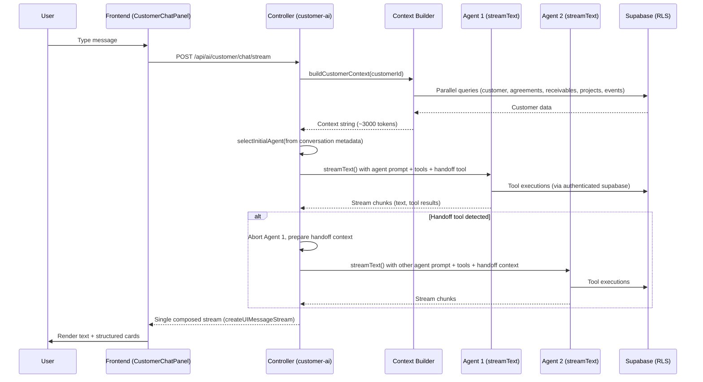

# Customer AI Agents Reference

**Created:** 2026-02-25
**Last Updated:** 2026-02-26
**Version:** 3.0.0
**Status:** Complete

## Overview

The Customer AI system provides two specialized agents for customer management. Agents use **LLM-driven tool-based handoff** — each agent has a `handoff` tool that lets it transfer the conversation to the other agent when the user's request is outside its domain. The controller composes both agents into a single seamless HTTP response stream using Vercel AI SDK v6's `createUIMessageStream`. Both agents receive full customer context (profile, agreements, receivables, projects, recent events, health signals, deliverables) in their system prompt.

## Architecture



### Handoff Mechanism

Each agent has a `handoff` tool. When it determines the user's request is outside its domain, it calls the tool with `{ reason, summary, pendingRequest }`. The controller:

1. Detects `tool-output-available` with `__handoff: true` marker in the stream
2. Aborts the current agent (stops wasted LLM compute)
3. Starts the other agent with handoff context injected into the system prompt
4. Continues writing chunks from the new agent to the same response stream

**Loop prevention:** MAX_HANDOFFS=2 per request. On the final iteration, the handoff tool is removed, forcing the agent to respond.

**Initial agent selection:** Uses the last assistant message's `metadata.agentType` from conversation history. Defaults to `customer_mgmt` for new conversations.

**File:** `backend/src/services/ai/tools/handoffTools.ts`

## Agent 1: Customer Management Agent

**Type identifier:** `customer_mgmt`

**System prompt function:** `getCustomerMgmtSystemPrompt(customerContext: string)`
**File:** `backend/src/services/ai/prompts/customerAgentPrompts.ts`

**Capabilities:**
- Engagement strategy and relationship management
- Negotiation guidance and pricing recommendations
- Status management (changing customer lifecycle status)
- Communication drafting (emails, follow-ups, proposals)
- Account health assessment (proactively surfaces health signals: expiring agreements, overdue invoices, inactivity)
- Stakeholder mapping and team dynamics
- After providing advice, suggests ONE relevant follow-up action (e.g., "Want me to draft a follow-up email?")

### Tools (4)

#### updateCustomerStatus

Change a customer's lifecycle status and auto-log the transition.

```typescript
{
  parameters: z.object({
    customerId: z.string().uuid(),
    newStatus: z.enum(['lead', 'prospect', 'active', 'paused', 'churned', 'archived']),
    reason: z.string().describe('Reason for status change'),
  }),
  // Side effects:
  // 1. UPDATE customers SET status = newStatus WHERE id = customerId
  // 2. INSERT customer_events (type: 'status_change', description: old -> new + reason)
}
```

**Frontend card:** `StatusChangeCard` (green border, ArrowRightLeft icon)

#### updateCustomerInfo

Atomic JSONB merge into the customer's `info` column using the `merge_customer_info` RPC.

```typescript
{
  parameters: z.object({
    customerId: z.string().uuid(),
    info: z.record(z.unknown()).describe('Key-value pairs to merge into customer info'),
  }),
  // Uses: supabase.rpc('merge_customer_info', { cid, new_info })
  // Atomic: COALESCE(info, '{}'::jsonb) || new_info
}
```

#### createEventLogEntry

Log an interaction or note to the customer's event timeline.

```typescript
{
  parameters: z.object({
    customerId: z.string().uuid(),
    eventType: z.enum(['note', 'meeting', 'email', 'call', 'task', 'milestone']),
    description: z.string(),
  }),
  // INSERT into customer_events
}
```

#### getCustomerSummary

Re-fetch full customer context mid-conversation (for long conversations where data may have changed).

```typescript
{
  parameters: z.object({
    customerId: z.string().uuid(),
  }),
  // Returns: full customer context string (same format as system prompt context)
}
```

---

## Agent 2: Product Management Agent

**Type identifier:** `product_mgmt`

**System prompt function:** `getProductMgmtSystemPrompt(customerContext: string)`
**File:** `backend/src/services/ai/prompts/productAgentPrompts.ts`

**Capabilities:**
- Product strategy creation (Playing to Win, April Dunford positioning)
- Roadmap development and feature prioritization
- User research synthesis (interview guides, personas, JTBD)
- Competitive analysis (competitor mapping, feature comparison)
- Product specs (PRDs, feature specs, technical requirements)
- Prioritization frameworks (RICE scoring, opportunity sizing)
- Success measurement (KPIs, AARRR metrics, dashboards)
- Ideation facilitation and brainstorming
- Launch planning (GTM strategy, rollout plans)
- References existing deliverables when creating new artifacts (avoids duplication)
- Assesses product maturity based on artifact count and diversity
- After creating or discussing artifacts, suggests ONE relevant next step

### Tools (5)

#### createProject

Create a new project for the customer.

```typescript
{
  parameters: z.object({
    customerId: z.string().uuid(),
    name: z.string(),
    description: z.string().optional(),
    status: z.enum(['planning', 'active', 'on_hold', 'completed']).default('planning'),
  }),
  // INSERT into customer_projects
}
```

**Frontend card:** `ProjectCreatedCard` (amber border, FolderPlus icon)

#### createArtifact

Create a new artifact (document) with full Markdown content within a project.

```typescript
{
  parameters: z.object({
    projectId: z.string().uuid(),
    title: z.string(),
    type: z.enum(['strategy', 'research', 'roadmap', 'spec', 'analysis', 'report', 'other']),
    content: z.string().describe('Full Markdown content'),
    status: z.enum(['draft', 'review', 'final']).default('draft'),
  }),
  // Side effects:
  // 1. INSERT into customer_artifacts
  // 2. INSERT customer_events (type: 'artifact_created')
}
```

**Frontend card:** `ArtifactCreatedCard` (purple border, FileText icon)

#### updateArtifact

Update an existing artifact's content, title, or status.

```typescript
{
  parameters: z.object({
    artifactId: z.string().uuid(),
    content: z.string().optional(),
    title: z.string().optional(),
    status: z.enum(['draft', 'review', 'final']).optional(),
  }),
  // UPDATE customer_artifacts WHERE id = artifactId
  // RLS enforced via is_customer_owner(customer_id)
}
```

#### listProjects

List all projects for a customer.

```typescript
{
  parameters: z.object({
    customerId: z.string().uuid(),
  }),
  // SELECT from customer_projects WHERE customer_id = customerId
}
```

#### listArtifacts

List artifacts in a project or across all customer projects.

```typescript
{
  parameters: z.object({
    projectId: z.string().uuid().optional(),
    customerId: z.string().uuid().optional(),
  }),
  // SELECT from customer_artifacts, optionally filtered by project_id
}
```

---

## Agent Routing (Handoff-Based)

**Previous approach (removed):** Keyword-based router (`CustomerAgentRouter.ts`) using static keyword lists. Replaced in v3.0.0.

**Current approach:** LLM-driven handoff via tool. Each agent decides when to transfer based on the user's request and its available tools.

### How Routing Works

1. **Initial agent** selected from last assistant message's `metadata.agentType` (default: `customer_mgmt`)
2. Agent processes the message with its domain tools + the `handoff` tool
3. If the agent calls `handoff`, the controller switches to the other agent mid-stream
4. The receiving agent gets handoff context (reason, summary, pending request) in its system prompt

### Handoff Tool

**File:** `backend/src/services/ai/tools/handoffTools.ts`

```typescript
createHandoffTool(currentAgent: AgentType, previousAgent?: AgentType)
// Returns: { handoff: tool({ inputSchema: { reason, summary, pendingRequest } }) }
// Output: { __handoff: true, targetAgent, reason, summary, pendingRequest }
```

### When Agents Hand Off

**Customer Management Agent hands off when:**
- User asks to create artifacts, strategies, roadmaps, PRDs
- User needs project/artifact management tools

**Product Management Agent hands off when:**
- User asks to update customer status, log events, manage agreements
- User needs customer relationship/financial tools

### Loop Prevention

| Layer | Mechanism |
|-------|-----------|
| Hard limit | MAX_HANDOFFS = 2 per request |
| Tool removal | Handoff tool excluded on final iteration |
| Prompt warning | Ping-pong detection via `previousAgent` parameter |

## Customer Context Builder

**File:** `backend/src/services/ai/prompts/customerContextBuilder.ts`

**Export:** `buildCustomerContext(customerId: string, supabase: SupabaseClient): Promise<string>`

### Data Fetching

Parallel queries via `Promise.all`:
1. Customer record from `customers`
2. Agreements from `customer_agreements` (ordered by created_at DESC)
3. Receivables from `customer_receivables` (type, amount, status)
4. Projects from `customer_projects` (id, name, status, description, agreement_id)
5. Events from `customer_events` (ordered by event_date DESC, limit 10)
6. Artifacts from `customer_artifacts` (title, type, status — limit 10)

### Health Signals

`computeHealthSignals()` analyzes customer data and returns warning strings:
- **Expiring agreements**: Agreements with `end_date` within 30 days (not terminated/suspended)
- **Overdue invoices**: Receivables with `type = 'invoice'` and `status = 'overdue'` (with total amount)
- **Inactivity**: No events in the last 14 days (reports days since last activity)

### Token Budget

Target: ~3000 tokens (estimated via `Math.ceil(text.length / 4)`)

Progressive truncation (3 rounds):
1. Truncate events to 3
2. Truncate projects to 5, artifacts to 5
3. Truncate agreements to 3

### Output Format

```
## Current Customer Context

**Customer**: Acme Corp
**Status**: live
**Vertical**: SaaS
**Persona**: CTO
**ICP**: Mid-market B2B SaaS...

**About**: Enterprise SaaS company...
**Product**: Project management tool...

**Team**:
- Alice (CTO)
- Bob (VP Engineering)

**Agreements** (2):
- Monthly retainer | retainer | 2026-01 - 2026-06 | $5,000 USD monthly

**Financial Summary**:
- Total Invoiced: $15,000.00
- Total Paid: $10,000.00
- Outstanding: $5,000.00

**Health Signals**:
- ⚠️ 1 agreement(s) expiring within 30 days
- ⚠️ No activity in 21 days

**Active Projects** (1):
- Product Strategy (active) - Strategic planning for Q1

**Deliverables** (3 total):
- Go-to-Market Plan (strategy, draft)
- User Research Report (research, final)

**Recent Events** (last 3):
- [2026-02-20] status_change: Changed to live
- [2026-02-15] meeting: Kickoff Call
```

## Related Documentation

- [Customer AI Chat Feature](../features/customer-ai-chat.md) - Full feature documentation
- [Customer AI Endpoints](../api/customer-ai-endpoints.md) - API endpoint reference
- [Content Agent Overview](./content-agent-overview.md) - Portfolio AI agent (similar architecture)
- [Core Tools Reference](./core-tools-reference.md) - Portfolio content tools
- [Database Schema](../Architecture/database/database-schema-reference.md) - `merge_customer_info` function
