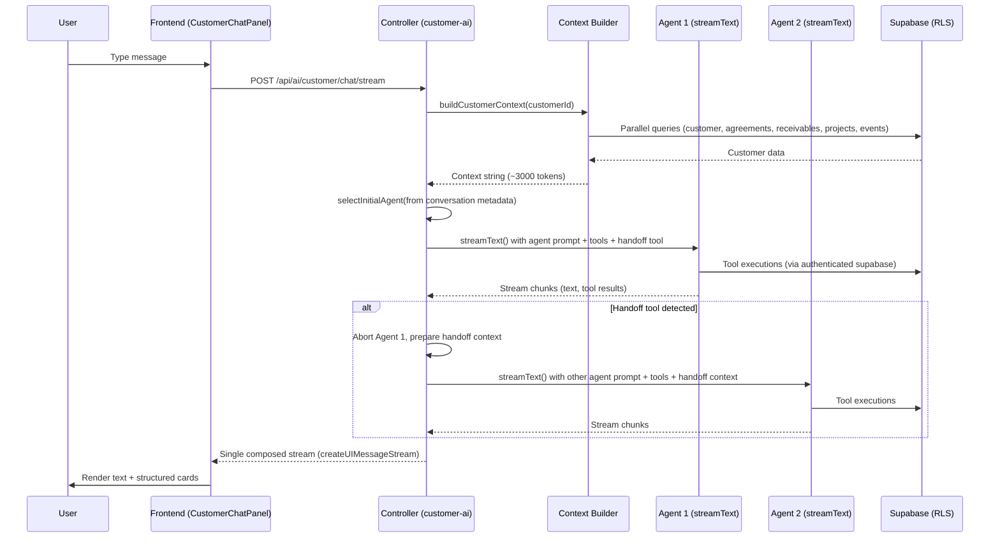

# Customer AI Agents Reference

**Created:** 2026-02-25
**Last Updated:** 2026-03-09
**Version:** 7.1.0
**Status:** Complete (Initiative/Document Rename + Anti-Duplication + Step Budget + Interaction Logging + Initiative Inference + Meeting Notes Analysis + Analytical Integrity)

---

## Table of Contents

1. [Overview](#overview)
2. [File Organization](#file-organization)
3. [Architecture](#architecture)
4. [Agent 1: Customer Management Agent](#agent-1-customer-management-agent)
5. [Agent 2: Product Management Agent](#agent-2-product-management-agent)
6. [Agent Routing (Handoff-Based)](#agent-routing-handoff-based)
7. [Customer Context Builder](#customer-context-builder)
8. [Related Documentation](#related-documentation)

---

## Overview

The Customer AI system provides two specialized agents for customer management. Agents use **LLM-driven tool-based handoff** — each agent has a `handoff` tool that lets it transfer the conversation to the other agent when the user's request is outside its domain. The controller composes both agents into a single seamless HTTP response stream using Vercel AI SDK v6's `createUIMessageStream`. Both agents receive full customer context (profile, agreements, receivables, projects, recent events, health signals, deliverables) in their system prompt.

The Product Management Agent includes 22 tools total: 5 CRUD tools for initiative and document management, and 17 capability tools that encode complete PM framework methodologies and create documents directly in `customer_documents`. Both agents include an `analyzeMeetingNotes` tool with agent-specific analysis flavoring (relationship-focused for CM, product-focused for PM).

---

## File Organization

All AI agent files are organized into agent-specific folders under `backend/src/services/ai/agents/`:

```
backend/src/services/ai/agents/
├── customer-mgmt/
│   ├── prompt/
│   │   └── customerAgentPrompts.ts
│   └── tools/
│       ├── customerMgmtTools.ts     (4 tools)
│       ├── actionItemTools.ts       (3 tools)
│       └── analyzeMeetingNotesTool.ts (1 tool)
├── product-mgmt/
│   ├── prompt/
│   │   └── productAgentPrompts.ts
│   └── tools/
│       ├── productMgmtTools.ts      (5 CRUD tools)
│       ├── documentHelpers.ts       (shared createDocumentWithEvent helper)
│       ├── createProductStrategyTool.ts
│       ├── evaluateBuildStrategyTool.ts
│       ├── applyDecisionFrameworkTool.ts
│       ├── assessShipReadinessTool.ts
│       ├── analyzeCompetitionTool.ts
│       ├── scopeMvpTool.ts
│       ├── buildPersonaIcpTool.ts
│       ├── planUserResearchTool.ts
│       ├── analyzeProductDataTool.ts
│       ├── designUserFlowTool.ts
│       ├── designUxUiTool.ts
│       ├── designAiFeatureTool.ts
│       ├── createGrowthStrategyTool.ts
│       ├── createLaunchPlanTool.ts
│       ├── createNarrativeTool.ts
│       ├── prioritizeItemsTool.ts
│       └── analyzeMeetingNotesTool.ts
└── shared/
    ├── handoffTools.ts
    ├── customerContextBuilder.ts
    └── meetingNotesSchema.ts
```

---

## Architecture


```mermaid
sequenceDiagram
    participant U as User
    participant FE as Frontend (CustomerChatPanel)
    participant C as Controller (customer-ai)
    participant CB as Context Builder
    participant A1 as Agent 1 (streamText)
    participant A2 as Agent 2 (streamText)
    participant DB as Supabase (RLS)

    U->>FE: Type message
    FE->>C: POST /api/ai/customer/chat/stream
    C->>CB: buildCustomerContext(customerId)
    CB->>DB: Parallel queries (customer, agreements, receivables, projects, events)
    DB-->>CB: Customer data
    CB-->>C: Context string (~3000 tokens)
    C->>C: selectInitialAgent(from conversation metadata)
    C->>A1: streamText() with agent prompt + tools + handoff tool
    A1->>DB: Tool executions (via authenticated supabase)
    A1-->>C: Stream chunks (text, tool results)

    alt Handoff tool detected
        C->>C: Abort Agent 1, prepare handoff context
        C->>A2: streamText() with other agent prompt + tools + handoff context
        A2->>DB: Tool executions
        A2-->>C: Stream chunks
    end

    C-->>FE: Single composed stream (createUIMessageStream)
    FE->>U: Render text + structured cards
```

### Handoff Mechanism

Each agent has a `handoff` tool. When it determines the user's request is outside its domain, it calls the tool with `{ reason, summary, pendingRequest }`. The controller:

1. Detects `tool-output-available` with `__handoff: true` marker in the stream
2. Aborts the current agent (stops wasted LLM compute)
3. Starts the other agent with handoff context injected into the system prompt
4. Continues writing chunks from the new agent to the same response stream

**Loop prevention:** MAX_HANDOFFS=2 per request. On the final iteration, the handoff tool is removed, forcing the agent to respond.

**Step budget:** Dual-condition stop with `stopWhen: [stepCountIs(8), toolStepsLimit(4)]`:
- Hard ceiling: never exceed 8 total steps (text + tool steps combined)
- Soft limit: stop after 4 steps that contain tool calls (prevents runaway artifact creation while allowing agent-user conversation)

**Interaction logging:** Every agent action (tool calls, text output, handoffs, finish events) is logged to `agent_interaction_logs` table via fire-and-forget DB inserts. Each request gets a unique `sessionId`. Large content fields are truncated to 2000 chars.

**Initial agent selection:** Uses the last assistant message's `metadata.agentType` from conversation history. Defaults to `customer_mgmt` for new conversations.

**File:** `backend/src/services/ai/agents/shared/handoffTools.ts`

---

## Agent 1: Customer Management Agent

**Type identifier:** `customer_mgmt`

**System prompt function:** `getCustomerMgmtSystemPrompt(customerContext: string)`
**File:** `backend/src/services/ai/agents/customer-mgmt/prompt/customerAgentPrompts.ts`

**Capabilities:**
- Engagement strategy and relationship management
- Negotiation guidance and pricing recommendations
- Status management (changing customer lifecycle status)
- Communication drafting (emails, follow-ups, proposals)
- Account health assessment (proactively surfaces health signals: expiring agreements, overdue invoices, inactivity)
- Stakeholder mapping and team dynamics
- After providing advice, suggests ONE relevant follow-up action (e.g., "Want me to draft a follow-up email?")

### Clarification Gate

Both agents implement a **Clarification Gate** — a structured internal check that runs before executing any action. The gate ensures agents ask for missing critical information instead of filling gaps with unannounced assumptions.

**How it works:**
1. **Identify action type** from the Action Requirements Matrix
2. **Check required info** against user message + customer context already available
3. **Decide:** All info present → execute; missing 1-2 pieces → ask 1 focused question with options; missing 3+ → ask up to 2 prioritized questions
4. **Escape hatch:** If user says "just do it", "use your judgment", "whatever works", "surprise me" → proceed with smart defaults and state assumptions

**Customer Agent Action Requirements Matrix (11 action types):**

| Action | Must Know | Can Infer From Context |
|--------|-----------|----------------------|
| Log event | Event type, what happened | Date (today), participants (from team) |
| Action item: follow_up | What to follow up on | Due date (3 business days), responsible (advisor) |
| Action item: meeting | Purpose of meeting | Duration (30min leads, 60min live), attendees (from team) |
| Action item: proposal | What is being proposed, scope | Pricing basis (from agreements), format (from past) |
| Action item: delivery | What is being delivered | Due date (from agreement), acceptance criteria |
| Action item: review | What is being reviewed, criteria | Timing (end of agreement period) |
| Draft: email | Recipient, purpose | Tone (professional), length (concise) |
| Draft: agenda | Meeting purpose | Duration (from meeting item or stage), attendees, format |
| Draft: follow-up note | What was discussed, next steps | Tone (match relationship stage) |
| Status change | Target status | Reason (from recent events) |
| Update customer info | Which fields, what values | N/A — always confirm |

**Product Agent Artifact-Type Minimums:** The Product Agent has a similar matrix for 18 artifact types (roadmap, strategy, competitive analysis, PRD, etc.) with "Required Information" and "Can Infer From Customer Context" columns.

**Clarification Question Rules (both agents):**
1. Max 1-2 questions per message
2. Offer options, not open blanks
3. Reference customer context
4. Prioritize — ask what most changes the output first
5. Never re-ask what's already in the context
6. Two rounds maximum before acting

**Design document:** `docs/ideation/clarification-before-action/design.md`

### Analytical Integrity Directive

Both agents include an **Analytical Integrity — CRITICAL** section in their system prompts that governs all output quality. This directive was added to prevent exaggeration, inflation, and "pleasing" behavior in agent responses and generated documents.

**System prompt directive (both agents):**
- State facts exactly as they are — "used once" means once, not "extensively"
- Scale conclusions to evidence — one data point is an observation, not a trend
- Never inflate, exaggerate, or add optimistic spin
- When evidence is thin or missing, say so directly (e.g., "Not enough data to assess")
- Never use amplifying language ("validates," "demonstrates strong," "highlights the importance of") unless evidence genuinely supports it
- Omit sections lacking sufficient evidence — shorter and accurate beats longer and padded
- Flag unclear information as needing clarification rather than interpreting charitably

**Tool-level reinforcement:** All 18 content-generation tool descriptions (17 PM capability tools + 1 CM meeting notes tool) include 3 anti-exaggeration lines appended to their `## Guidelines` section:
1. Never exaggerate, inflate, or add optimistic spin. State facts proportionally to the evidence.
2. When evidence is thin or missing, say so explicitly. Do not fill gaps with flattery or speculation.
3. Prefer shorter, accurate output over longer, padded output. Omit sections that lack sufficient evidence.

**Design document:** `docs/plans/2026-03-09-analytical-integrity-design.md`

### Tools (5)

#### updateCustomerStatus

Change a customer's lifecycle status and auto-log the transition.

```typescript
{
  parameters: z.object({
    customerId: z.string().uuid(),
    newStatus: z.enum(['lead', 'prospect', 'active', 'paused', 'churned', 'archived']),
    reason: z.string().describe('Reason for status change'),
  }),
  // Side effects:
  // 1. UPDATE customers SET status = newStatus WHERE id = customerId
  // 2. INSERT customer_events (type: 'status_change', description: old -> new + reason)
}
```

**Frontend card:** `StatusChangeCard` (green border, ArrowRightLeft icon)

#### updateCustomerInfo

Atomic JSONB merge into the customer's `info` column using the `merge_customer_info` RPC.

```typescript
{
  parameters: z.object({
    customerId: z.string().uuid(),
    info: z.record(z.unknown()).describe('Key-value pairs to merge into customer info'),
  }),
  // Uses: supabase.rpc('merge_customer_info', { cid, new_info })
  // Atomic: COALESCE(info, '{}'::jsonb) || new_info
}
```

#### createEventLogEntry

Log an interaction or note to the customer's event timeline.

```typescript
{
  parameters: z.object({
    customerId: z.string().uuid(),
    eventType: z.enum(['note', 'meeting', 'email', 'call', 'task', 'milestone']),
    description: z.string(),
  }),
  // INSERT into customer_events
}
```

#### getCustomerSummary

Re-fetch full customer context mid-conversation (for long conversations where data may have changed).

```typescript
{
  parameters: z.object({
    customerId: z.string().uuid(),
  }),
  // Returns: full customer context string (same format as system prompt context)
}
```

#### analyzeMeetingNotes

Analyze meeting notes and extract relationship insights, engagement signals, action items, risks, and next steps. Use when the user provides meeting notes about customer-facing meetings (status, discovery, pricing, kickoff, introduction, account review, demo).

**File:** `backend/src/services/ai/agents/customer-mgmt/tools/analyzeMeetingNotesTool.ts`
**Shared schema:** `backend/src/services/ai/agents/shared/meetingNotesSchema.ts`

```typescript
{
  parameters: z.object({
    initiativeId: z.string().uuid(),
    title: z.string(),
    content: z.string(), // Full Markdown meeting analysis (1500-3000 words)
    meetingType: z.enum(['status', 'discovery', 'sprint_planning', 'roadmap_review',
      'user_interview', 'pricing', 'kickoff', 'retrospective', 'design_review',
      'introduction', 'account_review', 'demo', 'other']),
    attendees: z.array(z.string()).optional(),
    meetingDate: z.string().regex(/^\d{4}-\d{2}-\d{2}$/).optional(),
    actionItemsSummary: z.array(z.object({
      description: z.string(),
      owner: z.string().optional(),
      dueDate: z.string().optional(),
    })).optional(),
  }),
  // Side effects:
  // 1. INSERT into customer_documents (type: 'meeting_notes', status: 'draft')
  //    metadata: { meetingType, agentSource: 'customer_mgmt', attendees?, meetingDate?, actionItemsSummary? }
  // 2. INSERT customer_events (type: 'delivery')
}
```

**Analysis emphasis (CM flavor):**
- Relationship signals and engagement health indicators
- Financial/agreement impact (pricing, scope, renewals discussed)
- Stakeholder dynamics (decision-maker signals, who drove the meeting)
- Status change triggers (should customer lifecycle status change?)

**Follow-up actions (always offered after analysis):**
1. "Would you like me to draft a follow-up email based on this meeting?"
2. "I identified [N] action items. Want me to create them as tracked action items?" — uses `createActionItem` tool

---

## Agent 2: Product Management Agent

**Type identifier:** `product_mgmt`

**System prompt function:** `getProductMgmtSystemPrompt(customerContext: string)`
**File:** `backend/src/services/ai/agents/product-mgmt/prompt/productAgentPrompts.ts`

**Capabilities:**
- Product strategy creation (Playing to Win, April Dunford positioning)
- Roadmap development and feature prioritization
- User research synthesis (interview guides, personas, JTBD)
- Competitive analysis (competitor mapping, feature comparison) — `analyzeCompetition` tool focuses on **competitive positioning**; general market research uses `createArtifact (type: custom)`
- Product specs (PRDs, feature specs, technical requirements)
- Prioritization frameworks (RICE scoring, opportunity sizing)
- Success measurement (KPIs, AARRR metrics, dashboards)
- Ideation facilitation and brainstorming
- Launch planning (GTM strategy, rollout plans)
- References existing deliverables when creating new artifacts (avoids duplication)
- **Anti-duplication rule:** Never creates a second artifact to improve/replace one just created — uses `updateArtifact` instead
- **Initiative inference:** If the user mentions a specific initiative or conversation context makes the target initiative clear, defaults to saving documents in that initiative. Only asks which initiative if context is ambiguous.
- Assesses product maturity based on artifact count and diversity
- After creating or discussing artifacts, suggests ONE relevant next step

### CRUD Tools (5)

**File:** `backend/src/services/ai/agents/product-mgmt/tools/productMgmtTools.ts`

#### createInitiative

Create a new initiative for the customer.

```typescript
{
  parameters: z.object({
    name: z.string(),
    description: z.string().optional(),
    agreementId: z.string().uuid().optional(),
  }),
  // INSERT into customer_initiatives (customerId bound via closure)
}
```

**Frontend card:** `InitiativeCreatedCard` (amber border, FolderPlus icon)

#### createDocument

Create a document with full Markdown content within an initiative. For types without a specialized tool (roadmaps, product specs, meeting notes, presentations, ideation, custom).

```typescript
{
  parameters: z.object({
    initiativeId: z.string().uuid(),
    type: z.enum(['roadmap', 'product_spec', 'meeting_notes', 'presentation', 'ideation', 'custom']),
    title: z.string(),
    content: z.string().describe('Full Markdown content'),
  }),
  // Side effects:
  // 1. INSERT into customer_documents (status: 'draft')
  // 2. INSERT customer_events (type: 'delivery')
}
```

**Frontend card:** `DocumentCreatedCard` (purple border, FileText icon)

#### updateDocument

Update an existing document's content, title, or status.

```typescript
{
  parameters: z.object({
    documentId: z.string().uuid(),
    content: z.string().optional(),
    title: z.string().optional(),
    status: z.enum(['draft', 'in_progress', 'review', 'final', 'archived']).optional(),
  }),
  // UPDATE customer_documents WHERE id = documentId
  // RLS enforced via is_customer_owner(customer_id)
}
```

#### listInitiatives

List all initiatives for a customer.

```typescript
{
  parameters: z.object({}),
  // SELECT from customer_initiatives WHERE customer_id = customerId (bound via closure)
}
```

#### listDocuments

List documents in an initiative or all documents for the customer.

```typescript
{
  parameters: z.object({
    initiativeId: z.string().uuid().optional(),
  }),
  // SELECT from customer_documents, optionally filtered by initiative_id
}
```

---

### Capability Tools (17)

All 17 capability tools follow the same pattern:

- **Location:** `backend/src/services/ai/agents/product-mgmt/tools/[toolName]Tool.ts`
- **Shared helper:** `backend/src/services/ai/agents/product-mgmt/tools/documentHelpers.ts`
- **Base parameters:** `initiativeId` (UUID), `title` (string), `content` (string — full Markdown document)
- **Side effects:** Calls `createDocumentWithEvent` which inserts to `customer_documents` and auto-logs a `delivery` event to `customer_events`
- **Default status:** All documents are created with `status: 'draft'`
- **Tool descriptions:** Each tool encodes the full PM framework methodology as its LLM-facing description

#### Summary Table

| Tool | Artifact Type | Extra Fields | Key Frameworks |
|------|--------------|--------------|----------------|
| `createProductStrategy` | `strategy` | `strategicHorizon?: 'now'\|'next'\|'later'` | Playing to Win, Crossing the Chasm |
| `evaluateBuildStrategy` | `build_analysis` | — | LNO framework, pre-mortem, reversibility |
| `applyDecisionFramework` | `decision_analysis` | `decisionStatement?: string` | Expected Value, Regret Minimization, Pre-Mortem |
| `assessShipReadiness` | `ship_decision` | — | Shipping Scorecard, reversibility assessment |
| `analyzeCompetition` | `competitive_analysis` | `competitors: string[]`, `focusAreas?: string[]` | SWOT, Porter's Five Forces, feature comparison. **Competitive Market Intelligence only** — for general market research, use `createArtifact (type: custom)` |
| `scopeMvp` | `mvp_scope` | — | Simplicity forcing, experience mapping |
| `buildPersonaIcp` | `persona_icp` | `analysisScope?: 'icp'\|'personas'\|'full'` | ICP scoring, JTBD, buying committee mapping |
| `planUserResearch` | `user_research` | `researchObjective?: string` | JTBD interviews, thematic analysis, empathy mapping |
| `analyzeProductData` | `data_analysis` | `analysisType?: string` | Funnel analysis, AARRR, cohort analysis |
| `designUserFlow` | `user_flow` | `flowType?: 'user_flow'\|'journey_map'\|'service_blueprint'` | Journey maps, service blueprints, state diagrams |
| `designUxUi` | `ux_design` | `designScope?: string` | Wireframes, interaction specs, WCAG accessibility |
| `designAiFeature` | `ai_feature_spec` | — | Eval-driven development, hybrid architecture patterns |
| `createGrowthStrategy` | `growth_strategy` | — | Retention-first development, growth loops, network effects |
| `createLaunchPlan` | `launch_plan` | `launchTier?: 'major'\|'medium'\|'minor'` | April Dunford positioning, launch tiers |
| `createNarrative` | `narrative` | `audience?: string` | Five-act structure, WHAT→SO WHAT→NOW WHAT |
| `prioritizeItems` | `prioritization` | `framework?: 'rice'\|'ice'\|'moscow'\|'opportunity'\|'value_effort'` | RICE, ICE, MoSCoW, value vs effort |
| `analyzeMeetingNotes` | `meeting_notes` | `meetingType`, `attendees?`, `meetingDate?`, `actionItemsSummary?` | Product-focused analysis: product implications, technical decisions, roadmap impact |

#### createProductStrategy

Creates product strategy artifacts using the Playing to Win cascade (Lafley/Martin), Crossing the Chasm (Geoffrey Moore), and positioning frameworks. Produces complete strategy documents including winning aspiration, where-to-play analysis, how-to-win decisions, capability maps, and horizon-based roadmaps.

```typescript
inputSchema: z.object({
  initiativeId: z.string().uuid(),
  title: z.string(),
  content: z.string(), // Full Markdown strategy content. Aim for 1500-3000 words.
  strategicHorizon: z.enum(['now', 'next', 'later']).optional(),
})
// now = 0-6 months, next = 6-18 months, later = 18+ months
```

#### evaluateBuildStrategy

Analyzes build/buy/partner decisions using the LNO (Leverage, Neutral, Overhead) framework, pre-mortem analysis, and reversibility assessment. Produces structured build analysis documents with trade-off matrices.

```typescript
inputSchema: z.object({
  initiativeId: z.string().uuid(),
  title: z.string(),
  content: z.string(), // Full Markdown build evaluation content. Aim for 1500-3000 words.
})
```

#### applyDecisionFramework

Applies structured decision frameworks (Expected Value, Regret Minimization, Weighted Matrix) to complex or high-stakes product decisions. Produces a decision analysis document including probability estimates, reversibility assessment, pre-mortem, and a decision record.

```typescript
inputSchema: z.object({
  initiativeId: z.string().uuid(),
  title: z.string(),
  content: z.string(), // Full Markdown decision analysis content. Aim for 1000-2000 words.
  decisionStatement: z.string().optional(),
})
```

#### assessShipReadiness

Evaluates whether a feature or product is ready to ship using a Shipping Scorecard and reversibility assessment. Produces a ship/hold recommendation with risk analysis and rollout strategy guidance.

```typescript
inputSchema: z.object({
  initiativeId: z.string().uuid(),
  title: z.string(),
  content: z.string(), // Full Markdown ship readiness assessment. Aim for 1000-2000 words.
})
```

#### analyzeCompetition

Competitive analysis using SWOT, competitor mapping, and feature comparison. Supports single competitor, segment, and full market scope. Includes market segment validation (pre-signature vs. post-sale) before producing deliverables such as landscape overviews, competitor profiles, and battle cards. **Note:** This tool focuses on **Competitive Market Intelligence** — market sizing, trends, and dynamics as they relate to the competitive landscape. For general market research (customer needs, TAM/SAM/SOM, industry opportunities, regulatory landscape), the agent uses `createArtifact (type: custom)` instead.

```typescript
inputSchema: z.object({
  initiativeId: z.string().uuid(),
  title: z.string(),
  content: z.string(), // Full Markdown competitive analysis content. Aim for 2000-4000 words.
  competitors: z.array(z.string()), // Required: list of competitors being analyzed
  focusAreas: z.array(z.string()).optional(), // e.g., ['pricing', 'features', 'GTM']
})
```

#### scopeMvp

MVP scoping using simplicity forcing functions and experience mapping. Produces a scoped MVP document with must-have/should-have/won't-have classification and success criteria.

```typescript
inputSchema: z.object({
  initiativeId: z.string().uuid(),
  title: z.string(),
  content: z.string(), // Full Markdown MVP scope document. Aim for 1500-3000 words.
})
```

#### buildPersonaIcp

Ideal Customer Profile (ICP) scoring, Jobs-to-be-Done analysis, and buying committee mapping. Produces persona documents with demographic, psychographic, and behavioral profiles aligned to the customer's market segment.

```typescript
inputSchema: z.object({
  initiativeId: z.string().uuid(),
  title: z.string(),
  content: z.string(), // Full Markdown persona/ICP analysis content. Aim for 1500-3000 words.
  analysisScope: z.enum(['icp', 'personas', 'full']).optional(),
})
```

#### planUserResearch

User research planning with JTBD interview guides, thematic analysis frameworks, and empathy mapping. Produces research plans, interview guides, and synthesis templates.

```typescript
inputSchema: z.object({
  initiativeId: z.string().uuid(),
  title: z.string(),
  content: z.string(), // Full Markdown user research content. Aim for 1500-3000 words.
  researchObjective: z.string().optional(),
})
```

#### analyzeProductData

Product data analysis using funnel analysis, AARRR framework, and cohort analysis. Produces analysis documents with findings, interpretations, and recommended actions based on product metrics.

```typescript
inputSchema: z.object({
  initiativeId: z.string().uuid(),
  title: z.string(),
  content: z.string(), // Full Markdown data analysis content. Aim for 1500-3000 words.
  analysisType: z.string().optional(), // e.g., 'funnel', 'cohort', 'AARRR', 'North Star'
})
```

#### designUserFlow

User flow design with journey maps, service blueprints, and state diagrams. Produces visual flow documentation with friction point identification and optimization recommendations.

```typescript
inputSchema: z.object({
  initiativeId: z.string().uuid(),
  title: z.string(),
  content: z.string(), // Full Markdown user flow/journey content. Aim for 1500-3000 words.
  flowType: z.enum(['user_flow', 'journey_map', 'service_blueprint']).optional(),
})
```

#### designUxUi

UX/UI specifications with wireframe descriptions, interaction specs, and WCAG accessibility guidelines. Produces design specifications ready for designer or developer handoff.

```typescript
inputSchema: z.object({
  initiativeId: z.string().uuid(),
  title: z.string(),
  content: z.string(), // Full Markdown UX/UI spec content. Aim for 1500-3000 words.
  designScope: z.string().optional(), // e.g., 'onboarding flow', 'dashboard component'
})
```

#### designAiFeature

AI feature specifications using eval-driven development methodology and hybrid architecture patterns. Produces AI feature specs that cover model selection, evaluation criteria, prompt engineering, and edge cases.

```typescript
inputSchema: z.object({
  initiativeId: z.string().uuid(),
  title: z.string(),
  content: z.string(), // Full Markdown AI feature spec content. Aim for 1500-3000 words.
})
```

#### createGrowthStrategy

Growth strategy using retention-first development methodology, growth loops design, and network effects analysis. Produces growth strategy documents with acquisition, activation, retention, and referral frameworks.

```typescript
inputSchema: z.object({
  initiativeId: z.string().uuid(),
  title: z.string(),
  content: z.string(), // Full Markdown growth strategy content. Aim for 1500-3000 words.
})
```

#### createLaunchPlan

Launch planning with April Dunford positioning framework and tiered launch planning. Tier selection controls scope: major launches include full GTM coordination, medium launches focus on targeted channels, minor launches produce release notes.

```typescript
inputSchema: z.object({
  initiativeId: z.string().uuid(),
  title: z.string(),
  content: z.string(), // Full Markdown launch plan content. Aim for 1500-3000 words.
  launchTier: z.enum(['major', 'medium', 'minor']).optional(),
})
```

#### createNarrative

Strategic storytelling using Andy Raskin's five-act narrative structure and the WHAT→SO WHAT→NOW WHAT communication framework. Produces pitches, investor narratives, internal alignment stories, and product announcements tailored to the specified audience.

```typescript
inputSchema: z.object({
  initiativeId: z.string().uuid(),
  title: z.string(),
  content: z.string(), // Full Markdown narrative content. Aim for 1000-2500 words.
  audience: z.string().optional(), // e.g., 'board', 'team', 'investors', 'customers'
})
```

#### prioritizeItems

Prioritization using RICE, ICE, MoSCoW, opportunity scoring, and value vs. effort frameworks. Produces ranked priority lists with scoring matrices, rationale documentation, and recommendation tiers (immediate, near-term, backlog).

```typescript
inputSchema: z.object({
  initiativeId: z.string().uuid(),
  title: z.string(),
  content: z.string(), // Full Markdown prioritization analysis content. Aim for 1500-3000 words.
  framework: z.enum(['rice', 'ice', 'moscow', 'opportunity', 'value_effort']).optional(),
})
```

#### analyzeMeetingNotes (Product Mgmt)

Analyze meeting notes and extract product insights, technical decisions, action items, risks, and roadmap impact. Use when the user provides meeting notes about product-focused meetings (sprint planning, roadmap reviews, design reviews, user interviews, retrospectives, feature demos, technical discussions).

**File:** `backend/src/services/ai/agents/product-mgmt/tools/analyzeMeetingNotesTool.ts`
**Shared schema:** `backend/src/services/ai/agents/shared/meetingNotesSchema.ts`

```typescript
{
  parameters: z.object({
    initiativeId: z.string().uuid(),
    title: z.string(),
    content: z.string(), // Full Markdown meeting analysis (1500-3000 words)
    meetingType: z.enum(['status', 'discovery', 'sprint_planning', 'roadmap_review',
      'user_interview', 'pricing', 'kickoff', 'retrospective', 'design_review',
      'introduction', 'account_review', 'demo', 'other']),
    attendees: z.array(z.string()).optional(),
    meetingDate: z.string().regex(/^\d{4}-\d{2}-\d{2}$/).optional(),
    actionItemsSummary: z.array(z.object({
      description: z.string(),
      owner: z.string().optional(),
      dueDate: z.string().optional(),
    })).optional(),
  }),
  // Side effects:
  // 1. INSERT into customer_documents (type: 'meeting_notes', status: 'draft')
  //    metadata: { meetingType, agentSource: 'product_mgmt', attendees?, meetingDate?, actionItemsSummary? }
  // 2. INSERT customer_events (type: 'delivery')
}
```

**Analysis emphasis (PM flavor):**
- Product implications (features, bugs, requirements discussed)
- Technical decisions (architecture, build-vs-buy, tech debt)
- User/market signals (needs, pain points, workflows revealed)
- Roadmap impact (priority or timeline changes)
- Design/UX feedback

**Follow-up actions (always offered after analysis):**
1. "Would you like me to draft a follow-up email based on this meeting?"
2. "I identified [N] action items. Want me to create them as tracked action items?" — handoff to Customer Management Agent for `createActionItem`

---

## Agent Routing (Handoff-Based)

**Previous approach (removed):** Keyword-based router (`CustomerAgentRouter.ts`) using static keyword lists. Replaced in v3.0.0.

**Current approach:** LLM-driven handoff via tool. Each agent decides when to transfer based on the user's request and its available tools.

### How Routing Works

1. **Initial agent** selected from last assistant message's `metadata.agentType` (default: `customer_mgmt`)
2. Agent processes the message with its domain tools + the `handoff` tool
3. If the agent calls `handoff`, the controller switches to the other agent mid-stream
4. The receiving agent gets handoff context (reason, summary, pending request) in its system prompt

### Handoff Tool

**File:** `backend/src/services/ai/agents/shared/handoffTools.ts`

```typescript
createHandoffTool(currentAgent: AgentType, previousAgent?: AgentType)
// Returns: { handoff: tool({ inputSchema: { reason, summary, pendingRequest } }) }
// Output: { __handoff: true, targetAgent, reason, summary, pendingRequest }
```

### When Agents Hand Off

**Customer Management Agent hands off when:**
- User asks to create artifacts, strategies, roadmaps, PRDs
- User needs project/artifact management tools
- User provides meeting notes primarily about product development, sprint planning, design reviews, or technical decisions

**Product Management Agent hands off when:**
- User asks to update customer status, log events, manage agreements
- User needs customer relationship/financial tools
- User provides meeting notes primarily about customer engagement, pricing, status, or account management

### Loop Prevention

| Layer | Mechanism |
|-------|-----------|
| Hard limit | MAX_HANDOFFS = 2 per request |
| Tool removal | Handoff tool excluded on final iteration |
| Prompt warning | Ping-pong detection via `previousAgent` parameter |

---

## Customer Context Builder

**File:** `backend/src/services/ai/agents/shared/customerContextBuilder.ts`

**Export:** `buildCustomerContext(customerId: string, supabase: SupabaseClient): Promise<string>`

### Data Fetching

Parallel queries via `Promise.all`:
1. Customer record from `customers`
2. Agreements from `customer_agreements` (ordered by created_at DESC)
3. Receivables from `customer_receivables` (type, amount, status)
4. Initiatives from `customer_initiatives` (id, name, status, description, agreement_id)
5. Events from `customer_events` (ordered by event_date DESC, limit 10)
6. Documents from `customer_documents` (title, type, status — limit 10)
7. Action Items from `customer_action_items` (id, type, description, due_date, status — pending only, limit 10)

### Health Signals

`computeHealthSignals()` analyzes customer data and returns warning strings:
- **Expiring agreements**: Agreements with `end_date` within 30 days (not terminated/suspended)
- **Overdue invoices**: Receivables with `type = 'invoice'` and `status = 'overdue'` (with total amount)
- **Inactivity**: No events in the last 14 days (reports days since last activity)

### Token Budget

Target: ~3000 tokens (estimated via `Math.ceil(text.length / 4)`)

Progressive truncation (3 rounds):
1. Truncate events to 3
2. Truncate initiatives to 5, documents to 5, action items to 5
3. Truncate agreements to 3, action items to 3

### Output Format

```
## Current Customer Context

**Customer**: Acme Corp
**Status**: live
**Vertical**: SaaS
**Persona**: CTO
**ICP**: Mid-market B2B SaaS...

**About**: Enterprise SaaS company...
**Product**: Project management tool...

**Team**:
- Alice (CTO)
- Bob (VP Engineering)

**Agreements** (2):
- Monthly retainer | retainer | 2026-01 - 2026-06 | $5,000 USD monthly

**Financial Summary**:
- Total Invoiced: $15,000.00
- Total Paid: $10,000.00
- Outstanding: $5,000.00

**Health Signals**:
- ⚠️ 1 agreement(s) expiring within 30 days
- ⚠️ No activity in 21 days

**Action Items** (2 pending):
- [follow_up] Schedule Q2 planning session (due: 2026-03-15) [todo]

**Active Initiatives** (1):
- Product Strategy (active) - Strategic planning for Q1

**Documents** (3 total):
- Go-to-Market Plan (strategy, draft)
- User Research Report (research, final)

**Recent Events** (last 3):
- [2026-02-20] status_change: Changed to live
- [2026-02-15] meeting: Kickoff Call
```

---

## Related Documentation

- [Customer AI Chat Feature](../features/customer-ai-chat.md) - Full feature documentation
- [Customer AI Endpoints](../api/customer-ai-endpoints.md) - API endpoint reference
- [Content Agent Overview](./content-agent-overview.md) - Portfolio AI agent (similar architecture)
- [Core Tools Reference](./core-tools-reference.md) - Portfolio content tools
- [Database Schema](../Architecture/database/database-schema-reference.md) - `merge_customer_info` function

---

## Version History

**v7.0.0** (2026-03-09)
- Added `analyzeMeetingNotes` tool to both agents with agent-specific analysis flavoring
- Customer Management variant: relationship signals, financial impact, stakeholder dynamics, status change triggers
- Product Management variant: product implications, technical decisions, user/market signals, roadmap impact
- Shared Zod schema (`meetingNotesSchema.ts`) with 13-value meetingType enum and regex-validated meetingDate
- Meeting notes routing via handoff: CM handles customer-facing meetings, PM handles product-focused meetings
- Follow-up actions: email drafting (inline) and action item creation (via existing createActionItem tool)
- Updated tool counts: CM agent 4→5 tools, PM agent 16→17 capability tools (22 total)

**v6.1.0** (2026-03-09)
- Added initiative inference behavior: Product Agent defaults to saving documents in the active initiative from conversation context instead of always asking
- Prompt change: replaced screen context reference with conversation context reference for initiative selection

**v6.0.0** (2026-03-08)
- Renamed all project/artifact references to initiative/document terminology
- CRUD tools: `createProject` → `createInitiative`, `createArtifact` → `createDocument`, `updateArtifact` → `updateDocument`, `listProjects` → `listInitiatives`, `listArtifacts` → `listDocuments`
- Tables: `customer_projects` → `customer_initiatives`, `customer_artifacts` → `customer_documents`
- Columns: `project_id` → `initiative_id` across all tool schemas
- Shared helper: `artifactHelpers.ts` → `documentHelpers.ts`, `createArtifactWithEvent` → `createDocumentWithEvent`
- Context builder: added action items section, updated truncation priorities

**v5.1.0** (2026-03-08)
- Added anti-duplication rule: agents must use `updateArtifact` instead of creating duplicate artifacts
- Clarified `analyzeCompetition` scope: "Competitive Market Intelligence" only; general market research → `createArtifact (type: custom)`
- Added step budget documentation: dual-condition `stopWhen` (8 total steps + 4 tool steps)
- Added interaction logging documentation: `agent_interaction_logs` table with fire-and-forget inserts

**v5.0.0** (2026-03-08)
- Added Clarification Gate section documenting the pre-action information check mechanism
- Customer Agent: 11-row Action Requirements Matrix with Must Know / Can Infer columns
- Product Agent: Enhanced artifact-type minimums with "Can Infer From Customer Context" column
- Shared: escape hatch, 6 clarification question rules, 2-round maximum guardrail
- Design document: `docs/ideation/clarification-before-action/design.md`

**v4.0.0** (2026-02-28)
- Reorganized all AI service files into agent-specific folder structure under `agents/`
- Added File Organization section with directory tree
- Updated all file path references to new locations
- Added 16 capability tools to Product Management Agent (total: 21 tools)
- Added Capability Tools summary table with artifact types, extra fields, and key frameworks
- Added individual descriptions and TypeScript input schemas for all 16 capability tools
- Updated Overview to reflect 21 total Product Management tools

**v3.0.0** (2026-02-26)
- Replaced keyword-based router with LLM-driven handoff mechanism
- Removed `CustomerAgentRouter.ts`
- Added handoff loop prevention (MAX_HANDOFFS=2)
- Documented `createUIMessageStream` composition pattern

**v2.0.0** (2026-02-25)
- Initial documentation of two-agent system
- Customer Management Agent (4 tools)
- Product Management Agent (5 CRUD tools)
- Customer Context Builder with health signals
