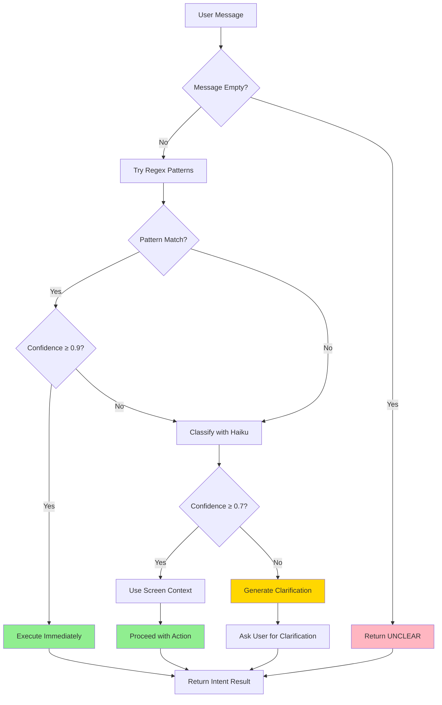

# Intent Detection Guide

**Version:** 2.0.0
**Last Updated:** 2026-02-25
**Status:** DEPRECATED

> **DEPRECATED (v2.0.0)**: The explicit `intentDetection.ts` utility was deleted as part of the Vercel AI SDK v6 refactor. Intent detection is now handled **implicitly by the LLM via tool-calling** — Claude autonomously decides which tools to invoke based on the user's message, screen context, and conversation history. The information below is retained for historical reference only.

## Overview (Historical)

The Content Agent previously used a **hybrid intent detection system** that combined fast regex pattern matching with AI-powered classification to accurately understand user requests. This approach has been superseded by LLM-native tool-calling, which is more flexible and requires no maintenance of regex patterns.

### Why Hybrid Approach?

**Problem with Single-Method Detection:**
- **Regex Only**: Fast but brittle, misses natural language variations
- **AI Only**: Accurate but slow and expensive for every message
- **No Confidence Scores**: Can't distinguish clear vs ambiguous requests

**Hybrid Solution Benefits:**
1. **Speed**: Regex catches 70-80% of clear intents instantly (no API call)
2. **Accuracy**: AI handles ambiguous cases with context awareness
3. **Cost Efficiency**: Only use AI when regex fails (20-30% of cases)
4. **Confidence-Based Routing**: Ask for clarification only when confidence < 0.7

---

## Intent Categories

The Content Agent recognizes **9 user intent categories** for content creation workflows:

| Intent | Description | Example User Messages |
|--------|-------------|----------------------|
| **GENERATE_TOPICS** | User wants topic ideas or suggestions | "Give me 5 blog post ideas", "What should I write about?" |
| **RESEARCH_TOPIC** | User wants to research a specific topic | "Research AI in healthcare", "Gather sources about blockchain" |
| **CREATE_SKELETON** | User wants to create content outline/structure | "Create a skeleton", "Generate an outline for this topic" |
| **WRITE_CONTENT** | User wants to write or expand content | "Write the content", "Expand on this outline" |
| **HUMANIZE_CONTENT** | User wants to make content sound more human | "Humanize this", "Remove AI patterns" |
| **CREATE_VISUALS** | User wants to create images/visuals | "Add images", "Generate visuals for this content" |
| **FULL_PIPELINE** | User wants complete end-to-end content creation | "Create a blog post about X", "Do it all" |
| **STATUS_CHECK** | User wants to know current status/progress | "What's the status?", "Show me progress" |
| **UNCLEAR** | Intent is unclear or conversational | "Hey", "Can you help me?", "Thanks" |

### Intent Priority in Ambiguous Cases

When multiple intents could match, the system prioritizes:
1. **FULL_PIPELINE** - Most comprehensive action
2. **Specific Actions** - RESEARCH_TOPIC, CREATE_SKELETON, WRITE_CONTENT (in workflow order)
3. **STATUS_CHECK** - Information request
4. **UNCLEAR** - Fallback for unclear cases

---

## Confidence Thresholds

The system uses **confidence scores (0.0 - 1.0)** to determine how to respond:

| Threshold | Score | Action | Example Scenarios |
|-----------|-------|--------|------------------|
| **HIGH** | ≥ 0.9 | Execute immediately | Regex pattern match: "research this topic" |
| **MEDIUM** | ≥ 0.7 | Proceed with caution | Strong AI signal: "Can you look into AI ethics?" |
| **LOW** | ≥ 0.5 | Ask for clarification | Weak signal: "Help me with content" |
| **UNCLEAR** | < 0.5 | Must clarify | No clear intent: "What do you think?" |

### Confidence Threshold Constants

```typescript
export const CONFIDENCE_THRESHOLD = {
  HIGH: 0.9,      // Execute immediately - regex match
  MEDIUM: 0.7,    // Proceed with caution - strong AI signal
  LOW: 0.5,       // Ask for clarification - weak signal
  UNCLEAR: 0.0    // Must clarify - no clear intent
} as const;
```

### Clarification Logic

```typescript
// Clarification needed when confidence < MEDIUM (0.7)
if (confidence < CONFIDENCE_THRESHOLD.MEDIUM) {
  return {
    clarificationNeeded: true,
    suggestedClarification: generateClarificationQuestion(intent, context)
  };
}
```

---

## Detection Flow



### Detection Flow Steps

1. **Validate Input**: Check if message is non-empty
2. **Regex Fast Path**: Try pattern matching first (0.95 confidence)
3. **High Confidence Check**: If confidence ≥ 0.9, execute immediately
4. **AI Fallback**: Use Claude Haiku for ambiguous cases
5. **Confidence Evaluation**: Check if confidence ≥ 0.7
6. **Action or Clarification**: Execute if confident, ask for clarification if not

---

## Regex Patterns (High Confidence)

Regex patterns provide **immediate intent detection** with 0.95 confidence when matched.

### Pattern Matching Logic

```typescript
function detectWithRegex(message: string): IntentDetectionResult | null {
  const normalizedMessage = message.trim().toLowerCase();

  for (const { intent, patterns } of INTENT_PATTERNS) {
    for (const pattern of patterns) {
      if (pattern.test(normalizedMessage)) {
        return {
          intent,
          confidence: 0.95,  // High confidence for regex
          clarificationNeeded: false,
          method: 'regex'
        };
      }
    }
  }

  return null;  // No pattern matched
}
```

### Intent 1: GENERATE_TOPICS

**Patterns:**
```regex
/\b(suggest|generate|give me|what are)\s+(some\s+)?topic(s)?\b/i
/\btopic\s+(ideas?|suggestions?)\b/i
/\bwhat should i write about\b/i
```

**Matching Examples:**
- ✅ "Suggest some topics for my blog"
- ✅ "Generate topic ideas"
- ✅ "What should I write about?"
- ✅ "Give me 5 topics"
- ❌ "I need ideas" (too vague, no "topic" keyword)

### Intent 2: RESEARCH_TOPIC

**Patterns:**
```regex
/\bresearch\s+(this\s+)?topic\b/i
/\bfind\s+(information|sources|articles)\s+(about|on)\b/i
/\bgather\s+(research|sources|data)\b/i
/\bconduct\s+research\b/i
```

**Matching Examples:**
- ✅ "Research this topic"
- ✅ "Find information about AI in healthcare"
- ✅ "Gather research on blockchain"
- ✅ "Conduct research for this article"
- ❌ "Tell me about AI" (no research keyword)

### Intent 3: CREATE_SKELETON

**Patterns:**
```regex
/\bcreate\s+(a\s+)?(skeleton|outline|structure)\b/i
/\bgenerate\s+(an?\s+)?(outline|structure)\b/i
/\bsketch\s+out\s+the\s+content\b/i
```

**Matching Examples:**
- ✅ "Create a skeleton"
- ✅ "Generate an outline for this blog"
- ✅ "Create content structure"
- ✅ "Sketch out the content"
- ❌ "I need a plan" (no skeleton/outline keyword)

### Intent 4: WRITE_CONTENT

**Patterns:**
```regex
/\bwrite\s+(the\s+)?(content|article|post|blog)\b/i
/\bgenerate\s+(the\s+)?(content|text|copy)\b/i
/\bexpand\s+(on\s+)?(this|the\s+outline)\b/i
/\bfill\s+in\s+the\s+(content|sections?)\b/i
```

**Matching Examples:**
- ✅ "Write the content"
- ✅ "Generate the blog post"
- ✅ "Expand on this outline"
- ✅ "Fill in the sections"
- ❌ "Make it longer" (too vague)

### Intent 5: HUMANIZE_CONTENT

**Patterns:**
```regex
/\b(humanize|make it sound more human)\b/i
/\bremove\s+ai\s+patterns\b/i
/\bmake it (less|more)\s+(robotic|natural)\b/i
/\bimprove\s+(the\s+)?humanity\b/i
```

**Matching Examples:**
- ✅ "Humanize this content"
- ✅ "Make it sound more human"
- ✅ "Remove AI patterns"
- ✅ "Make it less robotic"
- ❌ "Make it better" (too vague)

### Intent 6: CREATE_VISUALS

**Patterns:**
```regex
/\bcreate\s+(the\s+)?(visuals?|images?)\b/i
/\bgenerate\s+(the\s+)?(graphics?|pictures?)\b/i
/\badd\s+images?\b/i
```

**Matching Examples:**
- ✅ "Create visuals"
- ✅ "Generate images for this content"
- ✅ "Add images"
- ❌ "Make it look better" (too vague)

### Intent 7: FULL_PIPELINE

**Patterns:**
```regex
/\bcreate\s+content\b/i
/\bgenerate\s+(everything|complete\s+content)\b/i
/\brun\s+(the\s+)?(full\s+)?pipeline\b/i
/\bstart\s+from\s+scratch\b/i
/\bdo\s+it\s+all\b/i
```

**Matching Examples:**
- ✅ "Create content about AI in healthcare"
- ✅ "Generate everything for this topic"
- ✅ "Run the full pipeline"
- ✅ "Do it all"
- ❌ "Help me with content" (ambiguous)

### Intent 8: STATUS_CHECK

**Patterns:**
```regex
/\bwhat('?s|\s+is)\s+(the\s+)?status\b/i
/\bhow('?s|\s+is)\s+(it\s+)?going\b/i
/\bshow\s+me\s+(the\s+)?progress\b/i
/\bwhere\s+are\s+we\b/i
```

**Matching Examples:**
- ✅ "What's the status?"
- ✅ "How's it going?"
- ✅ "Show me progress"
- ✅ "Where are we with this?"
- ❌ "How are you?" (conversational, not status check)

---

## Claude Haiku Classification (AI Fallback)

When regex patterns don't match with high confidence, the system falls back to **Claude Haiku** for AI-powered intent classification.

### Haiku Configuration

```typescript
const { text } = await generateText({
  model: anthropic('claude-3-5-haiku-20241022'),
  prompt: classificationPrompt,
  maxTokens: 50,
  temperature: 0.1  // Low temperature for consistent classification
});
```

**Model**: `claude-3-5-haiku-20241022` (fast, cost-effective)
**Temperature**: `0.1` (deterministic, consistent results)
**Max Tokens**: `50` (concise response: "INTENT|0.8")

### Classification Prompt Template

```typescript
const prompt = `You are an intent classifier for a content creation agent. Analyze the user's message and determine their intent.

Context: ${contextInfo}

User message: "${message}"

Available intents:
- GENERATE_TOPICS: User wants topic ideas/suggestions
- RESEARCH_TOPIC: User wants to research a specific topic
- CREATE_SKELETON: User wants to create content outline/structure
- WRITE_CONTENT: User wants to write or expand content
- HUMANIZE_CONTENT: User wants to make content sound more human
- CREATE_VISUALS: User wants to create images/visuals
- FULL_PIPELINE: User wants complete end-to-end content creation
- STATUS_CHECK: User wants to know current status/progress
- UNCLEAR: Intent is unclear or conversational

Respond with ONLY the intent name and confidence (0.0-1.0), separated by a pipe.
Example: "WRITE_CONTENT|0.8"`;
```

### Response Parsing

```typescript
// Haiku response: "WRITE_CONTENT|0.8"
const [intentStr, confidenceStr] = text.trim().split('|');
const intent = intentStr.trim() as UserIntent;
const confidence = parseFloat(confidenceStr.trim());

// Clamp confidence to 0.0-1.0 range
const clampedConfidence = Math.min(Math.max(confidence, 0.0), 1.0);
```

### Example Haiku Classifications

| User Message | Haiku Response | Parsed Intent | Confidence |
|-------------|----------------|---------------|-----------|
| "Can you look into quantum computing?" | `RESEARCH_TOPIC\|0.85` | RESEARCH_TOPIC | 0.85 |
| "Help me with this article" | `WRITE_CONTENT\|0.65` | WRITE_CONTENT | 0.65 (clarify) |
| "I want to create something" | `UNCLEAR\|0.4` | UNCLEAR | 0.40 (clarify) |
| "Polish the content a bit" | `HUMANIZE_CONTENT\|0.75` | HUMANIZE_CONTENT | 0.75 |

---

## Screen Context Integration

**Screen context** provides additional information about the user's current page and artifact state, improving intent detection accuracy.

### Screen Context Interface

```typescript
interface ScreenContext {
  currentPage?: 'portfolio' | 'artifact' | 'dashboard' | 'chat';
  artifactId?: string;
  artifactType?: 'blog' | 'social_post' | 'showcase';
  artifactStatus?: 'draft' | 'research' | 'skeleton' | 'writing' | 'creating_visuals' | 'ready' | 'published';
  artifactTitle?: string;
}
```

### How Context Improves Detection

#### Scenario 1: User on Artifact Page

**Context:**
```typescript
{
  currentPage: 'artifact',
  artifactId: 'abc-123',
  artifactType: 'blog',
  artifactStatus: 'skeleton',
  artifactTitle: 'AI in Healthcare'
}
```

**User Message:** "Write it"

**Without Context:**
- Ambiguous - write what?
- Confidence: 0.6 → Ask for clarification

**With Context:**
- Artifact in 'skeleton' status → ready for writing
- Implicit reference to current artifact
- Confidence: 0.9 → Execute writeFullContent

#### Scenario 2: User on Portfolio Page

**Context:**
```typescript
{
  currentPage: 'portfolio'
}
```

**User Message:** "Create something about AI"

**Without Context:**
- Could be GENERATE_TOPICS or FULL_PIPELINE
- Confidence: 0.65 → Clarification needed

**With Context:**
- No artifact selected → likely wants full pipeline
- Confidence: 0.85 → Execute FULL_PIPELINE

### Context Integration in Haiku Prompt

```typescript
const contextInfo = context.artifactId
  ? `Current artifact: ${context.artifactTitle || 'Untitled'} (${context.artifactType}, status: ${context.artifactStatus})`
  : 'No artifact selected';

const prompt = `You are an intent classifier for a content creation agent. Analyze the user's message and determine their intent.

Context: ${contextInfo}

User message: "${message}"
...`;
```

**Example Haiku Prompt with Context:**
```
Context: Current artifact: AI in Healthcare (blog, status: skeleton)

User message: "write it"

[Available intents...]
```

**Haiku Response:** `WRITE_CONTENT|0.9` (high confidence due to status context)

---

## Clarification Flow

When confidence is below the MEDIUM threshold (0.7), the system generates a **context-aware clarification question** instead of guessing intent.

### Clarification Logic

```typescript
if (confidence < CONFIDENCE_THRESHOLD.MEDIUM) {
  return {
    intent: detectedIntent,
    confidence: confidence,
    clarificationNeeded: true,
    suggestedClarification: generateClarificationQuestion(intent, context),
    method: 'ai'
  };
}
```

### Context-Aware Clarification Questions

#### Intent: RESEARCH_TOPIC

**With Artifact Context:**
```typescript
// Context: { artifactTitle: 'AI Ethics' }
suggestedClarification: 'Would you like me to research "AI Ethics"?'
```

**Without Artifact Context:**
```typescript
// Context: {}
suggestedClarification: 'What topic would you like me to research?'
```

#### Intent: WRITE_CONTENT

**With Skeleton Status:**
```typescript
// Context: { artifactStatus: 'skeleton' }
suggestedClarification: 'Would you like me to write the content based on the skeleton?'
```

**Without Skeleton:**
```typescript
// Context: { artifactStatus: 'draft' }
suggestedClarification: 'Would you like me to write content? Do you have a skeleton/outline ready?'
```

### Clarification Question Templates

```typescript
function generateClarificationQuestion(intent: UserIntent, context: ScreenContext): string {
  switch (intent) {
    case UserIntent.GENERATE_TOPICS:
      return 'Would you like me to suggest topic ideas for your content?';

    case UserIntent.RESEARCH_TOPIC:
      return context.artifactTitle
        ? `Would you like me to research "${context.artifactTitle}"?`
        : 'What topic would you like me to research?';

    case UserIntent.CREATE_SKELETON:
      return 'Would you like me to create a content outline/skeleton?';

    case UserIntent.WRITE_CONTENT:
      return context.artifactStatus === 'skeleton'
        ? 'Would you like me to write the content based on the skeleton?'
        : 'Would you like me to write content? Do you have a skeleton/outline ready?';

    case UserIntent.HUMANIZE_CONTENT:
      return 'Would you like me to humanize the content (remove AI patterns)?';

    case UserIntent.CREATE_VISUALS:
      return 'Would you like me to create visuals/images for your content?';

    case UserIntent.FULL_PIPELINE:
      return 'Would you like me to run the full content creation pipeline (research → skeleton → write → humanize → visuals)?';

    case UserIntent.STATUS_CHECK:
      return 'Would you like to see the current status of your content?';

    case UserIntent.UNCLEAR:
    default:
      return "I'm not sure what you'd like me to do. Could you clarify your request?";
  }
}
```

---

## Example Intent Detections

### Example 1: High Confidence Regex Match

**User Message:** "Research AI in healthcare"

**Detection Result:**
```typescript
{
  intent: UserIntent.RESEARCH_TOPIC,
  confidence: 0.95,
  clarificationNeeded: false,
  method: 'regex'
}
```

**Action:** Execute `conductDeepResearch` immediately

---

### Example 2: Medium Confidence AI Classification

**User Message:** "Can you look into quantum computing trends?"

**Detection Result:**
```typescript
{
  intent: UserIntent.RESEARCH_TOPIC,
  confidence: 0.85,
  clarificationNeeded: false,
  method: 'ai'
}
```

**Action:** Proceed with research (confidence ≥ 0.7)

---

### Example 3: Low Confidence - Clarification Needed

**User Message:** "Help me with content"

**Detection Result:**
```typescript
{
  intent: UserIntent.WRITE_CONTENT,  // Best guess
  confidence: 0.6,
  clarificationNeeded: true,
  suggestedClarification: 'Would you like me to write content? Do you have a skeleton/outline ready?',
  method: 'ai'
}
```

**Action:** Ask user for clarification (confidence < 0.7)

---

### Example 4: Context-Enhanced Detection

**Screen Context:**
```typescript
{
  currentPage: 'artifact',
  artifactId: 'blog-123',
  artifactType: 'blog',
  artifactStatus: 'skeleton',
  artifactTitle: 'Future of AI'
}
```

**User Message:** "write it"

**Detection Result:**
```typescript
{
  intent: UserIntent.WRITE_CONTENT,
  confidence: 0.9,
  clarificationNeeded: false,
  method: 'ai'
}
```

**Reasoning:**
- Artifact in 'skeleton' status → ready for writing
- Implicit reference to current artifact
- High confidence due to context

**Action:** Execute `writeFullContent` for artifact 'blog-123'

---

### Example 5: Unclear Intent

**User Message:** "Hey there"

**Detection Result:**
```typescript
{
  intent: UserIntent.UNCLEAR,
  confidence: 0.0,
  clarificationNeeded: true,
  suggestedClarification: "I'm not sure what you'd like me to do. Could you clarify your request?",
  method: 'regex'
}
```

**Action:** Respond with greeting and ask what user needs help with

---

### Example 6: Full Pipeline with Context

**Screen Context:**
```typescript
{
  currentPage: 'portfolio'  // No artifact selected
}
```

**User Message:** "Create a blog post about climate change solutions"

**Detection Result:**
```typescript
{
  intent: UserIntent.FULL_PIPELINE,
  confidence: 0.95,
  clarificationNeeded: false,
  method: 'regex'
}
```

**Action:** Execute full pipeline:
1. Create new artifact
2. Conduct research on "climate change solutions"
3. Generate skeleton
4. Write content
5. Humanize content
6. Generate visuals

---

## Performance Considerations

### Regex Fast Path

**Advantage:** Instant detection (~1ms)
**Coverage:** 70-80% of user messages
**Cost:** $0 per detection

### AI Fallback

**Model:** Claude Haiku (fast, low-cost)
**Latency:** ~200-500ms
**Coverage:** Remaining 20-30% of messages
**Cost:** ~$0.0001 per classification

### Optimization Strategy

1. **Regex First**: Catch common patterns instantly
2. **AI for Edge Cases**: Handle natural language variations
3. **Context Enhancement**: Reduce ambiguity with artifact state

### Typical Request Distribution

```
Total User Messages: 100
├─ Regex Matches: 75 (75%)
│  └─ Execute immediately
└─ AI Classification: 25 (25%)
   ├─ High Confidence (≥0.9): 10 (40%)
   │  └─ Execute immediately
   ├─ Medium Confidence (0.7-0.9): 10 (40%)
   │  └─ Proceed with action
   └─ Low Confidence (<0.7): 5 (20%)
      └─ Ask for clarification
```

---

## Testing Intent Detection

### Manual Testing

```typescript
import { detectIntent } from './intentDetection.js';

// Test regex patterns
const result1 = await detectIntent('Research AI in healthcare', {});
console.log(result1);
// { intent: 'RESEARCH_TOPIC', confidence: 0.95, method: 'regex' }

// Test AI classification with context
const result2 = await detectIntent('write it', {
  currentPage: 'artifact',
  artifactStatus: 'skeleton'
});
console.log(result2);
// { intent: 'WRITE_CONTENT', confidence: 0.9, method: 'ai' }

// Test clarification flow
const result3 = await detectIntent('help me', {});
console.log(result3);
// { intent: 'UNCLEAR', confidence: 0.6, clarificationNeeded: true }
```

### Batch Testing

```typescript
import { detectIntentsBatch } from './intentDetection.js';

const testCases = [
  { text: 'Generate topics', context: {} },
  { text: 'Research quantum computing', context: {} },
  { text: 'write it', context: { artifactStatus: 'skeleton' } }
];

const results = await detectIntentsBatch(testCases);
results.forEach((r, i) => {
  console.log(`Test ${i + 1}:`, r.intent, `(${r.confidence})`);
});
```

---

## Troubleshooting

### Issue: Regex Not Matching

**Symptoms:**
- Clear user messages not detected with high confidence
- Falls back to AI unnecessarily

**Solution:**
- Check if message matches existing regex patterns
- Add new pattern to `INTENT_PATTERNS` array
- Test with case variations

**Example:**
```typescript
// User message: "I want to research blockchain"
// Current pattern: /\bresearch\s+(this\s+)?topic\b/i
// Problem: Requires "topic" keyword

// Solution: Add more flexible pattern
/\b(want to|need to)\s+research\b/i
```

### Issue: AI Classification Returns Wrong Intent

**Symptoms:**
- Haiku returns incorrect intent category
- Confidence scores don't match expected values

**Solution:**
- Review classification prompt clarity
- Add more context to screen context object
- Check if Haiku response parsing is correct

### Issue: Clarification Triggered Too Often

**Symptoms:**
- User gets clarification questions for clear messages
- Confidence scores consistently below 0.7

**Solution:**
- Add more regex patterns for common phrases
- Lower MEDIUM threshold from 0.7 to 0.6 (use with caution)
- Improve screen context integration

---

## Related Documentation

### Core Systems
- [content-agent-overview.md](./content-agent-overview.md) - Content Agent architecture with intent-based routing
- [system-prompt-specification.md](./system-prompt-specification.md) - System prompt with intent handling guidelines

### Tool Integration
- [core-tools-reference.md](./core-tools-reference.md) - Tools executed based on detected intents
- [context-tools-reference.md](./context-tools-reference.md) - Context fetching before intent execution

### Workflow Execution
- [pipeline-execution-flow.md](./pipeline-execution-flow.md) - How intents trigger workflow steps

### Frontend Integration
- [screen-context-specification.md](../api/screen-context-specification.md) - Screen context payload structure
- [frontend/screen-context-integration.md](../Architecture/frontend/screen-context-integration.md) - useScreenContext hook

---

**Version History:**
- **1.0.0** (2026-01-26) - Initial documentation with hybrid detection system
