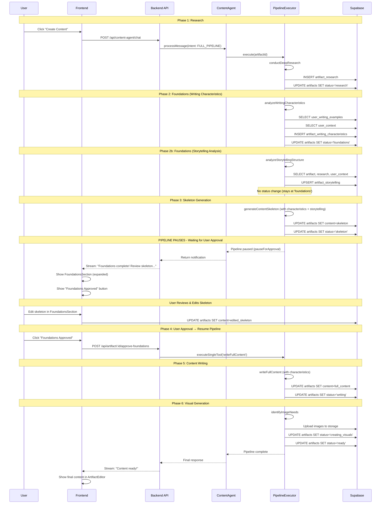
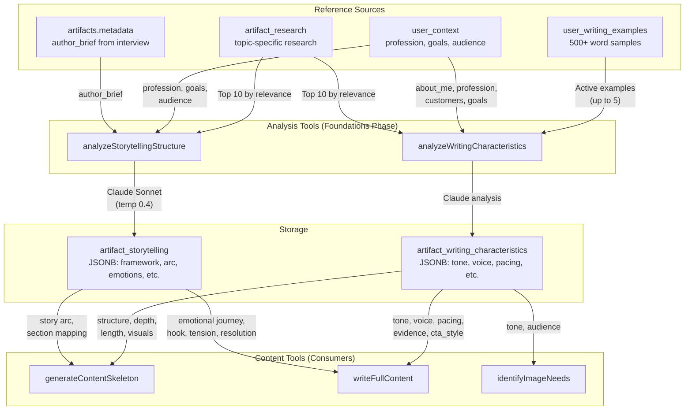
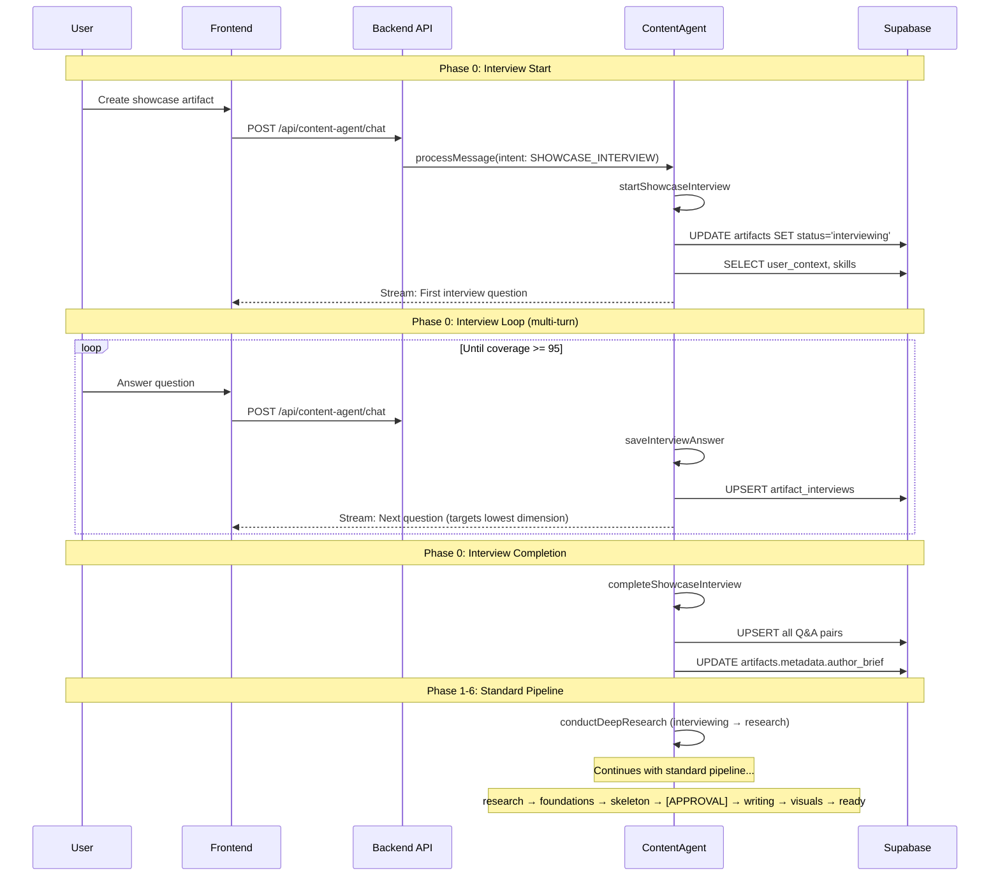
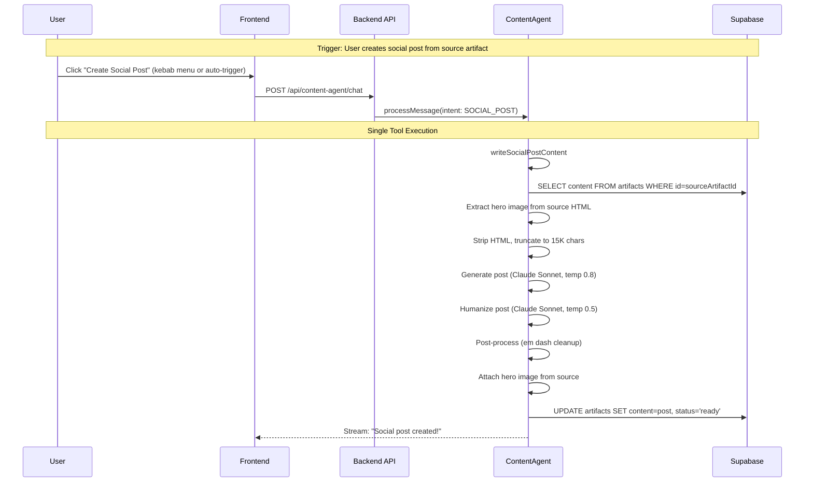
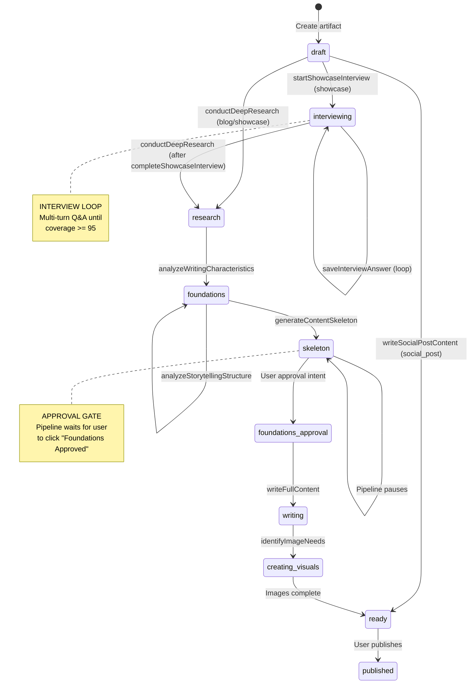
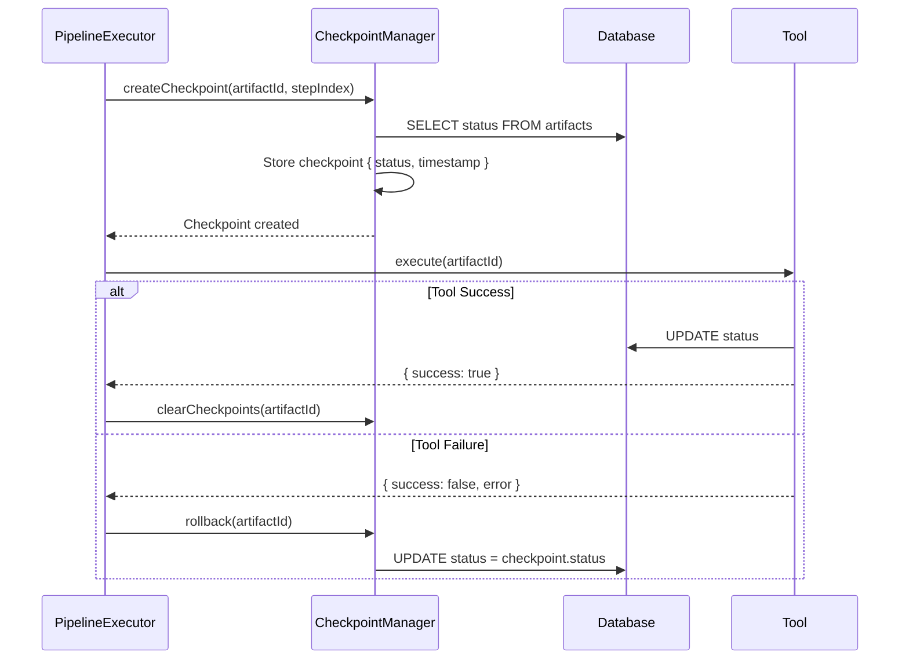
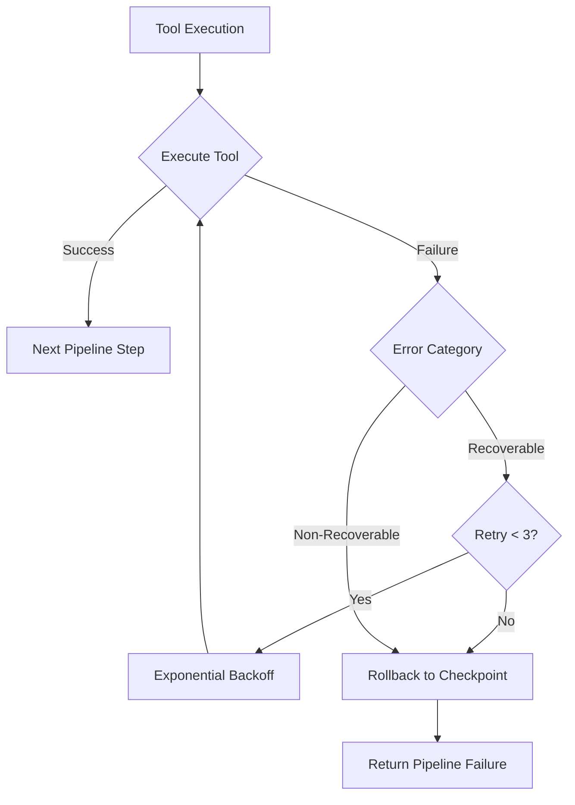

# Pipeline Execution Flow

**Version:** 4.0.0
**Last Updated:** 2026-02-20
**Status:** Complete (Phase 5 — Interview, Social Post, Content Improvement)

## Overview

The Content Agent executes content creation through **3 distinct pipeline paths** depending on artifact type and trigger context. All pipelines share the `ToolOutput<T>` interface, checkpoint/rollback mechanism, and error recovery strategies.

### Pipeline Paths

| Pipeline | Artifact Types | Status Flow | Tools |
|----------|---------------|-------------|-------|
| **Blog/Showcase Full Pipeline** | blog, showcase | draft → research → ... → ready | 7 core tools |
| **Showcase Interview Pipeline** | showcase (new) | draft → interviewing → research → ... → ready | 3 interview + 7 core tools |
| **Social Post Pipeline** | social_post | draft → ready | 1 tool (writeSocialPostContent) |

Additionally, **Content Improvement** tools (improveTextContent, improveImageContent) are on-demand editor actions that can be triggered on any artifact in an editable state.

### Pipeline Philosophy

**Linear Progression with Approval Gate**: Each step builds on the previous step's output, with a mandatory user approval checkpoint after skeleton generation:
```
Blog/Showcase:  draft → research → foundations → skeleton → [USER APPROVAL] → writing → creating_visuals → ready
Interview:      draft → interviewing → research → foundations → skeleton → [USER APPROVAL] → writing → creating_visuals → ready
Social Post:    draft → ready (single tool)
```

**Key Concepts:**
- **Atomicity**: Checkpoints before each step enable rollback on failure
- **Idempotency**: Safe to retry failed steps without side effects
- **Approval Gate**: Pipeline pauses at `skeleton` status for user approval
- **Writing Characteristics**: AI analyzes user's writing style to guide content generation
- **Interview Loop**: Showcase interview is multi-turn with incremental persistence

---

## Phase 4 Pipeline Flow



---

## Pipeline Steps

The Content Agent pipeline consists of **7 steps** with an **approval gate** between skeleton and writing:

| Step | Tool | Status Transition | Duration | Required |
|------|------|-------------------|----------|----------|
| **1. Research** | `conductDeepResearch` | draft → research | ~30-60s | Yes |
| **2. Foundations (Writing)** | `analyzeWritingCharacteristics` | research → foundations | ~15-30s | Yes |
| **3. Foundations (Storytelling)** | `analyzeStorytellingStructure` | foundations → foundations (no change) | ~10-20s | Yes |
| **4. Skeleton** | `generateContentSkeleton` | foundations → skeleton | ~20-40s | Yes |
| **--- APPROVAL GATE ---** | User Action | skeleton → foundations_approval | Manual | Yes |
| **5. Writing** | `writeFullContent` | foundations_approval → writing | ~60-120s | Yes |
| **6. Visuals** | `identifyImageNeeds` | writing → creating_visuals → ready | ~60-180s | Yes |
| **7. Humanity Check** | `applyHumanityCheck` | creating_visuals → ready | ~30-45s | Optional |

---

### Step 1: Research (draft → research)

**Tool**: `conductDeepResearch`

**Purpose**: Gather research from 5+ sources (Reddit, LinkedIn, Quora, Medium, Substack) using Tavily API.

**Input Requirements**:
- Artifact status: `draft`
- Artifact has topic/title defined

**Process**:
1. Determine source priority based on topic type (technical/business/community)
2. Query top 5 sources in parallel (4 results per source = 20 potential results)
3. Filter by relevance score > 0.6
4. Validate minimum 5 unique sources (fallback to mock if insufficient)
5. Store top 20 results in `artifact_research` table
6. Update artifact status to `research`

**Success Criteria**:
- 5+ unique source types
- 20 research results stored
- Average relevance score > 0.6

**Error Scenarios**:
- `RESEARCH_NOT_FOUND`: < 5 sources found → Uses fallback sources, pipeline continues
- `TOOL_TIMEOUT`: Tavily API timeout → Recoverable, retry with backoff
- `ARTIFACT_NOT_FOUND`: Invalid artifact ID → Non-recoverable

---

### Step 2: Foundations — Writing Characteristics (research → foundations) [PHASE 4]

**Tool**: `analyzeWritingCharacteristics`

**Purpose**: Analyze user's writing style based on their writing examples, context, and artifact research to guide content generation.

**Input Requirements**:
- Artifact status: `research`
- Research data exists (5+ sources)

**Data Sources**:
1. **Artifact Research** (`artifact_research` table)
   - Top 10 research results by relevance
   - Provides topic context and industry terminology

2. **User Writing Examples** (`user_writing_examples` table)
   - Up to 5 active writing samples (500+ words each)
   - Analyzed for tone, voice, structure patterns

3. **User Context** (`user_context` table)
   - About me, profession, expertise areas
   - Target audience, content goals

**Process**:
1. Fetch artifact data (title, type, research)
2. Fetch user's active writing examples
3. Fetch user context (profession, goals, audience)
4. Build comprehensive analysis prompt
5. Call Claude API for characteristics analysis
6. Parse and validate characteristics response
7. Store in `artifact_writing_characteristics` table
8. Update artifact status to `foundations`

**Writing Characteristics Generated**:

| Category | Characteristics | Source |
|----------|-----------------|--------|
| **Tone** | tone, voice, emotional_appeal | examples + context |
| **Structure** | sentence_structure, structure_preference, pacing | examples |
| **Vocabulary** | vocabulary_complexity, audience_assumption | examples + context |
| **Evidence** | use_of_evidence, use_of_examples | examples |
| **Formatting** | formatting_preferences, length_preference, use_of_visuals | examples + artifact type |
| **Engagement** | cta_style, depth | examples + goals |

**Output Schema**:
```typescript
interface WritingCharacteristics {
  [key: string]: WritingCharacteristicValue;
}

interface WritingCharacteristicValue {
  value: string | number | boolean | string[];
  confidence: number;  // 0-1
  source: 'artifact' | 'examples' | 'mix' | 'default';
  reasoning?: string;
}
```

**Success Criteria**:
- Characteristics object stored in database
- Summary and recommendations generated
- Status transitioned to `foundations`

---

### Step 3: Foundations — Storytelling Analysis (foundations → foundations) [NEW]

**Tool**: `analyzeStorytellingStructure`

**Purpose**: Select the best narrative framework for the artifact and generate comprehensive storytelling guidance that shapes both skeleton structure and content writing.

**Input Requirements**:
- Artifact status: `foundations`
- Research data exists
- Writing characteristics already analyzed (Step 2)

**Process**:
1. Fetch artifact data (title, type, metadata including author_brief)
2. Fetch top 10 research results by relevance
3. Fetch user context (profession, goals, audience)
4. Build type-specific storytelling prompt with framework recommendations
5. Call Claude Sonnet (temperature 0.4) for analysis
6. Parse and validate storytelling guidance
7. Upsert into `artifact_storytelling` table
8. **No status transition** — stays at `foundations`

**Framework Selection**:
- **Blog**: BAB, PAS, StoryBrand SB7, Duarte's Resonate, Story Spine
- **Showcase**: STAR, Hero's Journey, McKee's Structure, Stories That Stick
- **Social Post**: Story Spine condensed, BAB micro, Moth Method, PAS

**Output Used By**:
- `generateContentSkeleton` — story arc and section_mapping shape H2 section ordering
- `writeFullContent` — emotional journey, hook strategy, tension points, and resolution guide each section's narrative

**Storage**: `artifact_storytelling` table (JSONB `storytelling_guidance` column)

**Error Handling**: On failure, default type-specific storytelling guidance is returned so downstream tools still function.

---

### Step 4: Skeleton (foundations → skeleton)

**Tool**: `generateContentSkeleton`

**Purpose**: Create structured content outline with H2 sections and visual placeholders, guided by writing characteristics and storytelling guidance.

**Input Requirements**:
- Artifact status: `foundations`
- Research data exists (5+ sources)
- Writing characteristics analyzed

**Process**:
1. Fetch research results from database
2. Fetch writing characteristics from database
3. Build skeleton prompt with:
   - Tone modifiers
   - Research context
   - **Writing characteristics** (structure_preference, depth, length_preference, use_of_visuals)
4. Generate skeleton via Claude
5. Parse skeleton structure (H1 title + H2 sections + [IMAGE: ...] placeholders)
6. Store skeleton as markdown in `artifact.content`
7. Update artifact status to `skeleton`
8. **Pipeline PAUSES for user approval**

**Characteristics Applied to Skeleton**:
- `structure_preference`: Linear, problem-solution, or narrative structure
- `depth`: Surface, moderate, or deep-dive level of detail
- `length_preference`: Concise, moderate, or comprehensive
- `use_of_visuals`: Number and placement of [IMAGE: ...] placeholders

**Skeleton Structure by Type**:
```markdown
# Blog
H1: Title
Hook paragraph (informed by tone characteristic)
H2: Section 1 (depth-appropriate)
[IMAGE: description]
H2: Section 2
...

# Social Post
Hook (tone-appropriate)
* Point 1
* Point 2
CTA (cta_style characteristic)
[IMAGE: description]
#hashtag1 #hashtag2

# Showcase
H1: Title
Hero paragraph
H2: Overview
H2: Problem
H2: Solution
H2: Results
[IMAGE: demo screenshot]
```

---

### Approval Gate: User Review (skeleton → foundations_approval)

**IMPORTANT**: This is NOT a tool - it's a user action that resumes the pipeline.

**What Happens**:
1. Pipeline executor stops after skeleton generation
2. Agent streams notification to frontend via ChatPanel
3. Frontend displays FoundationsSection (auto-expanded)
4. User sees:
   - Writing characteristics display
   - **Editable** skeleton in TipTap editor
   - "Foundations Approved" button

**User Actions Available**:
- Edit skeleton structure in FoundationsSection
- Review writing characteristics
- Click "Foundations Approved" to continue

**Resume Mechanism**:
1. User clicks "Foundations Approved" button
2. Frontend calls `POST /api/artifact/:id/approve-foundations`
3. Backend calls `pipelineExecutor.executeSingleTool('writeFullContent', artifactId)`
4. Pipeline continues from Step 4 (Writing)

**UI State During Approval**:
- FoundationsSection: Expanded, skeleton editable
- ArtifactEditor: Hidden (no final content yet)
- ChatPanel: Shows "Foundations complete! Review skeleton..." notification

---

### Step 4: Writing (foundations_approval → writing)

**Tool**: `writeFullContent`

**Purpose**: Write complete content for all sections using Gemini 2.0 Flash, guided by writing characteristics.

**Input Requirements**:
- Artifact status: `foundations_approval` (user approved)
- Skeleton content exists with H2 sections
- Writing characteristics available

**Process**:
1. Fetch artifact (skeleton, tone, type, research)
2. Fetch writing characteristics
3. Parse skeleton to extract section headings
4. For each section:
   - Build section prompt with research context
   - **Apply writing characteristics**:
     - `tone`: Formal, casual, professional, etc.
     - `voice`: First-person, third-person, we/our
     - `pacing`: Fast, measured, thorough
     - `use_of_evidence`: Heavy citations, light references, anecdotal
     - `cta_style`: Direct, subtle, none
   - Generate content via Gemini
   - Apply tone-specific temperature
5. Combine all sections into full content
6. Update `artifact.content` with full markdown
7. Update artifact status to `writing`

**Temperature Mapping (from characteristics)**:
| Tone Characteristic | Temperature | Use Case |
|---------------------|-------------|----------|
| technical | 0.4 | Precise technical content |
| formal, authoritative | 0.5 | Academic, business |
| professional | 0.6 | Standard business content |
| casual, conversational, friendly | 0.7 | Personal blogs, social |
| humorous | 0.8 | Engaging, entertaining |

---

### Step 5: Visuals (writing → creating_visuals → ready)

**Tool**: `identifyImageNeeds`

**Purpose**: Generate high-quality images using DALL-E 3 (primary) or Gemini Imagen 4 (fallback), guided by writing characteristics.

**Input Requirements**:
- Artifact status: `writing`
- Content has `[IMAGE: description]` placeholders
- Writing characteristics available

**Process**:
1. **Extract Placeholders**: Parse content for `[IMAGE: ...]` patterns
2. **Apply Characteristics**: Style images based on:
   - `tone`: Professional, casual, playful
   - `audience_assumption`: Expert, intermediate, beginner
3. **Infer Purpose**: Determine image purpose from context
4. **Select Resolution**: Based on artifact type and purpose
5. **Generate Images**: DALL-E 3 with characteristic-informed prompts
6. **Upload to Storage**: Store in Supabase storage
7. **Embed in Content**: Replace placeholders with markdown image syntax
8. Update artifact status to `creating_visuals` then `ready`

**Image Style from Characteristics**:
| Characteristic | Image Style |
|----------------|-------------|
| tone: professional | Clean, corporate, polished |
| tone: casual | Friendly, warm, approachable |
| tone: technical | Diagrams, schematics, detailed |
| audience: expert | Complex visuals, data-rich |
| audience: beginner | Simple, illustrative, explanatory |

---

### Step 6: Humanity Check (Optional)

**Tool**: `applyHumanityCheck`

**Purpose**: Remove AI writing patterns to make content sound more human.

**When to Use**:
- User explicitly requests humanization
- Content flagged as AI-detectable
- Publishing to platforms with AI detection

**When to Skip** (use `skipHumanityCheck: true`):
- Technical documentation
- Internal content
- Time-sensitive publishing

---

## Writing & Storytelling References Flow

The foundations phase pulls from multiple reference sources to understand the user's writing style and design a narrative strategy:



### Reference Tables

**user_writing_examples** (User's writing samples):
```sql
CREATE TABLE user_writing_examples (
  id UUID PRIMARY KEY,
  user_id UUID REFERENCES auth.users(id),
  name TEXT NOT NULL,
  content TEXT NOT NULL,  -- Minimum 500 words
  word_count INTEGER,
  source_type TEXT,  -- 'paste', 'file', 'artifact_import'
  analyzed_characteristics JSONB,
  is_active BOOLEAN DEFAULT true,
  created_at TIMESTAMPTZ,
  updated_at TIMESTAMPTZ
);
```

**user_context** (User profile context):
```sql
CREATE TABLE user_context (
  id UUID PRIMARY KEY,
  user_id UUID REFERENCES auth.users(id) UNIQUE,
  about_me JSONB,        -- bio, value_proposition, unique_strengths
  profession JSONB,      -- industry, expertise_areas, experience_level
  customers JSONB,       -- target_audience, pain_points, decision_factors
  goals JSONB,           -- content_goals, success_metrics, tone_preference
  created_at TIMESTAMPTZ,
  updated_at TIMESTAMPTZ
);
```

**artifact_writing_characteristics** (Per-artifact analysis):
```sql
CREATE TABLE artifact_writing_characteristics (
  id UUID PRIMARY KEY,
  artifact_id UUID REFERENCES artifacts(id) UNIQUE,
  characteristics JSONB NOT NULL,  -- Flexible key-value pairs
  summary TEXT,                     -- Human-readable summary
  recommendations TEXT,             -- Content generation guidance
  created_at TIMESTAMPTZ,
  updated_at TIMESTAMPTZ
);
```

---

## Showcase Interview Pipeline

The interview pipeline is used for **showcase** artifacts when the user wants Claude to conduct an interactive interview before content creation. It adds an `interviewing` phase before the standard research → writing flow.

### Interview Pipeline Flow



### Coverage Scoring

The interview uses 5 dimensions scored 0-20 each (total 100):

| Dimension | What It Captures | Max |
|-----------|-----------------|-----|
| `case_context` | Background, setting, client description | 20 |
| `problem_challenge` | Problem or challenge addressed | 20 |
| `approach_methodology` | Methods, frameworks, process used | 20 |
| `results_outcomes` | Measurable results and impact | 20 |
| `lessons_insights` | Lessons learned and key insights | 20 |

**Completion threshold**: Total coverage >= 95 triggers `readyToComplete: true`

### Interview Resume

If the user leaves mid-interview:
1. All answered Q&A pairs are already saved incrementally via `saveInterviewAnswer`
2. On return, `startShowcaseInterview` detects `interviewing` status
3. Returns `isResume: true` with `existingPairs` and `lastCoverageScores`
4. Claude continues from `questionCount + 1`, targeting the lowest dimension

### Interview Data Storage

| Table | Data |
|-------|------|
| `artifact_interviews` | Individual Q&A pairs with dimension and coverage scores |
| `artifacts.metadata` | `author_brief`, `interview_completed`, `interview_coverage_scores`, `interview_question_count` |

---

## Social Post Pipeline

The social post pipeline is a **single-tool execution** that generates a promotional post from an existing blog or showcase artifact.

### Social Post Pipeline Flow



### Key Differences from Full Pipeline

| Aspect | Full Pipeline | Social Post |
|--------|--------------|-------------|
| Steps | 6 tools + approval gate | 1 tool |
| Status transitions | draft → research → ... → ready | draft → ready |
| User approval | Required (skeleton review) | Not needed |
| Research phase | Yes (5+ external sources) | No (uses source artifact content) |
| Image generation | Yes (DALL-E 3 / Imagen 4) | No (inherits hero image from source) |
| Humanization | Separate tool (applyHumanityCheck) | Built into writeSocialPostContent |
| Duration | ~2-5 minutes | ~15-30 seconds |

### Trigger Mechanisms

1. **Kebab menu**: User clicks "..." on eligible artifact → "Create Social Post"
2. **Auto-trigger**: URL param `?createSocialPost=true&sourceId=<id>` on ArtifactPage
3. **Eligibility**: Source artifact must be blog or showcase with status `ready` or `published`

---

## Content Improvement (On-Demand)

Content improvement tools are **not a pipeline** — they are ad-hoc editor actions that operate on specific selections within any editable artifact.

### Text Improvement Flow

```
User selects text → Sparkle button appears (BubbleMenu) → User clicks
→ Chat opens with selection context → User types instruction
→ improveTextContent tool called → Replacement text returned
→ Frontend swaps selected text in TipTap editor
```

### Image Improvement Flow

```
User clicks image → ImageBubbleMenu appears → User clicks "AI Improve"
→ Chat opens with image context → User types feedback
→ improveImageContent tool called → New image URL returned
→ Frontend swaps image src in TipTap editor
```

### Selection Context (editorSelectionStore)

The Zustand store `editorSelectionStore` captures:

| Field | Type | Description |
|-------|------|-------------|
| `type` | `'text' \| 'image'` | What was selected |
| `selectedText` | string | Highlighted text (text type) |
| `surroundingContext` | object | 2 paragraphs before/after + nearest heading |
| `imageUrl` | string | Current image URL (image type) |
| `imageDescription` | string | Original generation prompt |

---

## Status Flow Reference

### Complete Status Lifecycle



### Status Definitions

| Status | Description | Polling | UI State |
|--------|-------------|---------|----------|
| `draft` | Initial state, awaiting content creation | No | Show "Create Content" button |
| `interviewing` | Showcase interview in progress (multi-turn) | No | Show interview chat |
| `research` | Deep research in progress | Yes (2s) | Show loading in ResearchArea |
| `foundations` | Writing characteristics analysis in progress | Yes (2s) | Show loading indicator |
| `skeleton` | Skeleton generated, awaiting approval | **No** | Show FoundationsSection expanded |
| `foundations_approval` | User approved, writing about to start | No | Brief transition state |
| `writing` | Full content being written | Yes (2s) | Show writing progress |
| `creating_visuals` | Images being generated | Yes (2s) | Show image generation progress |
| `ready` | Content complete, ready for review | No | Show final content in editor |
| `published` | Content published externally | No | Show published indicator |

### Processing vs Non-Processing States

**Processing States** (polling enabled):
- `research`
- `foundations`
- `writing`
- `creating_visuals`

**Non-Processing States** (no polling):
- `draft`
- `interviewing` - Interactive interview (chat-driven)
- `skeleton` - Waiting for user approval
- `foundations_approval` - Brief transition
- `ready`
- `published`

---

## Checkpoint/Rollback Mechanism

The pipeline implements **transaction-like atomicity** through checkpoints.

### How Checkpoints Work



### Checkpoint Lifecycle

**1. Creation (Before Tool Execution)**:
```typescript
await checkpointManager.createCheckpoint(artifactId, stepIndex, {
  toolName: 'analyzeWritingCharacteristics'
});
```

**2. Rollback (On Tool Failure)**:
```typescript
const checkpoint = checkpointManager.getLastCheckpoint(artifactId);
await supabaseAdmin
  .from('artifacts')
  .update({ status: checkpoint.status })
  .eq('id', artifactId);
```

**3. Cleanup (On Success)**:
```typescript
checkpointManager.clearCheckpoints(artifactId);
```

---

## Error Recovery Strategies

### Recovery Layers



### Retryable vs Non-Retryable Errors

**Retryable**:
- `TOOL_EXECUTION_FAILED` - Generic execution failure
- `TOOL_TIMEOUT` - API timeout
- `AI_PROVIDER_ERROR` - OpenAI/Anthropic API error
- `AI_RATE_LIMIT` - Rate limit exceeded

**Non-Retryable**:
- `ARTIFACT_NOT_FOUND` - Artifact doesn't exist
- `INVALID_ARTIFACT_ID` - Malformed UUID
- `INVALID_STATUS` - Status transition not allowed
- `RESEARCH_NOT_FOUND` - Insufficient sources

---

## Pipeline Execution Examples

### Example 1: Full Pipeline with Approval

```typescript
// User clicks "Create Content" - starts pipeline
const result = await pipelineExecutor.execute('artifact-abc-123', {
  skipHumanityCheck: true
});

// Pipeline runs: research → foundations → skeleton
// Pipeline PAUSES at skeleton status
// User reviews skeleton, clicks "Foundations Approved"

// Backend receives approval
await pipelineExecutor.executeSingleTool('writeFullContent', 'artifact-abc-123');

// Pipeline continues: writing → creating_visuals → ready
```

### Example 2: Execute Single Tool (Resume from Approval)

```typescript
// Called by POST /api/artifact/:id/approve-foundations
const result = await pipelineExecutor.executeSingleTool(
  'writeFullContent',
  'artifact-abc-123'
);

if (result.success) {
  console.log('Writing complete, proceeding to visuals');
  // Pipeline continues automatically to identifyImageNeeds
}
```

---

## Performance Characteristics

### Pipeline Duration by Artifact Type

| Artifact Type | Pipeline | Avg Duration | Breakdown |
|---------------|----------|--------------|-----------|
| **Social Post** | Social Post | ~15-30s | Single tool: fetch source + generate + humanize + save |
| **Blog** | Full Pipeline | ~210-330s | Research (50s) + Foundations (20s) + Skeleton (30s) + [Approval] + Writing (70s) + Visuals (60-150s) |
| **Showcase** | Full Pipeline | ~180-270s | Research (40s) + Foundations (18s) + Skeleton (20s) + [Approval] + Writing (45s) + Visuals (45-120s) |
| **Showcase** | Interview Pipeline | ~240-360s+ | Interview (user-paced) + Research (40s) + Foundations (18s) + Skeleton (20s) + [Approval] + Writing (45s) + Visuals (45-120s) |

**Notes**:
- Approval time is user-dependent and not included in duration estimates
- Interview duration depends on number of questions (typically 5-8 turns)
- Content improvement tools (text/image) take ~5-30s per invocation

---

## Troubleshooting

### Issue: Pipeline Stuck at Skeleton Status

**Symptoms**:
- Status is `skeleton` but no "Foundations Approved" button visible
- FoundationsSection not showing approval button

**Diagnosis**:
```typescript
// Check artifact status in database
SELECT status FROM artifacts WHERE id = 'artifact-id';
// Should be 'skeleton' or 'foundations_approval'

// Check if characteristics exist
SELECT * FROM artifact_writing_characteristics WHERE artifact_id = 'artifact-id';
```

**Solution**:
- Verify FoundationsSection renders approval button when `status === 'skeleton' || status === 'foundations_approval'`
- Check if `onApprove` callback is provided to FoundationsSection

### Issue: Writing Characteristics Not Displayed

**Symptoms**:
- FoundationsSection shows skeleton but no characteristics
- WritingCharacteristicsDisplay component empty

**Diagnosis**:
```typescript
// Check if characteristics were stored
SELECT characteristics FROM artifact_writing_characteristics WHERE artifact_id = 'artifact-id';
```

**Solution**:
- Verify `analyzeWritingCharacteristics` tool completed successfully
- Check if `useWritingCharacteristics` hook is fetching data correctly

### Issue: Endless Polling After Skeleton

**Symptoms**:
- Backend logs show continuous polling
- Status is `skeleton` but polling continues

**Diagnosis**:
- Check `useArtifacts.ts` `processingStates` array
- `skeleton` and `foundations_approval` should NOT be in this array

**Solution**:
```typescript
// processingStates should NOT include skeleton or foundations_approval
const processingStates = ['research', 'foundations', 'writing', 'creating_visuals'];
```

---

## Related Documentation

### Tool References
- [core-tools-reference.md](./core-tools-reference.md) - Individual tool specifications
- [context-tools-reference.md](./context-tools-reference.md) - Context fetching tools

### Status Reference
- [STATUS_VALUES_REFERENCE.md](../artifact-statuses/STATUS_VALUES_REFERENCE.md) - Complete status definitions
- [status-flow-reference.md](../artifact-statuses/status-flow-reference.md) - Status transition diagrams

### System Architecture
- [content-agent-overview.md](./content-agent-overview.md) - Content Agent orchestration
- [UNIFIED_CONTENT_AGENT_ARCHITECTURE.md](./UNIFIED_CONTENT_AGENT_ARCHITECTURE.md) - Full architecture

### API Integration
- [content-agent-endpoints.md](../api/content-agent-endpoints.md) - REST API endpoints

---

**Version History:**
- **5.0.0** (2026-02-20) - Added storytelling analysis step (analyzeStorytellingStructure) to foundations phase, 7-step pipeline, storytelling references flow
- **4.0.0** (2026-02-20) - Phase 5: Added showcase interview pipeline, social post pipeline, content improvement flows, `interviewing` status, coverage scoring, interview resume
- **3.0.0** (2026-01-29) - Phase 4: Added foundations approval workflow, writing characteristics analysis, 6-step pipeline, approval gate documentation
- **2.0.0** (2026-01-28) - Phase 3: Image generation with DALL-E 3 / Gemini Imagen
- **1.0.0** (2026-01-26) - Initial documentation with checkpoint/rollback mechanism
