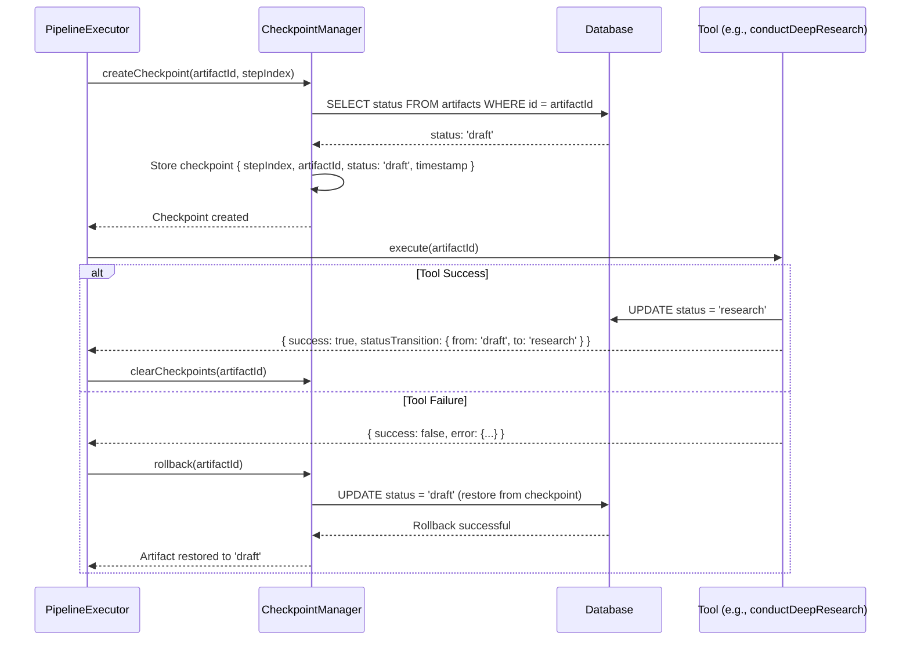

# Pipeline Execution Flow

**Version:** 2.0.0
**Last Updated:** 2026-01-28
**Status:** Complete (Phase 3 Image Generation)

## Overview

The Content Agent executes a **4-step content creation pipeline** that transforms a draft artifact into ready-to-publish content. The pipeline provides **transaction-like atomicity** through checkpoint/rollback mechanisms, ensuring consistent artifact state even when errors occur.

### Pipeline Philosophy

**Linear Progression**: Each step builds on the previous step's output:
```
draft → research → skeleton → creating_visuals → ready
```

**Atomicity**: Checkpoints before each step enable rollback on failure
**Idempotency**: Safe to retry failed steps without side effects
**Observability**: Full tracing, metrics, and progress reporting throughout

---

## Pipeline Steps

The Content Agent pipeline consists of **4 required steps** and **1 optional step**:

| Step | Tool | Status Transition | Duration | Required |
|------|------|-------------------|----------|----------|
| **1. Research** | `conductDeepResearch` | draft → research | ~30-60s | ✅ Yes |
| **2. Skeleton** | `generateContentSkeleton` | research → skeleton | ~20-40s | ✅ Yes |
| **3. Writing** | `writeFullContent` | skeleton → creating_visuals | ~60-120s | ✅ Yes |
| **4. Visuals** | `identifyImageNeeds` | creating_visuals → ready | ~60-180s | ✅ Yes |
| **5. Humanity Check** | `applyHumanityCheck` | creating_visuals → ready | ~30-45s | ❌ Optional |

### Step 1: Research (draft → research)

**Tool**: `conductDeepResearch`

**Purpose**: Gather research from 5+ sources (Reddit, LinkedIn, Quora, Medium, Substack) using Tavily API.

**Input Requirements**:
- Artifact status: `draft`
- Artifact has topic/title defined

**Process**:
1. Determine source priority based on topic type (technical/business/community)
2. Query top 5 sources in parallel (4 results per source = 20 potential results)
3. Filter by relevance score > 0.6
4. Validate minimum 5 unique sources
5. Store top 20 results in `artifact_research` table
6. Update artifact status to `research`

**Success Criteria**:
- ✅ 5+ unique source types
- ✅ 20 research results stored
- ✅ Average relevance score > 0.6

**Error Scenarios**:
- `RESEARCH_NOT_FOUND`: < 5 sources found → Recoverable, retry with broader topic
- `TOOL_TIMEOUT`: Tavily API timeout → Recoverable, retry with backoff
- `ARTIFACT_NOT_FOUND`: Invalid artifact ID → Non-recoverable

---

### Step 2: Skeleton (research → skeleton)

**Tool**: `generateContentSkeleton`

**Purpose**: Create structured content outline with H2 sections and visual placeholders using Claude.

**Input Requirements**:
- Artifact status: `research`
- Research data exists (5+ sources)

**Process**:
1. Fetch research results from database
2. Build skeleton prompt with tone modifiers and research context
3. Generate skeleton via Claude (claude-3-5-sonnet-20241022)
4. Parse skeleton structure (H1 title + H2 sections + [IMAGE: ...] placeholders)
5. Store skeleton as markdown in `artifact.content`
6. Update artifact status to `skeleton`

**Skeleton Structure by Type**:
```markdown
# Blog
H1: Title
Hook paragraph
H2: Section 1
[IMAGE: description]
H2: Section 2
...

# Social Post
Hook
• Point 1
• Point 2
CTA
[IMAGE: description]
#hashtag1 #hashtag2

# Showcase
H1: Title
Hero paragraph
H2: Overview
H2: Problem
H2: Solution
H2: Results
[IMAGE: demo screenshot]
```

**Success Criteria**:
- ✅ Valid markdown structure
- ✅ 3-7 H2 sections (blog/showcase)
- ✅ Research context integrated

---

### Step 3: Writing (skeleton → creating_visuals)

**Tool**: `writeFullContent`

**Purpose**: Write complete content for all sections using Gemini 2.0 Flash.

**Input Requirements**:
- Artifact status: `skeleton`
- Skeleton content exists with H2 sections

**Process**:
1. Fetch artifact (skeleton, tone, type, research)
2. Parse skeleton to extract section headings
3. For each section:
   - Build section prompt with research context
   - Generate content via Gemini (gemini-2.0-flash-exp)
   - Apply tone-specific temperature (formal: 0.5, humorous: 0.8)
   - Respect token limits (blog: 2000, social_post: 500, showcase: 1500)
4. Combine all sections into full content
5. Update `artifact.content` with full markdown
6. Calculate writing metadata (word count, section count)
7. Update artifact status to `creating_visuals`

**Temperature Mapping**:
| Tone | Temperature | Use Case |
|------|-------------|----------|
| technical | 0.4 | Precise technical content |
| formal, authoritative | 0.5 | Academic, business |
| professional | 0.6 | Standard business content |
| casual, conversational, friendly | 0.7 | Personal blogs, social |
| humorous | 0.8 | Engaging, entertaining |

**Success Criteria**:
- ✅ All sections written
- ✅ Content length within bounds
- ✅ Tone consistency maintained

---

### Step 4: Visuals (creating_visuals → ready)

**Tool**: `identifyImageNeeds`

**Purpose**: Generate high-quality images using DALL-E 3 (primary) or Gemini Imagen 4 (fallback) and embed them into the artifact content.

**Input Requirements**:
- Artifact status: `creating_visuals`
- Content has `[IMAGE: description]` placeholders

**Process**:
1. **Extract Placeholders**: Parse content for `[IMAGE: ...]` patterns via regex
2. **Infer Purpose**: Determine image purpose (hero, illustration, diagram, photo) from placeholder context
3. **Select Resolution**: Choose optimal resolution based on artifact type and purpose:
   - Hero images: 1792x1024
   - Blog illustrations: 1024x1024
   - Social posts: 1024x1024
   - Diagrams/charts: 1792x1024
4. **Generate Images**: Call DALL-E 3 (primary) with enhanced prompts
   - If DALL-E 3 fails, fallback to Gemini Imagen 4
   - Apply exponential backoff retry (3 attempts)
5. **Upload to Storage**: Store generated images in Supabase storage (`artifacts/{artifactId}/images/final/{imageId}.png`)
6. **Embed in Content**: Replace `[IMAGE: description]` placeholders with markdown image syntax (``)
7. **Update Metadata**: Store generation results in `visuals_metadata`:
   ```typescript
   {
     phase: { phase: 'complete' },
     needs: ImageNeed[],
     finals: FinalImage[],
     generation_stats: { total_needed, finals_generated, failures }
   }
   ```
8. Update artifact status to `ready`

**Image Generation Flow**:
```
[IMAGE: team collaboration in modern office]
    ↓
Purpose Detection: "illustration" (context-based)
    ↓
Resolution Selection: 1024x1024 (blog type)
    ↓
Enhanced Prompt: "Professional team collaboration in modern office.
                  Modern, sleek, contemporary design.
                  High quality, professional, no text overlays."
    ↓
DALL-E 3 Generation → Success → Upload to Supabase
    ↓ (if fail)
Gemini Imagen 4 Fallback → Upload to Supabase
    ↓
Embed: 
```

**Enhanced Prompt Engineering**:

Purpose-specific modifiers are applied:
| Purpose | Modifiers |
|---------|-----------|
| hero | "Wide panoramic composition, cinematic lighting, impactful visual" |
| illustration | "Clean digital illustration, editorial style, clear composition" |
| diagram | "Clean vector illustration, clear labels, minimal colors, technical diagram" |
| photo | "Professional photography, natural lighting, shallow depth of field" |
| chart | "Data visualization, clear labels, professional infographic style" |

**Success Criteria**:
- ✅ All `[IMAGE: ...]` placeholders extracted
- ✅ Images generated for each placeholder (or marked as failed)
- ✅ Images uploaded to Supabase storage
- ✅ Content updated with embedded image markdown
- ✅ `visuals_metadata` updated with phase: complete
- ✅ Status updated to `ready`

**Error Scenarios**:
- `PLACEHOLDER_NOT_FOUND`: No `[IMAGE: ...]` patterns → Status set to `ready` (no images needed)
- `IMAGE_GENERATION_FAILED`: Primary + fallback failed → Mark as failed, continue with remaining images
- `STORAGE_UPLOAD_FAILED`: Supabase upload error → Retry with exponential backoff
- `CONTENT_POLICY_VIOLATION`: DALL-E 3 rejected prompt → Skip image, log warning

**Fallback Behavior**:
1. DALL-E 3 (primary) - Best quality, $0.040/image
2. Gemini Imagen 4 (fallback) - Good quality, different style

---

### Step 5: Humanity Check (creating_visuals → ready) [OPTIONAL]

**Tool**: `applyHumanityCheck`

**Purpose**: Remove 24 AI writing patterns to make content sound more human using Claude.

**When to Use**:
- User explicitly requests humanization
- Content flagged as AI-detectable
- Publishing to platforms with AI detection

**When to Skip** (use `skipHumanityCheck: true`):
- Technical documentation (AI patterns acceptable)
- Internal content (no AI detection concern)
- Time-sensitive publishing

**Process**:
1. Fetch artifact content
2. Analyze for 24 AI patterns (vocabulary, structure, style, tone)
3. Apply humanization via Claude (claude-3-5-sonnet-20241022)
4. Calculate humanity score (0-100)
5. Update content with humanized version
6. Update artifact status to `ready`

**Typical Results**:
- Length reduction: 5-15% (more concise)
- Humanity score: 75-95 (higher = more human)
- Patterns fixed: 8-15 patterns

---

## Checkpoint/Rollback Mechanism

The pipeline implements **transaction-like atomicity** through checkpoints, ensuring artifacts can be restored to consistent states if errors occur.

### How Checkpoints Work



### Checkpoint Data Structure

```typescript
interface PipelineCheckpoint {
  stepIndex: number;        // Which step this checkpoint is for (0-4)
  artifactId: string;       // Artifact UUID
  status: ArtifactStatus;   // Status before tool execution ('draft', 'research', etc.)
  timestamp: number;        // When checkpoint was created (ms since epoch)
  metadata?: {
    toolName: string;       // Which tool will be executed
  };
}
```

### Checkpoint Lifecycle

**1. Creation (Before Tool Execution)**
```typescript
// Before executing each tool
await checkpointManager.createCheckpoint(artifactId, stepIndex, {
  toolName: 'conductDeepResearch'
});

// Checkpoint stores current status: 'draft'
```

**2. Storage**
```typescript
// In-memory storage per artifact
checkpoints = {
  'artifact-abc-123': [
    { stepIndex: 0, status: 'draft', timestamp: 1700000000000, toolName: 'conductDeepResearch' },
    { stepIndex: 1, status: 'research', timestamp: 1700000030000, toolName: 'generateContentSkeleton' },
    // ... more checkpoints as pipeline progresses
  ]
}
```

**3. Rollback (On Tool Failure)**
```typescript
// Fetch last checkpoint
const checkpoint = checkpointManager.getLastCheckpoint(artifactId);
// checkpoint.status = 'research' (status before failed tool)

// Restore artifact to checkpoint status
await supabaseAdmin
  .from('artifacts')
  .update({ status: checkpoint.status })
  .eq('id', artifactId);

// Artifact now back in 'research' status, safe to retry skeleton generation
```

**4. Cleanup (On Success)**
```typescript
// After pipeline completes successfully, clear all checkpoints
checkpointManager.clearCheckpoints(artifactId);

// Checkpoints deleted, artifact in 'ready' status
```

### Rollback Guarantees

✅ **Atomicity**: Each tool execution is an atomic operation (either fully succeeds or fully rolls back)
✅ **Consistency**: Artifact status always matches completed tool executions
✅ **Isolation**: Rollback doesn't affect other artifacts
✅ **Durability**: Status persisted to database, survives server restarts

❌ **Not Guaranteed**: Research data, skeleton content, or written content are NOT rolled back (only status)

**Rationale**: Partial work (research, skeleton) is preserved for manual recovery, avoiding expensive re-execution of successful steps.

---

## Error Recovery Strategies

The pipeline uses **layered error recovery** to handle transient failures and permanent errors differently.

### Recovery Layers

```mermaid
flowchart TD
    Start[Tool Execution Attempt] --> Execute{Execute Tool}
    Execute -->|Success| Record[Record Metrics]
    Record --> NextStep[Next Pipeline Step]

    Execute -->|Failure| Category{Error Category}

    Category -->|Recoverable| Retry{Retry Count < 3?}
    Retry -->|Yes| Backoff[Exponential Backoff + Jitter]
    Backoff --> Wait[Wait: delay = min(1000 * 2^attempt + rand(0,1000), 10000)]
    Wait --> Execute

    Retry -->|No| Circuit{Circuit Breaker Open?}
    Circuit -->|No| Rollback[Rollback to Checkpoint]
    Circuit -->|Yes| FailFast[Fail Fast]

    Category -->|Non-Recoverable| Rollback

    Rollback --> Return[Return Pipeline Failure]
    FailFast --> Return

    style Execute fill:#87CEEB
    style Backoff fill:#FFD700
    style Rollback fill:#FFB6C1
    style FailFast fill:#FF6347
```

### Layer 1: Exponential Backoff with Jitter

**Purpose**: Retry transient failures with increasing delays to avoid overwhelming services.

**Configuration**:
```typescript
interface BackoffOptions {
  maxRetries: number;      // Default: 3
  baseDelayMs: number;     // Default: 1000 (1 second)
  maxDelayMs: number;      // Default: 10000 (10 seconds)
  retryableCategories: ErrorCategory[];  // Which errors to retry
}
```

**Algorithm**:
```typescript
// Exponential backoff with jitter
delay = min(
  baseDelay * 2^attempt + random(0, baseDelay),  // Exponential + jitter
  maxDelay                                        // Cap at max
)

// Example progression:
// Attempt 1: 1000ms + random(0, 1000) = 1000-2000ms
// Attempt 2: 2000ms + random(0, 1000) = 2000-3000ms
// Attempt 3: 4000ms + random(0, 1000) = 4000-5000ms
// (capped at 10000ms)
```

**Retryable Error Categories**:
- `TOOL_EXECUTION_FAILED` - Generic execution failure (might be transient)
- `TOOL_TIMEOUT` - API timeout (likely transient)
- `AI_PROVIDER_ERROR` - OpenAI/Anthropic API error (might be transient)
- `AI_RATE_LIMIT` - Rate limit exceeded (definitely transient)

**Non-Retryable Error Categories**:
- `ARTIFACT_NOT_FOUND` - Artifact doesn't exist (permanent)
- `INVALID_ARTIFACT_ID` - Malformed UUID (permanent)
- `INVALID_STATUS` - Status transition not allowed (logic error)
- `RESEARCH_NOT_FOUND` - Insufficient sources (requires user action)

### Layer 2: Circuit Breaker Pattern

**Purpose**: Prevent cascading failures by failing fast when service is degraded.

**States**:
```typescript
enum CircuitState {
  CLOSED,      // Normal operation, allow requests
  OPEN,        // Failure threshold exceeded, fail fast
  HALF_OPEN    // Testing if service recovered
}
```

**Thresholds**:
- **Open Threshold**: 5 consecutive failures
- **Half-Open Timeout**: 60 seconds after opening
- **Success to Close**: 1 successful request in half-open state

**Behavior**:
```typescript
// Circuit CLOSED → Tool executes normally
// Circuit OPEN (after 5 failures) → Fail immediately, no execution
// Circuit HALF_OPEN (after 60s) → Try one request
//   - Success → Circuit CLOSED
//   - Failure → Circuit OPEN again
```

### Layer 3: Checkpoint Rollback

**Purpose**: Restore artifact to consistent state after all retry attempts fail.

**Trigger**: Retry attempts exhausted or non-recoverable error

**Process**:
1. Fetch last checkpoint (status before failed tool)
2. Restore artifact status to checkpoint
3. Log rollback event
4. Return pipeline failure with error details

**Example**:
```typescript
// Pipeline state before rollback:
// - Step 2 (generateContentSkeleton) failed after 3 retries
// - Artifact status: 'research' (changed by step 1)
// - Last checkpoint: { stepIndex: 1, status: 'research' }

// After rollback:
// - Artifact status restored to 'research'
// - User can retry skeleton generation manually
// - Research data preserved (not deleted)
```

---

## Progress Reporting

The pipeline provides **real-time progress updates** via callback function, enabling UI progress bars and status displays.

### Progress Callback Interface

```typescript
interface PipelineProgress {
  currentStep: number;      // Current step index (0-4)
  totalSteps: number;       // Total steps to execute (4 or 5)
  completedTools: string[]; // Names of completed tools
  currentTool?: string;     // Name of currently executing tool
  traceId: string;          // Trace ID for correlation
}

type ProgressCallback = (progress: PipelineProgress) => void;
```

### Usage Example

```typescript
// Define progress handler
const onProgress = (progress: PipelineProgress) => {
  console.log(`[${progress.traceId}] Step ${progress.currentStep + 1}/${progress.totalSteps}`);
  console.log(`  Current: ${progress.currentTool}`);
  console.log(`  Completed: ${progress.completedTools.join(', ')}`);

  // Update UI progress bar
  const percentage = (progress.currentStep / progress.totalSteps) * 100;
  updateProgressBar(percentage);
};

// Execute pipeline with progress reporting
const result = await pipelineExecutor.execute(artifactId, {
  onProgress: onProgress
});
```

### Progress Events

The callback is invoked **at the start of each step** (before tool execution):

```typescript
// Step 1 starts
onProgress({
  currentStep: 0,
  totalSteps: 4,
  completedTools: [],
  currentTool: 'conductDeepResearch',
  traceId: 'pipeline-1700000000-abc123'
});

// Step 2 starts (after step 1 completes)
onProgress({
  currentStep: 1,
  totalSteps: 4,
  completedTools: ['conductDeepResearch'],
  currentTool: 'generateContentSkeleton',
  traceId: 'pipeline-1700000000-abc123'
});

// ... etc
```

### UI Integration Example

```typescript
// React component with progress bar
const [progress, setProgress] = useState({ current: 0, total: 4 });

const startPipeline = async (artifactId: string) => {
  await api.post('/api/content-agent/execute', {
    message: 'Create full content',
    screenContext: { artifactId },
    options: {
      onProgress: (p) => {
        setProgress({ current: p.currentStep, total: p.totalSteps });
      }
    }
  });
};

// Render progress bar
<ProgressBar
  value={(progress.current / progress.total) * 100}
  label={`Step ${progress.current + 1} of ${progress.total}`}
/>
```

---

## Full Pipeline Execution

### Example 1: Standard Full Pipeline

```typescript
import { pipelineExecutor } from './PipelineExecutor.js';

// Execute all 4 required steps + humanity check
const result = await pipelineExecutor.execute('artifact-abc-123', {
  skipHumanityCheck: false,  // Include humanity check (5 steps total)
  onProgress: (progress) => {
    console.log(`Progress: ${progress.currentStep + 1}/${progress.totalSteps}`);
  }
});

if (result.success) {
  console.log('✅ Pipeline complete!');
  console.log(`  Trace ID: ${result.traceId}`);
  console.log(`  Duration: ${result.duration}ms`);
  console.log(`  Steps: ${result.stepsCompleted}/${result.totalSteps}`);
  console.log(`  Tools:`, Object.keys(result.toolResults));
} else {
  console.error('❌ Pipeline failed');
  console.error(`  Failed at step ${result.error.failedStep}: ${result.error.failedTool}`);
  console.error(`  Error: ${result.error.message}`);
  console.error(`  Recoverable: ${result.error.recoverable}`);
}
```

**Expected Output (Success)**:
```
Progress: 1/5
Progress: 2/5
Progress: 3/5
Progress: 4/5
Progress: 5/5
✅ Pipeline complete!
  Trace ID: pipeline-1700000000-abc123
  Duration: 185000ms
  Steps: 5/5
  Tools: ['conductDeepResearch', 'generateContentSkeleton', 'writeFullContent', 'applyHumanityCheck', 'identifyImageNeeds']
  Images Generated: 3/3
```

---

### Example 2: Skip Humanity Check

```typescript
// Execute without humanity check (faster, 4 steps)
const result = await pipelineExecutor.execute('artifact-xyz-789', {
  skipHumanityCheck: true  // Skip optional step
});

// Result: 4 steps completed (research, skeleton, writing, visuals)
console.log(`Steps: ${result.stepsCompleted}/4`);
```

---

### Example 3: Custom Retry Options

```typescript
// Custom retry configuration
const result = await pipelineExecutor.execute('artifact-def-456', {
  retryOptions: {
    maxRetries: 5,           // More retries
    baseDelayMs: 2000,       // Longer initial delay
    maxDelayMs: 30000,       // Higher cap
  }
});

// Retry progression: 2s, 4s, 8s, 16s, 30s (capped)
```

---

### Example 4: With Progress Tracking

```typescript
// Track progress in detail
const progressLog: PipelineProgress[] = [];

const result = await pipelineExecutor.execute('artifact-ghi-123', {
  onProgress: (progress) => {
    progressLog.push(progress);

    // Real-time logging
    console.log(`[${new Date().toISOString()}] ${progress.currentTool}`);
    console.log(`  Step ${progress.currentStep + 1}/${progress.totalSteps}`);
    console.log(`  Completed so far: ${progress.completedTools.join(', ')}`);
  }
});

// Review full progression
console.log('Pipeline progression:');
progressLog.forEach((p, i) => {
  console.log(`  ${i + 1}. ${p.currentTool} (step ${p.currentStep + 1}/${p.totalSteps})`);
});
```

---

## Single Tool Execution

For **partial workflow execution** or **manual step-by-step control**, execute individual tools instead of the full pipeline.

### Example 1: Execute Single Tool

```typescript
// Execute just the research step
const result = await pipelineExecutor.executeSingleTool(
  'conductDeepResearch',
  'artifact-abc-123'
);

if (result.success) {
  console.log('✅ Research complete');
  console.log(`  Duration: ${result.duration}ms`);
  console.log(`  Result:`, result.toolResults['conductDeepResearch']);
} else {
  console.error('❌ Research failed:', result.error.message);
}
```

### Example 2: Step-by-Step Pipeline

```typescript
// Manual step-by-step execution with user approval
const artifactId = 'artifact-xyz-789';

// Step 1: Research
console.log('Starting research...');
let result = await pipelineExecutor.executeSingleTool('conductDeepResearch', artifactId);
if (!result.success) {
  console.error('Research failed, stopping');
  return;
}

// User approval checkpoint
const continueWithSkeleton = await askUser('Research complete. Generate skeleton?');
if (!continueWithSkeleton) return;

// Step 2: Skeleton
console.log('Generating skeleton...');
result = await pipelineExecutor.executeSingleTool('generateContentSkeleton', artifactId);
if (!result.success) {
  console.error('Skeleton generation failed, stopping');
  return;
}

// ... continue with remaining steps
```

---

## Performance Characteristics

### Pipeline Duration by Artifact Type

| Artifact Type | Avg Duration | Breakdown |
|---------------|--------------|-----------|
| **Social Post** | ~90-150s | Research (30s) + Skeleton (10s) + Writing (15s) + Visuals (30-90s) |
| **Blog** | ~180-300s | Research (50s) + Skeleton (30s) + Writing (70s) + Visuals (60-150s) |
| **Showcase** | ~150-240s | Research (40s) + Skeleton (20s) + Writing (45s) + Visuals (45-120s) |

**Note on Visuals Duration**: Image generation time varies based on:
- Number of `[IMAGE: ...]` placeholders in content (typically 1-6)
- ~15-30 seconds per image with DALL-E 3
- ~20-40 seconds per image with Gemini Imagen 4 (fallback)
- Parallel generation not currently implemented (sequential for rate limit management)

### With Humanity Check

Add **30-45 seconds** to total duration if `skipHumanityCheck: false`.

### Metrics Collected

**Per Tool**:
- Execution duration (ms)
- Success/failure rate
- Percentile distribution (p50, p95, p99)

**Per Pipeline**:
- Total duration (ms)
- Steps completed
- Failure rate by step
- Retry statistics

---

## Troubleshooting

### Issue: Pipeline Stuck in Specific Step

**Symptoms**:
- Progress callback stops updating
- Timeout after 2+ minutes

**Diagnosis**:
```typescript
// Check which tool is executing
console.log(`Last progress: step ${progress.currentStep} (${progress.currentTool})`);

// Check tool-specific logs
// Research: Check Tavily API status
// Skeleton/Humanity: Check Claude API status
// Writing: Check Gemini API status
```

**Solution**:
- Verify API keys are valid
- Check API rate limits
- Increase `retryOptions.maxDelayMs` for slow APIs

---

### Issue: Rollback Not Restoring Status

**Symptoms**:
- Pipeline fails but artifact status remains in intermediate state
- Checkpoint rollback logs "No checkpoint found"

**Diagnosis**:
```typescript
// Check if checkpoints were created
const checkpoint = checkpointManager.getLastCheckpoint(artifactId);
console.log('Last checkpoint:', checkpoint);
// Should show: { stepIndex, status, timestamp }
```

**Solution**:
- Ensure checkpoint creation doesn't fail (database connection issues)
- Check database permissions for status updates
- Manually restore status via database query if needed

---

### Issue: Excessive Retries

**Symptoms**:
- Pipeline takes very long to fail
- Seeing 15+ retry attempts instead of 3

**Diagnosis**:
```typescript
// Check retry configuration
console.log('Retry options:', options.retryOptions);
// Should show: { maxRetries: 3, baseDelayMs: 1000, maxDelayMs: 10000 }
```

**Solution**:
- Reduce `maxRetries` to 2 or 1 for faster failure
- Classify errors as non-recoverable to skip retries
- Check circuit breaker isn't stuck in half-open state

---

## Related Documentation

### Tool References
- [core-tools-reference.md](./core-tools-reference.md) - Individual tool specifications (research, skeleton, writing, visuals, humanity)
- [context-tools-reference.md](./context-tools-reference.md) - Context fetching tools used by pipeline

### System Architecture
- [content-agent-overview.md](./content-agent-overview.md) - Content Agent orchestration and pipeline coordination
- [system-prompt-specification.md](./system-prompt-specification.md) - How system prompt guides pipeline execution

### Intent Detection
- [intent-detection-guide.md](./intent-detection-guide.md) - How FULL_PIPELINE intent triggers pipeline execution

### API Integration
- [content-agent-endpoints.md](../api/content-agent-endpoints.md) - REST API for triggering pipeline
- [error-handling-reference.md](../api/error-handling-reference.md) - Error categories and HTTP mappings

### Observability
- [backend/observability-architecture.md](../Architecture/backend/observability-architecture.md) - Tracing, metrics, backoff, circuit breaker details

### Database
- [database/artifact-schema-and-workflow.md](../Architecture/database/artifact-schema-and-workflow.md) - Artifact status definitions and transitions

---

**Version History:**
- **2.0.0** (2026-01-28) - Phase 3 image generation: Updated Step 4 with DALL-E 3 / Gemini Imagen implementation, revised timing estimates, added enhanced prompt engineering details
- **1.0.0** (2026-01-26) - Initial documentation with checkpoint/rollback mechanism
