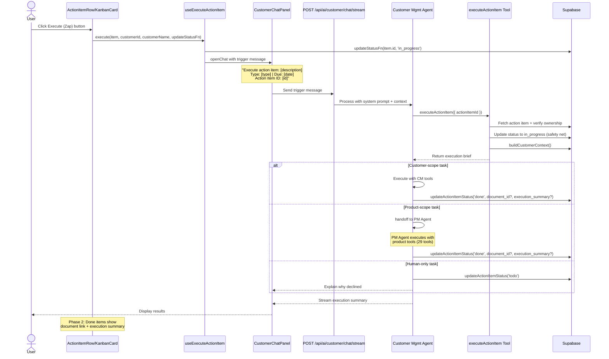
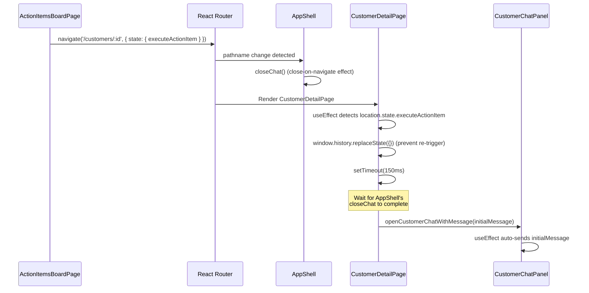
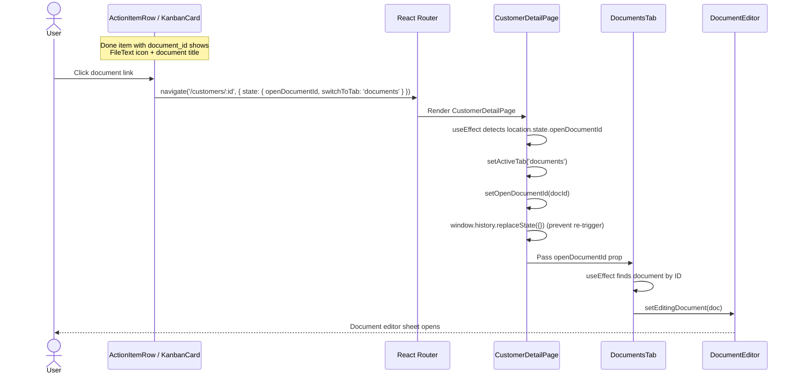

# Action Item Execution Flow

**Created:** 2026-03-21
**Last Updated:** 2026-03-21
**Version:** 2.0.0
**Status:** Complete (Phase 1 + Phase 2)

## Overview

User flow for executing action items via AI. Covers both the customer detail page and kanban board entry points.

## Flow Diagram

## Entry Points

### From Customer Detail Page (ActionItemsTab)

1. User is on `/customers/:id` with Action Items tab active
2. Hovers over a to-do action item card
3. Zap button appears between due date and status badge
4. Click → status changes, chat opens with trigger message

### From Kanban Board (ActionItemsBoardPage)

1. User is on `/action-items` board view
2. Zap button visible on to-do cards in the todo column
3. Click → status changes, navigates to `/customers/:id` with state
4. CustomerDetailPage detects state, opens chat after 150ms delay
5. Chat sends trigger message

## Cross-Page Navigation Detail

## Phase 2: Result Visibility Flow

### Document Navigation (from done action items)

### Execution Summary Toggle

1. Done items with `execution_summary` show a "Execution summary" toggle button
2. Clicking expands a `bg-muted/50` content block with the summary text
3. Clicking again collapses it (simple `useState(false)` toggle)

### Loading Animation

1. When `useExecuteActionItem.execute()` is called, `ExecutionStore.startExecution(itemId, customerId)` sets global state
2. `ActionItemRow` and `KanbanCard` read `useExecutionStore(s => s.executingItemId)`
3. Matching items show `border-primary/30 animate-pulse` border and "Executing..." badge
4. After setup completes (status update + chat open), `endExecution()` clears the animation

## Error Paths

| Scenario | Handling |
|----------|----------|
| Action item not found | Tool returns `{ success: false }`, agent reports error |
| Action item belongs to different customer | Tool returns `{ success: false }`, ownership check fails |
| Agent execution fails | Agent reverts status to `todo` with explanation |
| Human-only task detected | Agent declines, reverts to `todo`, explains why |
| Network error during chat | Standard chat error handling, status may remain `in_progress` |
| Document navigation with null customer_id | Guard prevents navigation (KanbanCard checks `item.customer_id`) |

## Related Documentation

- [Action Item Execution Feature](../features/action-item-execution.md)
- [Customer AI Agents Reference](../ai-agents-and-prompts/customer-agents-reference.md)
- [Customer Management Flow](./customer-management-flow.md)
