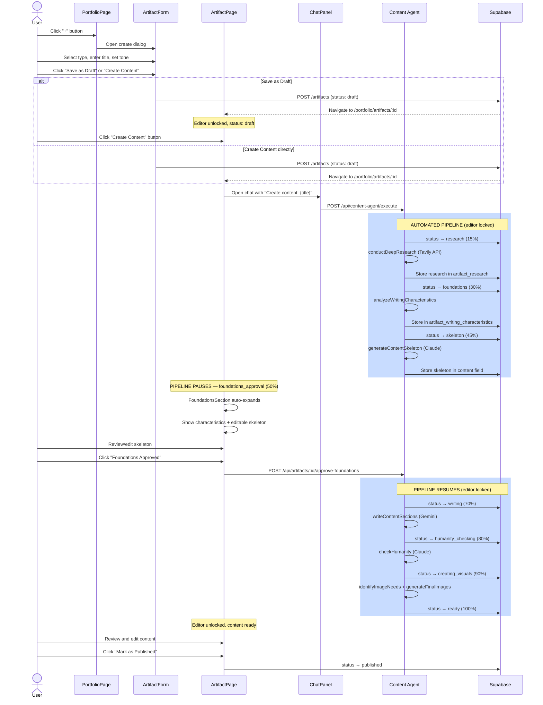
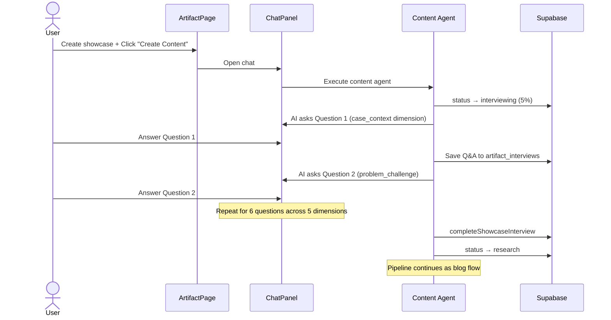
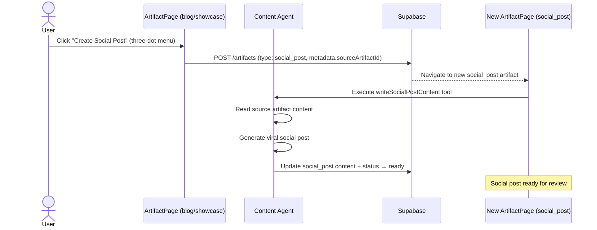

# Artifact Creation Flow

**Created:** 2026-02-19
**Last Updated:** 2026-02-19
**Version:** 1.0.0
**Status:** Complete

## Overview

The artifact creation flow is the primary user journey — from creating a new content artifact to publishing finished content. It covers two pipeline paths: **blog/showcase** content creation and **showcase interview** creation.

---

## Entry Points

| Entry | Screen | Action |
|-------|--------|--------|
| Portfolio page "+" button | PortfolioPage | Opens ArtifactForm dialog |
| Chat suggestion card | PortfolioPage/ArtifactPage | "Create Artifact" CTA in chat response |
| "Create Social Post" action | ArtifactPage (ready/published) | Creates social_post from existing blog/showcase |

---

## Flow: Blog/Showcase Content Creation

### Sequence Diagram



### Step-by-Step

| # | Status | User Action | System Action | UI State |
|---|--------|-------------|---------------|----------|
| 1 | — | Click "+" on Portfolio | Open ArtifactForm | Form dialog |
| 2 | — | Fill type, title, tone | — | Form inputs |
| 3 | `draft` | Click "Save as Draft" / "Create Content" | Create artifact in DB | Navigate to ArtifactPage |
| 4 | `draft` | Click "Create Content" (if draft) | Open ChatPanel, send initial message | Chat opens |
| 5 | `research` | Wait | AI researches via Tavily (6 sources) | Editor locked, progress 15% |
| 6 | `foundations` | Wait | AI analyzes writing characteristics | Progress 30% |
| 7 | `skeleton` | Wait | AI generates H1 + H2 skeleton | Progress 45% |
| 8 | `foundations_approval` | Review skeleton + characteristics | Pipeline paused | FoundationsSection expanded |
| 9 | `foundations_approval` | Edit skeleton (optional) | — | Skeleton editable in TipTap |
| 10 | `foundations_approval` | Click "Foundations Approved" | Resume pipeline | Brief transition |
| 11 | `writing` | Wait | AI writes full content per section | Progress 70% |
| 12 | `humanity_checking` | Wait | AI removes 24+ AI writing patterns | Progress 80% |
| 13 | `creating_visuals` | Wait | AI generates images for placeholders | Progress 90% |
| 14 | `ready` | Review content, edit as needed | — | Editor unlocked, full content |
| 15 | `published` | Click "Mark as Published" | Set published_at timestamp | Published badge |

---

## Flow: Showcase Interview Creation

For `showcase` type artifacts, the pipeline includes an interview phase before research.



### Interview Dimensions (5)

| Dimension | Purpose |
|-----------|---------|
| `case_context` | Background, company, role, timeline |
| `problem_challenge` | Problem statement, constraints, stakes |
| `approach_methodology` | How the user solved it, tools, methods |
| `results_outcomes` | Measurable results, metrics, impact |
| `lessons_insights` | Lessons learned, recommendations |

### Interview Details

- **6 questions** total across 5 dimensions
- AI dynamically generates questions based on coverage scores
- Each answer stored in `artifact_interviews` table with dimension and coverage_scores
- After completion, interview brief is synthesized and feeds into research phase

---

## Flow: Social Post Generation

Available when a blog or showcase artifact is in `ready` or `published` status.



### Eligibility

```typescript
// Can create social post when:
canCreateSocialPost(artifact) =
  artifact.type IN ('blog', 'showcase') AND
  artifact.status IN ('ready', 'published')
```

---

## Error Paths

| Error | When | Recovery |
|-------|------|----------|
| Research fails | Tavily API error during research | Retry via chat message or manual research entry |
| Pipeline timeout | Any processing step exceeds timeout | Artifact returns to last stable status |
| Foundations rejected | User wants to restart | Return to draft, re-trigger pipeline |
| Image generation fails | DALL-E 3 / Gemini error | Retry or skip images (content still generated) |
| Content too short | AI generates insufficient content | Edit manually or re-trigger writing via chat |

---

## Polling Behavior

| Status | Polling | Interval | Hook |
|--------|---------|----------|------|
| `draft` | Only if `enableDraftPolling=true` | 2s | useArtifact |
| `interviewing` | Yes | 2s | useArtifact |
| `research` | Yes | 2s | useArtifact + useResearch |
| `foundations` | Yes | 2s | useArtifact + useWritingCharacteristics |
| `skeleton` | **No** (pipeline paused) | — | — |
| `foundations_approval` | **No** (waiting for user) | — | — |
| `writing` | Yes | 2s | useArtifact |
| `humanity_checking` | Yes | 2s | useArtifact |
| `creating_visuals` | Yes | 2s | useArtifact |
| `ready` | No | — | — |
| `published` | No | — | — |

---

## Related Documentation

- [STATUS_VALUES_REFERENCE.md](../artifact-statuses/STATUS_VALUES_REFERENCE.md) - Status reference
- [pipeline-execution-flow.md](../ai-agents-and-prompts/pipeline-execution-flow.md) - Pipeline details
- [artifact-page.md](../screens/artifact-page.md) - ArtifactPage screen doc
