# Authentication Flow

**Created:** 2026-02-25
**Last Updated:** 2026-02-25
**Version:** 1.0.0
**Status:** Complete

## Overview

NextUp uses Supabase Auth for authentication with two sign-in methods: email/password and Google OAuth. All protected routes require a valid JWT session. The frontend `AuthProvider` manages session state, and `ProtectedRoute` guards authenticated pages.

---

## Authentication Methods

| Method | Provider | Pages |
|--------|----------|-------|
| Email/Password | Supabase Auth (`signInWithPassword`) | LoginPage, SignupPage |
| Google OAuth | Supabase Auth (`signInWithOAuth`) | LoginPage, SignupPage |

---

## Flow 1: Email/Password Sign Up

### Steps

1. User navigates to `/auth/signup`
2. User enters email, password, and confirm password
3. Password validation runs client-side via `usePasswordValidation` hook:
   - Minimum 8 characters
   - At least 1 uppercase letter
   - At least 1 number
   - Strength indicator displays (weak/fair/strong)
4. User clicks "Create account"
5. Frontend calls `supabase.auth.signUp({ email, password, options: { emailRedirectTo } })`
6. On success: navigate to `/auth/confirm` with email in route state
7. On error: display inline error (e.g., "An account with this email already exists")

### Email Confirmation

8. User sees `EmailConfirmationPage` with confirmation instructions
9. User can click "Resend confirmation email" (60-second cooldown between sends)
10. User clicks confirmation link in email
11. Supabase redirects to `/auth/callback`
12. `AuthCallbackPage` detects session via `AuthProvider` and redirects to `/portfolio`

---

## Flow 2: Email/Password Login

### Steps

1. User navigates to `/auth/login` (or is redirected by `ProtectedRoute`)
2. User enters email and password
3. User clicks "Sign in"
4. Frontend calls `supabase.auth.signInWithPassword({ email, password })`
5. On success: navigate to the `from` location (default: `/portfolio`)
6. On error: display "Invalid email or password"

### Special States

- **Post password reset**: If `location.state.passwordReset` is true, shows success banner: "Password updated successfully. Sign in with your new password."
- **Redirect preservation**: `ProtectedRoute` saves the original path in `location.state.from` so LoginPage redirects back after auth.

---

## Flow 3: Google OAuth

### Steps

1. User clicks "Continue with Google" on LoginPage or SignupPage
2. Frontend calls `supabase.auth.signInWithOAuth({ provider: 'google', options: { redirectTo } })`
3. User is redirected to Google consent screen
4. After consent, Google redirects back to `/auth/callback`
5. `AuthCallbackPage` shows a loading spinner while Supabase SDK processes hash fragment tokens
6. `AuthProvider.onAuthStateChange` fires `SIGNED_IN`
7. If session exists, redirect to `/portfolio`; otherwise redirect to `/auth/login`

### Data Migration on First Sign-In

8. On `SIGNED_IN` event, `AuthProvider` checks `localStorage.getItem('data-migrated')`
9. If not migrated, calls `POST /api/auth/migrate-data` with bearer token
10. Sets `localStorage.data-migrated = 'true'` to prevent re-migration
11. If migration occurred, sets `sessionStorage.show-migration-toast = 'true'`

---

## Flow 4: Password Reset

### Request Reset (unauthenticated)

1. User navigates to `/auth/reset-password` (or clicks "Forgot password?" on LoginPage)
2. User enters email address
3. Frontend calls `supabase.auth.resetPasswordForEmail(email, { redirectTo })`
4. Always shows success message (prevents email enumeration)
5. Success screen: "Check your email" with link back to sign in

### Set New Password (recovery mode)

6. User clicks reset link in email
7. Supabase redirects to `/auth/reset-password` (AuthProvider detects `PASSWORD_RECOVERY` event)
8. `AuthProvider.onAuthStateChange` fires `PASSWORD_RECOVERY` and redirects to `/auth/reset-password?recovery=true`
9. `PasswordResetPage` detects `?recovery=true` query param and renders `NewPasswordForm`
10. User enters new password + confirm (same validation as signup)
11. Frontend calls `supabase.auth.updateUser({ password: newPassword })`
12. On success: navigate to `/auth/login` with `{ passwordReset: true }` state
13. LoginPage shows success banner

```mermaid
sequenceDiagram
    participant U as User
    participant PR as PasswordResetPage
    participant SA as Supabase Auth
    participant E as Email
    participant AP as AuthProvider
    participant L as LoginPage

    U->>PR: Enter email, click "Send reset link"
    PR->>SA: resetPasswordForEmail(email)
    SA->>E: Send reset email
    PR->>U: Show "Check your email"

    U->>E: Click reset link
    E->>AP: Supabase redirects (PASSWORD_RECOVERY event)
    AP->>PR: Redirect to /auth/reset-password?recovery=true
    U->>PR: Enter new password + confirm
    PR->>SA: updateUser({ password })
    SA-->>PR: Success
    PR->>L: Navigate to /auth/login (state: { passwordReset: true })
    L->>U: Show "Password updated successfully"
```

---

## Flow 5: Sign Out

1. User clicks sign out (from sidebar or settings)
2. Frontend calls `supabase.auth.signOut()` via `useAuth().signOut`
3. `AuthProvider.onAuthStateChange` fires `SIGNED_OUT`
4. Session and user cleared from state
5. `ProtectedRoute` redirects to `/auth/login`

---

## Authentication Architecture

### Frontend Components

| Component | Location | Purpose |
|-----------|----------|---------|
| `AuthProvider` | `frontend/src/providers/AuthProvider.tsx` | Session state, onAuthStateChange listener, data migration |
| `ProtectedRoute` | `frontend/src/components/auth/ProtectedRoute.tsx` | Route guard: redirects to login if unauthenticated |
| `AuthLayout` | `frontend/src/components/auth/AuthLayout.tsx` | Split-panel layout (branding left, form right) |
| `BrandingPanel` | `frontend/src/components/auth/BrandingPanel.tsx` | Left panel branding content |
| `GoogleButton` | `frontend/src/components/auth/GoogleButton.tsx` | Google OAuth button |
| `OrDivider` | `frontend/src/components/auth/OrDivider.tsx` | "or" divider between OAuth and email form |
| `PasswordStrength` | `frontend/src/components/auth/PasswordStrength.tsx` | Password strength indicator UI |
| `usePasswordValidation` | `frontend/src/features/auth/hooks/usePasswordValidation.ts` | Password validation logic (min 8 chars, uppercase, number) |

### Backend Middleware

| Middleware | Location | Purpose |
|-----------|----------|---------|
| `requireAuth` | `backend/src/middleware/auth.ts` | Verifies Bearer JWT token via `supabaseAdmin.auth.getUser()`, attaches user to `req.user`, creates user-scoped Supabase client via AsyncLocalStorage |
| `optionalAuth` | `backend/src/middleware/auth.ts` | Same as `requireAuth` but doesn't fail if token is missing/invalid |

### Backend Auth Routes

| Method | Path | Description |
|--------|------|-------------|
| POST | `/api/auth/migrate-data` | Reassigns placeholder data to authenticated user (one-time migration) |

### Session Management

- **Token type**: JWT (Supabase access token)
- **Token delivery**: `Authorization: Bearer <token>` header on all API requests
- **Token refresh**: Handled automatically by Supabase JS SDK
- **Session persistence**: Supabase SDK stores session in `localStorage`
- **Server-side verification**: `supabaseAdmin.auth.getUser(token)` validates JWT and returns user

### Password Requirements

| Rule | Requirement |
|------|-------------|
| Minimum length | 8 characters |
| Uppercase | At least 1 uppercase letter |
| Number | At least 1 digit |
| Strength levels | Weak (0-1 rules), Fair (2 rules), Strong (3 rules) |

---

## Error Handling

| Scenario | Error Message | User Action |
|----------|---------------|-------------|
| Invalid credentials | "Invalid email or password. Please try again." | Re-enter credentials |
| Email already registered | "An account with this email already exists. Try signing in instead." | Navigate to login |
| Generic signup error | "Something went wrong. Please try again." | Retry |
| Password reset failure | "Failed to update password. Please try again." | Retry |
| Resend email failure | Toast: "Failed to send. Please try again." | Retry after cooldown |
| Password mismatch | "Passwords do not match" (inline, red text) | Fix confirm password |
| Missing/invalid token (API) | HTTP 401: "Missing or invalid authorization header" | Re-authenticate |
| Expired token (API) | HTTP 401: "Invalid or expired token" | Re-authenticate |

---

## Related Documentation

- [Authentication & Security API](../api/authentication-and-security.md)
- [Security Architecture](../Architecture/backend/security-architecture.md)
- [Auth Screen Documentation](../screens/auth-screens.md)
- [App Shell](../screens/app-shell.md) — sidebar sign out
