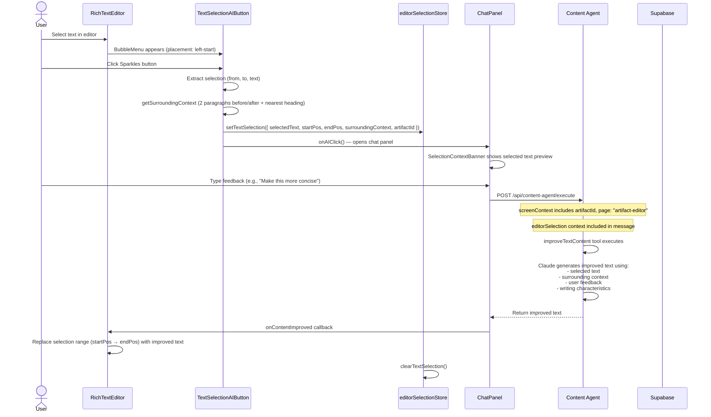
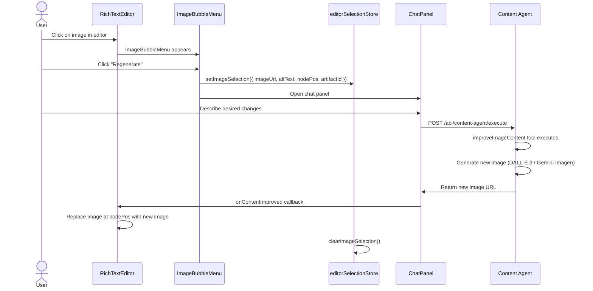

# Content Improvement Flow

**Created:** 2026-02-19
**Last Updated:** 2026-02-19
**Version:** 1.0.0
**Status:** Complete

## Overview

The Content Improvement flow allows users to select text or images in the editor and request AI-powered improvements via the chat panel. The AI processes the selection with surrounding context, generates an improved version, and replaces the selected content in the editor.

---

## Entry Points

| Entry | Screen | Trigger |
|-------|--------|---------|
| Text selection | ArtifactPage (editor) | Select text → floating AI button appears |
| Image click | ArtifactPage (editor) | Click image → ImageBubbleMenu → "Regenerate" |

---

## Flow: Text Improvement



---

## Flow: Image Improvement



---

## Text Selection Context

The `TextSelectionAIButton` extracts rich context around the selection:

```typescript
{
  selectedText: string       // The exact text the user highlighted
  startPos: number           // TipTap document position (start)
  endPos: number             // TipTap document position (end)
  surroundingContext: {
    before: string           // Up to 2 paragraphs before selection
    after: string            // Up to 2 paragraphs after selection
    sectionHeading: string   // Nearest H2/H3 heading above selection
  }
  artifactId: string
}
```

This context helps the AI understand where the text sits in the article, producing more coherent improvements.

---

## Key Components

| Component | Role |
|-----------|------|
| `TextSelectionAIButton` | Floating BubbleMenu button, captures selection context |
| `ImageBubbleMenu` | Context menu for images (crop, regenerate, delete) |
| `SelectionContextBanner` | Shows selected text preview in ChatPanel |
| `editorSelectionStore` | Zustand store bridging editor ↔ chat |
| `improveTextContent` | Backend tool for text improvement |
| `improveImageContent` | Backend tool for image improvement |

---

## Error Paths

| Error | When | Recovery |
|-------|------|----------|
| Selection too short | Selected text < 3 characters | AI button click is ignored |
| AI generation fails | Claude/DALL-E API error | Error shown in chat, selection preserved |
| Position mismatch | Editor content changed between selection and replacement | Fallback to text search-and-replace |

---

## Related Documentation

- [artifact-page.md](../screens/artifact-page.md) - ArtifactPage screen doc
- [content-creation-agent.md](../features/content-creation-agent.md) - AI pipeline feature
