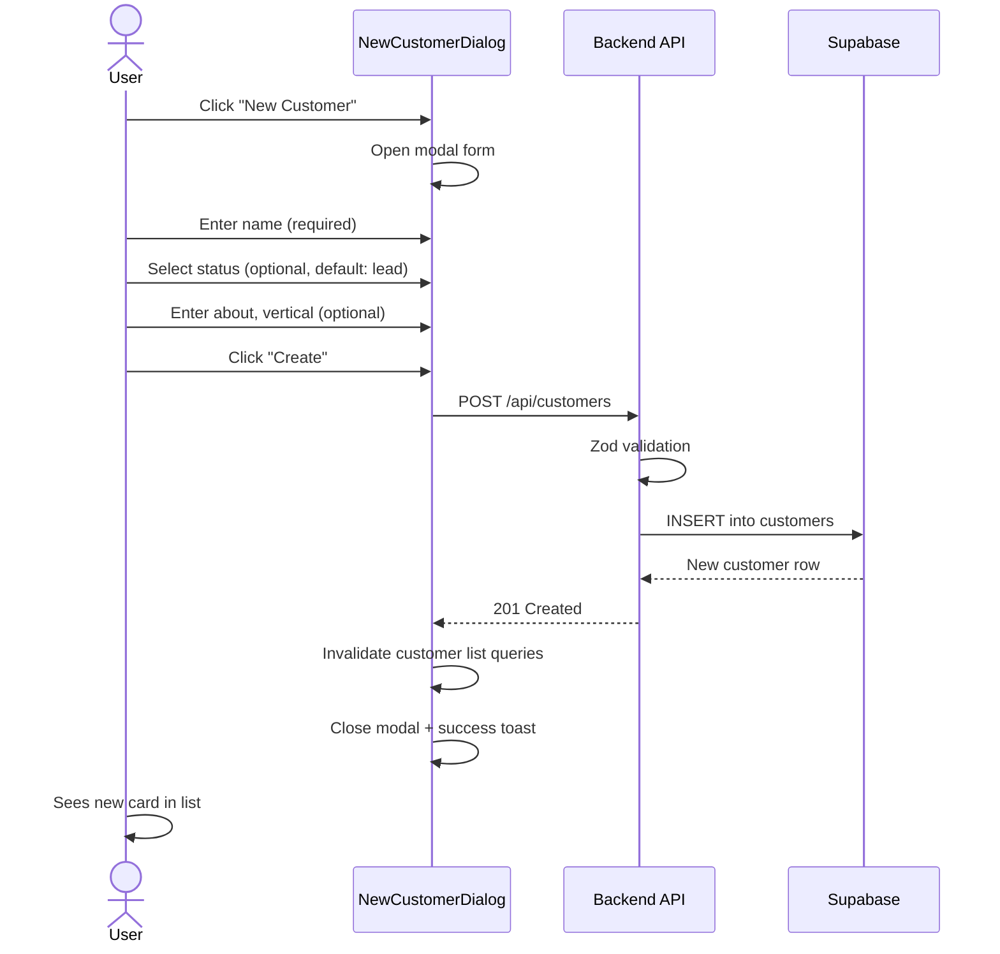
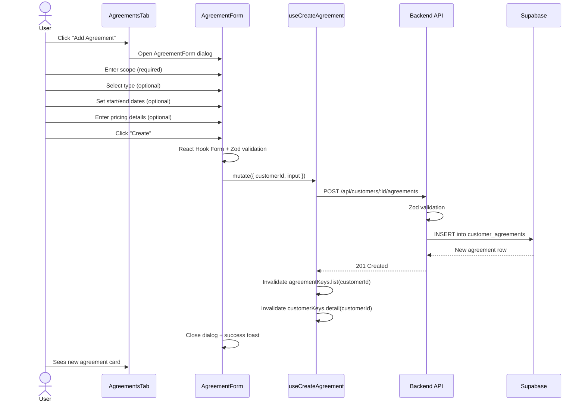
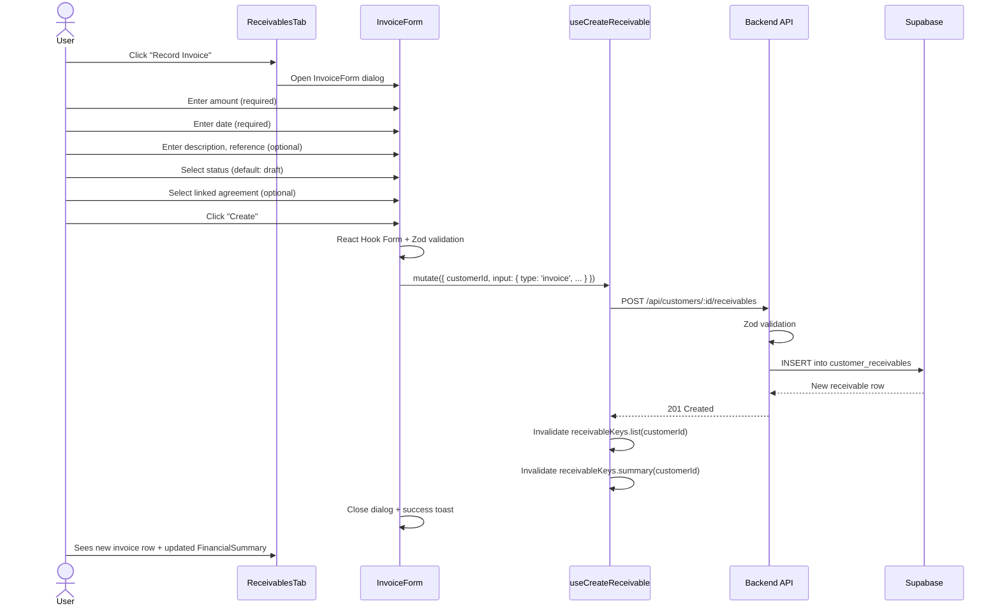
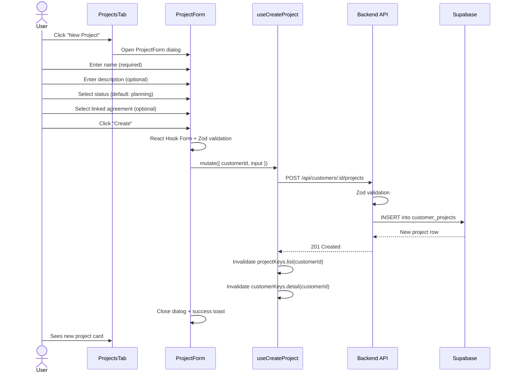
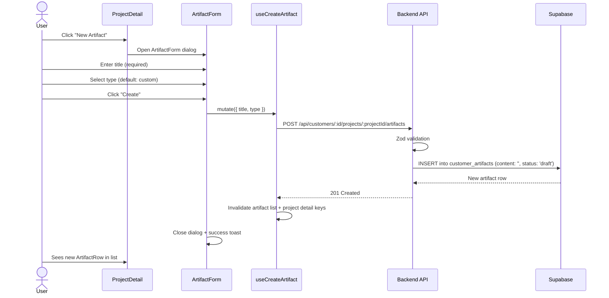
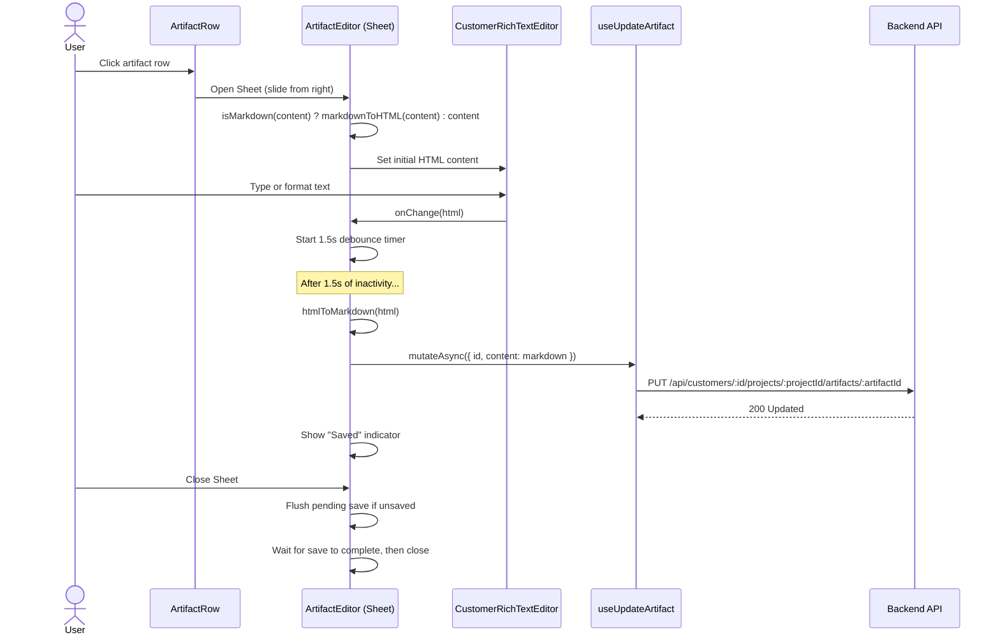

# Customer Management Flow

**Created:** 2026-02-25
**Last Updated:** 2026-02-25
**Version:** 4.0.0
**Status:** Complete (Phase 5)

## Overview

User flows for managing customer relationships: creating, browsing, editing, and archiving customers (Flows 1-8), Agreements (Flows 9-11), Receivables (Flows 12-14), Projects & Artifacts (Flows 15-20), and Search/Dashboard/Cross-Linking (Flows 21-23).

**Phase 5 additions:**
- **Flow 21: Full-Text Search** — User types in search box, query passed to `get_customer_list_summary` RPC via `websearch_to_tsquery('english', query)`, TSVECTOR indexes name/vertical/about/persona. Results update in real-time via TanStack Query.
- **Flow 22: Enriched Card Metrics** — Customer list cards display active agreements count, outstanding balance, active projects count, and last activity date. Data comes from `get_customer_list_summary` RPC (correlated subqueries). 6 sort options available.
- **Flow 23: Cross-Module Linking** — In portfolio ArtifactEditor, user opens "References" collapsible section, searches customer artifacts (debounced 300ms, calls `GET /api/customers/artifacts/search?q=...`), clicks result to link. Linked refs stored in `artifacts.metadata.linkedCustomerArtifacts` as `[{id, title, type, customerName}]`. In customer ArtifactEditor, "Referenced by" section auto-queries portfolio artifacts via JSONB `@>` containment (`useReferencedByArtifacts` hook), showing Badge chips that could navigate to portfolio artifacts.

## Flow 1: Create Customer

**Entry:** Click "New Customer" button on Customer List page

**Error path:** Validation failure shows inline error. API error shows destructive toast.

## Flow 2: Browse & Filter Customers

**Entry:** Navigate to `/customers` via sidebar or mobile nav

1. Page loads with all customers (no filters)
2. User can filter by status pills (All, Lead, Prospect, etc.)
3. User can search by name (instant filter via URL param)
4. User can sort by Last Updated, Name, Created, Status
5. All filter state persists in URL (shareable, back-button safe)

**Empty states:**
- No customers at all: "No customers yet" + Create button
- No matching filters: "No customers match your filters"

## Flow 3: View Customer Detail

**Entry:** Click any customer card in the list

1. Navigate to `/customers/:id`
2. Backend fetches customer with tab counts (agreements, receivables, projects)
3. Header shows: Back button, editable name, status dropdown
4. 4 tabs: Overview (active), Agreements, Receivables, Projects
5. Overview tab renders: QuickStats, CustomerInfoSection, TeamSection, EventTimeline

## Flow 4: Edit Customer Name (Inline)

1. Click customer name in detail header
2. Name becomes an editable input
3. Press Enter or click checkmark to save
4. Press Escape or click X to cancel
5. `PUT /api/customers/:id` with `{ name }` body

## Flow 5: Change Customer Status

**From list page:**
1. Hover over customer card to reveal status dropdown
2. Select new status
3. `PATCH /api/customers/:id/status` fires
4. List refreshes with updated status badge

**From detail page:**
1. Click status dropdown in header
2. Select new status
3. Same PATCH endpoint, detail view refreshes

## Flow 6: Edit Customer Info

1. On Overview tab, click "Edit" button on Customer Information section
2. Form shows: About, Vertical, Persona, ICP, Product fields
3. Edit fields, click "Save"
4. `PUT /api/customers/:id` with `{ info }` body
5. Section returns to read-only view

## Flow 7: Manage Team Members

1. On Overview tab, Team section
2. Click "Add Member" to add new team member (name required, role/email/notes optional)
3. Click pencil icon on existing member to edit inline
4. Click trash icon to remove
5. Changes saved via `PUT /api/customers/:id` with updated `info.team` array

## Flow 8: Archive Customer

1. On list page, click "..." menu on card > "Archive"
2. Browser confirm dialog: "Archive this customer?"
3. `DELETE /api/customers/:id` (soft delete: sets `deleted_at`)
4. Customer disappears from list (filtered by `deleted_at IS NULL`)

---

## Flow 9: Create Agreement

**Entry:** Click "Add Agreement" button in the Agreements tab on the Customer Detail page

**Status after creation:** Computed from dates at render time. A new agreement with a future start date shows "Upcoming". An agreement with no dates shows "Open-Ended".

**Error path:** Zod validation failure shows inline field errors. API error shows destructive toast.

## Flow 10: Edit Agreement

**Entry:** Hover an agreement card and click the Edit button

1. `AgreementForm` dialog opens pre-populated with existing agreement data
2. User edits one or more fields
3. Click "Save"
4. `PUT /api/customers/:id/agreements/:agreementId` fires
5. TanStack Query invalidates `agreementKeys.list(customerId)`
6. Card re-renders with updated data and recomputed status badge

**Status recomputation:** Changing dates recalculates the displayed status badge immediately on the next render (no server-stored status involved).

## Flow 11: Terminate Agreement

**Entry:** Hover an agreement card and click the Terminate button

1. Confirm dialog: "Terminate this agreement?"
2. `PUT /api/customers/:id/agreements/:agreementId` with `{ override_status: 'terminated' }`
3. Agreement card now shows red "Terminated" badge
4. Terminate action replaced by "Reactivate" (clears override_status) in hover menu

**Note:** Termination is a soft override — the agreement record is preserved. Use Delete for permanent removal.

---

## Flow 12: Record Invoice

**Entry:** Click "Record Invoice" button in the Receivables tab

**FinancialSummary update:** After mutation, `receivableKeys.summary` is invalidated, triggering a fresh `GET /api/customers/:id/receivables/summary` call. The 3-column summary card updates to reflect the new total invoiced amount.

**Error path:** Zod validation failure shows inline field errors. API error shows destructive toast.

## Flow 13: Record Payment

**Entry:** Click "Record Payment" button in the Receivables tab

1. `PaymentForm` dialog opens
2. User enters amount (required), date (required), optional description/reference
3. User optionally links the payment to an existing invoice
4. Click "Create"
5. `POST /api/customers/:id/receivables` with `{ type: 'payment', ... }`
6. `receivableKeys.list` and `receivableKeys.summary` invalidated
7. Payment row appears in transaction list. FinancialSummary updates: Total Paid increases, Outstanding balance decreases

## Flow 14: Mark Invoice as Paid

**Entry:** Hover an invoice row and click "Mark as Paid"

1. `PUT /api/customers/:id/receivables/:receivableId` with `{ status: 'paid' }`
2. Invoice status badge changes from "Sent" / "Overdue" to green "Paid"
3. "Mark as Paid" action disappears from hover menu (invoice already paid)
4. `receivableKeys.summary` is NOT re-fetched by this action alone (status change does not affect financial totals — only amount matters)

**Note:** Financial totals (total_invoiced, total_paid, balance) are computed from receivable type and amount only. Invoice status does not affect the financial summary.

---

## Flow 15: Create Project

**Entry:** Click "New Project" button in the Projects tab on the Customer Detail page

**Error path:** Zod validation failure shows inline field errors. API error shows destructive toast.

## Flow 16: Edit Project

**Entry:** Click Edit in project card actions dropdown or Edit button in ProjectDetail

1. `ProjectForm` dialog opens pre-populated with existing project data
2. User edits one or more fields
3. Click "Save"
4. `PUT /api/customers/:id/projects/:projectId` fires
5. TanStack Query invalidates `projectKeys.list(customerId)` and `projectKeys.detail(customerId, projectId)`
6. Card or detail view re-renders with updated data

## Flow 17: Delete Project

**Entry:** Click Delete in project card actions dropdown

1. Confirm dialog: "Delete this project? This will also delete all artifacts within it."
2. `DELETE /api/customers/:id/projects/:projectId`
3. Database CASCADE deletes all child artifacts
4. TanStack Query invalidates project and customer detail keys
5. If in detail view, navigates back to project list
6. Project card disappears from list

## Flow 18: Create Artifact

**Entry:** Click "New Artifact" button in ProjectDetail

## Flow 19: Edit Artifact Content

**Entry:** Click an ArtifactRow in ProjectDetail

**Title editing:** Same auto-save pattern. Type in title Input, 1.5s debounce, saves via PUT.

**Status change:** Immediate save (no debounce). Select new status from dropdown, PUT fires immediately.

## Flow 20: Delete Artifact

**Entry:** Click trash icon in ArtifactEditor header

1. AlertDialog confirmation: "Delete artifact? This action cannot be undone."
2. `DELETE /api/customers/:id/projects/:projectId/artifacts/:artifactId`
3. TanStack Query invalidates artifact list + project detail keys
4. ArtifactEditor Sheet closes
5. ArtifactRow disappears from list

---

## Related Documentation

- [Customer Management Feature](../features/customer-management.md)
- [Customer Pages](../screens/customer-pages.md)
- [Customer API Endpoints](../api/customer-endpoints.md)
