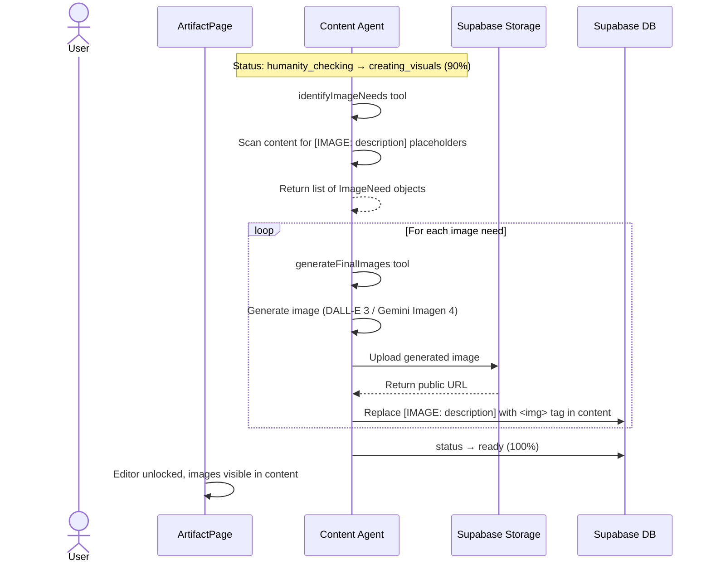
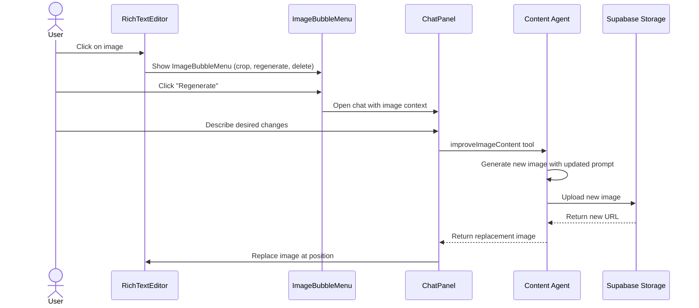

# Image Generation Flow

**Created:** 2026-02-19
**Last Updated:** 2026-02-19
**Version:** 1.0.0
**Status:** Complete

## Overview

The Image Generation flow handles automatic image creation during the content pipeline (status: `creating_visuals`) and user-triggered image regeneration for published content. Images are generated by DALL-E 3 or Gemini Imagen 4, stored in Supabase Storage, and placed at `[IMAGE: description]` placeholders in the content.

---

## Entry Points

| Entry | Trigger | Context |
|-------|---------|---------|
| Pipeline auto-generation | Status transition: `humanity_checking` → `creating_visuals` | After humanity check completes |
| Manual regeneration | ImageBubbleMenu → "Regenerate" | User clicks image in editor |
| Image improvement | Chat panel → `improveImageContent` tool | User requests changes via chat |

---

## Flow: Pipeline Image Generation



---

## Flow: Image Regeneration (User-Triggered)



---

## Image Needs Identification

The `identifyImageNeeds` tool scans content for placeholders:

```
[IMAGE: A consultant reviewing a dashboard with KPI metrics]
[IMAGE: Before/after comparison of the product redesign]
```

Each placeholder produces an `ImageNeed` object:

```typescript
interface ImageNeed {
  description: string    // Text after "IMAGE:"
  position: number       // Location in content
  style: 'realistic' | 'illustration' | 'diagram' | 'photo'
}
```

---

## Image Providers

| Provider | Model | Use Case | Max Size |
|----------|-------|----------|----------|
| OpenAI | DALL-E 3 | Default image generation | 1024x1024 |
| Google | Gemini Imagen 4 | Alternative provider | 1024x1024 |

---

## Storage

Images are stored in Supabase Storage:
- **Bucket:** `artifact-images`
- **Path:** `{user_id}/{artifact_id}/{image_name}.png`
- **Access:** Public URLs via Supabase CDN

---

## Image Approval Panel

During `creating_visuals` status, the `ImageApprovalPanel` component shows generated images for review:

| Action | Result |
|--------|--------|
| Approve image | Image kept in content |
| Reject image | Image removed, placeholder restored |
| Regenerate | New image generated (max 3 retries per image) |

---

## Error Paths

| Error | When | Recovery |
|-------|------|----------|
| Generation fails | DALL-E 3 / Gemini API error | Content still usable without images; user can retry |
| Upload fails | Supabase Storage error | Retry upload; fall back to base64 inline |
| Max retries | 3 regeneration attempts | Image placeholder remains; user can edit manually |

---

## Related Documentation

- [artifact-page.md](../screens/artifact-page.md) - ImageApprovalPanel UI
- [artifact-creation-flow.md](./artifact-creation-flow.md) - Full pipeline flow
- [content-creation-agent.md](../features/content-creation-agent.md) - Tool reference
