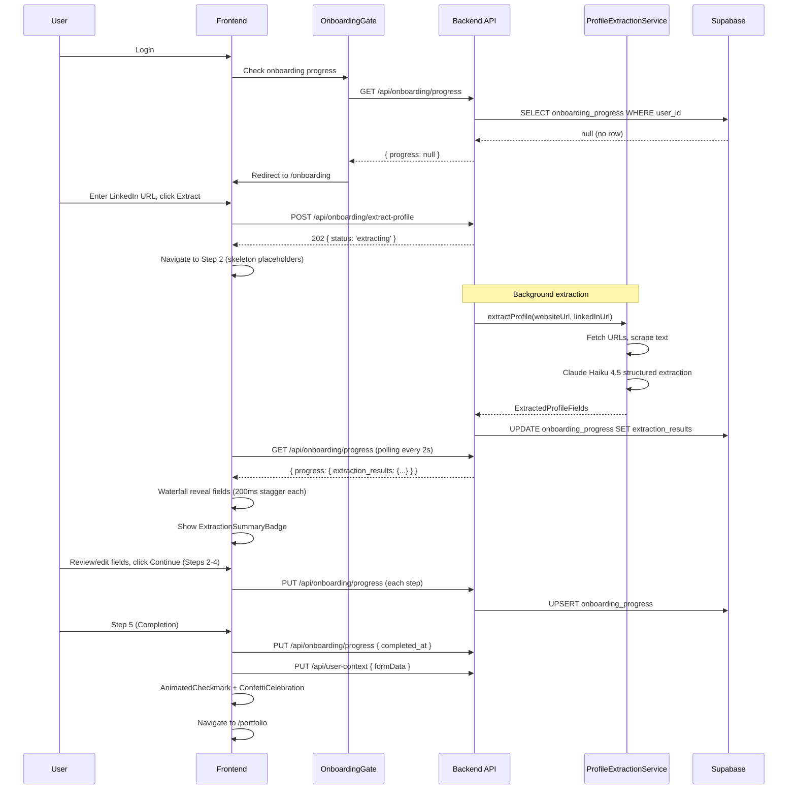

# Onboarding Flow

**Created:** 2026-03-02
**Last Updated:** 2026-03-02
**Version:** 2.1.0
**Status:** Complete

## Overview

The onboarding flow guides new users through profile setup so that the AI content engine can produce personalized output from the first interaction. The wizard supports automatic profile extraction from LinkedIn/website URLs, manual field entry, and writing reference uploads. The entire flow is designed to complete in ~2 minutes.

Phase 2 added directional step transitions, extraction waterfall reveal, skip confirmation dialog (Escape key), mobile-optimized voice step, ChipToggle priorities, and a celebration completion sequence.

## Entry Points

1. **New user login** — `OnboardingGate` detects no `onboarding_progress` row (or `completed_at` is null) and redirects to `/onboarding`
2. **Resume card** — Existing user with incomplete onboarding sees "Complete your profile" card on PortfolioPage (animated with `onboarding-animate-fade-up`)

## Flow Steps

### Step 0: Welcome

- 3-stage staggered entrance animation (0ms/150ms/300ms)
- Time badge ("Takes ~2 minutes"), value proposition rows
- Two actions: "Get Started" (proceeds to Step 1) or "Skip for now" (opens SkipConfirmationDialog)
- Reduced motion: instant appearance, no stagger

### Step 1: Import (Profile Extraction)

- User enters LinkedIn URL and/or website URL
- **Duplicate URL warning**: inline amber message when both fields have the same value
- Optional: paste text directly
- Unified bottom navigation: Back (left), Skip this step + Extract Profile (right) — matches Steps 2-4 pattern
- "Extract Profile" fires `POST /api/onboarding/extract-profile` (returns 202 immediately)
- Frontend sets `extractionStatus: 'submitted'`, `navigationDirection: 'forward'`, then navigates to Step 2
- Extraction runs in the background via the `ProfileExtractionService`
- "Skip this step" navigates to Step 2 with `extractionStatus: 'skipped'`

### Step 2: Profile (About Me + Profession)

- **Extracting state**: `ExtractionSkeletonField` placeholders with "Analyzing your profile..." message, `aria-busy="true"` on fieldset
- **Waterfall reveal**: When extraction completes, fields appear one-by-one (200ms delay each) via `useExtractionWaterfall`. Each field wrapped in `OnboardingField` showing `AiExtractedBadge` (green for AI-extracted, amber for needs-input)
- **Summary badge**: After all fields revealed, `ExtractionSummaryBadge` fades in: "Found X of Y fields"
- **Collapsed fields**: Methodologies and Certifications collapsed by default; `CollapsedFieldsToggle` shows amber indicator when AI data exists in collapsed fields
- **Timeout state** (after 30s): if extraction hasn't completed, shows the form anyway with "Extraction is taking longer than expected" message
- When extraction results arrive (via 2s polling), they are merged into the form (user edits are never overwritten)
- Fields: Bio, Value Proposition, Years of Experience, Expertise Areas, Industries, Methodologies (collapsed), Certifications (collapsed)
- "Continue" saves progress to server, advances to Step 3

### Step 3: Market (Customers + Goals)

- Fields: Ideal Client (textarea), Content Goals (textarea), Business Goals (textarea)
- **Content Priorities**: `ChipToggle` group (`role="group"`, `aria-labelledby`) with 6 options:
  - Thought Leadership, Lead Generation, Brand Awareness, Client Retention, Speaking Opportunities, Community Building
- "Continue" saves progress, advances to Step 4

### Step 4: Voice (Writing References)

- **Desktop**: 4-tab interface (Paste / File / File URL / Publication) using shadcn Tabs
- **Mobile** (< 768px): Vertical stacked buttons with `min-h-[44px]` touch targets, Check icon for selected method
- Reuses existing `FileDropZone` and `PublicationUrlInput` components from the portfolio feature
- Shows count of added references
- "Continue" or "Skip this step" advances to Step 5

### Step 5: Completion

- On mount: saves `completed_at` to `onboarding_progress` and writes `formData` to `user_context`
- **Celebration sequence**: `AnimatedCheckmark` (SVG stroke animation) + `ConfettiCelebration` (canvas-confetti, lazy-loaded)
- **Personalized greeting**: `useFirstName()` tries `user_metadata.full_name` → bio first word (capitalized, < 20 chars) → "there" (email prefix skipped)
- **Staggered entrance**: checkmark 0ms, "You're all set, {name}!" 350ms, headline 400ms, completion rows 700-900ms, CTA 1000ms
- Completion rows: Profile complete, N writing samples added, Goals defined
- "Go to my portfolio" button navigates to `/portfolio` and resets wizard store
- **Reduced motion fallback**: Static `PartyPopper` icon instead of confetti, no stroke animation

## Step Transitions (Phase 2)

`WizardLayout` wraps step content. On step change:
1. `navigationDirection` is set to `'forward'` or `'backward'` in the Zustand store
2. `animationKey` updates, forcing React remount
3. CSS class applied: `onboarding-step-enter-forward` (slide from right) or `onboarding-step-enter-backward` (slide from left)
4. Duration: 250ms with cubic-bezier(0.16, 1, 0.3, 1)
5. When `prefers-reduced-motion` is active: `opacity-100` (instant)

## Sequence Diagram

## Error Handling

| Scenario | Behavior |
|----------|----------|
| Network error on progress fetch | OnboardingGate fails open (renders children) |
| Extraction fails | `extraction_results: { __error: true }` — user fills fields manually |
| Extraction timeout (30s) | Form shown with "taking longer than expected" message |
| Save progress fails | Toast notification, data preserved in Zustand store |
| Page refresh during extraction | `hydrateFromServer` detects null extraction_results with step >= 2, restarts polling |
| Duplicate import URLs | Inline amber warning: "Both URLs are the same — we'll use it once for extraction." |

## Skip Behavior

### Skip Confirmation Dialog (Phase 2)

Instead of direct skip buttons, all skip actions open a `SkipConfirmationDialog`:
- Copy: "Skip setup for now?" / "You can finish this anytime in Settings. NextUp's AI uses your profile to generate content in your voice — the more you add, the better your results."
- On confirm: saves `completed_at` to the database, navigates to `/portfolio`
- On cancel: closes dialog, returns to wizard

**Trigger methods:**
- "Skip for now" link in WizardShell header (steps 1-4)
- "Skip for now" button on WelcomeStep
- **Escape key** on steps 1-4 (guarded: does not re-trigger while dialog is already open)

## Offline Behavior (Phase 2)

`WizardLayout` shows an amber offline banner when the connection is down:
- "You're offline. Your progress is saved — keep filling in what you know."
- Uses `useConnectionStatus` hook (state === 'api_down')
- `role="status"` + `aria-live="polite"`

## Accessibility (Phase 2)

| Feature | Implementation |
|---------|---------------|
| Reduced motion | `useReducedMotion` hook + CSS `@media (prefers-reduced-motion: reduce)` |
| ARIA busy | `aria-busy="true"` on fieldset during extraction |
| ARIA live | `aria-live="polite"` on extraction status messages and offline banner |
| Chip ARIA | ChipToggle: `role="checkbox"` + `aria-checked`; container: `role="group"` + `aria-labelledby` |
| Touch targets | Mobile: `min-h-[44px]` on all interactive elements |
| Progress bar | `role="progressbar"`, `aria-valuenow`, `aria-valuemin`, `aria-valuemax`, `aria-label` |

## Related Documentation

- [Onboarding Wizard Feature](../features/onboarding-wizard.md)
- [Onboarding Page Screen](../screens/onboarding-page.md)
- [Profile Page](../screens/profile-page.md) — where `user_context` data is also editable
