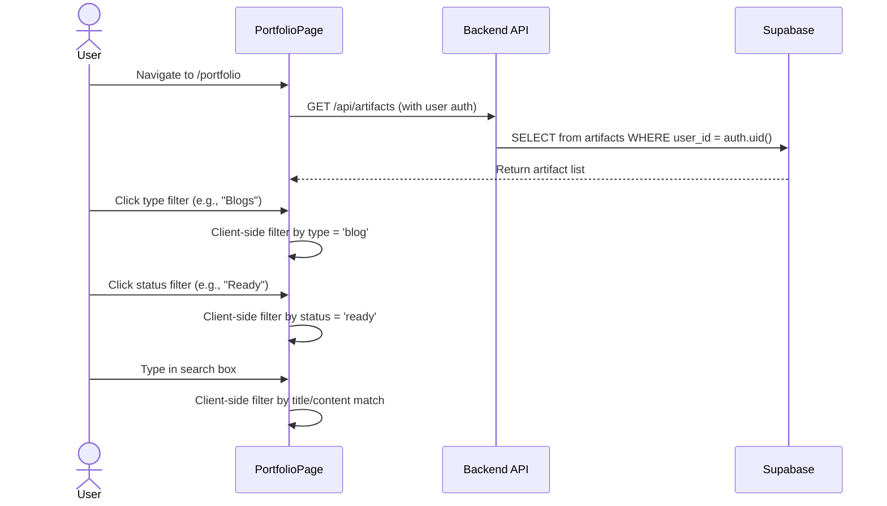
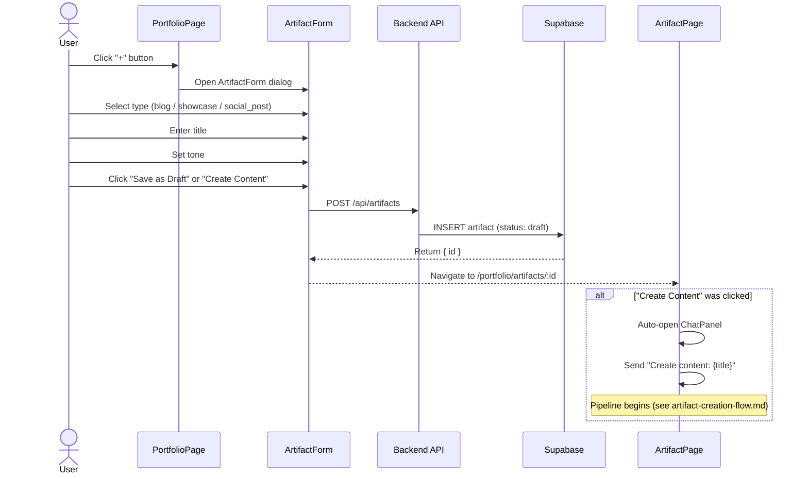
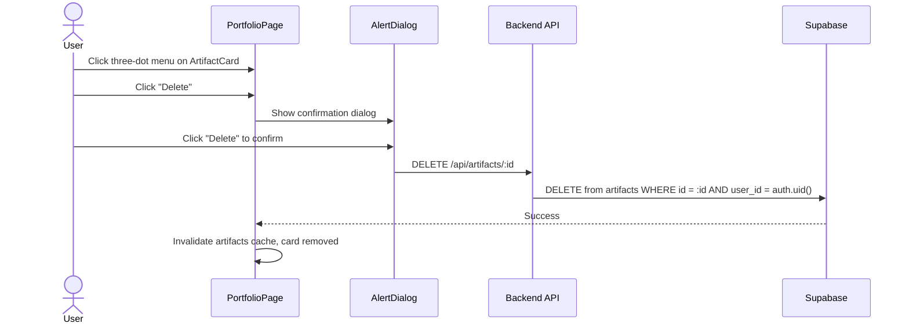
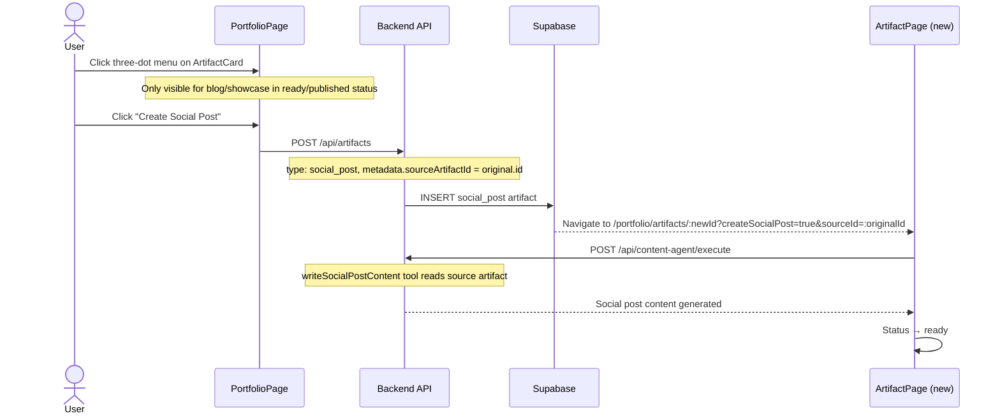

# Portfolio Management Flow

**Created:** 2026-02-19
**Last Updated:** 2026-02-19
**Version:** 1.0.0
**Status:** Complete

## Overview

The Portfolio Management flow covers the CRUD operations and browsing experience on the main Portfolio page — creating artifacts, filtering/searching, editing, deleting, and creating social posts from existing content.

---

## Entry Points

| Entry | Screen | Action |
|-------|--------|--------|
| App launch | AppShell | Default route redirects to `/portfolio` |
| Sidebar nav | Any page | Click Portfolio icon in sidebar |

---

## Flow: Browse & Filter



### Filters

| Filter | Options | Default | Type |
|--------|---------|---------|------|
| Type | All, Posts (social_post), Blogs (blog), Showcases (showcase) | All | Client-side |
| Status | All, Draft, Ready, Published | All | Client-side |
| Search | Free text | Empty | Client-side, matches title + content |

---

## Flow: Create Artifact



---

## Flow: Delete Artifact



---

## Flow: Create Social Post from Artifact



### Social Post Eligibility

```typescript
canCreateSocialPost(artifact) =
  artifact.type IN ('blog', 'showcase') AND
  artifact.status IN ('ready', 'published')
```

---

## ArtifactCard States

| Status | Card Appearance |
|--------|----------------|
| `draft` | Default card, "Draft" badge |
| Processing states | Animated processing badge, progress indicator |
| `ready` | Green "Ready" badge |
| `published` | Blue "Published" badge |

---

## Related Documentation

- [portfolio-page.md](../screens/portfolio-page.md) - Screen doc
- [artifact-creation-flow.md](./artifact-creation-flow.md) - Full creation flow
- [artifact-page.md](../screens/artifact-page.md) - Artifact editor
