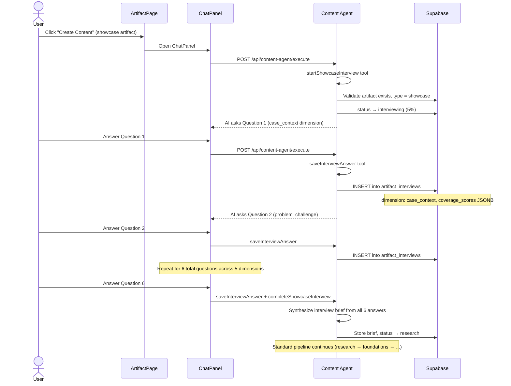

# Showcase Interview Flow

**Created:** 2026-02-19
**Last Updated:** 2026-02-19
**Version:** 1.0.0
**Status:** Complete

## Overview

The Showcase Interview flow is a guided Q&A session that precedes the content creation pipeline for `showcase` type artifacts. The AI asks 6 questions across 5 dimensions to gather the user's case study details, then synthesizes a brief that feeds into the research and writing phases.

---

## Entry Point

| Entry | Screen | Condition |
|-------|--------|-----------|
| Create Content | ArtifactPage | Artifact type = `showcase`, status = `draft` |

---

## Flow



---

## Interview Dimensions (5)

| Dimension | Purpose | Question Focus |
|-----------|---------|---------------|
| `case_context` | Background | Company, role, timeline, industry |
| `problem_challenge` | Problem statement | Pain points, constraints, stakes, failed attempts |
| `approach_methodology` | Solution approach | Methods, tools, frameworks, team involvement |
| `results_outcomes` | Measurable impact | Metrics, KPIs, before/after, timeline to results |
| `lessons_insights` | Takeaways | Lessons learned, recommendations, what they'd do differently |

---

## Interview Details

| Property | Value |
|----------|-------|
| Total questions | 6 |
| Dimensions covered | 5 (some dimensions may have 2 questions) |
| Question generation | Dynamic — AI generates questions based on coverage scores |
| Storage | `artifact_interviews` table (one row per Q&A pair) |
| Coverage tracking | JSONB `coverage_scores` per answer |
| Completion trigger | All 5 dimensions have sufficient coverage |

---

## Coverage Scores

Each answer is scored across the 5 dimensions:

```typescript
interface CoverageScores {
  case_context: number        // 0-100
  problem_challenge: number   // 0-100
  approach_methodology: number // 0-100
  results_outcomes: number    // 0-100
  lessons_insights: number    // 0-100
}
```

The AI dynamically selects the next question targeting the dimension with the lowest cumulative coverage.

---

## Database Schema

### artifact_interviews table

| Column | Type | Description |
|--------|------|-------------|
| id | uuid | Primary key |
| artifact_id | uuid | FK to artifacts |
| user_id | uuid | FK to auth.users |
| question | text | AI-generated question |
| answer | text | User's response |
| dimension | text | One of 5 dimensions |
| coverage_scores | jsonb | Per-dimension coverage after this answer |
| question_number | integer | 1-6 |
| created_at | timestamptz | When Q&A was recorded |

---

## UI Behavior During Interview

| Aspect | Behavior |
|--------|----------|
| Editor | Locked overlay — "Interview in progress" |
| ChatPanel | Active — shows questions and accepts answers |
| Status badge | "Interviewing" (indigo) |
| Progress | 5% |
| FoundationsSection | Hidden |
| ResearchArea | Hidden |

---

## Transition to Standard Pipeline

After `completeShowcaseInterview`:

1. Interview brief is synthesized from all 6 answers
2. Status transitions: `interviewing` → `research`
3. The interview brief enriches the research phase (Tavily searches include interview context)
4. Standard pipeline continues: research → foundations → skeleton → approval → writing → humanity_checking → creating_visuals → ready

---

## Related Documentation

- [artifact-creation-flow.md](./artifact-creation-flow.md) - Full pipeline flow (includes interview path)
- [artifact-page.md](../screens/artifact-page.md) - UI behavior by status
- [content-creation-agent.md](../features/content-creation-agent.md) - Tool reference
