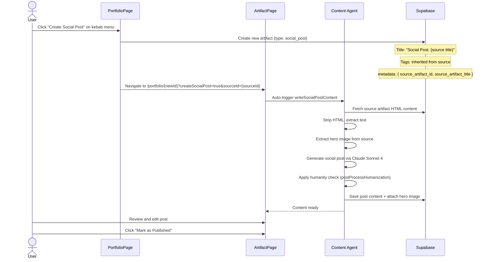

# Social Post Creation Flow

**Created:** 2026-02-20
**Last Updated:** 2026-02-20
**Version:** 1.0.0
**Status:** Complete

## Overview

The social post creation flow lets users generate viral social media posts from existing blog or showcase artifacts. The AI reads the full source content, extracts key points, and writes a promotional post with a link placeholder.

---

## Entry Points

| Entry | Screen | Condition |
|-------|--------|-----------|
| Kebab menu "Create Social Post" | PortfolioPage (ArtifactCard) | Source artifact is blog/showcase in ready/published status |
| Header "Create Social Post" button | ArtifactPage | Same eligibility check |

---

## Flow Sequence



---

## Step-by-Step

### 1. Eligibility Check

The "Create Social Post" action is only available when:
- Source artifact type is `blog` or `showcase`
- Source artifact status is `ready` or `published`
- Controlled by `canCreateSocialPost()` utility function

### 2. Artifact Creation

When the user clicks the action:
1. A new artifact is created via `useCreateArtifact` mutation
2. Type: `social_post`
3. Title: `"Social Post: {source article title}"`
4. Tags: copied from the source artifact
5. Metadata: `{ source_artifact_id, source_artifact_title }`

### 3. Navigation + Auto-Trigger

The user is navigated to:
```
/portfolio/{newArtifactId}?createSocialPost=true&sourceId={sourceArtifactId}
```

The `createSocialPost=true` URL parameter triggers automatic AI generation when the ArtifactPage loads.

### 4. AI Content Generation

The `writeSocialPostContent` tool executes:

**Inputs:**
- `artifactId` — the new social post artifact
- `sourceArtifactId` — the source blog/showcase
- `sourceTitle`, `sourceType`, `sourceTags`, `tone`

**Process:**
1. Fetches full HTML content from the source artifact
2. Strips HTML tags, extracts plain text
3. Identifies and extracts the hero image from the source
4. Generates a viral social media post via Claude Sonnet 4
5. Includes `[LINK_PLACEHOLDER]` for the article URL
6. Applies `postProcessHumanization()` to clean em dashes and AI patterns
7. Attaches the hero image to the social post
8. Saves content to the new artifact

### 5. User Review

The social post appears in the editor for final review:
- User can edit the text
- User can modify the link placeholder
- User can change tags
- Click "Mark as Published" when ready

---

## Key Components

| Component | Purpose |
|-----------|---------|
| `canCreateSocialPost()` | Eligibility check (type + status) |
| `ArtifactCard` kebab menu | Entry point on PortfolioPage |
| `ArtifactPage` header button | Entry point on artifact detail |
| `writeSocialPostContent` tool | AI generation (backend) |

---

## Backend Tool

**Tool:** `writeSocialPostContent` in `backend/src/services/ai/tools/socialPostTools.ts`

**AI Provider:** Claude Sonnet 4
**Humanity Check:** Applied via `postProcessHumanization()` (em dash cleanup + AI pattern removal)
**Image Handling:** Extracts hero image from source and attaches to social post

---

## Related

- [Content Creation Agent](../features/content-creation-agent.md) — Pipeline architecture
- [Artifact Creation Flow](artifact-creation-flow.md) — General artifact creation
- [Social Post Generation](../features/social-post-generation.md) — Feature deep-dive
