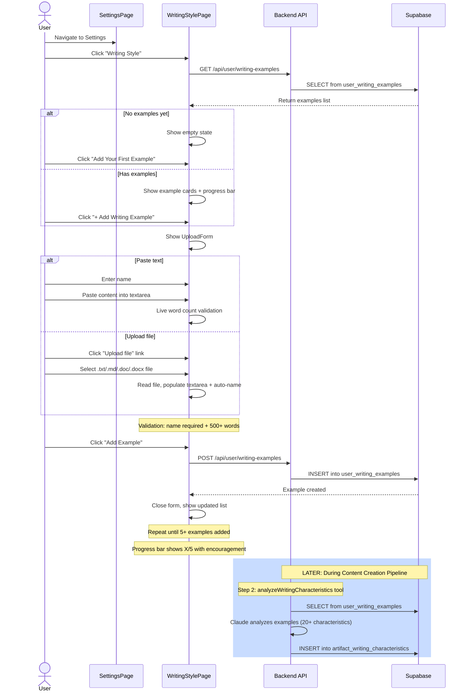

# Writing Style Setup Flow

**Created:** 2026-02-19
**Last Updated:** 2026-02-19
**Version:** 1.0.0
**Status:** Complete

## Overview

The Writing Style Setup flow is how users teach the AI their unique writing voice. Users upload writing samples (minimum 500 words each, target 5 samples), which are later analyzed during the content creation pipeline to extract 20+ writing characteristics.

---

## Entry Points

| Entry | Screen | Action |
|-------|--------|--------|
| Settings navigation | Sidebar / Settings | Navigate to `/settings/style` |
| First-time prompt | ArtifactPage (during content creation) | System prompts user to add examples if none exist |

---

## Flow



---

## Step-by-Step

| # | User Action | System Action | UI State |
|---|-------------|---------------|----------|
| 1 | Navigate to `/settings/style` | Fetch writing examples | Loading → example list |
| 2 | Click "+ Add Writing Example" | Show UploadForm | Form expanded |
| 3a | Paste text into textarea | Count words in real-time | Word count indicator updates |
| 3b | Upload file | Read file, populate textarea + name | Content and name auto-filled |
| 4 | Enter example name | Validate non-empty | — |
| 5 | Click "Add Example" | POST to API, close form | New card in list, progress bar updates |
| 6 | (Optional) Delete example | DELETE to API, remove card | Card removed, progress bar updates |
| 7 | Reach 5 examples | Show green success message | "Great! You have enough examples" |

---

## Validation

| Rule | Condition | Error Message |
|------|-----------|---------------|
| Name required | `name.trim()` is empty | HTML required attribute |
| Min word count | `wordCount < 500` | "Content must be at least 500 words. Current: {N}" |
| File type | Only `.txt`, `.md`, `.doc`, `.docx` | Browser file picker filter |

---

## Data Flow

### Writing Example → Characteristics (during content creation)

```
user_writing_examples (raw text)
        ↓
  analyzeWritingCharacteristics tool (Claude)
        ↓
  artifact_writing_characteristics (20+ traits)
        ↓
  Used by writeContentSections tool (Gemini)
  to match user's voice in generated content
```

---

## Related Documentation

- [writing-style-page.md](../screens/writing-style-page.md) - Screen doc
- [writing-style-analysis.md](../features/writing-style-analysis.md) - Feature doc
- [artifact-creation-flow.md](./artifact-creation-flow.md) - How characteristics feed into pipeline
