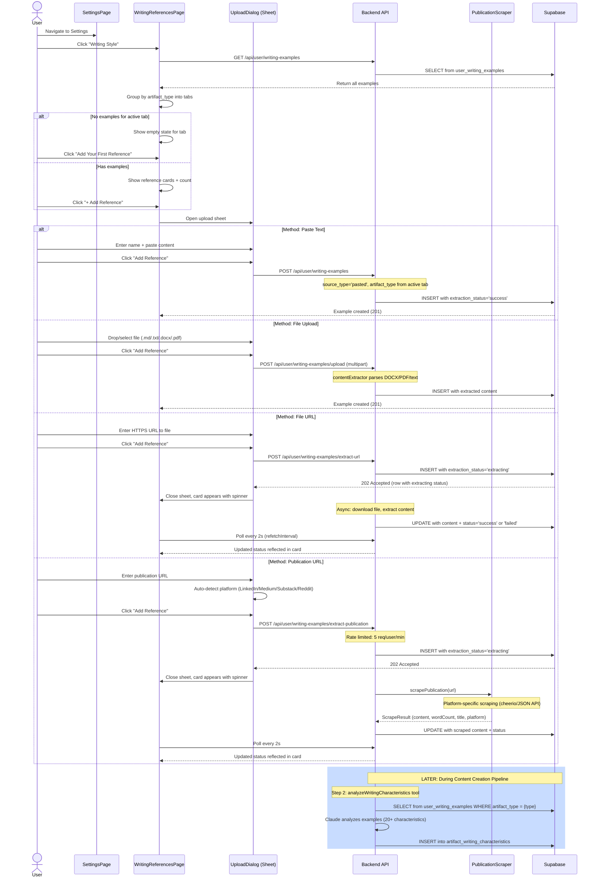

# Writing Style Setup Flow

**Created:** 2026-02-19
**Last Updated:** 2026-02-24
**Version:** 2.0.0
**Status:** Complete

## Overview

The Writing Style Setup flow is how users teach the AI their unique writing voice, **per content type**. Users upload writing references categorized by artifact type (Blog, Social Post, Showcase) using 4 methods: paste text, file upload, file URL, or publication URL. References are later analyzed during the content creation pipeline to extract 20+ writing characteristics, filtered by artifact type.

---

## Entry Points

| Entry | Screen | Action |
|-------|--------|--------|
| Settings navigation | Sidebar / Settings | Navigate to `/settings/style` |
| First-time prompt | ArtifactPage (during content creation) | System prompts user to add examples if none exist |

---

## Flow



---

## Step-by-Step

| # | User Action | System Action | UI State |
|---|-------------|---------------|----------|
| 1 | Navigate to `/settings/style` | Fetch all writing examples | Loading spinner, then tabbed view |
| 2 | Select tab (Blog/Social Post/Showcase) | Filter references by artifact_type | Tab content updates |
| 3 | Click "+ Add Reference" | Open upload Sheet | Sheet slides in from right |
| 4a | Paste text: enter name + content | Live word count in textarea | Word count badge updates |
| 4b | File upload: drop/select file | Parse file name, show in drop zone | File name shown |
| 4c | File URL: enter HTTPS URL | Validate URL format | Submit enabled when valid |
| 4d | Publication URL: enter URL | Auto-detect platform, show badge | "LinkedIn detected" badge |
| 5 | Click "Add Reference" | Submit to appropriate endpoint | Sheet closes |
| 6 | (Paste/File) See card immediately | Example created synchronously | Card with content preview |
| 6 | (URL) See card with spinner | 202 returned, polling starts | Card shows "extracting" spinner |
| 7 | (URL) Wait for extraction | Backend extracts/scrapes async | Spinner then success check or failed badge |
| 8 | (Failed) Click retry | POST /:id/retry, re-extract | Spinner then success or failed |
| 9 | Click card | Open detail sheet | Full content view |
| 10 | Click delete | DELETE to API | Card removed from list |

---

## Error Handling

| Scenario | Error | Recovery |
|----------|-------|----------|
| File too large | Multer rejects (10MB limit) | Try smaller file |
| Unsupported file type | Multer rejects | Use .md, .txt, .docx, or .pdf |
| File URL download fails | extraction_status='failed' | Click retry button |
| Publication scrape fails | extraction_status='failed' | Click retry, or paste content manually |
| Rate limited (publication) | 429 Too Many Requests | Wait 1 minute |
| Private URL (SSRF) | 400 "Private URLs are not allowed" | Use a public URL |
| Invalid artifact_type | 400 validation error | Should not occur (set by UI) |

---

## Async Extraction Pattern (File URL & Publication URL)

```
1. Frontend submits URL -> Backend creates DB row (extraction_status='extracting')
2. Backend responds 202 with row data
3. Frontend closes dialog, shows card with spinner
4. Backend asynchronously: downloads/scrapes -> extracts content -> updates row
5. Frontend polls GET /api/user/writing-examples every 2s (refetchInterval)
6. When extraction_status changes to 'success' or 'failed', polling stops
7. Card updates to show content preview (success) or retry button (failed)
```

---

## Publication Scraping Platforms

| Platform | Method | Content Source |
|----------|--------|---------------|
| LinkedIn | cheerio HTML parsing | `<article>` then `og:description` then JSON-LD `articleBody` |
| Medium | cheerio HTML parsing | `<article>` then `p, h1-h4, blockquote, li` elements |
| Substack | cheerio HTML parsing | `.post-content, .body.markup` then same elements as Medium |
| Reddit | JSON API | Append `.json` to URL, extract `selftext` from post data |
| Generic | cheerio HTML parsing | `<article>` then `<main>` then paragraphs > 50 chars |

Results cached in-memory for 1 hour (MD5 hash of URL as key).

---

## Data Flow

### Writing References to Pipeline Integration

```
user_writing_examples (per artifact_type)
        |
  analyzeWritingCharacteristics tool (Claude)
  -- filters by artifact.type to match correct references
        |
  artifact_writing_characteristics (20+ traits)
        |
  Used by writeContentSections tool (Gemini)
  to match user's voice in generated content
```

---

## Related Documentation

- [writing-style-page.md](../screens/writing-style-page.md) - Screen doc
- [writing-style-analysis.md](../features/writing-style-analysis.md) - Feature doc
- [artifact-creation-flow.md](./artifact-creation-flow.md) - How characteristics feed into pipeline
- [content-agent-endpoints.md](../api/content-agent-endpoints.md) - API endpoints
